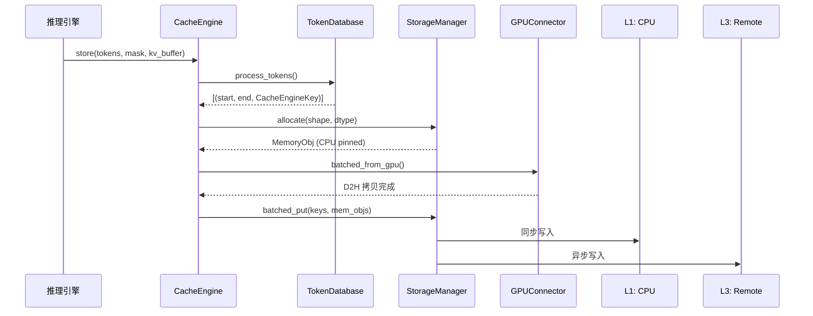
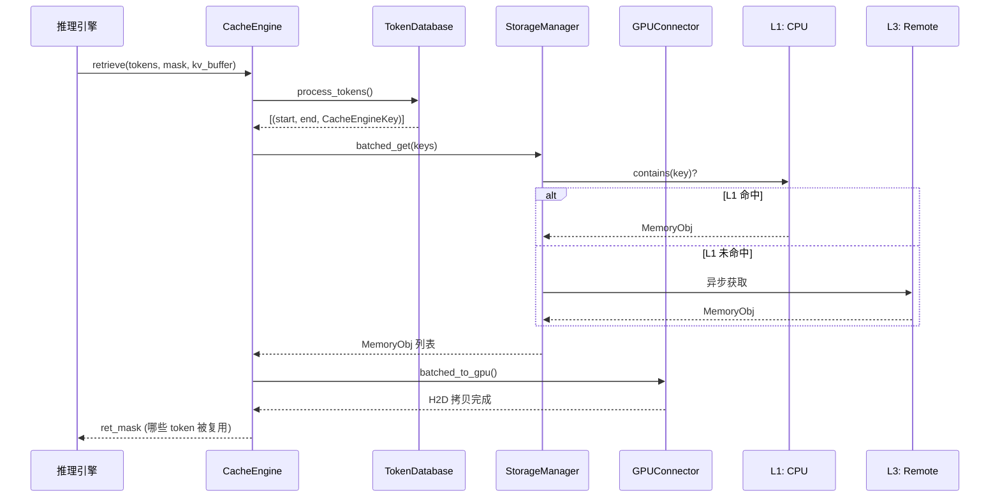

# 一文读懂 LMCache：让 KV Cache 从"阅后即焚"变"永久记忆"

> **系列**: LMCache 技术博客系列 | **类型**: 架构概览篇
> 10 分钟理解 LMCache 的系统全貌、核心架构与设计哲学

### 引言

想象一下，你每天在公司做重复的案头工作——每次都要从零开始翻资料、写报告。如果有一个"记忆库"，上次做过的部分可以直接复用，只做新增的部分，效率会提升多少？

这正是 LMCache 为 LLM 推理做的事。在 Transformer 的 Attention 机制中，每个 token 都需要与之前所有 token 计算注意力权重，而 KV Cache 缓存了已计算的 Key/Value 矩阵，避免重复计算。但传统推理引擎在请求结束后就丢弃 KV Cache——就像"阅后即焚"的短信。LMCache 把这些 KV Cache 存起来、复用起来、管理起来，让它们从临时状态转变为可持久化存储、跨引擎复用、可观测、可变换的"AI 原生知识"。

### 背景：LLM 推理的 KV Cache 痛点

| 痛点       | 具体表现                                            |
|----------|-------------------------------------------------|
| 随请求释放    | 请求结束 KV Cache 即丢弃，下次相同 prompt 需重算               |
| GPU 显存有限 | Llama-3-70B 每请求约 1.5GB/4K tokens，长上下文场景溢出       |
| 无法跨实例复用  | 多个推理实例各自计算，无法共享已算好的 KV Cache                    |
| 仅前缀匹配    | 传统 prefix caching 只匹配从位置 0 开始的连续 token，RAG 场景复用率低 |
| 引擎耦合     | 缓存与推理引擎同命运，引擎崩溃则缓存全丢                            |
| 推理请求响应慢  | 缓存有限，命中率低，反复淘汰、重复计算，TTFT/TPOT时延高，效率低            |
| 成本高昂     | 如果仅有GPU HBM，缓存容量小，且价格昂贵                         |

LMCache 的核心价值：**降低 TTFT（首 token 延迟）、提升吞吐**，尤其针对长上下文 Agent、多轮对话、RAG 场景。

LMCache 是 LLM 推理的 **KV Cache 管理层**，将 KV Cache 从临时状态转变为：
- 可**持久化存储**（CPU/磁盘/远程）
- 可**跨引擎复用**（vLLM/SGLang/TensorRT-LLM）
- 可**观测**（Prometheus/Event/Trace）
- 可**变换**（压缩/量化/自定义 SERDE）

### 核心架构

```
┌──────────────────────────────────────────────┐
│        Inference Engine (vLLM/SGLang/TRT)    │
└──────────┬──────────────────────┬────────────┘
           │                      │
           ▼                      ▼
┌─────────────────┐    ┌────────────────────────┐
│ Integration     │    │   MP Mode              │
│ Layer           │    │   MPCacheEngine +       │
│ (Connector +    │    │   EngineModules         │
│  Adapter +      │    └────────────────────────┘
│  ServiceFactory)│
└────────┬────────┘
         ▼
┌──────────────────────────────────────────────┐
│          LMCacheManager (生命周期管理)         │
│  - CacheEngine                                │
│  - LookupClient/Server                        │
│  - OffloadServer                              │
│  - HealthMonitor                              │
└────────┬──────────────────────────────────────┘
         ▼
┌──────────────────────────────────────────────┐
│          CacheEngine (核心引擎)                │
│  ┌──────────┐ ┌──────────┐ ┌───────────────┐ │
│  │TokenDB   │ │EventMgr  │ │GPUConnector   │ │
│  └────┬─────┘ └──────────┘ └───────────────┘ │
│       ▼                                       │
│  ┌────────────────────────────────────────┐   │
│  │       StorageManager (分层存储)         │   │
│  │  CPU → Disk → Remote → PD → P2P → NIXL│   │
│  └────────────────────────────────────────┘   │
└──────────────────────────────────────────────┘
```

MP 模式的关键优势：**No fate-sharing**——推理引擎崩溃，缓存不丢。MoE 模型场景下性能提升 **10x**。

##### 核心模块速查

| 模块 | 文件 | 职责 |
|------|------|------|
| CacheEngine | `v1/cache_engine.py` | KV Cache 存/取/查找主入口 |
| TokenDatabase | `v1/token_database.py` | Token→CacheEngineKey 映射 |
| StorageManager | `v1/storage_backend/storage_manager.py` | 多后端存取编排 |
| GPUConnector | `v1/gpu_connector/gpu_connectors.py` | GPU↔CPU 内存桥接 |
| MemoryManagement | `v1/memory_management.py` | 内存池分配/淘汰 |
| CacheBlend | `v1/compute/blend/` | 非前缀 KV 复用 |
| MPCacheEngine | `v1/multiprocess/server.py` | 多进程缓存引擎 |
| DistributedStorage | `v1/distributed/` | MP 模式分布式存储 |

##### 关键设计决策

1. **分离式架构**：Cache Engine 独立于推理引擎进程（No fate-sharing）
2. **前缀哈希链**：自然支持前缀复用，匹配 LLM 推理的 token 结构
3. **分层存储 + 异步写入**：热数据放 L1，冷数据自动淘汰到 L2/L3
4. **GPUConnector 抽象**：引擎无关，可插拔适配
5. **MP 多进程**：绕过 GIL，真正并行处理 KV 操作

> 笔者注：No fate-sharing 的本质是"关注点分离"——推理引擎负责推理，缓存服务负责缓存。两者独立演进、独立故障、独立扩缩容，用通信协议代替内存共享，用持久化存储代替进程内缓存。这是从"嵌入式缓存"到"独立缓存服务"的架构升级，也是 LMCache 能支撑生产级 LLM 推理的基石。

##### 两种部署模式

| 模式 | 描述 | 适用场景 |
|------|------|---------|
| **Standalone** | CacheEngine 嵌入推理引擎进程内 | 单实例、开发测试 |
| **Multiprocess (MP)** | 独立缓存服务进程，ZMQ/共享内存通信 | 多实例、MoE、生产部署 |


### 核心数据流

##### Store 流程（存 KV Cache）



##### Retrieve 流程（取 KV Cache）



### 技术栈

| 层面 | 技术选型 |
|------|---------|
| 核心语言 | Python + C++/CUDA + Rust |
| 推理引擎集成 | vLLM / SGLang / TensorRT-LLM |
| 分层存储 | CPU RAM / SSD / Redis / S3 / Mooncake / NIXL / InfiniStore |
| 进程间通信 | ZMQ / POSIX 共享内存 / HTTP API |
| GPU 传输 | NVLink / RDMA / TCP |
| 可观测性 | Prometheus / Event Bus / OpenTelemetry |
| 多硬件支持 | NVIDIA CUDA / AMD ROCm / Intel XPU / 摩尔线程 MUSA |

### 设计哲学

LMCache 的四大设计原则，每一条都是在具体场景下的 trade-off 选择：

| 原则 | 含义 | 典型体现 |
|------|------|---------|
| **用空间换延迟** | 多层存储换取更快访问 | L1 CPU 缓存避免重算 |
| **用异步换吞吐** | 异步写入不阻塞推理 | RemoteBackend 异步 put |
| **用抽象换生态** | 统一接口适配多种引擎 | GPUConnector / StorageBackendInterface |
| **用分层换弹性** | 热数据快、冷数据大 | L1/L2/L3 分层架构 |

### 总结

LMCache 把 LLM 推理中"阅后即焚"的 KV Cache 变成了可持久化、跨引擎复用、可观测、可变换的 AI 原生知识。核心架构围绕 CacheEngine 展开，通过 TokenDatabase 做 Token→Key 映射，StorageManager 编排分层存储，GPUConnector 适配不同推理引擎。两种部署模式（Standalone/MP）覆盖从开发到生产的全场景。

一句话实践建议：如果你在跑长上下文 Agent 或多轮对话的 LLM 服务，LMCache 是降低 TTFT 的利器——从 `pip install lmcache` 开始。

### 延伸阅读
- LMCache开源地址：https://github.com/LMCache/LMCache
- LMCache 官方文档：https://docs.lmcache.ai

---

*本文属于 [LMCache 技术博客系列]，欢迎持续关注。*
