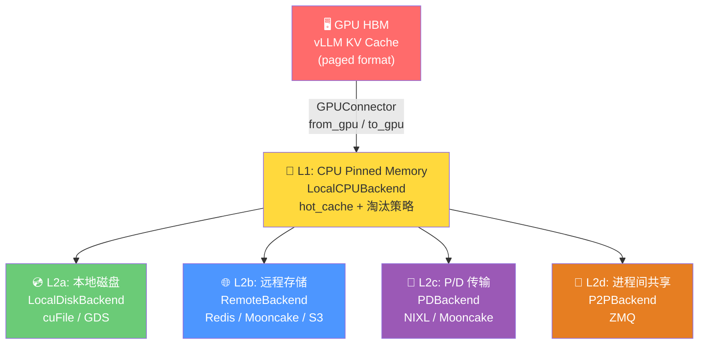

# LMCache 存储引擎深潜：从 GPU 到远程的分层存储之旅

> **系列**: LMCache 技术博客系列 | **类型**: 核心模块深潜篇
> 深入 LMCache 的存储引擎，理解 KV Cache 如何在 GPU、CPU、磁盘与远程存储之间高效流转

### 引言

想象一座城市的仓储物流系统。你的 GPU 显存是"门店"，空间金贵、存取最快；CPU 内存是"前置仓"，容量大一些、距离近；本地 SSD 是"区域仓库"，容量更大但取货慢；远程 Redis/S3 是"中央仓库"，几乎无限容量但跨城配送。而 StorageManager 就是这座城市的"调度中心"——它决定什么货物放在哪一层、什么时候该搬运、怎么搬最快。

在 LMCache 中，KV Cache 的存储不是"一股脑全塞进去"，而是一套精心设计的分层存储系统。你存入的数据会根据配置同步写入 L1（CPU）、异步写入 L2（磁盘）或 L3（远程），读取时按层级查找，远程数据还会自动回填到本地。这一切的背后，是 StorageManager 编排着 5 种 Standalone 后端、9+ 种 MP 模式 L2 适配器、15+ 种远程连接器，以及异步写入、预取、Pin、SERDE 变换等一系列机制。

让我们深入这座"仓储物流系统"的内部。

### 分层存储架构全貌



### StorageManager：分层存储的调度中心

在 Standalone 模式下，`StorageManager`（`lmcache/v1/storage_backend/storage_manager.py`）是整个存储子系统的入口。它持有所有后端的引用，对外提供统一的 `allocate`/`contains`/`batched_put`/`batched_get` 接口。

核心初始化逻辑：

```python
class StorageManager:
    def __init__(self, config, metadata, event_manager, ...):
        self.loop = asyncio.new_event_loop()           # 独立事件循环
        self.storage_backends = OrderedDict()           # 有序后端字典
        self.create_backends()                          # 按配置创建后端
        self.allocator_backend = self._get_allocator_backend(config)
        self.local_cpu_backend = self.storage_backends.get("LocalCPUBackend")
```

关键设计点：

1. **独立事件循环线程**：`StorageManager` 在初始化时创建一个专属的 `asyncio` 事件循环，运行在独立线程 `storage-manager-event-loop` 上。所有异步操作（远程写入、P2P 传输等）都通过 `asyncio.run_coroutine_threadsafe()` 提交到这个循环。

2. **有序后端字典**：`OrderedDict` 保证了后端的遍历顺序——先 L1（CPU），再 L2（磁盘），最后 L3（远程）。这个顺序直接决定了 `contains` 和 `get` 的查找优先级。

3. **Allocator Backend 分离**：`allocator_backend` 是实际分配内存的后端（通常是 `LocalCPUBackend`），其他后端通过 `allocate_and_copy_objects()` 将数据从分配器后端的内存拷贝到自己的内存空间。

### Standalone 模式的 5+ 种后端

##### LocalCPUBackend —— L1 热数据层

`LocalCPUBackend` 是最核心的后端，几乎所有其他后端都依赖它作为缓冲区。它使用 `MixedMemoryAllocator` 管理 CPU Pinned Memory，内置 `hot_cache` 字典存储 KV 数据。

```python
class LocalCPUBackend(AllocatorBackendInterface):
    def __init__(self, config, metadata, ...):
        self.cache_policy = get_cache_policy(config.cache_policy)  # LRU/LFU/FIFO/MRU
        self.hot_cache = self.cache_policy.init_mutable_mapping()  # 热缓存字典
        self.use_hot = config.local_cpu                             # 是否启用热缓存
        self.memory_allocator = self.initialize_allocator(config, metadata)
```

它支持 5 种缓存淘汰策略（`cache_policy/` 目录）：LRU、LFU、FIFO、MRU，以及自定义策略。`hot_cache` 是一个 `MutableMapping`，具体实现由策略决定——LRU 用 `OrderedDict`，LFU 用带频率计数的字典。

##### LocalDiskBackend —— L2 本地磁盘层

`LocalDiskBackend` 使用 `PathSharder` 将 KV Cache 分片存储到本地 SSD。它依赖 `LocalCPUBackend` 作为缓冲区——写入时先到 CPU，再异步刷盘；读取时先从磁盘加载到 CPU。

它内部有一个 `LocalDiskWorker`，使用 `AsyncPQThreadPoolExecutor` 管理优先级任务队列，prefetch 任务优先级高于普通 put 任务。

##### RemoteBackend —— L3 远程存储层

`RemoteBackend` 是连接远程存储的桥梁。它通过 `connector/` 目录下的连接器与远程系统通信，支持 SERDE 变换（序列化/反序列化）以减少网络传输量。

```python
class RemoteBackend(StorageBackendInterface):
    def __init__(self, config, metadata, loop, local_cpu_backend, ...):
        self.connection = None                    # RemoteConnector 实例
        self.serializer, self.deserializer = CreateSerde(
            config.remote_serde, metadata, config  # SERDE 变换管线
        )
        self.init_connection()                    # 初始化远程连接
```

##### PDBackend / PDBackendAsync —— PD 分离式推理

PD（Prefill-Decode）分离模式下，`PDBackend` 让 Prefill 实例的 KV Cache 通过 RDMA/NVLink 直接传输到 Decode 实例的 GPU 显存。同步版使用 ZMQ 通信，异步版 `PDBackendAsync` 使用 `zmq.asyncio` 实现非阻塞传输。

##### P2PBackend —— 跨节点 CPU 共享

`P2PBackend` 实现跨推理节点的 KV Cache 共享。它通过 `LMCacheWorker` 与集群控制器通信，发现其他节点上的缓存位置，然后通过 `TransferChannel` 直接传输数据。

此外还有 `GdsBackend`（GPU Direct Storage，绕过 CPU 直接读写 SSD）、`MaruBackend`（CXL 共享内存）、`NixlStorageBackend`（NIXL RDMA 传输）等特殊后端。

### MP 模式的分布式存储

在 Multiprocess（MP）模式下，存储架构完全不同。`Distributed StorageManager`（`lmcache/v1/distributed/storage_manager.py`）使用 `L1Manager` + `L2Adapters` 的两层架构：

```python
class StorageManager:  # distributed 版本
    def __init__(self, config: StorageManagerConfig):
        self._l1_manager = L1Manager(config.l1_manager_config)
        self._l2_adapters: list[L2AdapterInterface] = []
        for ac in config.l2_adapter_config.adapters:
            adapter = create_l2_adapter(ac, l1_memory_desc)
            if ac.serde_config is not None:
                adapter = SerdeL2AdapterWrapper(inner=adapter, serde=...)
```

##### L1Manager

`L1Manager`（`lmcache/v1/distributed/l1_manager.py`）管理 L1 层缓存对象，内部维护 `L1ObjectState`：

```python
@dataclass
class L1ObjectState:
    memory_obj: MemoryObj      # 缓存数据
    write_lock: TTLLock        # 写锁（带 TTL）
    read_lock: TTLLock         # 读锁（带 TTL）
    is_temporary: bool         # 是否临时对象
```

`TTLLock` 是带超时的锁——如果锁在 TTL 时间内未被释放，自动解锁。这防止了因进程崩溃导致的死锁。

##### L2Adapters（9+ 种）

`l2_adapters/` 目录下有 9 种以上的 L2 适配器：

| 适配器 | 用途 |
|--------|------|
| `fs_l2_adapter` | 本地文件系统 |
| `s3_l2_adapter` | AWS S3 对象存储 |
| `mooncake_store_l2_adapter` | Mooncake 分布式存储 |
| `nixl_store_l2_adapter` | NIXL RDMA 存储 |
| `nixl_store_dynamic_l2_adapter` | NIXL 动态存储 |
| `hfbucket_l2_adapter` | HuggingFace Bucket |
| `dax_l2_adapter` | DAX 存储 |
| `resp_l2_adapter` | RESP 协议存储 |
| `raw_block_l2_adapter` | 原始块设备 |
| `plugin_l2_adapter` | 插件式自定义存储 |
| `native_connector_l2_adapter` | 原生连接器 |
| `native_plugin_l2_adapter` | 原生插件 |

每个适配器都实现 `L2AdapterInterface`，可以通过 `SerdeL2AdapterWrapper` 包装 SERDE 变换。

### StorageBackendInterface 统一接口

所有后端都实现 `StorageBackendInterface`（`lmcache/v1/storage_backend/abstract_backend.py`），核心方法如下：

```python
class StorageBackendInterface(metaclass=abc.ABCMeta):
    def contains(self, key, pin=False) -> bool: ...          # 查询是否存在
    def batched_submit_put_task(self, keys, objs, ...) -> ...: # 异步批量写入
    def get_blocking(self, key) -> Optional[MemoryObj]: ...   # 同步读取
    def get_non_blocking(self, key) -> Optional[Future]: ...  # 异步读取
    def pin(self, key) -> bool: ...                           # 锁定防淘汰
    def unpin(self, key) -> bool: ...                         # 解锁
    def remove(self, key, force=True) -> bool: ...            # 删除
    def get_allocator_backend(self) -> AllocatorBackendInterface: ...
```

`AllocatorBackendInterface` 继承自 `StorageBackendInterface`，额外提供 `allocate`/`batched_allocate`/`initialize_allocator` 方法，用于管理内存分配器。

`batched_submit_put_task` 是异步写入的关键——它返回 `Future` 或 `None`，调用者不需要等待写入完成。`batched_contains` 使用前缀匹配：按顺序检查 keys，一旦某个 key 不存在就停止，返回连续命中的数量。

### 15+ 连接器：connector/ 目录

`connector/` 目录包含 15+ 种远程连接器，每个连接器由一对 `*_connector.py`（协议实现）和 `*_adapter.py`（LMCache 适配）组成：

| 连接器 | 适配器 | 目标系统 |
|--------|--------|---------|
| `redis_connector` | `redis_adapter` | Redis KV 存储 |
| `valkey_connector` | `valkey_adapter` | Valkey（Redis 兼容） |
| `s3_connector` | `s3_adapter` | AWS S3 / MinIO |
| `mooncakestore_connector` | `mooncakestore_adapter` | Mooncake 分布式存储 |
| `infinistore_connector` | `infinistore_adapter` | InfiniStore RDMA |
| `hf3fs_connector` | `hf3fs_adapter` | HuggingFace 3FS |
| `fs_connector` | `fs_adapter` | 本地文件系统 |
| `hfbucket_connector` | `hfbucket_adapter` | HuggingFace Bucket |
| `eic_connector` | `eic_adapter` | EIC 存储 |
| `blackhole_connector` | `blackhole_adapter` | 黑洞（测试用） |
| `audit_connector` | `audit_adapter` | 审计日志 |
| `mock_connector` | `mock_adapter` | 模拟测试 |
| `sagemaker_hyperpod_connector` | `sagemaker_hyperpod_adapter` | SageMaker HyperPod |
| `lm_connector` | `lm_adapter` | LM 自有协议 |

所有连接器都继承自 `RemoteConnector`（`base_connector.py`），提供统一的 `exists`/`get`/`put`/`list` 接口。`RemoteBackend` 通过 `CreateConnector()` 工厂函数根据 URL 协议自动选择连接器。

### 异步写入机制：Store 的完整时序

当 `CacheEngine.store()` 被调用时，数据经历了从 GPU 到多层存储的异步流转。这是整个存储引擎最精妙的部分：

```mermaid
sequenceDiagram
    participant CE as CacheEngine
    participant SM as StorageManager
    participant GC as GPUConnector
    participant L1 as LocalCPUBackend
    participant LD as LocalDiskBackend
    participant RB as RemoteBackend
    participant Loop as EventLoop线程

    CE->>SM: allocate(shape, dtype)
    SM->>L1: allocate() → MemoryObj (CPU pinned)
    L1-->>SM: MemoryObj
    SM-->>CE: MemoryObj

    CE->>GC: batched_from_gpu(memory_objs, starts, ends)
    Note over GC: D2H 拷贝: GPU → CPU Pinned

    CE->>SM: batched_put(keys, memory_objs)
    SM->>L1: batched_submit_put_task(keys, objs)
    Note over L1: 同步写入 hot_cache

    SM->>LD: batched_submit_put_task(keys, objs)
    Note over LD: 提交异步磁盘写入任务

    SM->>RB: batched_submit_put_task(keys, objs)
    RB->>RB: serializer.serialize(obj)
    RB->>Loop: asyncio.run_coroutine_threadsafe(put)
    Note over Loop: 异步网络写入<br/>不阻塞推理

    SM->>SM: memory_obj.ref_count_down()
    Note over SM: 引用计数-1，释放内存
```

##### asyncio 事件循环

`StorageManager` 在初始化时创建独立的事件循环线程：

```python
self.loop = asyncio.new_event_loop()
self.thread = threading.Thread(
    target=start_loop_in_thread_with_exceptions,
    args=(self.loop,),
    name="storage-manager-event-loop",
)
self.thread.start()
```

所有耗时操作（远程写入、P2P 传输、磁盘 I/O）都通过 `asyncio.run_coroutine_threadsafe()` 提交到这个循环，不会阻塞推理主线程。

##### WeightedSemaphore 与 AsyncMultiSerializer

当多个 `batched_get` 并发执行时，可能导致 `LocalCPUBackend` 的内存分配器死锁。`AsyncMultiSerializer` 通过 `WeightedSemaphore` 解决这个问题：

```python
class WeightedSemaphore:
    def __init__(self, chunk_budget: int):
        self._concurrent_budget_cap = chunk_budget // 2  # 最多用一半给并发
        self._current_chunks = self._concurrent_budget_cap
        self._cond = asyncio.Condition()

    async def acquire(self, n: int = 1) -> None:
        async with self._cond:
            await self._cond.wait_for(lambda: self._current_chunks >= n)
            self._current_chunks -= n

    async def release(self, n: int = 1) -> None:
        async with self._cond:
            self._current_chunks += n
            self._cond.notify_all()
```

核心思路：假设所有 chunk 大小相同，50% 的内存预算足够给并发请求使用。当请求的 chunk 数超过并发预算时，需要独占访问。

##### allocate_and_copy_objects

当数据需要写入多个后端时，`batched_put` 会为每个后端分配独立的内存空间：

```python
def allocate_and_copy_objects(allocator_backend, keys, src_memory_objs, stream):
    allocated_objects = []
    for key, src_memory_obj in zip(keys, src_memory_objs):
        if allocator_backend.contains(key):
            continue                                    # 已存在则跳过
        memory_obj = allocator_backend.allocate(...)    # 在目标后端分配
        with torch_dev.stream(stream):
            memory_obj.tensor.copy_(src_memory_obj.tensor, non_blocking=True)
        allocated_objects.append(memory_obj)
    stream.synchronize()                                # 等待拷贝完成
    return keys[:len(allocated_objects)], allocated_objects
```

这里使用 CUDA Stream 实现非阻塞拷贝，最后 `synchronize()` 确保数据一致。

### Prefetch 预取机制

LMCache 的预取机制通过 `async_lookup_and_prefetch` 实现。它的工作流程是：

1. **异步查找**：对每个后端调用 `batched_async_contains()`，找出哪些 key 在哪个后端
2. **分层预取**：按前缀匹配，将 keys 分配到各个后端，每个后端启动一个异步 `batched_get_non_blocking` 任务
3. **回调通知**：所有预取任务完成后，通过 `prefetch_all_done_callback` 通知调度器

```python
async def async_lookup_and_prefetch(self, lookup_id, keys, cum_chunk_lengths, ...):
    loading_tasks = []
    tier_expected_chunks = []
    for backend_name, backend in self.get_active_storage_backends(...):
        num_hit_keys = await backend.batched_async_contains(lookup_id, keys, pin)
        if num_hit_chunks == 0:
            continue
        get_coro = self.async_serializer.run(
            backend.batched_get_non_blocking(lookup_id, backend_keys, ...),
            num_hit_chunks,
        )
        loading_task = asyncio.create_task(get_coro)
        loading_tasks.append(loading_task)
    # ...
```

预取的结果会自动写入 `LocalCPUBackend`，下次同步读取时直接命中 L1。

### Pin 机制与 TTL

Pin 机制防止 KV Cache 被淘汰策略回收。典型场景是：推理引擎在 `lookup` 阶段发现缓存命中，但在 `retrieve` 阶段数据已被淘汰。通过 Pin，lookup 时锁定数据，retrieve 完成后再 unpin。

在 MP 模式下，`L1Manager` 使用 `TTLLock` 实现 Pin：

```python
@dataclass
class L1ObjectState:
    write_lock: TTLLock    # 写锁带 TTL，防止死锁
    read_lock: TTLLock     # 读锁带 TTL，支持共享读取
```

`TTLLock` 的超时机制确保即使进程崩溃，锁也会在 TTL 到期后自动释放，避免永久死锁。

在 Standalone 模式下，`StorageManager.batched_contains(keys, pin=True)` 会在查找时同时 pin 命中的 key，`lookup_pins` 字典记录每个 lookup_id 对应的 pinned keys，retrieve 完成后通过 `batched_unpin` 释放。

### SERDE 序列号/反序列化

SERDE（Serialize/Deserialize）是数据写入远程存储前的变换管线，目的是减少网络传输量。

##### Standalone 模式

`naive_serde/` 目录提供 3 种 SERDE：

| SERDE | 说明 |
|-------|------|
| `naive_serde` | 直接传输原始字节，无压缩 |
| `fp8` | 将 KV Cache 量化为 FP8，体积减半 |
| `cachegen` | CacheGen 专用编解码器，高压缩比 |
| `kivi_serde` | KIVI 量化方法 |

##### MP 模式

`distributed/serde/` 目录提供更丰富的 SERDE：

```python
class Serializer(abc.ABC):
    def serialize(self, src: MemoryObj, dst: MemoryObj) -> int: ...     # 原地变换
    def estimate_serialized_size(self, layout_desc) -> int: ...          # 预估大小

class Deserializer(abc.ABC):
    def deserialize(self, src: MemoryObj, dst: MemoryObj) -> int: ...   # 反变换
```

MP 模式使用 `SerdeL2AdapterWrapper` 将 SERDE 透明地包装在 L2 适配器外层，控制器无需感知 SERDE 的存在：

```python
if ac.serde_config is not None:
    adapter = SerdeL2AdapterWrapper(
        inner=adapter,
        serde=create_serde_processor(ac.serde_config),
        l1_manager=self._l1_manager,
    )
```

FP8 SERDE 的实现非常直观——将 KV Cache 张量量化为 `float8_e4m3fn`，体积减半，精度损失在推理场景可接受：

```python
class Fp8QuantizationSerializer(Serializer):
    def serialize(self, src: MemoryObj, dst: MemoryObj) -> int:
        fp8_tensor = src.tensor.to(self._fp8_dtype).contiguous()  # 量化为 FP8
        fp8_as_bytes = fp8_tensor.view(torch.uint8).flatten()     # 重解释为字节
        dst_tensor.flatten()[:n_bytes].copy_(fp8_as_bytes)        # 拷贝到目标
        return n_bytes
```

### QuotaManager 与 EvictionPolicy

##### QuotaManager

在 MP 模式下，`QuotaManager`（`lmcache/v1/distributed/quota_manager.py`）实现按 `cache_salt` 的配额管理：

```python
class QuotaManager:
    def set_quota(self, cache_salt: str, limit_bytes: int) -> None: ...
    def delete_quota(self, cache_salt: str) -> bool: ...
    def get_limit_bytes(self, cache_salt: str) -> int: ...  # 未注册返回 0
```

采用**白名单语义**：未注册的 `cache_salt` 配额为 0，意味着其数据会在下次淘汰周期被清除。配额变更即时生效，无需重启。

##### EvictionPolicy

Standalone 模式的淘汰策略在 `cache_policy/` 目录：

- **LRU**（最近最少使用）：淘汰最久未访问的数据
- **LFU**（最不经常使用）：淘汰访问频率最低的数据
- **FIFO**（先进先出）：淘汰最早写入的数据
- **MRU**（最近最多使用）：淘汰最近访问的数据

MP 模式的淘汰策略在 `distributed/eviction_policy/` 目录：

- **LRU**：与 Standalone 类似
- **IsolatedLRU**：按 `cache_salt` 隔离的 LRU，每个 salt 独立淘汰
- **Noop**：不淘汰（用于测试）

淘汰由 `L1EvictionController` 和 `L2EvictionController` 周期性执行，它们检查 QuotaManager 的配额，决定哪些数据需要淘汰。

### 总结

LMCache 的存储引擎是一个精心设计的分层系统，核心理念可以概括为：

1. **分层存储，按序查找**：L1（CPU）→ L2（磁盘）→ L3（远程），热数据快、冷数据大
2. **异步写入，不阻塞推理**：独立事件循环 + `batched_submit_put_task`，远程写入完全异步
3. **统一接口，灵活扩展**：`StorageBackendInterface` + 15+ 连接器 + 9+ L2 适配器，新存储后端只需实现接口
4. **SERDE 变换，减少传输**：FP8 量化、CacheGen 压缩，远程存储前自动变换
5. **Pin + TTL，防止淘汰死锁**：Pin 机制保护正在使用的数据，TTL 防止进程崩溃后的永久锁定
6. **Quota + Eviction，公平分配**：按 `cache_salt` 配额管理，LRU/LFU 等策略淘汰冷数据

回到城市的仓储物流类比——StorageManager 就是那个调度中心，它知道每个仓库的容量和速度，决定货物放在哪里、什么时候搬运、怎么搬最快。而这一切，对上层的 CacheEngine 来说，只是一个简单的 `put` 和 `get`。

### 延伸阅读
- LMCache开源地址：https://github.com/LMCache/LMCache
- LMCache 官方文档：https://docs.lmcache.ai
---

*本文属于 [LMCache 技术博客系列]，欢迎持续关注。*
