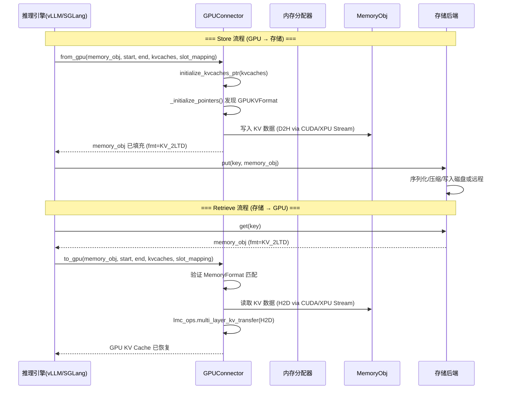

# LMCache GPU 连接器与内存管理：跨越 GPU 与 CPU 的数据桥梁

> **系列**: LMCache 技术博客系列 | **类型**: 核心模块深潜篇
> 深入理解 GPUConnector 如何适配不同推理引擎，MemoryObj 如何管理 KV Cache 的生命周期

### 引言

想象你是一位国际会议的翻译官——台上嘉宾说法语，台下观众听中文，你需要在两种语言之间实时转换。如果翻译官只懂一种语言，会议就卡住了。

在 LMCache 的世界里，GPU 就是那位说法语的嘉宾，CPU/磁盘是说中文的观众，而 **GPUConnector** 就是那位翻译官。不同的推理引擎（vLLM、SGLang、TensorRT-LLM）在 GPU 上组织 KV Cache 的方式截然不同——就像不同国家的语言，有的主语在前，有的主语在后。GPUConnector 的职责就是：不管 GPU 端的"方言"有多复杂，都能准确地把 KV Cache 翻译成 LMCache 统一理解的格式，反之亦然。

定位：GPU↔CPU 内存桥接抽象层，将推理引擎特定的 KV Cache 格式转换为 LMCache 内部的标准化 MemoryObj。

本文将带你深入 GPUConnector 的接口设计、8 种实现背后的适配逻辑、MemoryObj 的格式体系与生命周期，以及支撑这一切的内存分配器架构。

### 一、GPUConnectorInterface：翻译官的"执业标准"

所有 GPUConnector 都必须遵守一份"执业标准"——`GPUConnectorInterface` 抽象基类（`lmcache/v1/gpu_connector/gpu_connectors.py:40`）。它定义了四个核心方法：

```python
class GPUConnectorInterface(metaclass=abc.ABCMeta):
    @abc.abstractmethod
    def from_gpu(self, memory_obj, start, end, **kwargs): ...
    # GPU KV Cache → MemoryObj（"翻译"成 LMCache 格式）

    @abc.abstractmethod
    def to_gpu(self, memory_obj, start, end, **kwargs): ...
    # MemoryObj → GPU KV Cache（"翻译"回引擎格式）

    @abc.abstractmethod
    def batched_from_gpu(self, memory_objs, starts, ends, **kwargs): ...
    # 批量版 from_gpu

    @abc.abstractmethod
    def batched_to_gpu(self, memory_objs, starts, ends, **kwargs): ...
    # 批量版 to_gpu
```

你可以看到，接口非常简洁：`from_gpu` 把 GPU 上的 KV Cache "卸载"到 CPU 侧的 `MemoryObj`，`to_gpu` 则反过来把 `MemoryObj` 的数据"加载"回 GPU。`start` 和 `end` 参数标记了 token 序列中的起止位置，而 `**kwargs` 则是各引擎的"方言参数"——比如 vLLM 需要传入 `slot_mapping`（分页地址映射表），SGLang 也有自己的映射逻辑。

此外还有一个辅助方法 `get_shape(num_tokens)` 用于计算给定 token 数对应的张量形状，以及 `initialize_kvcaches_ptr(**kwargs)` 用于延迟初始化 GPU 端的 KV Cache 指针。

### 二、为什么需要 GPUConnector 抽象？

核心原因只有一个：**不同引擎的 KV Cache 布局差异巨大**。

在 `lmcache/v1/gpu_connector/utils.py` 中，你可以看到 LMCache 识别了多达 11 种 `GPUKVFormat`：

| 格式枚举 | 物理布局 | 使用场景 |
|---------|---------|---------|
| `NL_X_TWO_NB_BS_NH_HS` | `NL x [2, NB, BS, NH, HS]` | vLLM FlashAttention (NHD) |
| `NL_X_NB_TWO_BS_NH_HS` | `NL x [NB, 2, BS, NH, HS]` | vLLM FlashInfer (NHD) |
| `NL_X_TWO_NB_NH_BS_HS` | `NL x [2, NB, NH, BS, HS]` | vLLM FlashAttention (HND) |
| `NL_X_NB_TWO_NH_BS_HS` | `NL x [NB, 2, NH, BS, HS]` | vLLM FlashInfer (HND) |
| `NL_X_NB_BS_HS` | `NL x [NB, BS, HS]` | vLLM MLA |
| `NB_NL_TWO_BS_NH_HS` | `[NB, NL, 2, BS, NH, HS]` | vLLM Cross-Layer |
| `TWO_X_NL_X_NBBS_NH_HS` | `2 x NL x [PBS, NH, HS]` | SGLang MHA |
| `NL_X_NBBS_ONE_HS` | `NL x [PBS, 1, HS]` | SGLang MLA |
| `NB_NL_TWO_NH_BS_HS` | `[NB, NL, 2, NH, BS, HS]` | TensorRT-LLM (HND) |

其中 NB=num_blocks, NL=num_layers, BS=block_size, NH=num_heads, HS=head_size, PBS=page_buffer_size。

这些格式之间的差异不仅仅是维度的排列顺序——NHD（heads 在 block_size 后面）和 HND（heads 在 block_size 前面）的物理内存布局完全不同，Cross-Layer 格式甚至把所有层打包进一个大张量。如果没有 GPUConnector 这层抽象，LMCache 的存储引擎就得为每种格式写一套独立的读写逻辑，那将是维护的噩梦。

`normalize_kv_and_discover_format()` 函数（`utils.py:470`）是格式发现的核心：它通过递归检查 KV Cache 的列表嵌套深度和内层张量的维度，自动推断出当前是哪种格式。对于 vLLM 的 HND 布局，它还能通过 `attempt_permute_to_contiguous_view()` 无拷贝地恢复物理布局——因为 HND 只是对 NHD 做了维度置换，底层存储是相同的。

### 三、8 种 GPUConnector 实现：适配器的全景列表

| 实现 | 引擎 | KV Cache 布局 |
|------|------|--------------|
| VLLMPagedAttentionConnector | vLLM | Paged Attention |
| VLLMFlashInferConnector | vLLM | FlashInfer |
| VLLMMLAConnector | vLLM | MLA (Multi-head Latent Attention) |
| SGLangConnector | SGLang | SGLang attention |
| XPUConnector | Intel GPU | XPU |
| HPUConnector | Intel Habana | HPU |
| MUSAConnector | 摩尔线程 | MUSA |
| MockGPUConnector | 测试 | Mock |


##### 3.1 vLLM 系列连接器

vLLM 是适配最复杂的引擎，LMCache 为其提供了 4 种连接器变体：

**V2 连接器**（`VLLMPagedMemGPUConnectorV2`）是最基础的版本，适用于非分层、非 V3 的场景。它的核心传输逻辑调用 `lmc_ops.multi_layer_kv_transfer()`——一个 C++/CUDA 内核，一次性完成所有层的 KV Cache 搬运。在 `from_gpu` 中，它支持 GPU 中间缓冲模式：先从分页 KV Cache 拷到 GPU 临时缓冲区，再从 GPU 缓冲区拷到 CPU 的 MemoryObj，避免分页寻址和 PCIe 传输的竞争。

**V3 连接器**（`VLLMPagedMemGPUConnectorV3`）引入了 `KVLayerGroupsManager`，支持异构 block_size 的场景（如 DeepSeek V4 的混合压缩组）。它按组分配 GPU 指针和临时缓冲区，每组独立传输。

**Layerwise 连接器**（`VLLMPagedMemLayerwiseGPUConnector` 和 `VLLMBufferLayerwiseGPUConnector`）采用逐层传输策略，使用 Python generator 模式——每次 yield 一层，上层代码通过 `generator.send()` 逐层传入 MemoryObj。`BufferLayerwise` 变体更进一步，实现了双缓冲 ping-pong 机制和 RoPE 位置编码恢复，专门服务于 KV Cache Blend（前缀拼接）场景。

##### 3.2 多硬件连接器

LMCache 的多硬件支持通过设备分支实现，而非继承。`CreateGPUConnector()` 工厂函数（`__init__.py:50`）根据 `torch_device_type` 选择不同的连接器：

- **XPU**（Intel GPU）：`VLLMPagedMemXPUConnectorV2/V3`，使用 `torch.xpu.Stream` 替代 `torch.cuda.Stream`
- **HPU**（Intel Habana）：`VLLMPagedMemHPUConnectorV2`，使用 `htorch.core.mark_step()` 做惰性执行同步，传输逻辑用纯 Torch 的 `index_copy_/index_select` 实现
- **MUSA**（摩尔线程）：`VLLMPagedMemMUSAConnectorV2`，继承自 V2，覆盖传输逻辑为 `torch.musa` API

##### 3.3 SGLang 连接器

SGLang 的 KV Cache 布局与 vLLM 不同——MHA 模式下使用 `2 x NL x [PBS, NH, HS]` 的双列表结构（K 层列表 + V 层列表），MLA 模式下使用 `NL x [PBS, 1, HS]`。`SGLangGPUConnector` 和 `SGLangLayerwiseGPUConnector` 专门适配这些格式。

##### 3.4 MockGPUConnector

测试利器——所有方法都是 no-op，让你在没有 GPU 的环境下也能跑通 LMCache 的集成测试。

### 四、Store/Retrieve 中的数据流

当 LMCache 执行一次 Store（保存 KV Cache）或 Retrieve（恢复 KV Cache）时，GPUConnector 是数据必经的"海关"。下面是完整的时序流：



在 Store 流程中，`from_gpu` 的关键步骤是：先通过 `normalize_kv_and_discover_format` 发现格式，再通过 CUDA Stream 异步执行 D2H（Device to Host）传输。如果目标 MemoryObj 在 CPU 上且不在 CUDA 设备上，会强制同步等待传输完成。

在 Retrieve 流程中，`to_gpu` 会先验证 MemoryFormat 是否匹配（比如 V2 连接器要求 KV_2LTD 或 KV_MLA_FMT），然后通过 `lmc_ops.multi_layer_kv_transfer` 执行 H2D 传输。值得注意的是 `skip_prefix_n_tokens` 参数——当 vLLM 已经通过 prefix caching 缓存了部分 token 时，LMCache 会跳过这些已缓存的部分，避免重复写入导致的数据竞争。

### 五、MemoryObj 与 MemoryFormat：数据的"护照"与"签证"

如果说 GPUConnector 是翻译官，那 MemoryObj 就是数据在 LMCache 内部流通的"护照"，而 MemoryFormat 则是"签证"——它标注了数据的内部布局。

##### 5.1 MemoryFormat 枚举

```python
class MemoryFormat(Enum):
    KV_2LTD = auto()   # [2, num_layers, num_tokens, hidden_dim]
    KV_T2D  = auto()   # [num_tokens, 2, hidden_dim]
    KV_2TD  = auto()   # [2, num_tokens, hidden_dim]
    BINARY  = auto()   # 压缩二进制
    KV_MLA_FMT = auto() # [1, num_layers, num_tokens, aligned_head_size]
    EC_TD   = auto()   # [num_tokens, hidden_dim] (Encoder Cache)
```

这些格式之间的对应关系很清晰：

- **KV_2LTD**：V2 连接器的标准格式，所有层打包在一起，K/V 在最外层。适合一次性传输所有层。
- **KV_T2D**：逐 token 存储 K/V，SGLang 的 layerwise 连接器使用。
- **KV_2TD**：K/V 在最外层，token 在中间。VLLMBufferLayerwise 连接器使用，方便逐层处理。
- **KV_MLA_FMT**：MLA（Multi-head Latent Attention）专用，K/V 合并为一个向量，最外层维度为 1。
- **BINARY**：压缩后的二进制格式，用于远程传输或磁盘持久化。
- **EC_TD**：Encoder Cache 格式，用于跨模态模型的 encoder 部分缓存。

`token_dim()` 方法返回 token 维度在 shape 中的索引——KV_2LTD 是 2，KV_T2D 是 1，KV_2TD 是 0。这让上层代码无需关心具体格式就能提取 token 数量。

##### 5.2 MemoryObj 的结构

`MemoryObj` 是一个抽象基类，有两个主要实现：

- **TensorMemoryObj**：包装一个 `torch.Tensor`，用于 GPU/CPU pinned 内存上的 KV Cache 数据。支持引用计数和 pin 计数，是生产环境的主力。
- **BytesBufferMemoryObj**：包装一个 `bytes` 对象，用于序列化/反序列化场景。

`TensorMemoryObj` 的核心元数据是 `MemoryObjMetadata`：

```python
@dataclass
class MemoryObjMetadata:
    shape: torch.Size          # 逻辑形状
    dtype: Optional[torch.dtype]  # 数据类型
    address: int               # 物理地址（在分配器缓冲区中的偏移）
    phy_size: int              # 物理大小（对齐后）
    ref_count: int             # 引用计数
    pin_count: int = 0         # 钉住计数（防止驱逐）
    fmt: MemoryFormat = MemoryFormat.UNDEFINED  # 内存格式
    cached_positions: Optional[torch.Tensor] = None  # 缓存时的位置编码
```

### 六、内存分配器体系：三层架构

LMCache 的内存分配器是一个精心设计的三层体系，每层解决不同的问题：

##### 6.1 MixedMemoryAllocator（CPU Pinned 内存）

`MixedMemoryAllocator` 是 CPU 侧的主力分配器，它组合了两种子分配器：

- **PinMemoryAllocator**：分配 CUDA pinned 内存（页锁定内存），DMA 传输的必要条件。底层调用 `lmc_ops.alloc_pinned_ptr()`，支持 NUMA 感知和 HugePages。
- **BufferAllocator**：分配普通 `bytearray`，用于 `BINARY_BUFFER` 格式的临时数据。

`MixedMemoryAllocator` 根据 `MemoryFormat` 自动路由到对应的子分配器——KV 格式走 pinned 路径，二进制缓冲走 bytearray 路径。

pinned 内存的空闲管理使用 `AddressManager`，它维护一个 `SortedList<FreeBlock>` 作为显式空闲列表。分配时按首次适配搜索，释放时自动合并相邻空闲块（coalescing）。4KB 对齐确保与 GPU 页大小兼容。

##### 6.2 PagedTensorMemoryAllocator（分页 GPU 内存）

`PagedTensorMemoryAllocator` 将一大块 GPU 内存预先切分为等大小的页，每页恰好容纳一个 chunk 的 KV Cache。空闲页用 `deque` 管理，分配和释放都是 O(1)。这种设计特别适合 GDS（GPUDirect Storage）场景——每个页可以独立注册到 io_uring，实现真正的零拷贝磁盘 I/O。

##### 6.3 CuFileMemoryAllocator（GDS 直接 GPU-磁盘）

`CuFileMemoryAllocator` 继承自 `GPUMemoryAllocator`，在初始化时调用 `cuFileBufRegister()` 将 GPU 内存注册到 CUDA File（GDS）子系统。这样磁盘 I/O 可以直接读写 GPU 内存，绕过 CPU 中转，大幅降低延迟。ROCm 平台有对应的 `HipFileMemoryAllocator`。

```python
class CuFileMemoryAllocator(GPUMemoryAllocator):
    def __init__(self, size, device=None):
        super().__init__(size, device, align_bytes=4096)  # 4K 对齐
        self.base_pointer = self.tensor.data_ptr()
        cuFileBufRegister(ctypes.c_void_p(self.base_pointer), size, flags=0)
```

### 七、MemoryObj 生命周期：从分配到释放

一个 MemoryObj 的完整生命周期如下：

```
分配 → 使用 → 引用计数管理 → 释放
```

1. **分配**：调用 `allocator.allocate(shapes, dtypes, fmt)` 返回一个 `MemoryObj`，初始 `ref_count=1`。
2. **使用**：通过 `memory_obj.tensor` 获取视图进行读写。在 GPUConnector 的 `from_gpu`/`to_gpu` 中，数据通过 CUDA Stream 异步拷贝。
3. **引用计数**：`ref_count_up()` 增加引用，`ref_count_down()` 减少引用。当 `ref_count` 降到 0 且 `pin_count` 也为 0 时，自动调用 `parent_allocator.free(self)` 归还内存。
4. **Pin 机制**：`pin()` 防止内存被驱逐（用于 lookup 期间的临时保护和 cache controller 的持久保护）。`PinMonitor` 跟踪 pin 的超时，防止内存泄漏。
5. **安全网**：`TensorMemoryObj.__del__()` 析构函数会在 GC 回收时检查是否有未释放的引用，发出警告。

值得注意的是 `batched_free` 中的**合并优化**：先将待释放的 MemoryObj 按地址排序，合并相邻块后批量归还给 `AddressManager`，减少锁竞争和合并操作次数。

### 八、多硬件支持：CUDA / ROCm / SYCL / XPU / MUSA

LMCache 的多硬件策略是"共享接口，设备分支"：

| 硬件平台 | 设备类型 | Stream API | 同步 API | 传输实现 |
|---------|---------|-----------|---------|---------|
| NVIDIA GPU | `cuda` | `torch.cuda.Stream` | `torch.cuda.synchronize()` | CUDA 内核 (`lmc_ops`) |
| AMD GPU (ROCm) | `cuda` | 同 CUDA | 同 CUDA | CUDA 兼容层 |
| Intel GPU (XPU) | `xpu` | `torch.xpu.Stream` | `torch.xpu.synchronize()` | SYCL 内核 |
| Intel Habana (HPU) | `hpu` | 无独立 Stream | `htorch.core.mark_step()` | 纯 Torch ops |
| 摩尔线程 (MUSA) | `musa` | `torch.musa.Stream` | `torch.musa.synchronize()` | 纯 Torch ops |

`torch_device_type` 在导入时自动检测，`CreateGPUConnector()` 据此分发到对应的连接器实现。HPU 和 MUSA 由于缺少自定义 CUDA 内核的支持，退化为纯 Torch 操作（`index_copy_/index_select`），功能正确但性能不如 CUDA 内核路径。

`_validate_vllm_device_features()` 函数确保不支持的特性/设备组合在启动时就报错，而不是在运行时出现难以调试的异常——比如 `enable_blending` 只在 `cuda` 和 `xpu` 上可用，`use_layerwise` 在 `hpu` 和 `musa` 上不支持。

### 设计哲学

> **用抽象换生态** — GPUConnector 抽象使 LMCache 可以 vendor-neutral 地适配任何推理引擎。

### 总结

GPUConnector 和内存管理体系是 LMCache 的"基础设施层"——它们不直接面对用户，却决定了系统能支持多少种引擎、多少种硬件、以及数据搬运的效率上限。

回顾本文的核心要点：

1. **GPUConnectorInterface** 定义了 `from_gpu`/`to_gpu`/`batched_from_gpu`/`batched_to_gpu` 四个核心方法，是所有适配器的统一契约。
2. **8 种实现**覆盖了 vLLM（4 种变体）、SGLang、XPU、HPU、MUSA 和 Mock 场景，通过工厂函数 `CreateGPUConnector` 按引擎+设备自动选择。
3. **6 种 MemoryFormat** 描述了 KV Cache 在 CPU 侧的不同布局，连接器负责 GPU 格式与 CPU 格式之间的转换。
4. **三层分配器体系**（MixedMemory → PagedTensor → CuFile）分别解决 CPU pinned 内存管理、GPU 分页内存和 GDS 零拷贝的需求。
5. **引用计数 + Pin 机制** 确保内存的安全共享与及时回收，`__del__` 析构函数作为最后的安全网。

理解了这层"翻译官"和"护照"系统，你就能明白 LMCache 为什么能在不修改推理引擎代码的前提下，优雅地支持如此多样的硬件和引擎组合。下一篇，我们将从设计模式的视角，拆解 LMCache 中那些值得借鉴的工程智慧。

### 延伸阅读
- LMCache开源地址：https://github.com/LMCache/LMCache
- LMCache 官方文档：https://docs.lmcache.ai

---

*本文属于 [LMCache 技术博客系列]，欢迎持续关注。*
