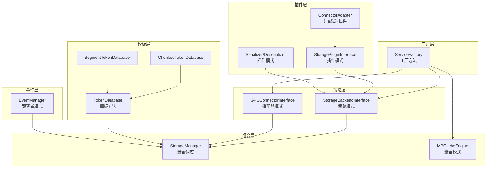
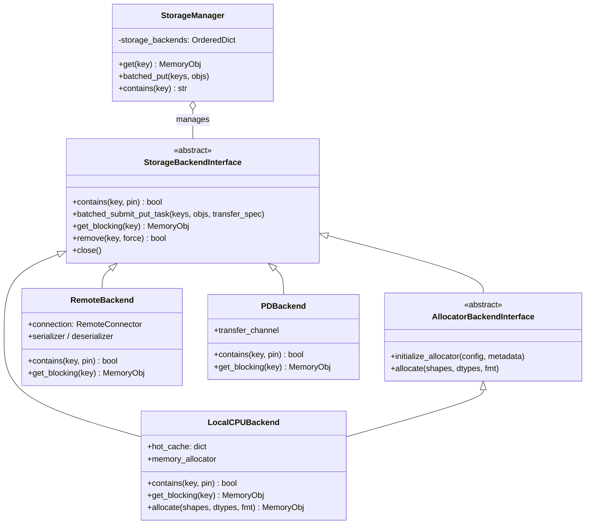

# LMCache 设计模式解析：从实战中学习可复用的架构智慧

> **系列**: LMCache 技术博客系列 | **类型**: 设计模式篇
> 深入 LMCache 代码，拆解 7 大设计模式的实战应用

### 引言

你玩过乐高积木吗？那些精巧的连接件——铰链、转接器、滑轨——让形状各异的积木块无缝拼装在一起，搭出千变万化的造型。设计模式在软件架构中扮演的就是"连接件"的角色：它们让不同模块各司其职，又能灵活协作。

LMCache 作为一个需要同时对接多种推理引擎、多种存储后端、多种网络传输协议的系统，如果不用设计模式来组织代码，很快就会变成一团"意大利面条"。事实上，LMCache 的代码库中精心运用了至少 7 种经典设计模式，让整个系统既灵活又健壮。

今天，我们就来逐一拆解这些设计模式——不是教科书式的泛泛而谈，而是直接进入 LMCache 的源码，看看每个模式在真实场景中解决了什么问题、怎么用的、以及你在自己的项目中何时该用。

### 设计模式关系总览

在深入每个模式之前，先给你一张全局地图，看看这些模式在 LMCache 中是如何协作的：



可以看到，**工厂方法**在最顶层决定创建哪些组件；**策略模式**和**适配器模式**定义了存储和 GPU 连接的可替换接口；**组合模式**把多个模块编排成流水线；**模板方法**统一了 token 处理的流程骨架；**插件模式**让第三方可以贡献新后端；**观察者模式**则贯穿整个数据流，实现松耦合的事件通知。

---

### 1. 策略模式：让存储后端可插拔

##### 它解决了什么

LMCache 需要支持多种存储介质：CPU 内存、本地磁盘、远程 Redis/S3、P2P 直传、NIXL 共享内存……这些后端的读写逻辑完全不同，但上层调用者（`StorageManager`）不应该关心"数据到底存在哪里"——它只需要一个统一的 `put` / `get` / `contains` 接口。

##### 在 LMCache 中的实现

`StorageBackendInterface` 就是策略模式的"策略接口"，定义了所有存储后端必须实现的方法：

```python
# lmcache/v1/storage_backend/abstract_backend.py
class StorageBackendInterface(metaclass=abc.ABCMeta):
    @abc.abstractmethod
    def contains(self, key, pin=False) -> bool: ...

    @abc.abstractmethod
    def batched_submit_put_task(self, keys, objs, ...): ...

    @abc.abstractmethod
    def get_blocking(self, key) -> Optional[MemoryObj]: ...
```

而 `LocalCPUBackend`、`RemoteBackend`、`PDBackend` 等则是具体的策略实现。`StorageManager` 持有一个 `OrderedDict[str, StorageBackendInterface]`，遍历所有后端执行操作，完全不感知具体后端类型：

```python
# lmcache/v1/storage_backend/storage_manager.py
class StorageManager:
    def __init__(self, config, metadata, event_manager, ...):
        self.storage_backends: OrderedDict[str, StorageBackendInterface] = OrderedDict()
        self.create_backends()  # 根据配置动态创建策略实例

    def get(self, key, location=None):
        for backend_name, backend in self.get_active_storage_backends(location):
            memory_obj = backend.get_blocking(key)  # 多态调用
            if memory_obj:
                return memory_obj
```

##### 适用场景

当你需要**在运行时切换算法或策略**，且客户端不应感知具体实现时，就用策略模式。LMCache 的存储后端选择完全由配置驱动，用户改一下 `remote_url` 就从 Redis 切换到 S3，上层代码一行不改。

##### 策略模式类图



---

### 2. 适配器模式：让不同推理引擎"说同一种语言"

##### 它解决了什么

vLLM、SGLang、TensorRT-LLM——每种推理引擎内部 KV Cache 的张量布局完全不同。vLLM 用 paged attention 的 block 表，SGLang 用自己的 tensor layout，TRT-LLM 又是另一套。LMCache 要从这些引擎中"取"KV Cache 存下来，或者"还"KV Cache 回去，就必须适配这些差异。

##### 在 LMCache 中的实现

`GPUConnectorInterface` 定义了统一的 `from_gpu` / `to_gpu` 接口，而每种引擎有专属的适配器实现：

```python
# lmcache/v1/gpu_connector/gpu_connectors.py
class GPUConnectorInterface(metaclass=abc.ABCMeta):
    @abc.abstractmethod
    def to_gpu(self, memory_obj, start, end, **kwargs): ...

    @abc.abstractmethod
    def from_gpu(self, memory_obj, start, end, **kwargs): ...
```

`CreateGPUConnector` 函数根据引擎类型和硬件平台选择适配器：

```python
# lmcache/v1/gpu_connector/__init__.py
def CreateGPUConnector(config, metadata, engine, layout_hints=None):
    if engine == EngineType.SGLANG:
        return SGLangGPUConnector(...)
    elif engine == EngineType.VLLM:
        if config.use_gpu_connector_v3:
            return VLLMPagedMemGPUConnectorV3(...)
        else:
            return VLLMPagedMemGPUConnectorV2(...)
    elif engine == EngineType.TRTLLM:
        return TRTLLMGPUConnector(...)
```

这里你还能看到适配器模式的一个巧妙变体：**同一引擎在不同硬件上也需要不同适配器**——vLLM 在 CUDA 上用 `VLLMPagedMemGPUConnectorV2`，在 XPU 上用 `VLLMPagedMemXPUConnectorV2`，在 MUSA 上又有专门的 `VLLMPagedMemMUSAConnectorV2`。

##### 适用场景

当你需要**让不兼容的接口协同工作**时——典型场景就是对接第三方系统。适配器模式让你不需要修改已有代码，只需写一个"翻译层"。

---

### 3. 工厂方法模式：根据配置"生产"正确的组件

##### 它解决了什么

LMCache 有两种运行模式：Standalone（单进程）和 MP（多进程）。不同模式下需要创建不同的 `LMCacheManager`、`LookupServer`、`HealthMonitor` 等组件。如果用一堆 `if-else` 散落在各处，代码很快就会失控。

##### 在 LMCache 中的实现

`BaseServiceFactory` 是工厂方法的抽象基类，定义了创建各种组件的接口：

```python
# lmcache/integration/base_service_factory.py
class BaseServiceFactory(ABC):
    @abstractmethod
    def get_or_create_lmcache_engine(self) -> Optional[LMCacheEngine]: ...

    @abstractmethod
    def maybe_create_lookup_client(self): ...

    @abstractmethod
    def maybe_create_health_monitor(self, lmcache_manager): ...
```

`StandaloneServiceFactory` 是 Standalone 模式的具体工厂：

```python
# lmcache/v1/standalone/standalone_service_factory.py
class StandaloneServiceFactory(BaseServiceFactory):
    def get_or_create_lmcache_engine(self):
        if self._engine is not None:
            return self._engine
        self._engine = LMCacheEngineBuilder.get_or_create(
            instance_id=self._config.lmcache_instance_id,
            config=self._config, metadata=self._metadata,
            gpu_connector=self._gpu_connector, ...
        )
        return self._engine
```

而 vLLM 集成有自己的 `VLLMServiceFactory`，SGLang 也可以有自己的工厂实现。`LMCacheManager` 只依赖 `BaseServiceFactory` 接口，不关心具体是哪个工厂：

```python
# lmcache/v1/manager.py
class LMCacheManager:
    def __init__(self, config, service_factory: BaseServiceFactory, ...):
        self._lmcache_engine = service_factory.get_or_create_lmcache_engine()
        self._lookup_client = service_factory.maybe_create_lookup_client()
        # ... 全部通过工厂创建
```

##### 适用场景

当你需要**根据上下文创建不同对象，且客户端不应知道具体创建逻辑**时。工厂方法把"创建什么"的决策封装在工厂内部，调用方只需说"给我一个引擎"。

---

### 4. 组合模式：把多个模块编排成流水线

##### 它解决了什么

在 LMCache 的多进程（MP）架构中，一次缓存操作需要经过多个阶段：先 Lookup（查找缓存是否存在），再 GPUTransfer（在进程间传输数据），最后 Blend（将缓存与新 token 融合）。这些模块需要像流水线一样串联工作。

##### 在 LMCache 中的实现

`MPCacheEngine` 是组合模式中的"组合节点"，它持有多个 `EngineModule` 实例，按顺序调度它们处理请求。每个 `EngineModule`（如 `LookupModule`、`GPUTransferModule`、`BlendModule`）是"叶子节点"，专注于单一职责。

从 `StorageManager` 的角度，你也能看到组合模式的影子——它管理着多个 `StorageBackendInterface`，遍历它们执行 `put` / `get` / `contains`，就像操作一个统一的后端：

```python
# StorageManager 遍历所有后端——组合模式思维
def batched_put(self, keys, memory_objs, transfer_spec=None, location=None):
    for backend_name, backend in self.storage_backends.items():
        # 为每个后端分配内存并提交写入
        allocator_backend = backend.get_allocator_backend()
        backend.batched_submit_put_task(ks, objs, transfer_spec=transfer_spec)
```

##### 适用场景

当你需要**以统一的方式处理"单个对象"和"对象组合"**时。在 LMCache 中，无论是一个后端还是多个后端，`StorageManager` 都用相同的接口操作它们。

---

### 5. 观察者模式：缓存事件的发布订阅

##### 它解决了什么

在异步预取场景中，`StorageManager` 发起从远程后端加载 KV Cache 的任务，但加载完成后需要通知调度器"数据已就绪"。如果用同步等待，整个推理流水线会被阻塞。观察者模式让加载任务和通知逻辑解耦。

##### 在 LMCache 中的实现

`EventManager` 是事件总线，管理着事件的注册、状态更新和回调触发：

```python
# lmcache/v1/event_manager.py
class EventManager:
    def __init__(self):
        # events[event_type][event_status][event_id] = future
        self.events: dict[EventType, dict[EventStatus, dict[str, asyncio.Future]]] = {
            et: {es: {} for es in EventStatus} for et in EventType
        }

    def add_event(self, event_type, event_id, future):
        """注册事件（发布者调用）"""
        status_dict[event_status.ONGOING][event_id] = future

    def update_event_status(self, event_type, event_id, status):
        """更新事件状态（发布者完成时调用）"""
        # 将事件从 ONGOING 移到 DONE
```

在 `StorageManager.async_lookup_and_prefetch` 中，加载任务完成后通过回调更新事件状态：

```python
# 注册事件 → 加载完成 → 回调通知
self.event_manager.add_event(EventType.LOADING, lookup_id, all_done)
all_done.add_done_callback(
    lambda future: self.prefetch_all_done_callback(future, lookup_id, ...)
)
```

此外，`StorageBackendListener` 也是一个观察者模式的体现——后端发生驱逐（evict）事件时通知监听者：

```python
# lmcache/v1/storage_backend/storage_backend_listener.py
class StorageBackendListener(metaclass=abc.ABCMeta):
    @abc.abstractmethod
    def on_evict(self, backend, keys): ...
```

##### 适用场景

当一个对象的状态变化需要通知其他对象，且你**不想让这些对象紧耦合**时。LMCache 的异步加载、缓存驱逐通知都是典型场景。

---

### 6. 模板方法模式：统一流程骨架，子类填充细节

##### 它解决了什么

LMCache 需要把输入的 token 序列转换成缓存键（`CacheEngineKey`），但有两种不同的分块策略：按固定 chunk_size 分块（`ChunkedTokenDatabase`）和按特殊分隔符分段（`SegmentTokenDatabase`）。两种策略的流程骨架是一样的——分块 → 哈希 → 生成 key——但分块的具体逻辑不同。

##### 在 LMCache 中的实现

`TokenDatabase` 是抽象基类，`process_tokens()` 定义了流程骨架（包括哈希函数初始化、key 生成等公共逻辑），而子类实现具体的分块策略：

```python
# lmcache/v1/token_database.py
class TokenDatabase(metaclass=abc.ABCMeta):
    def __init__(self, config=None, metadata=None):
        self.hash_func = self._get_vllm_hash_func(hash_algorithm)  # 公共逻辑
        self.metadata = metadata

    @abc.abstractmethod
    def process_tokens(self, tokens=None, hashes=None, ...):
        """子类实现具体分块策略"""
        raise NotImplementedError

    def _make_key_by_hash(self, chunk_hash, request_configs=None):
        """公共方法：由 hash 生成 CacheEngineKey"""
        return CacheEngineKey(self.metadata.model_name, ...)


class ChunkedTokenDatabase(TokenDatabase):
    def process_tokens(self, tokens=None, ...):
        token_chunks = self._chunk_tokens(tokens)      # 固定大小分块
        prefix_hashes = self._prefix_hash(token_chunks) # 前缀哈希链
        for chunk_id, hash_val in enumerate(prefix_hashes):
            yield (start_idx, end_idx, self._make_key_by_hash(hash_val))


class SegmentTokenDatabase(TokenDatabase):
    def process_tokens(self, tokens=None, ...):
        token_chunks = self._fast_split_by_subtensor(tokens)  # 按分隔符分段
        for token_chunk in token_chunks:
            yield (start_idx, end_idx, self._make_key_by_hash(hash_val))
```

注意 `_make_key_by_hash()` 是模板方法中的"钩子方法"——子类不需要重写它，但会调用它。而 `process_tokens()` 是"抽象方法"——子类必须实现。

##### 适用场景

当你有**一套固定的算法骨架，但某些步骤需要子类自定义**时。模板方法模式让你避免重复编写公共逻辑，同时保留扩展点。

---

### 7. 插件模式：让第三方贡献新后端

##### 它解决了什么

LMCache 的存储后端不可能内置所有存储系统——用户可能想用自研的分布式存储、特殊的硬件加速通道、或者自定义的序列化压缩算法。插件模式让第三方只需实现接口、注册适配器，就能无缝接入 LMCache。

##### 在 LMCache 中的实现

**存储后端插件**——`StoragePluginInterface` 定义了可配置存储后端的接口：

```python
# lmcache/v1/storage_backend/abstract_backend.py
class StoragePluginInterface(StorageBackendInterface):
    def __init__(self, dst_device, config=None, metadata=None,
                 local_cpu_backend=None, loop=None):
        super().__init__(dst_device=dst_device)
        self.config = config       # 框架注入配置
        self.metadata = metadata   # 框架注入元数据
        self.local_cpu_backend = local_cpu_backend  # 框架注入本地后端
```

第三方只需继承 `StoragePluginInterface`，然后在配置中声明：

```yaml
# 配置示例
storage_plugins:
  - my_custom_backend
extra_config:
  storage_plugin.my_custom_backend.module_path: "my_package.my_backend"
  storage_plugin.my_custom_backend.class_name: "MyCustomBackend"
```

`storage_plugin_launcher` 会动态加载：

```python
# lmcache/v1/storage_backend/__init__.py
def storage_plugin_launcher(config, metadata, loop, local_cpu_backend, ...):
    for storage_plugin in config.storage_plugins:
        module = importlib.import_module(module_path)      # 动态导入
        backend_class = getattr(module, class_name)
        backend_instance = backend_class(config=config, ...)  # 实例化
        storage_backends[storage_plugin] = backend_instance   # 注册
```

**远程连接器插件**——`ConnectorAdapter` 让第三方可以贡献新的远程存储适配器（Redis、S3、MooncakeStore、InfiniStore、NIXL 等）：

```python
# lmcache/v1/storage_backend/connector/__init__.py
class ConnectorAdapter(ABC):
    def can_parse(self, url) -> bool: ...         # 能否处理这个 URL
    def create_connector(self, context) -> RemoteConnector: ...  # 创建连接器
```

内置的适配器包括 `RedisAdapter`、`S3Adapter`、`MooncakeStoreAdapter`、`InfiniStoreAdapter` 等，它们都继承 `ConnectorAdapter`，由 `ConnectorManager` 自动发现和注册。

**SERDE 插件**——序列化/反序列化也遵循插件模式：

```python
# lmcache/v1/storage_backend/naive_serde/serde.py
class Serializer(metaclass=abc.ABCMeta):
    @abc.abstractmethod
    def serialize(self, memory_obj) -> MemoryObj: ...

class Deserializer(metaclass=abc.ABCMeta):
    @abc.abstractmethod
    def deserialize(self, memory_obj) -> MemoryObj: ...
```

目前有 `NaiveSerializer`（直传）、`KIVISerializer`（Kivi 量化）、`CacheGenSerializer`（CacheGen 压缩）三种实现，通过 `CreateSerde` 工厂函数根据配置选择。

##### 适用场景

当你希望**系统具备开放扩展能力，第三方无需修改核心代码就能添加新功能**时。这是构建生态系统的关键模式。

---

### 总结：设计模式不是银弹，但好架构离不开它们

回顾 LMCache 中的 7 种设计模式：

| 模式 | 核心位置 | 解决的问题 | 一句话总结 |
|------|---------|-----------|-----------|
| 策略模式 | `StorageBackendInterface` | 存储后端可插拔 | 定义接口，实现可替换 |
| 适配器模式 | `GPUConnectorInterface` | 适配不同推理引擎 | 统一接口，翻译差异 |
| 工厂方法 | `BaseServiceFactory` | 根据配置创建组件 | 封装创建，解耦决策 |
| 组合模式 | `StorageManager` / `MPCacheEngine` | 多模块流水线编排 | 统一接口，递归组合 |
| 观察者模式 | `EventManager` | 异步事件通知 | 发布订阅，松耦合 |
| 模板方法 | `TokenDatabase` | 统一流程骨架 | 骨架固定，步骤可变 |
| 插件模式 | `StoragePluginInterface` / `ConnectorAdapter` | 第三方扩展 | 接口开放，实现可插 |

这些模式不是孤立存在的——策略模式定义了接口，工厂方法创建具体策略，适配器模式让不兼容的策略协同工作，组合模式把策略编排成流水线，观察者模式让流水线中的事件通知解耦，模板方法统一了流水线中的公共逻辑，插件模式让整个系统可以向第三方开放。

设计模式的本质是**管理依赖关系**。在 LMCache 这样的系统中，模块间的依赖如果不用接口隔离、不用工厂解耦、不用事件通知替代直接调用，代码很快就会变成"改一处动全身"的泥潭。而合理运用设计模式，就是给系统装上"乐高连接件"——每个模块独立演进，整体架构灵活稳固。

下次你在设计一个需要对接多种外部系统、支持多种运行模式、需要开放扩展的架构时，不妨想想 LMCache 的这 7 种连接件——它们可能正是你需要的。

---

### 延伸阅读
- LMCache开源地址：https://github.com/LMCache/LMCache
- LMCache 官方文档：https://docs.lmcache.ai

---

*本文属于 [LMCache 技术博客系列](.，欢迎持续关注。*
