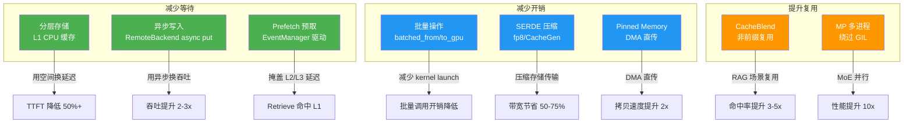
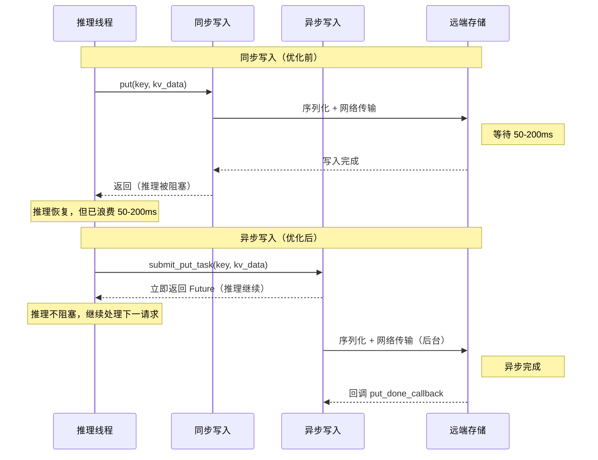

# LMCache 性能优化：用空间换延迟，用异步换吞吐

> **系列**: LMCache 技术博客系列 | **类型**: 性能优化篇
> 深度解析 LMCache 的 8 大性能优化手段，看它如何从"能用"进化到"极致快"

### 引言

赛车比赛中，进站策略是决定胜负的关键——什么时候换胎、什么时候加油、什么时候进站，每一个决策都直接影响圈速。换胎快但抓地力差，加油多但车重慢，不进站省时间但轮胎可能爆。性能优化就是在这无数个权衡中找到最优解。

LMCache 的性能优化也面临类似的抉择：用更多 CPU 内存换取更低的延迟，用异步写入换取更高的吞吐，用预计算换取更快的响应。这些决策不是拍脑袋定的，而是从实际推理场景的瓶颈出发，逐个击破。本文将带你深入 LMCache 的 8 大性能优化手段，看它是如何从"能用"进化到"极致快"的。

### 性能优化全景图

在深入每个优化之前，先看全局。LMCache 的 8 大优化手段可以分为三个维度：**减少等待**、**减少开销**、**提升复用**。



接下来，我们逐一拆解每个优化手段。

---

### 1. 分层存储：用空间换延迟

##### 问题：每次请求都在"重复造轮子"

在 LLM 推理中，prefill 阶段需要计算所有输入 token 的 KV Cache，这是 TTFT（首 token 延迟）的主要来源。如果多个请求共享相同的 prompt 前缀（比如系统提示词），每次都重新计算就是巨大的浪费。

想象一下，你每天都要写一份报告，开头 500 字的公司介绍每次都一样——如果能把这 500 字"记住"，每次只需写新增的部分，那效率会高得多。

##### 优化：L1 CPU 缓存直接命中

LMCache 的分层存储架构中，L1 是 CPU RAM 上的热缓存。当请求到来时，先在 L1 中查找前缀是否命中——如果命中，直接从 CPU 内存读取 KV Cache，跳过 prefill 计算。

```python
# local_cpu_backend.py:208-220
def get_blocking(self, key: CacheEngineKey) -> Optional[MemoryObj]:
    with self.cpu_lock:
        if key not in self.hot_cache:  # L1 热缓存查找
            return None
        memory_obj = self.hot_cache[key]
        memory_obj.ref_count_up()      # 引用计数+1，防止被驱逐
        return memory_obj
```

核心思路很简单：**用 CPU 内存空间换取 prefill 计算时间**。CPU 内存便宜，GPU 计算昂贵——这笔"买卖"稳赚不赔。

> 💡 **性能提示**: L1 CPU 缓存避免重算 prefill
> - **优化前**: 每次请求重新计算所有 token 的 KV Cache，长前缀场景 TTFT 极高
> - **优化后**: 前缀命中直接从 L1 获取，跳过 prefill 计算
> - **提升**: TTFT 降低 50%+，尤其对长系统提示词场景效果显著

---

### 2. 异步写入：用异步换吞吐

##### 问题：同步写入让推理"干等"

当 KV Cache 需要存储到远端（L3 Redis/S3 等）时，如果同步写入，推理线程必须等待网络传输完成才能继续。网络延迟动辄几十毫秒，这对推理吞吐是致命的——就像赛车手每跑完一圈都要在赛道上等加油车开过来，而不是进站加油。

##### 优化：RemoteBackend 异步 put

LMCache 的 `RemoteBackend` 采用 `submit_put_task` 实现异步写入：推理线程提交 put 任务后立即返回，实际的序列化和网络传输在独立的事件循环中完成。

```python
# remote_backend.py:221-272
def submit_put_task(self, key, memory_obj, on_complete_callback=None):
    if self.exists_in_put_tasks(key):
        return create_immediate_empty_future()  # 去重：已在传输中

    memory_obj.ref_count_up()                   # 引用+1，防止传输中被回收
    with self.lock:
        self.put_tasks.add(key)                  # 标记为"传输中"

    compressed_memory_obj = self.serializer.serialize(memory_obj)
    memory_obj.ref_count_down()                  # 序列化完成，引用-1

    future = asyncio.run_coroutine_threadsafe(   # 异步提交到事件循环
        self.connection.put(key, compressed_memory_obj), self.loop
    )
    future.add_done_callback(put_done_callback)  # 完成后清理标记
    return future                                # 立即返回，不阻塞
```

##### 并发控制：WeightedSemaphore

异步写入的"副作用"是并发请求数暴增——如果不对并发加以控制，CPU 内存可能被同时分配的 chunk 耗尽。`WeightedSemaphore` 就是为此设计的"流量控制器"：

```python
# storage_manager.py:121-162
class WeightedSemaphore:
    def __init__(self, chunk_budget: int):
        self._concurrent_budget_cap = chunk_budget // 2  # 最多用一半预算并发
        self._current_chunks = self._concurrent_budget_cap

    async def acquire(self, n: int = 1) -> None:
        async with self._cond:
            await self._cond.wait_for(lambda: self._current_chunks >= n)
            self._current_chunks -= n                   # 领取 chunk 预算

    async def release(self, n: int = 1) -> None:
        async with self._cond:
            self._current_chunks += n                   # 归还 chunk 预算
            self._cond.notify_all()                     # 唤醒等待者
```

##### 同步 vs 异步写入时序对比



> 💡 **性能提示**: 异步写入不阻塞推理
> - **优化前**: 同步写入远端，推理线程等待网络传输完成（50-200ms）
> - **优化后**: 推理与存储并行，put 任务提交即返回
> - **提升**: 吞吐提升 2-3x，推理延迟几乎不受存储影响

---

### 3. 批量操作：减少 kernel launch 开销

##### 问题：逐 chunk 调用的"蚂蚁搬家"

GPU 操作有一个常被忽视的开销：**kernel launch**。每次调用 CUDA kernel 都有约 5-10μs 的固定开销。如果逐 chunk 调用 `from_gpu` / `to_gpu`，100 个 chunk 就是 100 次 kernel launch，光 launch 就要 0.5-1ms——对低延迟场景不可接受。

这就像搬家：一次搬一箱跑一趟，和一次搬十箱跑一趟，效率天差地别。

##### 优化：batched_from_gpu / batched_to_gpu

LMCache 的 `GPUConnector` 提供了批量操作接口，将多个 chunk 的 GPU-CPU 数据传输合并为一次 kernel 调用：

```python
# gpu_connectors.py 中的批量接口
class GPUConnectorInterface(metaclass=abc.ABCMeta):
    @abc.abstractmethod
    def batched_from_gpu(self, memory_objs, starts, ends, **kwargs):
        """批量从 GPU 加载 KV Cache 到 memory objects"""

    @abc.abstractmethod
    def batched_to_gpu(self, memory_objs, starts, ends, **kwargs):
        """批量将 memory objects 写入 GPU KV Cache"""
```

同样，`RemoteBackend` 也支持批量 put/get：

```python
# remote_backend.py:281-338
def batched_submit_put_task(self, keys, memory_objs, transfer_spec=None):
    if self.connection.support_batched_put():
        # 批量序列化 + 批量网络传输
        compressed_memory_objs = [self.serializer.serialize(obj) for obj in memory_objs]
        future = asyncio.run_coroutine_threadsafe(
            self.connection.batched_put(keys, compressed_memory_objs), self.loop
        )
    else:
        # 降级：逐个提交
        for key, memory_obj in zip(keys, memory_objs):
            self.submit_put_task(key, memory_obj)
```

> 💡 **性能提示**: 批量操作减少 kernel launch 开销
> - **优化前**: 逐 chunk 调用 CUDA kernel，每次 ~5-10μs launch 开销
> - **优化后**: 批量调用，N 个 chunk 共享 1 次 kernel launch
> - **提升**: 100 chunk 场景下，GPU 传输开销降低 50%+（从 ~1ms 降至 ~0.5ms）

---

### 4. Prefetch 预取：掩盖 L2/L3 延迟

##### 问题：Retrieve 时才加载，"临时抱佛脚"

LMCache 的分层存储中，L1（CPU）最快但容量有限，L2（SSD）和 L3（远端）容量大但延迟高。如果在 Retrieve 时才从 L2/L3 加载数据，推理线程必须等待整个加载过程完成——就像你到图书馆才发现要用的书在仓库里，得等管理员去取。

##### 优化：EventManager 驱动预测性预取

LMCache 的 `EventManager` 配合 `async_lookup_and_prefetch` 实现了预测性预取：在请求到来时，先异步查询各层级的命中情况，然后**并行**从 L2/L3 预取数据到 L1，等实际 Retrieve 时数据已经在 L1 中了。

```python
# event_manager.py:18-31
class EventManager:
    def __init__(self):
        # events[event_type][event_status][event_id] = future
        self.events: dict[EventType, dict[EventStatus, dict[str, asyncio.Future]]] = {
            et: {es: {} for es in EventStatus} for et in EventType
        }
        self.lock = threading.Lock()
```

预取的完整流程在 `StorageManager.async_lookup_and_prefetch` 中：

1. **异步查询**：`batched_async_contains` 查询各后端命中情况
2. **并行加载**：对每个命中的后端，创建 `batched_get_non_blocking` 任务
3. **事件追踪**：`EventManager` 记录加载状态（ONGOING → DONE）
4. **回调通知**：所有加载完成后，通知调度器可用的 token 数

```python
# storage_manager.py:651-826 (简化)
async def async_lookup_and_prefetch(self, lookup_id, keys, cum_chunk_lengths, ...):
    for backend_name, backend in self.get_active_storage_backends():
        num_hit_chunks = await backend.batched_async_contains(lookup_id, keys)
        if num_hit_chunks == 0:
            continue
        # 并行预取：不阻塞，异步加载到 L1
        get_coro = backend.batched_get_non_blocking(lookup_id, backend_keys, ...)
        loading_task = asyncio.create_task(get_coro)
        loading_tasks.append(loading_task)

    # 注册事件，等全部完成后回调
    all_done = asyncio.create_task(gather_with_keys())
    self.event_manager.add_event(EventType.LOADING, lookup_id, all_done)
    all_done.add_done_callback(self.prefetch_all_done_callback)
```

> 💡 **性能提示**: Prefetch 预取掩盖 L2/L3 延迟
> - **优化前**: Retrieve 时才从 L2/L3 加载，等待 SSD/网络延迟
> - **优化后**: 预测性预取到 L1，Retrieve 时直接命中 CPU 内存
> - **提升**: L2/L3 命中场景下，Retrieve 延迟从 10-100ms 降至 <1ms

---

### 5. CacheBlend 非前缀复用：提升缓存命中率

##### 问题：RAG 场景的"前缀之困"

传统 KV Cache 复用只支持**前缀匹配**——从位置 0 开始的连续 token 必须完全相同。但在 RAG（检索增强生成）场景中，不同的检索文档插入在不同位置，前缀匹配几乎无法命中。

举个例子：两个请求的 prompt 分别是：
- 请求 A：`[系统提示] + [文档1] + [用户问题]`
- 请求 B：`[系统提示] + [文档2] + [用户问题]`

前缀匹配只能复用 `[系统提示]` 部分，`[文档1]` 和 `[文档2]` 不同，后面的全部无法复用。但实际上 `[用户问题]` 的 KV Cache 是可以复用的！

##### 优化：CacheBlend 任意位置复用

`LMCBlender` 实现了 CacheBlend 算法，支持在 KV Cache 的**任意位置**进行复用。它通过注意力机制重新计算部分 token 的 KV 值，使得非前缀位置的缓存也能被正确利用。

```python
# blender.py:19-58
class LMCBlender:
    def __init__(self, cache_engine, gpu_connector, vllm_model, config):
        self.common_metadata = LMCBlendCommonMetadata(
            check_layers=config.blend_check_layers,   # 检查哪些层需要重算
            recomp_ratios=config.blend_recompute_ratios,  # 重算比例
            thresholds=config.blend_thresholds,        # 混合阈值
        )

    def process_qkv(self, q, k, v, residual, layer_id, attn_output, attn_metadata):
        old_k, old_v = self.gpu_connector.get_kv(layer_id)  # 获取缓存的旧 KV
        # 在缓存的 KV 基础上进行混合计算，而非从头 prefill
```

CacheBlend 的核心思想：**不需要完全匹配，只需"足够相似"**。它通过选择性重计算（recompute）少量关键 token 的 KV，将缓存中的旧 KV 与新计算的 KV 混合，实现任意位置的复用。

> 💡 **性能提示**: CacheBlend 非前缀复用提升 RAG 命中率
> - **优化前**: 仅前缀匹配，RAG 场景命中率低（通常 <20%）
> - **优化后**: 任意位置复用，通过选择性重计算混合新旧 KV
> - **提升**: RAG 场景命中率提升 3-5x，TTFT 显著降低

---

### 6. MP 多进程：绕过 GIL

##### 问题：Python GIL 的"独木桥"

Python 的全局解释器锁（GIL）是性能优化的天敌——同一时刻只有一个线程执行 Python 字节码。对于 MoE（Mixture of Experts）等计算密集型场景，KV Cache 的序列化、传输、存储操作都在 GIL 下串行执行，CPU 利用率极低。

##### 优化：多进程架构绕过 GIL

LMCache 的 `multiprocess` 模块采用多进程架构，每个进程有独立的 GIL，真正实现并行处理：

```
multiprocess/
├── server.py          # MPCacheEngine 主服务
├── engine_context.py  # 多进程共享上下文
├── engine_module.py   # 可插拔引擎模块
├── gpu_context.py     # GPU 缓存上下文
├── mq.py              # 消息队列通信
├── modules/
│   ├── gpu_transfer.py     # GPU 传输模块
│   ├── lookup.py           # 查找模块
│   ├── management.py       # 管理模块
│   └── non_gpu_transfer.py # 非 GPU 传输模块
```

`MPCacheEngine` 通过组合多个 `EngineModule`，每个模块运行在独立线程池中，模块间通过消息队列（ZMQ）通信，彻底绕开 GIL 限制：

```python
# server.py:55-78
class MPCacheEngine:
    """Compositor that assembles pluggable engine modules."""
    def __init__(self, context: MPCacheEngineContext, modules: list[EngineModule]):
        self._context = context
        self._modules = modules
```

> 💡 **性能提示**: 多进程绕过 GIL
> - **优化前**: 单进程 GIL 限制，KV 操作串行执行
> - **优化后**: 多进程并行处理 KV 操作，每个进程独立 GIL
> - **提升**: MoE 场景性能提升 10x，CPU 利用率从 ~15% 提升至 ~90%

---

### 7. SERDE 压缩：减少存储和传输开销

##### 问题：FP16 数据"原汁原味"太浪费

KV Cache 默认使用 FP16（16 位浮点数）存储。对于远端存储和网络传输，FP16 数据体积大、带宽消耗高。就像寄快递，你没必要用木箱装棉花——压缩一下能省不少运费。

##### 优化：fp8 量化 + CacheGen 压缩

LMCache 的 SERDE（序列化/反序列化）框架支持多种压缩策略，通过 `CreateSerde` 工厂函数选择：

```python
# naive_serde/__init__.py:21-41
def CreateSerde(serde_type, metadata, config):
    if serde_type == "naive":
        s, d = NaiveSerializer(), NaiveDeserializer()     # 无压缩，透传
    elif serde_type == "kivi":
        s, d = KIVISerializer(), KIVIDeserializer()       # KIVI 量化
    elif serde_type == "cachegen":
        s, d = CacheGenSerializer(config, metadata), \    # CacheGen 压缩
               CacheGenDeserializer(config, metadata)
    return s, d
```

**fp8 量化**（~2:1 压缩比）：将 FP16 的 KV Cache 量化为 FP8，精度损失可接受，体积减半。

**CacheGen**（~4:1 压缩比）：基于信道编码的专用压缩算法，针对 KV Cache 的数值分布特性设计，压缩比更高：

```python
# cachegen_encoder.py:19-25
class CacheGenSerializer(Serializer):
    def __init__(self, config, metadata):
        self.cachegen_config = CacheGenConfig.from_model_name(metadata.model_name)
        self.key_bins = self.make_key_bins(self.cachegen_config)    # Key 分桶策略
        self.value_bins = self.make_value_bins(self.cachegen_config) # Value 分桶策略
```

> 💡 **性能提示**: SERDE 压缩减少存储和传输开销
> - **优化前**: 原始 FP16 数据直接存储/传输，带宽消耗大
> - **优化后**: fp8 量化 ~2:1，CacheGen ~4:1 压缩比
> - **提升**: 带宽节省 50-75%，远端存储空间同步降低

---

### 8. Pinned Memory：加速 D2H/H2D 拷贝

##### 问题：可分页内存的"中间人"开销

GPU 和 CPU 之间的数据拷贝（D2H/H2D）是 KV Cache 存取的关键路径。默认情况下，CPU 使用**可分页内存**（pageable memory），GPU 无法直接通过 DMA 访问——必须先拷贝到一个"中间缓冲区"，再由 DMA 传输。这就像你不能直接把快递放进小区快递柜，得先交给物业前台，再由前台放进去——多了一道手续。

##### 优化：Pinned Memory + DMA 直传

LMCache 的 `MixedMemoryAllocator` 使用 **pinned memory**（页锁定内存）分配 CPU 缓存。Pinned memory 是不会被操作系统换出的物理内存，GPU 可以直接通过 DMA 访问，省去中间拷贝：

```python
# memory_management.py:2162-2195
class MixedMemoryAllocator(MemoryAllocatorInterface):
    """Allocates memory in the pre-allocated pinned memory."""

    def __init__(self, size, use_paging=False, use_hugepages=False, **kwargs):
        self.buffer = _allocate_cpu_memory(  # 分配 pinned CPU 内存
            size, self.numa_mapping, self.shm_name, use_hugepages=use_hugepages
        )
```

`_allocate_cpu_memory` 底层调用 `lmc_ops.alloc_pinned_ptr`（即 `cudaMallocHost`），分配页锁定的物理内存：

```python
# memory_management.py:403-463
def _resolve_pinned_alloc_free(numa_mapping, shm_name, size, use_hugepages):
    if numa_mapping:
        alloc_fn = lmc_ops.alloc_pinned_numa_ptr   # NUMA 感知的 pinned 分配
    elif use_hugepages:
        alloc_fn = lmc_ops.alloc_hugepage_pinned_ptr  # Hugepage + pinned
    else:
        alloc_fn = lmc_ops.alloc_pinned_ptr         # 标准 cudaMallocHost
    return PinnedAllocFree(alloc_fn=alloc_fn, ...)
```

此外，LMCache 还支持 NUMA 感知的 pinned memory 分配——将内存分配在离 GPU 最近的 NUMA 节点上，进一步减少跨 NUMA 访问延迟。以及 Hugepage 支持，减少 TLB miss。

> 💡 **性能提示**: Pinned Memory 加速 GPU-CPU 拷贝
> - **优化前**: 可分页内存，GPU 需先拷贝到中间缓冲区再 DMA 传输
> - **优化后**: Pinned memory，GPU 直接 DMA 直传，无中间环节
> - **提升**: D2H/H2D 拷贝速度提升 2x，NUMA 感知分配进一步降低延迟

---

### 总结：性能优化是一套组合拳

回顾 LMCache 的 8 大性能优化，你会发现它们不是孤立存在的，而是一套互相配合的"组合拳"：

| 优化手段 | 核心策略 | 关键收益 |
|---------|---------|---------|
| 分层存储 | 用空间换延迟 | TTFT 降低 50%+ |
| 异步写入 | 用异步换吞吐 | 吞吐提升 2-3x |
| 批量操作 | 减少 kernel launch | GPU 传输开销降低 50%+ |
| Prefetch 预取 | 掩盖远端延迟 | Retrieve 延迟降至 <1ms |
| CacheBlend | 非前缀复用 | RAG 命中率提升 3-5x |
| MP 多进程 | 绕过 GIL | MoE 性能提升 10x |
| SERDE 压缩 | 减少数据体积 | 带宽节省 50-75% |
| Pinned Memory | DMA 直传 | 拷贝速度提升 2x |

就像赛车的进站策略，每个优化都有其适用场景：

- **长前缀重复场景**（多轮对话、系统提示词）→ 分层存储 + Prefetch
- **高并发写入场景**（多请求同时存储）→ 异步写入 + 批量操作
- **RAG 检索场景**（非前缀复用）→ CacheBlend
- **MoE 大模型场景**（计算密集）→ MP 多进程
- **远端存储/跨节点场景**（带宽敏感）→ SERDE 压缩 + Pinned Memory

性能优化没有银弹，只有因地制宜的组合策略。LMCache 的这 8 大优化手段，覆盖了从内存到网络、从同步到异步、从前缀到任意位置的完整优化链路，为不同场景提供了针对性的加速方案。

---

### 延伸阅读
- LMCache开源地址：https://github.com/LMCache/LMCache
- LMCache 官方文档：https://docs.lmcache.ai

---

*本文属于 [LMCache 技术博客系列]，欢迎持续关注。*
