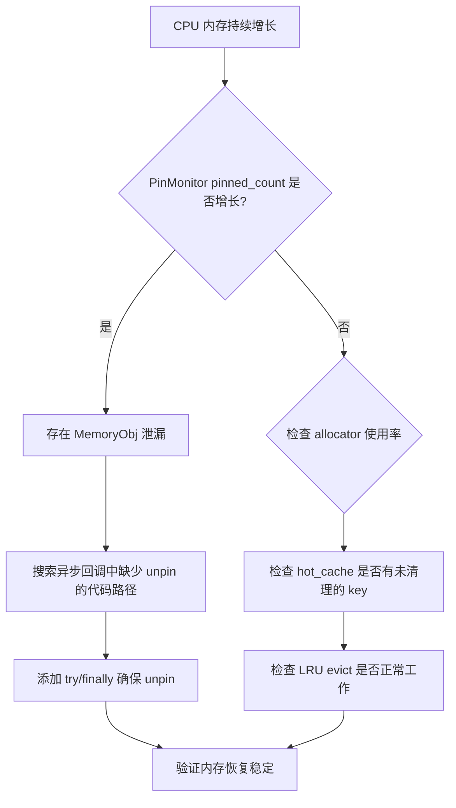
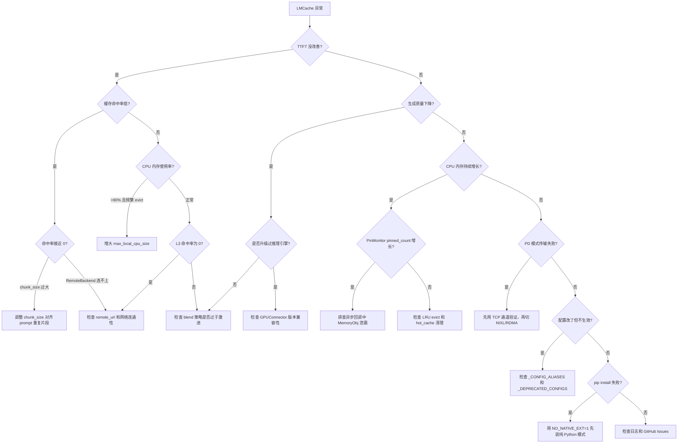

# LMCache 踩坑与避坑：那些文档里没写的暗礁

> **系列**: LMCache 技术博客系列 | **类型**: 踩坑避坑篇
> 10 个真实踩坑场景，帮你绕过 LMCache 部署中的隐形暗礁

### 引言

航海的人都知道，海图上标注的暗礁可以提前绕开，但真正让你触礁的，往往是那些海图上没画出来的。LMCache 的文档覆盖了基本用法和配置说明，但当你真正把它部署到生产环境，才会发现——有些坑，文档里真没写。

你可能遇到过这些场景：明明开了缓存，TTFT 却没改善；CPU 内存莫名其妙地持续增长；PD 分离部署时 KV Cache 传输死活不通……这些问题排查起来耗时耗力，因为它们的根因往往藏在配置细节、版本兼容性或异步语义的角落里。

这篇文章总结了 10 个最常见的 LMCache 踩坑场景，每个都包含**触发条件、具体表现、调试技巧和最佳实践**。读完之后，你至少能少踩一半的坑。

### 一、chunk_size 配置不当：缓存命中的"隐形门槛"

**触发条件**：`chunk_size` 设置过大或过小。默认值是 256（见 `config.py:71`），但如果你没有根据实际 prompt 模式调整，可能适得其反。

**表现**：TTFT 没有改善甚至变差。chunk_size 太大时，只有完整匹配一个 chunk 的 token 序列才能命中缓存，导致命中率骤降；太小时，哈希计算和查找的开销急剧上升，抵消了缓存带来的收益。

**调试技巧**：观察缓存命中率指标。LMCache 通过 `LMCStatsMonitor` 暴露了命中率统计，你可以通过 Prometheus 抓取 `lmcache_hit_rate` 指标。如果命中率低于预期，先检查 chunk_size 是否合理。

**最佳实践**：

```yaml
# 默认值适用于大多数场景
chunk_size: 256

# RAG 场景：文档前缀较长且重复，可适当增大
chunk_size: 512

# 多轮对话：每轮增量较短，可适当减小
chunk_size: 128
```

核心思路：**让 chunk 边界尽量对齐 prompt 中的重复片段边界**。如果你的 system prompt 固定 300 tokens，设 chunk_size=256 就能命中前 256 tokens，剩下 44 tokens 单独一个 chunk。如果设 chunk_size=512，那 300 tokens 的 prompt 连一个完整 chunk 都凑不齐，命中率为零。

### 二、CPU 内存不足导致频繁驱逐：L1 缓存的"漏桶效应"

**触发条件**：`max_local_cpu_size` 设置过小（默认 5GB，见 `config.py:77`）。当并发请求数多、模型大、上下文长时，5GB 远远不够。

**表现**：缓存命中率低，日志中频繁出现 evict 记录。这是典型的"漏桶效应"——刚存进去的缓存还没来得及被复用，就被 LRU 策略驱逐了。

**调试技巧**：监控 L1 容量使用率。通过 Prometheus 的 `lmcache_local_cpu_usage` 指标观察。如果使用率长期在 90% 以上且 evict 频繁，说明容量不足。

**最佳实践**：根据并发请求数和模型大小计算所需内存。粗略公式：

```
所需 CPU 内存 ≈ 并发请求数 × 每请求 KV Cache 大小 × 1.5（留余量）
每请求 KV Cache 大小 ≈ 2 × num_layers × hidden_dim × seq_len × dtype_size
```

例如 Llama-3-70B（80 层，8192 hidden_dim，FP16，4K tokens）：

```python
kv_per_req = 2 * 80 * 8192 * 4096 * 2  # ≈ 10.7 GB
cpu_needed = 10 * kv_per_req * 1.5      # 10 并发 ≈ 160 GB
```

```yaml
max_local_cpu_size: 160  # 单位 GB
```

### 三、RemoteBackend 连接超时：异步写入的"沉默失败"

**触发条件**：`remote_url` 指向的 Redis/S3 网络不稳定，或配置格式错误。

**表现**：异步 put 任务失败，缓存丢失，但你可能浑然不知——因为 RemoteBackend 的 `put` 是异步的（`remote_backend.py:38`），失败不会阻塞推理主流程。最隐蔽的表现是：L1 命中正常但 L3 命中率为零。

**调试技巧**：

1. 检查 `remote_url` 配置格式，确保协议前缀正确：
   - Redis: `redis://host:port`
   - S3: `lm://endpoint:port`
2. 检查网络连通性：`redis-cli -h host -p port ping`
3. 检查日志中是否有 `Failed to put` 或 `Connection lost` 关键字

**最佳实践**：

```yaml
remote_url: "redis://10.0.0.5:6379"
remote_serde: "naive"  # 简单场景用 naive，大模型考虑 "safetensors"
```

RemoteBackend 内置了重连机制（`min_reconnect_interval = 10` 秒，见 `remote_backend.py:65`），但如果你用的是 S3 且网络延迟较高，建议在 S3 客户端层配置超时和重试策略。

### 四、GPUConnector 与推理引擎版本不匹配：数据错乱的"幽灵 Bug"

**触发条件**：vLLM 升级后 KV Cache 的内存布局发生变化。LMCache 的 GPUConnector 是针对特定版本的推理引擎开发的，它依赖 vLLM 内部的 `block_table`、`slot_mapping` 等数据结构来定位和拷贝 KV Cache。

**表现**：`from_gpu`/`to_gpu` 数据错乱——不是报错，而是生成质量下降。输出看起来"似是而非"，出现重复、幻觉或语义漂移。这是最可怕的 Bug 类型：不崩溃，但结果不对。

**调试技巧**：对比 KV Cache tensor 的 shape 和 dtype。在 store 和 retrieve 前后打印：

```python
# store 前：检查 GPU 端 KV Cache 的 shape
kv_tensor = kwargs.get("kv_cache")
print(f"GPU KV shape: {kv_tensor[0].shape}, dtype: {kv_tensor[0].dtype}")

# retrieve 后：检查 CPU 端 MemoryObj 的 shape
print(f"CPU MemObj shape: {memory_obj.tensor.shape}, dtype: {memory_obj.tensor.dtype}")
```

如果 shape 或 dtype 对不上，大概率是版本不匹配。

**最佳实践**：LMCache 版本与推理引擎版本保持同步。每次升级 vLLM 后，先在测试环境验证 GPUConnector 的兼容性。关注 LMCache 的 release note 中是否有 "adapter update for vLLM x.x" 的说明。

### 五、MemoryObj 内存泄漏：异步场景下的"温水煮青蛙"

**触发条件**：异步场景下 MemoryObj 的引用计数未正确释放。LMCache 的 `MemoryObj` 使用引用计数（`ref_count`）和 pin 计数（`pin_count`）管理生命周期。在异步回调中，如果忘记调用 `unpin()` 或 `sub_ref()`，对象就不会被回收。

**表现**：CPU 内存持续增长，像温水煮青蛙，直到 OOM。

**调试技巧**：

1. 监控 PinMonitor 的 pinned_objects 数量（`pin_monitor.py:49`），通过 Prometheus 指标 `lmcache_pin_monitor_pinned_objects_count` 观察
2. 关注日志中的 `Pin timeout detected` 警告——PinMonitor 会在 `pin_timeout_sec`（默认 300 秒）后强制 unpin 超时对象
3. 如果 forced_unpin_count 持续增长，说明存在泄漏

**最佳实践**：确保异步回调中正确释放引用。使用 context manager 模式：

```python
# 正确：使用 pin/unpin 配对
obj = storage_manager.allocate(shape, dtype, fmt)
obj.pin()
try:
    await async_put_to_remote(obj)  # 异步操作
finally:
    obj.unpin()  # 确保释放

# 错误：忘记 unpin
obj = storage_manager.allocate(shape, dtype, fmt)
obj.pin()
await async_put_to_remote(obj)  # 如果异常，pin 永远不会释放
```

下面的流程图展示了内存泄漏的排查思路：



### 六、MP 模式下共享内存权限问题：跨用户的"隐形墙"

**触发条件**：不同用户运行推理引擎和 MP Server。MP 模式使用 POSIX 共享内存（`posix_shm.py`）进行进程间通信，共享内存对象的权限默认是创建者的 umask。

**表现**：POSIX 共享内存访问被拒绝，MP Server 无法读取推理引擎写入的 KV Cache 数据。日志中出现 `Permission denied` 或 `EACCES` 错误。

**调试技巧**：

```bash
# 检查 /dev/shm 下的共享内存对象权限
ls -la /dev/shm/ | grep lmcache

# 检查进程的 effective user
ps -eo pid,euser,cmd | grep -E "vllm|lmcache"
```

**最佳实践**：统一用户运行，或配置共享内存权限：

```bash
# 方案 1：统一用户（推荐）
sudo -u lmcache_user python -m vllm.entrypoints.openai.api_server ...
sudo -u lmcache_user python -m lmcache.v1.multiprocess.server ...

# 方案 2：设置 umask 后启动
umask 0000  # 允许所有用户访问共享内存
python -m lmcache.v1.multiprocess.server ...
```

注意：`posix_shm.py` 使用 `_posixshmem` C 扩展而非标准库的 `SharedMemory` 包装器，正是为了规避 macOS 上 MAC label 传播导致的 `EACCES` 问题（见 `posix_shm.py:24-28`）。

### 七、CacheBlend 选择性重算不足：质量下降的"过度优化"

**触发条件**：`blend_recompute_ratios` 配置过于激进，即重算比例设置过低。CacheBlend 的核心思想是：不是所有 token 的 KV Cache 都需要精确保留，部分 token 可以只保留近似值，需要时再重算。

**表现**：生成质量下降，hallucination 增加。这不是随机错误，而是系统性的语义偏移——因为被"跳过"的关键 token 的注意力信息丢失了。

**调试技巧**：对比 blend 前后的 perplexity：

```bash
# 不开 blend 的 baseline
python benchmark.py --model llama3-70b --enable-blending false

# 开 blend
python benchmark.py --model llama3-70b --enable-blending true \
    --blend-recompute-ratios 0.3
```

如果 perplexity 上升超过 5%，说明重算比例过低。

**最佳实践**：从保守策略开始，逐步调整。LMCache 在开启 blend 时会自动设置 `save_unfull_chunk=True`（见 `config.py:626-631`），确保不完整 chunk 也被保存：

```yaml
enable_blending: true
blend_recompute_ratios: [0.8, 0.5, 0.2]  # 从高到低，先保守
blend_min_tokens: 256                      # 最少 256 tokens 才触发 blend
```

逐步降低重算比例，每次降低后验证输出质量，找到性能和质量的平衡点。

### 八、PD 分离传输通道配置错误：KV Cache 传输的"断头路"

**触发条件**：NIXL/RDMA 端口未开放，或 `pd_peer_host`/`pd_peer_init_port` 配置错误。PD（Prefill-Decode 分离）模式下，Prefill Worker 需要将 KV Cache 通过 NIXL 通道传输给 Decode Worker。

**表现**：KV Cache 传输失败，Decode Worker 等待超时。日志中出现 `Allocation timeout` 或 `Connection refused`。

**调试技巧**：

```bash
# 检查端口是否开放
telnet pd_peer_host pd_peer_init_port

# 检查配置
grep -E "pd_peer|transfer_channel" lmcache_config.yaml
```

**最佳实践**：先用 TCP 通道验证，再切换到 NIXL/RDMA。NIXL 通道的配置项较多（`nixl_channel.py`），建议分步验证：

```yaml
# 第一步：用 TCP 通道验证 PD 基本功能
transfer_channel: "py_socket"
enable_pd: true
pd_role: "sender"       # Prefill Worker
pd_peer_host: "10.0.0.2"
pd_peer_init_port: [5556]

# 第二步：确认 TCP 通道正常后，切换到 NIXL
transfer_channel: "nixl"
nixl_buffer_device: "cuda"
nixl_buffer_size: 1073741824  # 1GB
```

PD 模式还会自动设置 `save_unfull_chunk=True`（见 `config.py:680-686`），因为不完整的 chunk 也需要传输到 Decode Worker，否则会导致生成结果错误。

### 九、配置别名与废弃参数：改了配置但不生效的"幽灵配置"

**触发条件**：使用了已废弃的配置名。LMCache 的配置系统维护了别名映射（`_CONFIG_ALIASES`）和废弃映射（`_DEPRECATED_CONFIGS`），见 `config.py:38-63`。

**表现**：配置不生效，或日志中出现 deprecation warning 但程序继续运行。最坑的情况是：你改了 `nixl_peer_port`，但实际生效的是 `nixl_receiver_port`——因为前者已被废弃。

**调试技巧**：检查日志中的 deprecation warning。`_resolve_config_aliases` 函数（`config_base.py:184-214`）会打印警告：

```
WARNING: nixl_peer_port is deprecated, use nixl_receiver_port instead
```

**最佳实践**：参考 `_CONFIG_ALIASES` 和 `_DEPRECATED_CONFIGS` 中的映射关系，使用最新的配置名：

| 废弃名 | 当前名 |
|--------|--------|
| `nixl_peer_host` | `pd_peer_host` |
| `nixl_peer_init_port` | `pd_peer_init_port` |
| `nixl_peer_port` | `nixl_receiver_port` |
| `nixl_role` | `pd_role` |
| `plugin_locations` | `runtime_plugin_locations` |
| `external_backends` | `storage_plugins` |
| `enable_xpyd` | `enable_pd` |
| `controller_url` | `controller_pull_url` |

升级 LMCache 版本后，第一件事就是检查配置文件中是否有废弃参数。

### 十、C++/CUDA 扩展编译失败：安装阶段的"第一道坎"

**触发条件**：缺少 CUDA toolkit 或版本不兼容。LMCache 的 `setup.py` 会根据环境变量选择编译 CUDA/ROCm/SYCL 扩展（见 `setup.py:402-442`）。

**表现**：`pip install` 失败，报错信息通常包含 `CUDA_HOME not found`、`nvcc not found` 或 `CUDA version mismatch`。

**调试技巧**：

```bash
# 检查 CUDA 版本
nvcc --version
nvidia-smi | head -3

# 检查 torch 编译时的 CUDA 版本
python -c "import torch; print(torch.version.cuda)"

# 两者必须匹配！如果不匹配，pip install 会失败
```

**最佳实践**：使用 `NO_NATIVE_EXT=1` 先安装纯 Python 模式验证功能，再解决编译问题：

```bash
# 第一步：纯 Python 模式安装，快速验证
NO_NATIVE_EXT=1 pip install -e .

# 第二步：确认 CUDA 环境正确后，重新编译
pip install -e .  # 自动编译 C++/CUDA 扩展

# 如果只需要 C++ 扩展（不需要 GPU 扩展）
NO_GPU_EXT=1 pip install -e .
```

`NO_NATIVE_EXT=1` 是 `NO_CUDA_EXT=1` 的替代品，后者已被废弃（见 `setup.py:24-33`），但仍然兼容。

### 踩坑排查决策树

当你遇到问题但不确定是哪个坑时，按照下面的决策树排查：



### 总结

回看这 10 个坑，你会发现它们有几个共同特征：

1. **配置是最大的坑源**：chunk_size、max_local_cpu_size、remote_url、blend_recompute_ratios……大部分问题都源于配置不当。LMCache 提供了合理的默认值，但生产环境的"合理"和默认值往往有差距。

2. **异步是隐蔽的陷阱**：RemoteBackend 的异步 put、MemoryObj 的引用计数、PD 通道的异步传输——异步操作让错误变得"沉默"，不报错但结果不对。

3. **版本兼容性是定时炸弹**：GPUConnector 依赖推理引擎的内部数据结构，配置别名随着版本迭代不断变化。升级前一定要检查兼容性。

4. **调试的关键是指标**：命中率、内存使用率、PinMonitor 计数、evict 频率——这些 Prometheus 指标是你排查问题的"雷达"。部署 LMCache 的第一步，应该是把可观测性搭好。

航海的智慧在于：不是等触礁了才慌，而是在出发前就把暗礁标在海图上。希望这篇文章能成为你 LMCache 部署航程中的那张"暗礁图"——提前标注，安全抵达。

### 延伸阅读
- LMCache开源地址：https://github.com/LMCache/LMCache
- LMCache 官方文档：https://docs.lmcache.ai

---

*本文属于 [LMCache 技术博客系列]，欢迎持续关注。*
