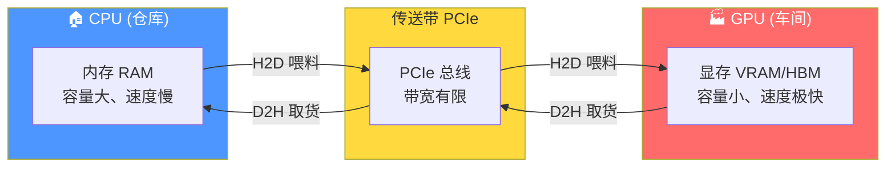
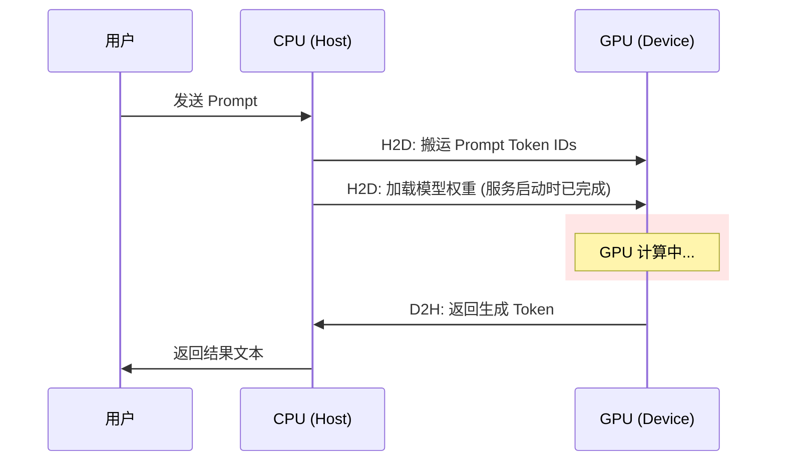
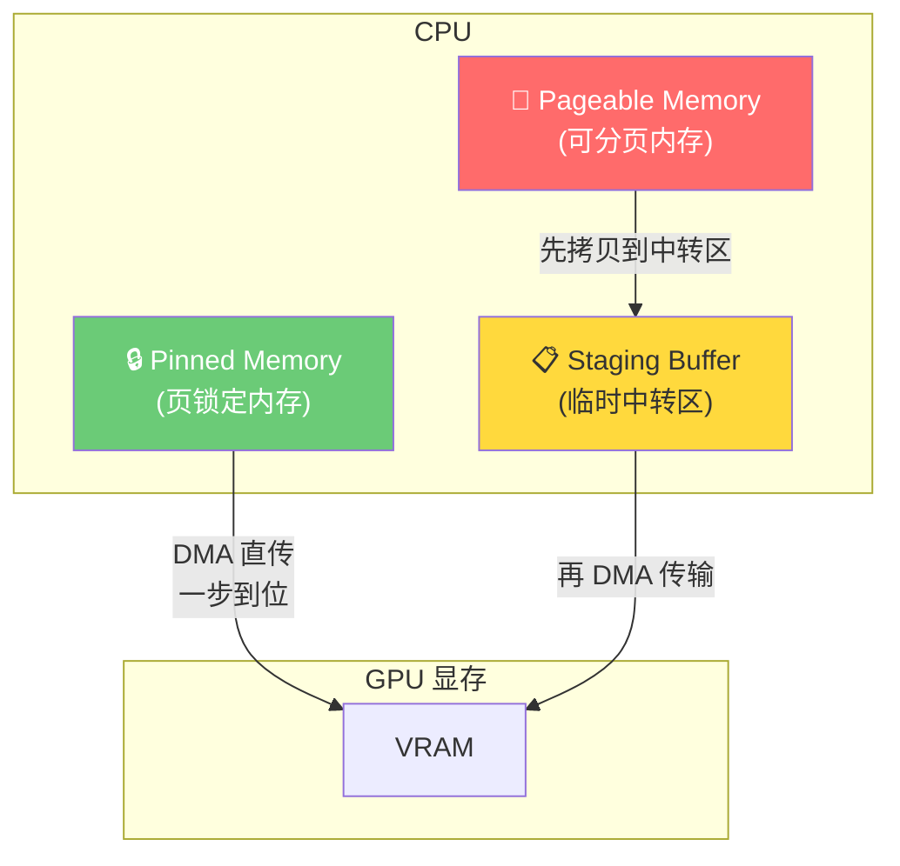
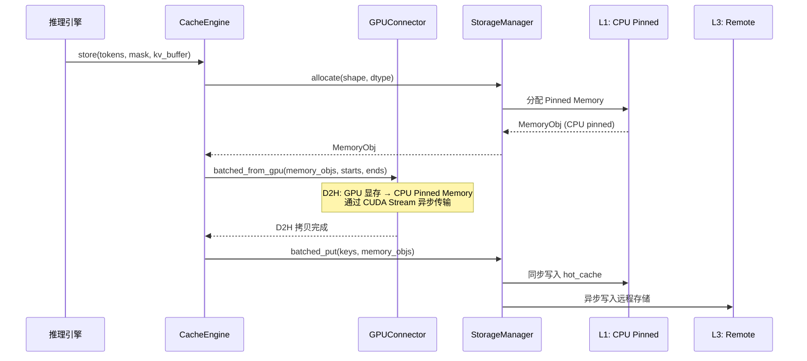
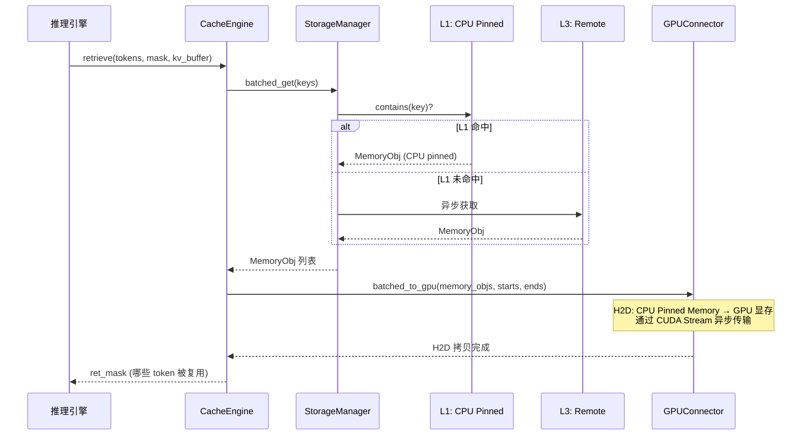
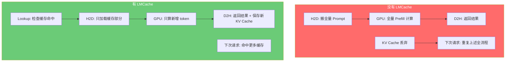
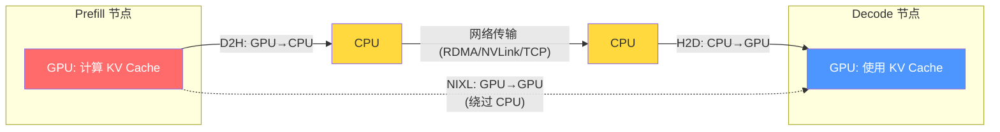

# LMCache之D2H 与 H2D 深度解析：GPU 和 CPU 之间的数据搬运学

> **系列**: LMCache 技术博客系列 | **类型**: 核心概念深潜篇
> 从硬件原理到 LMCache 工程实践，彻底搞懂 LLM 推理中最关键的数据通路

### 引言

想象一座工厂——车间里是高速运转的机械臂（GPU），仓库里堆满了原材料和成品（CPU 内存）。机械臂每秒能处理 3000 箱货，但连接车间和仓库的传送带（PCIe 总线）每秒只能运 14 箱。工厂的效率瓶颈不在生产，而在搬运。

LLM 推理系统就是这座工厂。GPU 内部计算极快，但每次推理都需要把 Prompt、模型权重、KV Cache 从 CPU 搬到 GPU（H2D），算完再把结果搬回来（D2H）。这两趟搬运，决定了用户感知的"快"与"慢"。

本文将从硬件原理出发，讲清楚 H2D 和 D2H 到底是什么、为什么它们是 LLM 推理的瓶颈、以及 LMCache 如何在工程上系统性地优化这条数据通路。

### 一、核心定义：H2D 与 D2H

| 缩写 | 全称 | 数据流向 | 对应操作 | 关键场景 |
|------|------|---------|---------|---------|
| **H2D** | Host to Device | CPU → GPU | 数据从内存拷贝到显存 | 输入阶段：Prompt 加载、模型权重加载、KV Cache 恢复 |
| **D2H** | Device to Host | GPU → CPU | 数据从显存拷贝回内存 | 输出阶段：Token 结果返回、KV Cache 保存 |

> **术语约定**：Host（H）指 CPU 及其主内存（RAM），Device（D）指 GPU 及其显存（VRAM），有时也指 NPU 等加速器。

##### 1.1 H2D：输入与预热

推理开始前，必须把数据从 CPU 内存搬到 GPU 显存，GPU 才能开始计算。具体场景包括：

1. **Prompt 输入**：用户的输入文本被 tokenize 为 Token ID 序列，存储在 CPU 内存中。推理引擎调用 `cudaMemcpy` 将其 H2D 搬运到 GPU 显存。
2. **模型加载**：大模型权重通常几十到几百 GB，启动服务时需要从磁盘经 CPU 加载到 GPU 显存——这是最大的 H2D 过程。
3. **KV Cache 恢复**：如果之前缓存了 KV Cache，需要从 CPU/磁盘/远程存储 H2D 加载回 GPU，避免重算。

##### 1.2 D2H：输出与返回

GPU 算完后，结果需要传回 CPU，才能转换为文本返回给用户。具体场景包括：

1. **Token 结果传输**：GPU 采样得到下一个 Token ID，需要 D2H 拷贝回 CPU 内存，再经 API 网关返回给用户。
2. **KV Cache 保存**：将 GPU 上新计算的 KV Cache D2H 拷贝到 CPU，持久化到分层存储中，供后续请求复用。
3. **流式输出**：流式推理中，每生成一个 Token 理论上都需要一次 D2H（工程上通常批量传输以减少开销）。

##### 1.3 形象比喻



- **H2D（喂料）**：仓库管理员把原材料从仓库搬到传送带上，送进车间
- **D2H（取货）**：车间把成品放到传送带上，运回仓库包装发货

### 二、为什么 H2D/D2H 是 LLM 推理的瓶颈

##### 2.1 带宽鸿沟：200 倍的速度差

| 位置                      | 带宽          | 类比 |
|-------------------------|-------------|------|
| GPU 内部（HBM → 计算单元）      | ~3,000 GB/s | 车间里的高速滑道 |
| CPU ↔ GPU（PCIe 4.0 x16） | ~32 GB/s    | 连接仓库的窄传送带 |
| CPU ↔ GPU（PCIe 5.0 x16） | ~64 GB/s    | 升级后的传送带 |
| GPU ↔ GPU（NVLink 4.0）   | ~600 GB/s   | 车间之间的直达通道 |
| GPU ↔ GPU（NVLink 5.0）   | ~900 GB/s   | 车间之间的直达通道 |

GPU 内部一秒运 3000 箱货，进出仓库的传送带一秒只能运 32 箱。**瓶颈不在生产速度，而在搬运速度。** 如果搬运时间超过计算时间，GPU 就会"饿死"——算力闲置，等待数据。

##### 2.2 每次推理都要搬好几趟

一次完整的 LLM 推理，H2D 和 D2H 至少各发生一次：



在 Prefill（预填充）阶段，长 Prompt 的 Token ID 需要一次性 H2D 搬运；在 Decode（解码）阶段，每生成一个 Token 都需要 D2H 返回。对于流式输出，D2H 的频率直接决定了用户感知的"打字速度"。

##### 2.3 内存有两种：VIP 通道与普通通道

CPU 内存分两种，它们的 H2D/D2H 传输路径完全不同：



- **Pageable Memory（可分页内存）**：操作系统可能随时将内存页换出到磁盘（Swap）。DMA 引擎不敢直接读取，因为数据可能在传输过程中被换走。所以必须先拷贝到一个"中转区"（Staging Buffer），再由 DMA 传输——**多了一趟中转**。

- **Pinned Memory（页锁定内存）**：操作系统保证这块内存不会被换出，DMA 引擎可以直接读取——**一步到位**。

| 内存类型 | H2D 传 1GB | 中转开销 | 适用场景 |
|---------|-----------|---------|---------|
| Pageable | ~80 ms | 有（多一次拷贝） | 一次性数据、小数据量 |
| Pinned | ~70 ms | 无（DMA 直传） | 频繁传输、大数据量 |

LLM 推理中 KV Cache 的 H2D/D2H 极其频繁，用 Pinned Memory 每次省一次中转，积少成多效果显著。LMCache 的 `MixedMemoryAllocator` 默认使用 Pinned Memory 分配 KV Cache 缓冲区，正是出于这个原因。

##### 2.4 性能影响量化

以 Llama-3-70B 为例，一次 4K token 的 Prefill：

| 操作 | 数据量 | PCIe 4.0 耗时 | HBM 内耗时 |
|------|--------|--------------|-----------|
| Prompt H2D | ~32 KB (token IDs) | ~1 μs | — |
| KV Cache H2D (恢复) | ~1.5 GB | ~47 ms | ~0.5 ms |
| KV Cache D2H (保存) | ~1.5 GB | ~47 ms | ~0.5 ms |
| Token D2H | ~4 KB | ~0.1 μs | — |

KV Cache 的 H2D/D2H 是真正的性能杀手——1.5 GB 的数据在 PCIe 上要跑 ~47 ms，而在 GPU 内部只需要 ~0.5 ms。**这就是为什么 LMCache 要花大力气优化 KV Cache 的搬运效率。**

### 三、LMCache 中的 D2H 与 H2D

##### 3.1 Store 流程 = D2H

当推理引擎完成 Prefill 后，需要把 GPU 上新计算的 KV Cache 保存到分层存储中。此时数据在 GPU 上，要搬到 CPU 存储——这就是 D2H。



关键步骤：
1. **分配 Pinned Memory**：`StorageManager` 通过 `LocalCPUBackend` 分配 CPU Pinned Memory 作为目标缓冲区
2. **D2H 拷贝**：`GPUConnector.batched_from_gpu()` 通过 CUDA Stream 将 GPU 上的 KV Cache 异步拷贝到 CPU Pinned Memory
3. **分层写入**：同步写入 L1（CPU），异步写入 L3（远程），不阻塞推理

##### 3.2 Retrieve 流程 = H2D

当新请求到来时，如果 TokenDatabase 发现已有缓存的 KV Cache，需要从分层存储加载回 GPU——数据在 CPU 上，要搬到 GPU——这就是 H2D。



关键步骤：
1. **分层查找**：先查 L1（CPU），未命中再查 L3（远程），远程数据自动回填到 L1
2. **H2D 拷贝**：`GPUConnector.batched_to_gpu()` 通过 CUDA Stream 将 CPU Pinned Memory 中的 KV Cache 异步拷贝到 GPU 显存
3. **返回复用掩码**：`ret_mask` 标记哪些 token 的 KV Cache 已被恢复，推理引擎只需计算新增部分

##### 3.3 GPUConnector：D2H/H2D 的"海关"

GPUConnector 是 H2D/D2H 的执行者，它封装了不同推理引擎的 KV Cache 格式差异，提供统一的 `from_gpu`（D2H）和 `to_gpu`（H2D）接口：

```python
class GPUConnectorInterface(metaclass=abc.ABCMeta):
    def from_gpu(self, memory_obj, start, end, **kwargs):
        """D2H: GPU KV Cache → CPU MemoryObj"""

    def to_gpu(self, memory_obj, start, end, **kwargs):
        """H2D: CPU MemoryObj → GPU KV Cache"""

    def batched_from_gpu(self, memory_objs, starts, ends, **kwargs):
        """批量 D2H"""

    def batched_to_gpu(self, memory_objs, starts, ends, **kwargs):
        """批量 H2D"""
```

不同引擎在 GPU 上组织 KV Cache 的方式截然不同（Paged Attention、FlashInfer、MLA 等格式），GPUConnector 负责在引擎特有的 GPU 格式和 LMCache 统一的 CPU 格式（MemoryFormat）之间做转换，同时执行底层的 D2H/H2D 传输。

### 四、LMCache 的四大优化策略

##### 4.1 策略一：缓存复用，减少搬运次数

最根本的优化——**能不搬就不搬**。



LMCache 通过 TokenDatabase 的前缀哈希链，精确识别哪些 token 的 KV Cache 已经存在，只 H2D 加载缺失部分。在 RAG、多轮对话等场景中，前缀命中率可达 80%+，对应的 H2D 数据量和 GPU 计算量同步减少。

##### 4.2 策略二：Pinned Memory，消除中转开销

LMCache 的 `MixedMemoryAllocator` 默认分配 CUDA Pinned Memory：

```python
class MixedMemoryAllocator:
    def __init__(self, size, backend="cuda", ...):
        self.pin_allocator = PinMemoryAllocator(size, backend)
        # 底层调用 lmc_ops.alloc_pinned_ptr()
        # 支持 NUMA 感知和 HugePages
```

所有 KV Cache 的 D2H/H2D 都走 Pinned Memory 路径，省去 Pageable Memory 的中转开销。在频繁的 Store/Retrieve 循环中，这一优化带来的延迟减少非常可观。

##### 4.3 策略三：批量传输，摊薄启动开销

每次 H2D/D2H 都有固定开销（驱动调用、DMA 启动等），大约 5-10 μs。如果逐 token 传输，开销会迅速累积。

LMCache 使用 `batched_from_gpu` / `batched_to_gpu` 批量传输多个 chunk 的 KV Cache：

```python
def batched_from_gpu(self, memory_objs, starts, ends, **kwargs):
    """一次性 D2H 传输多个 chunk，而非逐个传输"""
    for i, (memory_obj, start, end) in enumerate(zip(memory_objs, starts, ends)):
        self.from_gpu(memory_obj, start, end, **kwargs)
    stream.synchronize()  # 统一同步一次，而非每个 chunk 同步一次
```

批量传输将 N 次驱动调用合并为 1 次，N 次 DMA 启动合并为 1 次，N 次同步等待合并为 1 次。对于 64 个 chunk 的 KV Cache，这可以节省约 0.5 ms 的固定开销。

##### 4.4 策略四：计算与传输重叠，隐藏延迟

LMCache 的 Layerwise GPUConnector 实现了计算与传输的重叠（Overlap）：

```mermaid
gantt
    title Layerwise 传输：计算与 D2H 重叠
    dateFormat X
    axisFormat %s

    section GPU 计算
    Layer 0 计算     :0, 5
    Layer 1 计算     :5, 10
    Layer 2 计算     :10, 15

    section D2H 传输
    Layer 0 D2H     :5, 12
    Layer 1 D2H     :10, 17
    Layer 2 D2H     :15, 22
```



Layerwise 连接器使用 Python generator 模式——每次 yield 一层的 KV Cache，上层代码通过 `generator.send()` 逐层传入 MemoryObj。当 GPU 在计算第 N+1 层时，CUDA Stream 已经在异步传输第 N 层的 KV Cache 到 CPU。传输延迟被计算"藏"起来了，用户感知不到。

在 Retrieve（H2D）方向，同样可以利用 CUDA Stream 实现异步预加载——在推理引擎需要某层 KV Cache 之前，提前发起 H2D 传输。

### 五、多硬件支持：不只是 CUDA

LMCache 的 H2D/D2H 优化不局限于 NVIDIA GPU。`CreateGPUConnector()` 工厂函数根据 `torch_device_type` 自动选择对应的连接器实现：

| 硬件平台 | 设备类型 | Stream API | 传输实现 |
|---------|---------|-----------|---------|
| NVIDIA GPU | `cuda` | `torch.cuda.Stream` | CUDA 内核 (`lmc_ops`) |
| AMD GPU (ROCm) | `cuda` | 同 CUDA | CUDA 兼容层 |
| Intel GPU (XPU) | `xpu` | `torch.xpu.Stream` | SYCL 内核 |
| Intel Habana (HPU) | `hpu` | `htorch.core.mark_step()` | 纯 Torch ops |
| 摩尔线程 (MUSA) | `musa` | `torch.musa.Stream` | 纯 Torch ops |

不同硬件的 H2D/D2H 传输机制不同，但 GPUConnector 抽象层屏蔽了这些差异——上层代码只需调用 `from_gpu` / `to_gpu`，无需关心底层是 CUDA Stream 还是 SYCL Stream。

### 六、PD 分离架构中的 H2D/D2H

在 Prefill-Decode（PD）分离架构中，H2D/D2H 有了新的含义——不再是 CPU↔GPU 之间的搬运，而是 GPU↔GPU 之间的跨节点传输：



传统路径是 D2H → 网络 → H2D，数据要经过 CPU 中转。LMCache 的 NIXL 存储后端支持 GPU Direct RDMA，让 KV Cache 直接从 Prefill 节点的 GPU 传输到 Decode 节点的 GPU，绕过 CPU 中转，大幅降低跨节点 KV Cache 传输的延迟。

### 设计哲学

> **用空间换延迟** — Pinned Memory 占用更多物理内存，但消除了 H2D/D2H 的中转开销。
>
> **用异步换吞吐** — CUDA Stream 异步传输 + 独立事件循环，让 D2H/H2D 不阻塞推理主线程。
>
> **用抽象换生态** — GPUConnector 统一了不同引擎、不同硬件的 H2D/D2H 差异，一套代码适配所有平台。

### 总结

H2D 和 D2H 是 LLM 推理中 CPU 与 GPU 之间的数据搬运操作，本质是 PCIe 总线上的内存拷贝。由于 PCIe 带宽（~32 GB/s）与 GPU 内部带宽（~3,000 GB/s）存在近 100 倍的差距，H2D/D2H 成为 LLM 推理的关键瓶颈。

LMCache 从四个维度系统性地优化了这条数据通路：

1. **缓存复用**：通过前缀哈希链精确识别可复用的 KV Cache，减少 H2D/D2H 的数据量和次数
2. **Pinned Memory**：使用页锁定内存消除 DMA 传输的中转开销
3. **批量传输**：合并多次小传输为一次大传输，摊薄驱动调用和 DMA 启动开销
4. **计算与传输重叠**：利用 CUDA Stream 异步传输，在 GPU 计算的同时搬运数据，隐藏延迟

理解了 H2D/D2H 的原理和 LMCache 的优化策略，你就能明白为什么 LMCache 能在长上下文、多轮对话场景中显著降低 TTFT——它不是让传送带变快，而是让传送带少跑几趟。

### 延伸阅读
- LMCache开源地址：https://github.com/LMCache/LMCache
- LMCache 官方文档：https://docs.lmcache.ai

---

*本文属于 [LMCache 技术博客系列](./series-index.md)，欢迎持续关注。*
