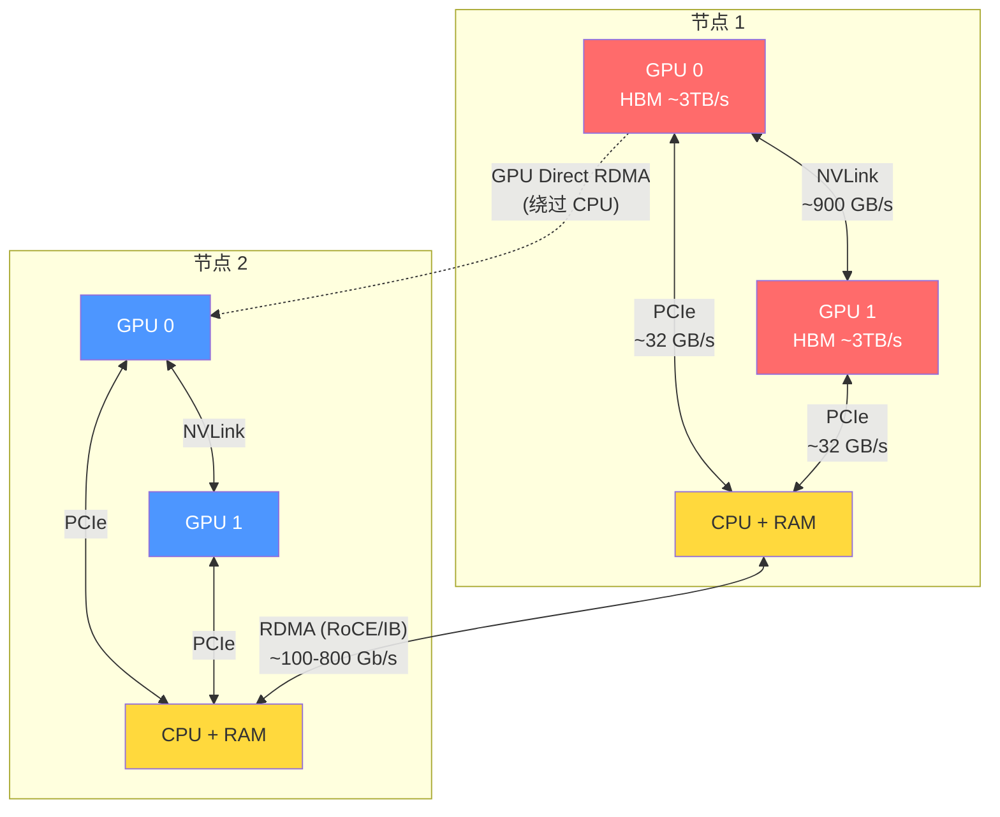
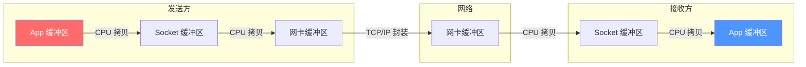
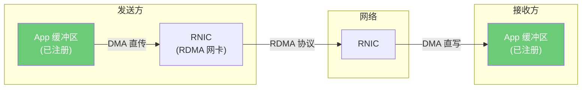
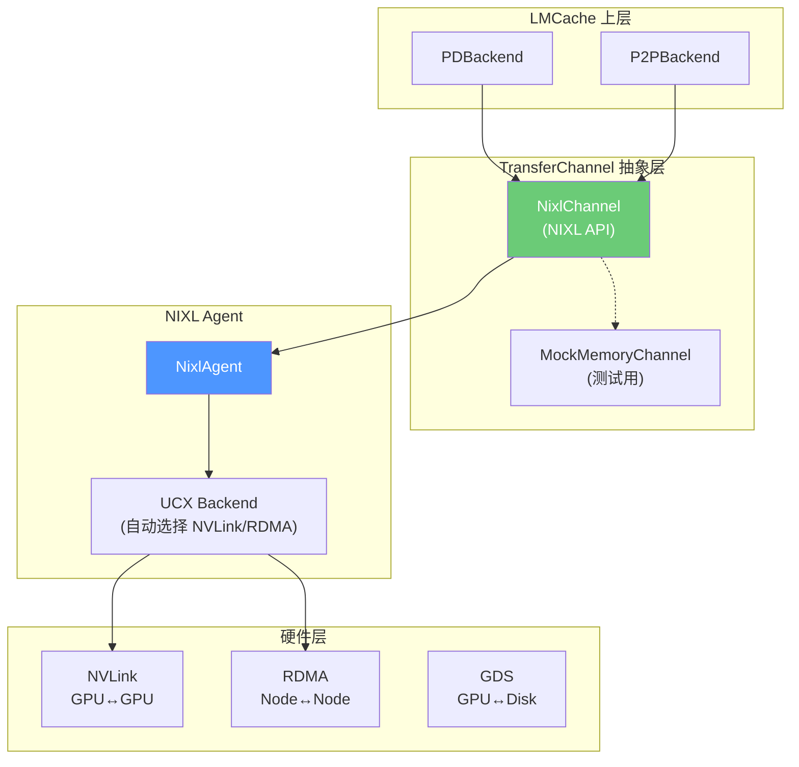
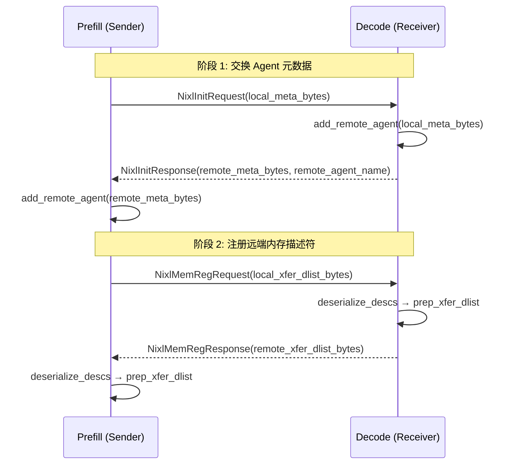
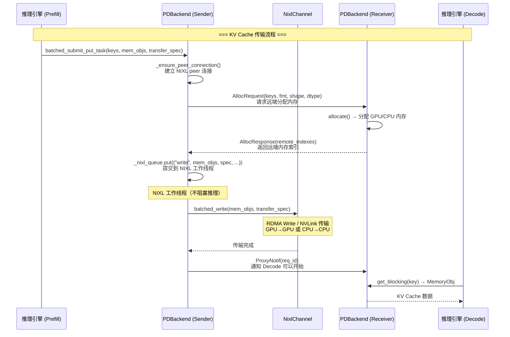
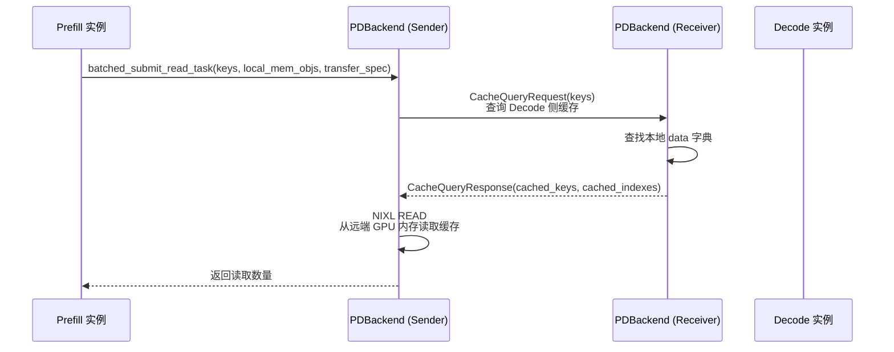
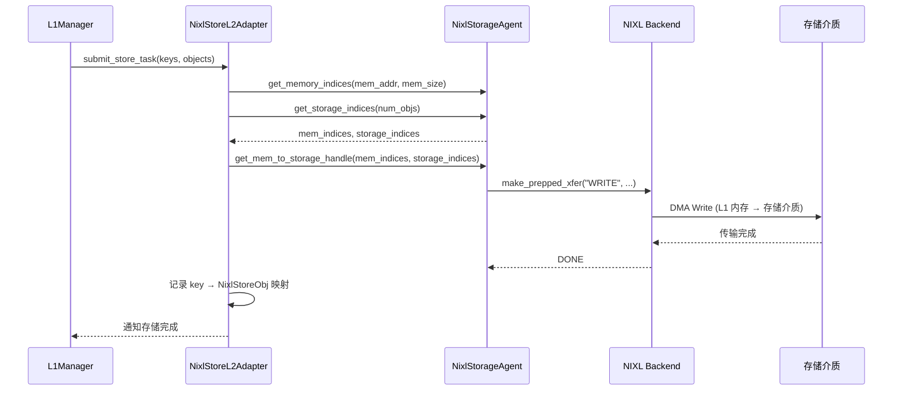

# LMCache 之 NVLink 与 RDMA 深度解析：LLM 推理中跨越节点的数据高速公路

> **系列**: LMCache 技术博客系列 | **类型**: 核心技术深潜篇
> 从硬件原理到 LMCache 工程实践，彻底搞懂 NVLink、RDMA 与 NIXL 如何让 KV Cache 飞越 GPU 与节点

### 引言

上一篇我们讲了 D2H 和 H2D——GPU 和 CPU 之间通过 PCIe 总线搬运数据。但 PCIe 的带宽上限约 32-64 GB/s，当 LLM 推理从单卡走向多卡、从单节点走向多节点时，这条"窄传送带"远远不够。

想象一座城市的物流系统：PCIe 是连接仓库和车间的传送带，NVLink 是车间之间的直达高速通道，RDMA 是跨城的高速公路——货物不经过中间仓库，直达目的地。这三条通路各有各的定位，共同构成了 LLM 推理的数据传输骨干。

本文将从硬件原理出发，讲清楚 NVLink 和 RDMA 是什么、为什么它们对 PD 分离架构至关重要、以及 LMCache 如何通过 NIXL 抽象层统一驾驭这些高速通路。

### 一、三条数据通路的带宽全景

在深入 NVLink 和 RDMA 之前，先看一张全景对比：

| 通路 | 连接对象 | 典型带宽 | 延迟 | 典型协议 |
|------|---------|---------|------|---------|
| **PCIe 4.0 x16** | CPU ↔ GPU | ~32 GB/s | ~1 μs | TLP 包传输 |
| **PCIe 5.0 x16** | CPU ↔ GPU | ~64 GB/s | ~0.8 μs | TLP 包传输 |
| **NVLink 3.0** | GPU ↔ GPU (同节点) | ~900 GB/s | ~0.1 μs | 高速缓存一致性协议 |
| **NVLink 4.0** | GPU ↔ GPU (同节点) | ~1.8 TB/s | ~0.05 μs | 高速缓存一致性协议 |
| **RDMA (RoCEv2)** | 节点 ↔ 节点 | ~100-400 Gb/s | ~2-5 μs | RDMA Verbs |
| **RDMA (InfiniBand)** | 节点 ↔ 节点 | ~200-800 Gb/s | ~0.5-1 μs | RDMA Verbs |



关键洞察：**NVLink 带宽是 PCIe 的 15-30 倍，RDMA 带宽是 TCP 的 5-10 倍**。当 KV Cache 需要在 GPU 之间或节点之间迁移时，选择哪条通路直接决定了传输延迟。

### 二、NVLink：GPU 之间的高速私路

##### 2.1 NVLink 是什么

NVLink 是 NVIDIA 开发的 GPU 间高速互连协议，直接连接同节点内的 GPU，绕过 PCIe 总线和 CPU 中转。它的核心特性：

1. **直连拓扑**：GPU 之间通过物理链路直接通信，不经过 CPU
2. **缓存一致性**：支持 GPU 间的缓存一致性协议，一个 GPU 可以直接访问另一个 GPU 的显存
3. **极高带宽**：NVLink 4.0 每条链路 100 GB/s，4 条链路可达 400 GB/s，全连接拓扑可达 1.8 TB/s

##### 2.2 NVLink vs PCIe：为什么差距这么大

| 维度 | PCIe 4.0 x16 | NVLink 4.0 |
|------|-------------|------------|
| 拓扑 | 树形（CPU 为根） | 全连接/环形 |
| 带宽 | ~32 GB/s | ~900 GB/s (4 链路) |
| 延迟 | ~1 μs | ~0.05 μs |
| 传输方式 | CPU 中转或 DMA | GPU 直传 |
| 缓存一致性 | 不支持 | 支持 |

PCIe 是"公共道路"——所有设备共享一条总线，由 CPU 的 Root Complex 做交通管制。NVLink 是"私人高速"——GPU 之间有专属通道，不需要经过 CPU 这个"收费站"。

##### 2.3 NVLink 在 LLM 推理中的角色

在单节点多卡推理中，NVLink 主要用于：

1. **Tensor Parallelism（TP）**：模型权重分片在多卡上，每层计算需要 AllReduce 同步，NVLink 的带宽直接决定 TP 的效率
2. **KV Cache 跨卡迁移**：当请求从一张卡调度到另一张卡时，KV Cache 需要跨卡传输
3. **PD 分离（同节点）**：Prefill 和 Decode 在同一节点的不同 GPU 上，KV Cache 通过 NVLink 直接传输

### 三、RDMA：跨节点数据传输的"传送门"

##### 3.1 RDMA 是什么

RDMA（Remote Direct Memory Access）允许一台机器的网卡直接读写另一台机器的内存，**全程不需要 CPU 参与**。它就像一个"传送门"——数据从源端内存出发，直接出现在目的端内存，中间的 CPU 完全不感知。

##### 3.2 传统 TCP vs RDMA：为什么差了 10 倍

传统网络传输的数据路径：



传统 TCP 需要经过 **4 次 CPU 拷贝** + **2 次协议栈处理**（TCP/IP 封装/解封装），CPU 要全程参与。

RDMA 的数据路径：



RDMA 只需要 **0 次 CPU 拷贝**——网卡 DMA 直接读写已注册的内存区域，CPU 完全不参与数据搬运。

| 维度 | TCP (Socket) | RDMA |
|------|-------------|------|
| CPU 参与 | 每次传输都要 CPU 拷贝 | 零 CPU 参与 |
| 拷贝次数 | 4 次 | 0 次 |
| 延迟 | ~50-100 μs | ~1-5 μs |
| 带宽利用率 | ~50-70% | ~90-95% |
| 内存要求 | 普通 Pageable 内存 | 必须注册 MR（Memory Region） |

##### 3.3 RDMA 的三种操作模式

| 模式 | 全称 | 说明 | 适用场景 |
|------|------|------|---------|
| **Send/Recv** | Send and Receive | 双方协同：发送方发起，接收方必须提前 post receive buffer | 小消息、控制信令 |
| **Write** | RDMA Write | 单方操作：发送方直接写入接收方的内存，接收方无需参与 | 大块数据推送（如 KV Cache 传输） |
| **Read** | RDMA Read | 单方操作：发起方直接读取远端内存，远端无需参与 | 按需拉取数据 |

LMCache 的 PD 传输主要使用 RDMA Write——Prefill 节点算完 KV Cache 后，直接 Write 到 Decode 节点的 GPU 显存，Decode 节点的 CPU 完全不参与。

##### 3.4 Memory Registration：RDMA 的前置条件

RDMA 操作要求内存必须提前注册为 MR（Memory Region）。注册过程告诉 RNIC：这块内存的物理地址、大小、访问权限，让网卡可以直接 DMA 读写。

```python
# Infinistore 连接器中的 MR 注册
self.rdma_conn = infinistore.InfinityConnection(config)
self.rdma_conn.connect()

# 注册发送缓冲区
for i in range(MAX_BUFFER_CNT):
    send_buffer = bytearray(self.buffer_size)
    self.rdma_conn.register_mr(_get_ptr(send_buffer), self.buffer_size)
    self.send_buffers.append(send_buffer)
```

这和上一篇讲的 Pinned Memory 本质相同——锁定物理内存页，确保 DMA 传输期间数据不会被操作系统换出。区别在于 RDMA 的 MR 注册还包含了远端访问权限信息。

##### 3.5 GPU Direct RDMA：终极优化

传统的跨节点 GPU 数据传输路径：

```
GPU → D2H → CPU 内存 → RDMA Write → 远端 CPU 内存 → H2D → 远端 GPU
```

4 次数据搬运，2 次 CPU 参与。

GPU Direct RDMA 让 RNIC 直接读写 GPU 显存：

```
GPU → GPU Direct RDMA → 远端 GPU
```

**1 次数据搬运，0 次 CPU 参与**。这就是 LMCache 在 PD 分离架构中追求的终极路径。

### 四、LMCache 的传输架构：TransferChannel 抽象层

LMCache 面临的挑战：NVLink、RDMA、TCP 等传输方式差异巨大，但上层业务逻辑（Store/Retrieve/PD 传输）不应该关心底层用的是哪种通路。解决方案是 `BaseTransferChannel` 抽象层。

##### 4.1 BaseTransferChannel 接口

```python
class BaseTransferChannel(metaclass=abc.ABCMeta):
    # 连接管理
    def lazy_init_peer_connection(self, local_id, peer_id, peer_init_url, ...): ...
    async def async_lazy_init_peer_connection(self, ...): ...

    # 双向传输（Send/Recv 配对调用）
    def batched_send(self, objects, transfer_spec=None) -> int: ...
    def batched_recv(self, buffers, transfer_spec=None) -> int: ...
    async def async_batched_send(self, objects, transfer_spec=None) -> int: ...
    async def async_batched_recv(self, buffers, transfer_spec=None) -> int: ...

    # 单方传输（Write/Read，只需一端调用）
    def batched_write(self, objects, transfer_spec=None) -> int: ...
    def batched_read(self, buffers, transfer_spec=None) -> int: ...
    async def async_batched_write(self, objects, transfer_spec=None) -> int: ...
    async def async_batched_read(self, buffers, transfer_spec=None) -> int: ...

    def close(self) -> None: ...
```

关键设计：
- **Send/Recv**：双方协同模式，适用于需要握手确认的场景
- **Write/Read**：单方操作模式，对应 RDMA Write/Read，接收方无需主动参与
- **同步/异步**：每个操作都有 sync 和 async 版本，适配不同的调用上下文

##### 4.2 NixlChannel：NIXL 统一传输层

NIXL（NVIDIA Inference Exchange Layer）是 NVIDIA 推出的高性能数据传输抽象层，底层可以自动选择 NVLink、RDMA、GDS 等硬件通路。LMCache 的 `NixlChannel` 封装了 NIXL API，是当前的主力传输实现。



NixlChannel 的核心初始化流程：

```python
class NixlChannel(BaseTransferChannel):
    def __init__(self, async_mode, device, **kwargs):
        # 1. 创建 NIXL Agent
        self.nixl_wrapper = NixlAgentWrapper(
            buffer_ptr=kwargs["buffer_ptr"],      # 预分配缓冲区地址
            buffer_size=kwargs["buffer_size"],     # 缓冲区大小
            page_size=kwargs["align_bytes"],       # 页对齐大小
            tp_rank=kwargs["tp_rank"],             # Tensor Parallel rank
            backends=kwargs.get("backends", ["UCX"]),  # NIXL 后端
            device=device,                         # 设备类型
        )
        self.nixl_agent = self.nixl_wrapper.agent
```

##### 4.3 NIXL Agent 初始化：内存注册与传输准备

`NixlAgentWrapper` 在初始化时完成三件关键工作：

```python
class NixlAgentWrapper:
    def __init__(self, buffer_ptr, buffer_size, page_size, tp_rank, backends, device):
        # 1. 创建 NIXL Agent，指定后端（默认 UCX）
        nixl_agent = NixlAgent(
            str(uuid.uuid4()),
            nixl_agent_config(backends=backends),
        )

        # 2. 注册本地内存（区分 CPU/VRAM）
        memory_desc = [(buffer_ptr, buffer_size, tp_rank, "")]
        if device_type == "cpu":
            mem_type = "DRAM"
        elif device_type in {"cuda", "xpu", "hpu"}:
            mem_type = "VRAM"
        reg_descs = nixl_agent.get_reg_descs(memory_desc, mem_type=mem_type)
        nixl_agent.register_memory(reg_descs)

        # 3. 预准备传输描述符列表（避免运行时开销）
        xfer_desc = [(base_addr, page_size, tp_rank)
                     for base_addr in range(buffer_ptr, buffer_ptr + buffer_size, page_size)]
        xfer_descs = nixl_agent.get_xfer_descs(xfer_desc, mem_type=mem_type)
        xfer_handler = nixl_agent.prep_xfer_dlist("", xfer_descs, mem_type=mem_type)
```

1. **内存注册**：将预分配的缓冲区注册到 NIXL，NIXL 底层会根据内存类型（DRAM/VRAM）选择对应的注册方式——VRAM 注册到 GPU Direct RDMA，DRAM 注册到普通 RDMA
2. **传输描述符**：将缓冲区按页大小切分为传输单元，每个单元有独立的地址索引
3. **预准备传输句柄**：`prep_xfer_dlist` 预先构建传输描述符列表的句柄，运行时只需指定索引即可发起传输，避免重复构建开销

##### 4.4 Peer Connection：两阶段握手

NIXL 的 peer 连接建立分为两个阶段——先交换 Agent 元数据，再注册远端内存描述符：



为什么分两阶段？代码注释给出了答案：

> Initialization has to be two stages: (1) Exchanging the metadata. (2) Registering the memory descriptors. Otherwise, there's a chance that nixl got stuck (handle always gives "PROC" status) during the first request.

两阶段握手确保 NIXL Agent 在发起传输之前，双方的内存注册和远端描述符都已完全就绪，避免首次传输卡住。

##### 4.5 batched_write：RDMA Write 的执行路径

当 Prefill 节点需要将 KV Cache 传输到 Decode 节点时，调用 `batched_write`：

```python
def batched_write(self, objects, transfer_spec=None) -> int:
    # 1. 构建传输句柄：指定本地内存索引 → 远端内存索引的映射
    handle = self.nixl_agent.make_prepped_xfer(
        "WRITE",                                      # RDMA Write 操作
        self.nixl_wrapper.xfer_handler,               # 本地传输句柄
        self.get_local_mem_indices(objects),           # 本地 MemoryObj 的地址索引
        self.remote_xfer_handlers_dict[transfer_spec["receiver_id"]],  # 远端传输句柄
        transfer_spec["remote_indexes"],               # 远端内存索引
    )

    # 2. 发起传输
    self.nixl_agent.transfer(handle)

    # 3. 轮询等待完成
    while True:
        status = self.nixl_agent.check_xfer_state(handle)
        if status == "ERR":
            raise RuntimeError("Failed to send objects to remote peer")
        elif status == "PROC":
            time.sleep(0.001)  # 避免忙等
            continue
        assert status == "DONE"
        break

    return len(objects)
```

整个流程：
1. **构建传输句柄**：`make_prepped_xfer` 将本地内存索引和远端内存索引绑定到一个传输操作中，NIXL 底层自动选择 NVLink 或 RDMA
2. **发起传输**：`transfer` 是非阻塞的，数据开始通过硬件通路传输
3. **轮询完成**：`check_xfer_state` 检查传输状态，PROC 表示传输中，DONE 表示完成

### 五、PDBackend：PD 分离架构中的 KV Cache 传输

##### 5.1 PD 分离架构概述

PD（Prefill-Decode）分离架构将 LLM 推理拆分为两个独立阶段：

- **Prefill 实例**：专门处理 Prompt 的预填充，计算密集
- **Decode 实例**：专门处理 Token 生成，内存带宽密集

核心挑战：Prefill 算完的 KV Cache 需要传输到 Decode 实例才能开始生成。这个传输的延迟直接决定了 Decode 实例的等待时间。

##### 5.2 PDBackend 的传输流程



关键设计点：

1. **远端内存分配**：Sender 先通过 ZMQ 请求 Receiver 分配内存，获取远端内存索引（`remote_indexes`），这是 RDMA Write 的目标地址
2. **NIXL 工作线程**：传输操作在独立线程执行，不阻塞推理主线程。所有 NIXL GPU 操作集中在单一线程，避免 CUDA context 竞争
3. **Push 模式**：数据由 Sender 主动推送到 Receiver，Receiver 不需要主动拉取
4. **Proxy 通知**：传输完成后通过 ZMQ 通知 Decode 侧的代理，触发后续调度

##### 5.3 双向 NIXL：Decode 侧缓存回读

LMCache 还支持反向传输——Prefill 实例可以从 Decode 实例读取已缓存的 KV Cache：



这使得 Prefill 实例可以复用 Decode 侧已有的 KV Cache，避免重复计算——在多轮对话场景中特别有价值。

##### 5.4 PDBackendAsync：异步版本的高性能实现

`PDBackendAsync` 是 `PDBackend` 的异步版本，核心改进：

1. **ReservationManager**：基于预留的准入控制，防止并发请求填满缓冲区导致死锁
2. **异步 ZMQ**：使用 `zmq.asyncio` 实现非阻塞通信
3. **Staging Buffer**：发送侧使用分页缓冲区，支持流式 Prefill 场景下的增量传输

```python
class ReservationManager:
    """预留式准入控制，防止并发请求死锁"""
    async def async_try_admit(self, req_id, total_chunks) -> bool:
        async with self._async_admit_condition:
            while True:
                available = self._total_chunks - self._total_reserved
                if available >= total_chunks:
                    self._reservations[req_id] = total_chunks
                    self._total_reserved += total_chunks
                    return True
                # 等待其他请求释放预留
                await asyncio.wait_for(
                    self._async_admit_condition.wait(),
                    timeout=min(remaining, self._condition_poll_interval),
                )
```

##### 5.5 缓冲区设备选择：CPU 还是 GPU

PDBackend 的传输缓冲区可以配置为 CPU 或 GPU：

```python
# 配置项：pd_buffer_device
if self.corrected_device == "cpu":
    # CPU 缓冲区：数据 D2H 到 CPU，再 RDMA 传输
    # 路径：GPU → D2H → CPU Buffer → RDMA → 远端 CPU Buffer → H2D → 远端 GPU
    alloc_type = "cpu"
else:
    # GPU 缓冲区：直接在 GPU 上分配，支持 GPU Direct RDMA
    # 路径：GPU Buffer → GPU Direct RDMA → 远端 GPU Buffer
    alloc_type = "gpu"
```

GPU 缓冲区模式配合 NIXL 的 VRAM 注册，可以实现 GPU Direct RDMA——KV Cache 从 Prefill 的 GPU 显存直接传输到 Decode 的 GPU 显存，绕过 CPU 中转。这是延迟最低的传输路径。

### 六、InfiniStore：RDMA 远程存储连接器

除了 PD 分离的节点间传输，LMCache 还通过 `InfiniStoreConnector` 实现基于 RDMA 的远程 KV Cache 存储：

```python
class InfiniStoreConnector(RemoteConnector):
    def __init__(self, host, port, dev_name, link_type, loop, memory_allocator):
        config = infinistore.ClientConfig(
            host_addr=host,
            service_port=port,
            connection_type=infinistore.TYPE_RDMA,
            link_type=link_type,   # "IB" 或 "RoCE"
            dev_name=dev_name,
        )
        self.rdma_conn = infinistore.InfinityConnection(config)
        self.rdma_conn.connect()

        # 注册发送/接收缓冲区
        for i in range(MAX_BUFFER_CNT):
            send_buffer = bytearray(self.buffer_size)
            self.rdma_conn.register_mr(_get_ptr(send_buffer), self.buffer_size)
```

InfiniStore 使用 RDMA Read/Write 实现 KV Cache 的远程存取，与 Redis 等 TCP 存储相比，延迟降低 10 倍以上。

### 七、NixlStoreL2Adapter：MP 模式下的 NIXL 存储

在 MP（多进程）模式下，`NixlStoreL2Adapter` 将 NIXL 作为 L2 存储后端，支持多种存储介质：

| NIXL 后端 | 存储介质 | 说明 |
|-----------|---------|------|
| GDS | 本地 SSD | GPU Direct Storage，GPU 直接读写磁盘 |
| GDS_MT | 本地 SSD | GDS 多线程版本 |
| POSIX | 本地 SSD | 标准 POSIX I/O |
| HF3FS | 3FS 分布式文件系统 | HuggingFace 3FS |
| OBJ | 对象存储 | NIXL 原生对象存储 |
| AZURE_BLOB | Azure Blob | Azure 云存储 |

```python
class NixlStorageAgent:
    def __init__(self, device, backend, backend_params, pool_size, l1_memory_desc):
        # 创建 NIXL Agent 和后端
        self.nixl_agent = NixlAgent(self.agent_name, nixl_conf)
        self.nixl_agent.create_backend(backend, backend_params)

        # 注册 L1 内存（用于 DMA 传输）
        self.init_mem_handlers(device, l1_memory_desc.ptr, ...)

        # 注册存储介质
        if backend in ["GDS", "GDS_MT", "POSIX", "HF3FS"]:
            self.init_storage_handlers_file(...)
        elif backend in ["OBJ", "AZURE_BLOB"]:
            self.init_storage_handlers_object(...)
```

NixlStoreL2Adapter 的 Store 流程：



### 八、P2PBackend：跨节点 CPU 缓存共享

`P2PBackend` 实现跨推理节点的 KV Cache 共享，同样使用 NixlChannel 作为传输通道：

```python
class P2PBackend(StorageBackendInterface):
    def __init__(self, config, metadata, loop, local_cpu_backend, lmcache_worker):
        self.transfer_channel = CreateTransferChannel(
            channel_type=config.transfer_channel,
            async_mode=True,
            role="both",           # P2P 模式下双方都可读可写
            buffer_ptr=self.memory_allocator.cpu_allocator.buffer_ptr,
            buffer_size=self.memory_allocator.cpu_allocator.buffer_size,
            backends=config.nixl_backends,
            device="cpu",          # P2P 使用 CPU 缓冲区
        )
```

P2P 模式与 PD 模式的关键区别：

| 维度 | PD 模式 | P2P 模式 |
|------|---------|---------|
| 角色 | Sender / Receiver | Both（双方对等） |
| 缓冲区 | CPU 或 GPU | CPU |
| 传输方向 | 单向（Prefill → Decode） | 双向 |
| 发现机制 | 配置指定 | 通过 LMCacheWorker 查询 Controller |
| 传输操作 | Write（Push） | Write + Read |

P2P 模式下，每个节点既是数据的提供者也是消费者。当节点 A 发现节点 B 上有自己需要的 KV Cache 时，通过 NIXL READ 直接从 B 的 CPU 内存拉取数据。

### 设计哲学

> **用抽象换生态** — BaseTransferChannel 抽象了 NVLink、RDMA、GDS 等传输方式的差异，上层代码无需关心底层硬件。
>
> **用异步换吞吐** — NIXL 工作线程 + asyncio 事件循环，传输不阻塞推理主线程。
>
> **用分层换弹性** — PD/P2P/NixlStore 三种传输模式覆盖同节点、跨节点、持久化存储的全场景。

### 总结

NVLink 和 RDMA 是 LLM 推理中跨越 GPU 和节点的两条关键高速通路。NVLink 提供同节点 GPU 间 ~900 GB/s 的极致带宽，RDMA 提供跨节点零 CPU 参与的低延迟传输。GPU Direct RDMA 更是让数据直接在 GPU 显存之间飞越，彻底绕过 CPU 中转。

LMCache 通过三层抽象驾驭这些高速通路：

1. **BaseTransferChannel**：统一 Send/Recv 和 Write/Read 两种传输模式，屏蔽底层差异
2. **NixlChannel**：封装 NIXL API，自动选择 NVLink/RDMA/GDS 等硬件通路
3. **PDBackend / P2PBackend / NixlStoreL2Adapter**：面向 PD 分离、跨节点共享、持久化存储三种业务场景

理解了 NVLink 和 RDMA 的硬件原理，以及 LMCache 如何通过 NIXL 统一抽象层驾驭它们，你就能明白为什么 LMCache 能在 PD 分离架构中实现亚毫秒级的 KV Cache 跨节点传输——它不是在优化软件路径，而是在充分利用硬件提供的"传送门"。

### 延伸阅读
- LMCache开源地址：https://github.com/LMCache/LMCache
- LMCache 官方文档：https://docs.lmcache.ai
- NVIDIA NIXL 项目：https://github.com/ai-dynamo/nixl
- RDMA over Converged Ethernet (RoCE) 协议规范

---

*本文属于 [LMCache 技术博客系列](./series-index.md)，欢迎持续关注。*
