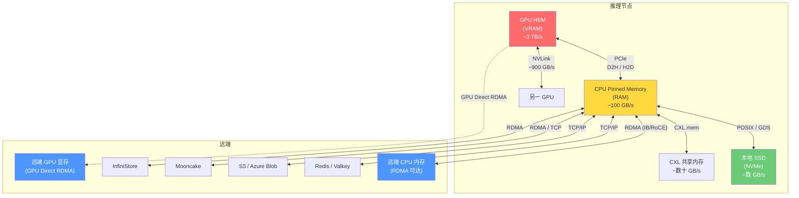
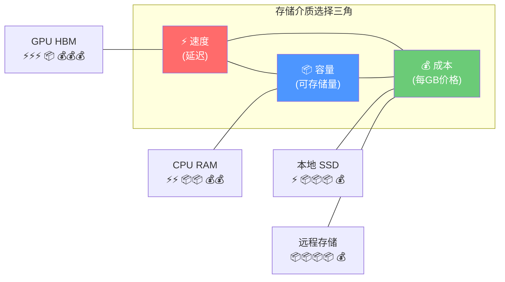
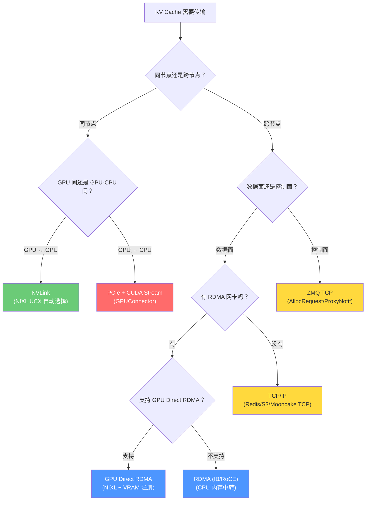
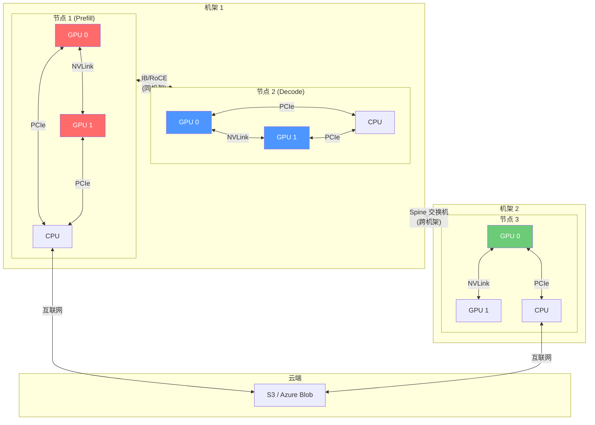
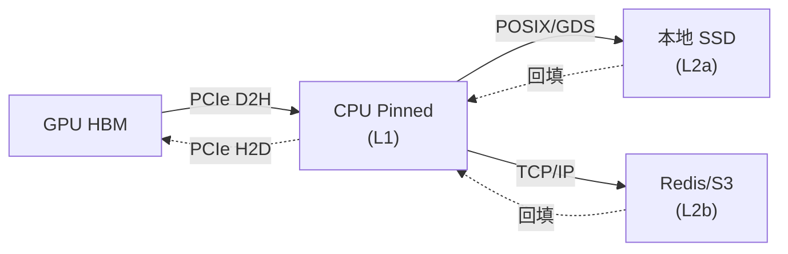
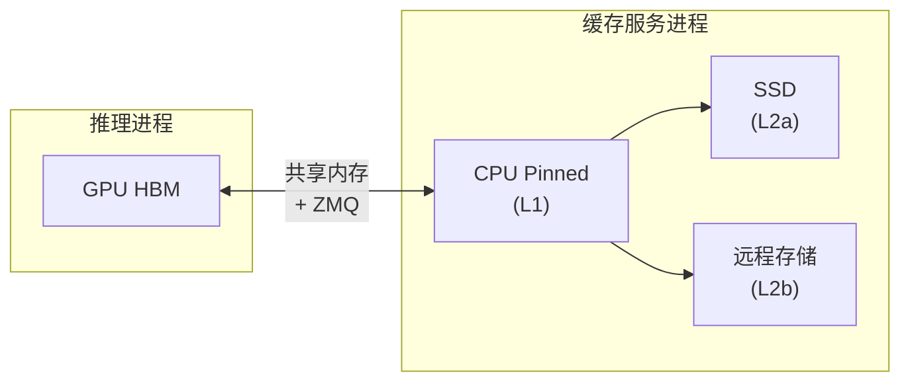
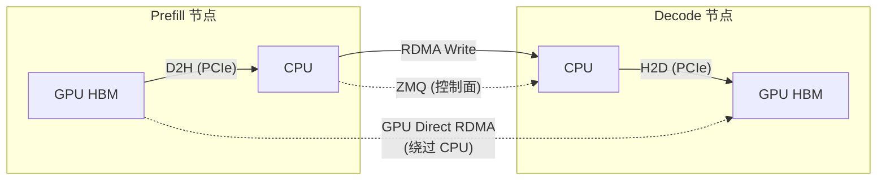
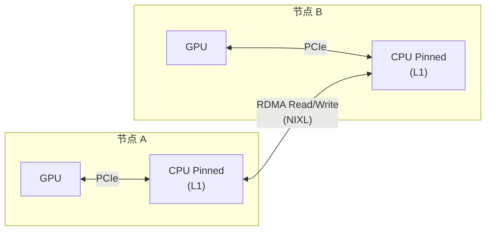
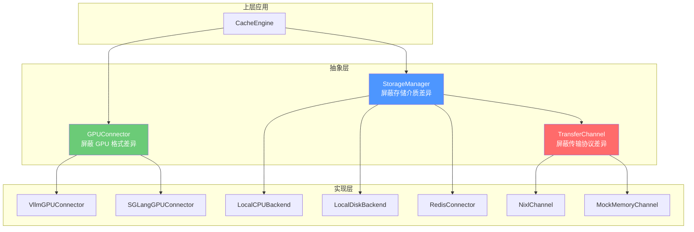
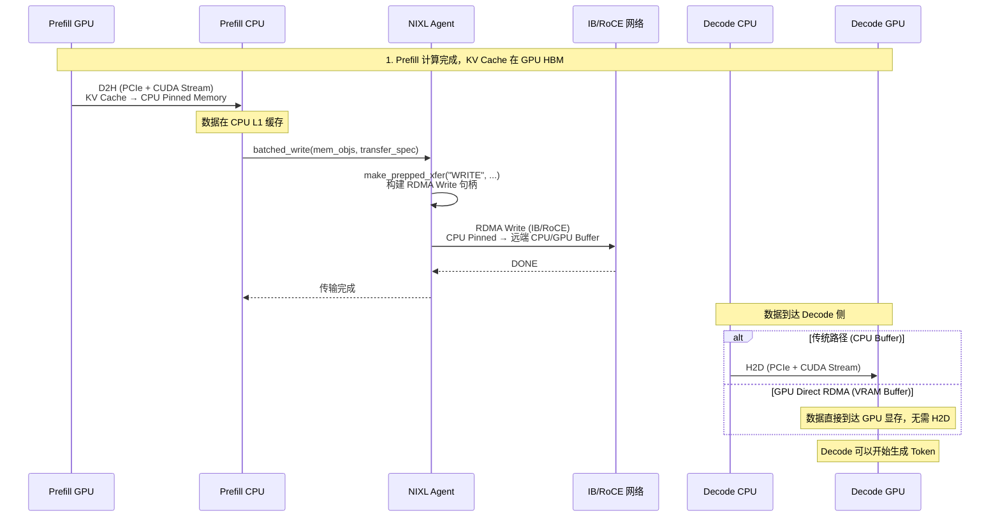

# LMCache 存储与传输全景：数据从 GPU 到云端的全链路图谱

> **系列**: LMCache 技术博客系列 | **类型**: 全景概览篇
> 一张图看懂 LMCache 中 KV Cache 的存储介质、传输协议与物理网络，建立全局认知

### 引言

上一篇我们讲了 NVLink 和 RDMA——两条跨越 GPU 和节点的"高速公路"。但如果把视角拉远，LMCache 中 KV Cache 的旅途远不止这两条路。

想象一个跨国物流体系：GPU 显存是"旗舰店"，CPU 内存是"城市仓"，本地 SSD 是"区域枢纽"，远程存储是"海外仓"，而连接它们的道路有城市快速路（PCIe）、城际高铁（NVLink）、国际航线（RDMA）、普通公路（TCP/IP）——还有调度中心（ZMQ）在背后指挥一切。

KV Cache 从 GPU 诞生那一刻起，就可能经历 D2H 搬到 CPU、序列化后写入磁盘、压缩后传到远程、再通过 RDMA 推送到另一个节点的 GPU——每一步都涉及不同的存储介质、传输协议和物理网络。

本文是全景篇，目标是**建立全局认知**：LMCache 中有哪些存储介质、哪些传输协议、哪些物理网络，它们如何组合、如何选择、如何协同。后续三篇文章将分别深入存储介质、传输协议、物理网络的细节。

### 一、全局架构：KV Cache 的全链路旅途

KV Cache 的典型旅途：

1. **诞生**：GPU 上 Prefill 计算产生 KV Cache
2. **D2H**：通过 PCIe 搬到 CPU Pinned Memory（Store 流程）
3. **持久化**：异步写入本地 SSD 或远程存储
4. **跨节点**：通过 RDMA/NVLink 推送到 Decode 节点的 GPU（PD 分离）
5. **H2D**：新请求到来时，从 CPU 搬回 GPU（Retrieve 流程）

每一步的选择取决于**部署模式**（Standalone/MP/PD/P2P）、**硬件配置**和**性能目标**。

### 二、存储介质：KV Cache 的"住所"

##### 2.1 存储介质层级

LMCache 的存储介质按离 GPU 由近到远分为 5 层：

| 层级 | 介质 | 典型容量 | 读取延迟 | 每GB成本 | LMCache 实现 |
|------|------|---------|---------|---------|-------------|
| **L0** | GPU HBM | 80-192 GB | ~0.5 μs | 极高 | 推理引擎自带 |
| **L1** | CPU Pinned Memory | 数十-数百 GB | ~1 μs + PCIe | 高 | `LocalCPUBackend` |
| **L2a** | 本地 SSD (NVMe) | 数 TB | ~10-100 μs | 中 | `LocalDiskBackend` / NIXL GDS |
| **L2b** | 远程内存 (RDMA) | 理论无限 | ~5-50 μs | 中 | `InfiniStore` / `Mooncake` / `PDBackend` |
| **L2c** | 远程存储 (TCP) | 理论无限 | ~1-10 ms | 低 | Redis / S3 / Azure Blob |

##### 2.2 介质选择的三个维度

LMCache 的分层策略：**热数据留在快介质，冷数据淘汰到慢介质**。L1 满了淘汰到 L2a/L2b，L2a 满了淘汰到 L2c。Retrieve 时从最热层开始查找，未命中则逐层回填。

##### 2.3 各介质在 LMCache 中的角色

| 介质 | 角色 | 关键特性 |
|------|------|---------|
| **GPU HBM** | 计算现场，KV Cache 的"出生地"和"工作台" | 推理引擎管理，LMCache 通过 GPUConnector 访问 |
| **CPU Pinned Memory** | L1 热缓存，最高频的存取层 | 页锁定内存，DMA 直传，无中转开销 |
| **CPU Pageable Memory** | L1 备选，Pinned 不足时的降级方案 | 有中转开销，仅测试场景使用 |
| **本地 SSD** | L2 持久化，进程重启后缓存不丢失 | 支持 GDS (GPU Direct Storage) 绕过 CPU |
| **远端 CPU 内存** | L2 分布式缓存，跨实例共享 | RDMA 直传，零 CPU 拷贝 |
| **远端 GPU 显存** | L2 PD 专用，Decode 节点的 KV 缓冲 | GPU Direct RDMA，最低延迟的跨节点路径 |
| **CXL 共享内存** | L2 新兴介质，CXL 设备共享内存池 | 介于 DDR 和 RDMA 之间 |
| **Redis/Valkey** | L2 远程 KV 存储，通用型 | TCP 连接，延迟较高但生态成熟 |
| **S3/Azure Blob** | L2 云端持久化，冷数据归档 | 互联网带宽，适合离线预计算场景 |
| **InfiniStore** | L2 RDMA 远程存储，低延迟 | 专用 RDMA 连接，比 Redis 快 10 倍+ |
| **Mooncake** | L2 分布式存储，RDMA + TCP 双模 | 支持多种传输方式，灵活切换 |
| **3FS (HF3FS)** | L2 分布式文件系统 | NIXL 原生支持，高性能文件存储 |

### 三、传输协议：KV Cache 的"搬运规则"

##### 3.1 协议分层

LMCache 的传输协议分为三层：

| 层次 | 协议 | 作用 | 典型带宽 |
|------|------|------|---------|
| **硬件传输** | PCIe / NVLink / RDMA | 数据在物理介质间搬运 | 32 GB/s - 1.8 TB/s |
| **传输框架** | CUDA Stream / NIXL / UCX | 封装硬件差异，提供统一 API | 取决于底层硬件 |
| **应用协议** | ZMQ / Redis / S3 / HTTP | 控制面通信和远程存储访问 | 取决于网络 |

##### 3.2 核心传输协议一览

| 协议 | 类型 | 连接对象 | LMCache 使用场景 | 实现组件 |
|------|------|---------|-----------------|---------|
| **PCIe** | 硬件总线 | CPU ↔ GPU | D2H/H2D，KV Cache 在 CPU-GPU 间搬运 | `GPUConnector` |
| **NVLink** | 硬件互连 | GPU ↔ GPU | 同节点 GPU 间 KV Cache 直传 | NIXL UCX Backend |
| **RDMA Write** | 网络协议 | 节点 → 节点 | PD 分离中 Prefill 推送 KV Cache 到 Decode | `NixlChannel.batched_write` |
| **RDMA Read** | 网络协议 | 节点 → 节点 | P2P 模式从远端拉取 KV Cache | `NixlChannel.batched_read` |
| **GPU Direct RDMA** | 网络协议 | GPU → 远端 GPU | 绕过 CPU 的跨节点 GPU 直传 | NIXL + VRAM 注册 |
| **CUDA Stream** | GPU 运行时 | GPU 内异步传输 | D2H/H2D 的异步执行与重叠 | `GPUConnector` (Layerwise) |
| **UCX** | 通信框架 | 多种硬件 | NIXL 底层自动选择 NVLink/RDMA/TCP | `NixlChannel` 默认后端 |
| **ZMQ** | 消息协议 | 进程间/节点间 | 控制面通信（内存分配、通知、RPC） | 全局 |
| **Redis 协议** | 存储协议 | 客户端 → Redis | 远程 KV Cache 存取 | `RedisConnector` |
| **S3 协议** | 存储协议 | 客户端 → 对象存储 | 云端 KV Cache 持久化 | `S3Connector` |
| **GDS** | 存储协议 | GPU ↔ SSD | GPU 直接读写本地磁盘 | `CuFileMemoryAllocator` |
| **msgspec msgpack** | 序列化协议 | — | 所有 ZMQ 消息的高效编解码 | 全局 |

##### 3.3 协议选择的核心逻辑

**核心原则：快路径优先**——能用 NVLink 不用 PCIe，能用 RDMA 不用 TCP，能用 GPU Direct 不用 CPU 中转。

### 四、物理网络：KV Cache 的"道路基础设施"

##### 4.1 网络拓扑

##### 4.2 物理网络类型

| 网络类型 | 拓扑范围 | 典型带宽 | 典型延迟 | LMCache 场景 |
|---------|---------|---------|---------|-------------|
| **PCIe 4.0 x16** | 节点内 (CPU-GPU) | 32 GB/s | ~1 μs | D2H/H2D |
| **PCIe 5.0 x16** | 节点内 (CPU-GPU) | 64 GB/s | ~0.8 μs | D2H/H2D |
| **NVLink 3.0** | 节点内 (GPU-GPU) | 900 GB/s | ~0.1 μs | TP 通信、同节点 PD |
| **NVLink 4.0** | 节点内 (GPU-GPU) | 1.8 TB/s | ~0.05 μs | TP 通信、同节点 PD |
| **NVLink-Network** | 节点间 (GPU-GPU) | 数百 GB/s | ~1 μs | DGX SuperPOD |
| **InfiniBand NDR** | 节点间 | 400 Gb/s | ~0.5 μs | PD 分离、P2P、远程存储 |
| **InfiniBand XDR** | 节点间 | 800 Gb/s | ~0.3 μs | 下一代集群 |
| **RoCEv2 (100G)** | 节点间 | 100 Gb/s | ~2-5 μs | 以太网 RDMA |
| **RoCEv2 (400G)** | 节点间 | 400 Gb/s | ~1-2 μs | 高性能以太网 |
| **TCP/IP (10G)** | 节点间/云端 | 10 Gb/s | ~50-100 μs | 远程存储 (Redis/S3) |
| **TCP/IP (100G)** | 节点间 | 100 Gb/s | ~10-50 μs | 高速以太网 |
| **CXL 2.0** | 节点内 (CPU-设备) | 数十 GB/s | ~0.1 μs | 共享内存池 |
| **CXL 3.0** | 节点间 (多主机) | 数十 GB/s | ~0.5 μs | 跨节点内存共享 |

##### 4.3 网络带宽的量化影响

以 Llama-3-70B 一次 4K token 的 KV Cache 传输（约 1.5 GB）为例：

| 网络 | 传输时间 | 对 TTFT 的影响 |
|------|---------|--------------|
| NVLink 4.0 | ~0.8 ms | 几乎无感 |
| InfiniBand NDR | ~30 ms | 可接受 |
| RoCEv2 (100G) | ~120 ms | 明显 |
| TCP/IP (10G) | ~1.2 s | 不可接受 |

**网络选择直接决定了 PD 分离架构是否可行**——如果 KV Cache 传输时间超过本地重算时间，PD 分离就失去了意义。

### 五、LMCache 四种部署模式的传输路径

##### 5.1 Standalone 模式

最简单的模式，所有存储和传输都在单节点内。PCIe 是唯一的物理通路，L1→L2a 用 POSIX/GDS，L1→L2b 用 TCP/IP。

##### 5.2 MP（多进程）模式

推理进程和缓存服务进程分离，通过共享内存和 ZMQ 通信。No fate-sharing：推理进程崩溃不影响缓存。

##### 5.3 PD（Prefill-Decode）分离模式

数据面：RDMA Write 推送 KV Cache；控制面：ZMQ 协调内存分配和通知。GPU Direct RDMA 是终极优化路径。

##### 5.4 P2P（点对点）模式

P2P 模式下节点对等，双方都可以发起 RDMA Read 或 Write。通过 Controller 发现哪个节点有需要的 KV Cache。

### 六、存储介质、协议、网络的组合矩阵

| 部署模式 | 存储介质 | 传输协议 | 物理网络 | 典型延迟 |
|---------|---------|---------|---------|---------|
| Standalone | GPU → CPU → SSD → Remote | PCIe + POSIX/GDS + TCP | PCIe + 以太网 | D2H: ~50ms/1.5GB |
| MP | GPU → (共享内存) → CPU → SSD/Remote | 共享内存 + ZMQ + POSIX + TCP | 内存总线 + 以太网 | 共享内存: ~μs级 |
| PD | GPU → (RDMA) → 远端 GPU | PCIe + RDMA Write + ZMQ | PCIe + IB/RoCE | RDMA: ~30ms/1.5GB |
| PD (GPU Direct) | GPU → 远端 GPU | GPU Direct RDMA | IB/RoCE + GPU | ~15ms/1.5GB |
| P2P | CPU → (RDMA) → 远端 CPU | RDMA Read/Write + ZMQ | IB/RoCE | RDMA: ~30ms/1.5GB |

### 七、关键抽象：LMCache 如何屏蔽复杂性

面对如此多的存储介质、传输协议和物理网络，LMCache 通过三层抽象让上层代码无需关心底层细节：

| 抽象层 | 接口 | 屏蔽的差异 | 上层调用 |
|-------|------|-----------|---------|
| **GPUConnector** | `from_gpu` / `to_gpu` | 不同推理引擎的 KV Cache 格式 | `CacheEngine.store` / `retrieve` |
| **BaseTransferChannel** | `batched_write` / `batched_read` | NVLink / RDMA / TCP 的硬件差异 | `PDBackend` / `P2PBackend` |
| **StorageBackendInterface** | `put` / `get` / `contains` | CPU / SSD / Redis / S3 / RDMA 的存储差异 | `StorageManager` |

**设计哲学**：上层只关心"存"和"取"，不关心底层是 PCIe 还是 RDMA、是 CPU 内存还是 SSD。抽象层负责把正确的数据通过正确的通路搬到正确的位置。

### 八、全链路示例：一次 PD 分离的 KV Cache 传输

以 PD 分离架构中一次完整的 KV Cache 传输为例，展示所有存储介质、协议和网络的协作：

**涉及的所有组件**：

| 步骤 | 存储介质 | 传输协议 | 物理网络 |
|------|---------|---------|---------|
| Prefill 计算 | GPU HBM | CUDA Kernel | GPU 内部 |
| D2H | GPU HBM → CPU Pinned | PCIe + CUDA Stream | PCIe 总线 |
| RDMA Write | CPU Pinned → 远端 Buffer | RDMA Write (NIXL) | IB/RoCE |
| H2D (传统) | CPU → GPU HBM | PCIe + CUDA Stream | PCIe 总线 |
| GPU Direct | GPU HBM → 远端 GPU HBM | GPU Direct RDMA (NIXL) | IB/RoCE + PCIe |

### 总结

LMCache 的存储与传输体系是一个**三维矩阵**：

1. **存储介质维度**：从 GPU HBM 到云端 S3，5 层存储覆盖所有延迟-容量需求
2. **传输协议维度**：从 PCIe 到 RDMA，从 CUDA Stream 到 NIXL，硬件差异被抽象层屏蔽
3. **物理网络维度**：从节点内 NVLink 到跨机架 InfiniBand，网络选择决定架构可行性

三者协同的核心原则：

- **快路径优先**：能用 NVLink 不用 PCIe，能用 RDMA 不用 TCP，能用 GPU Direct 不用 CPU 中转
- **分层淘汰**：热数据留在快介质，冷数据自动淘汰到慢介质
- **抽象屏蔽**：GPUConnector / TransferChannel / StorageBackend 三层抽象让上层无需关心底层细节

后续三篇文章将分别深入：

- **存储介质详解篇**：每种介质的物理特性、LMCache 中的实现细节、容量规划与淘汰策略
- **传输协议详解篇**：PCIe/NVLink/RDMA/CUDA Stream/NIXL 的协议细节与 LMCache 中的使用方式
- **物理网络详解篇**：InfiniBand/RoCE/TCP 的网络拓扑、带宽规划与 LMCache 集群部署实践

### 延伸阅读
- LMCache开源地址：https://github.com/LMCache/LMCache
- LMCache 官方文档：https://docs.lmcache.ai
- [D2H 与 H2D 深度解析](./07-d2h-h2d-explained.md)
- [NVLink 与 RDMA 深度解析](./08-nvlink-rdma-explained.md)

---

*本文属于 [LMCache 技术博客系列](./series-index.md)，欢迎持续关注。*
