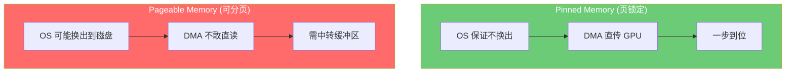
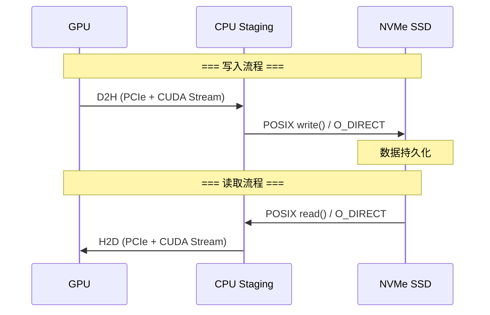
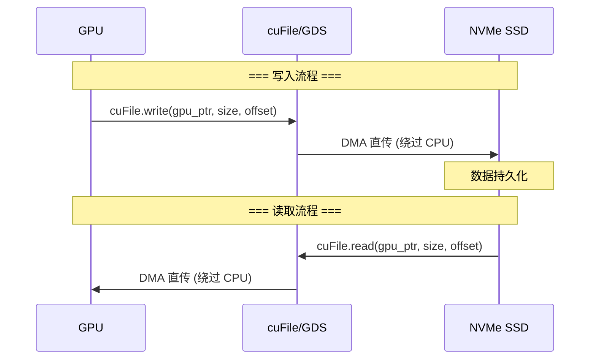
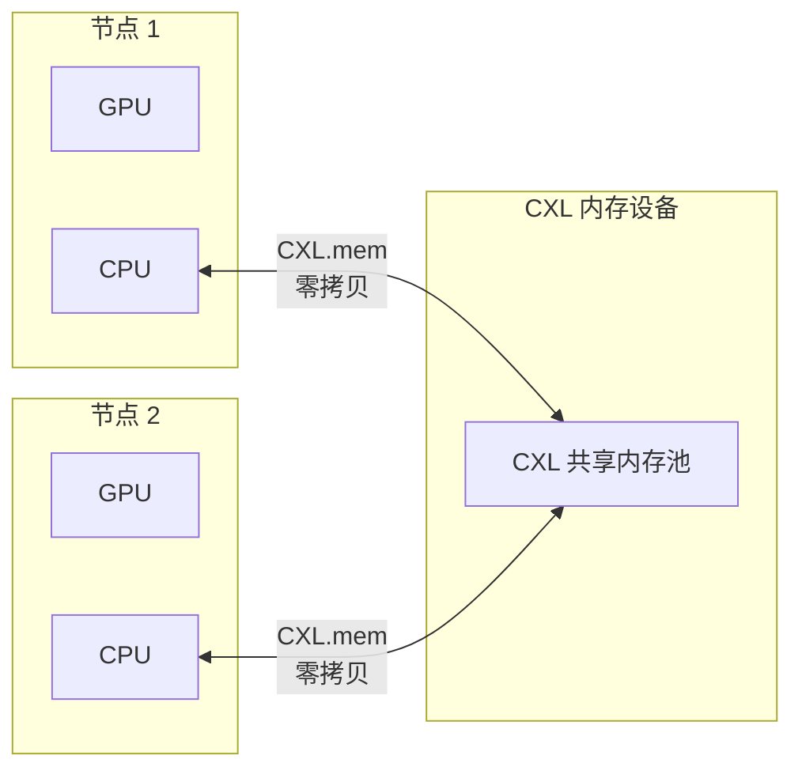
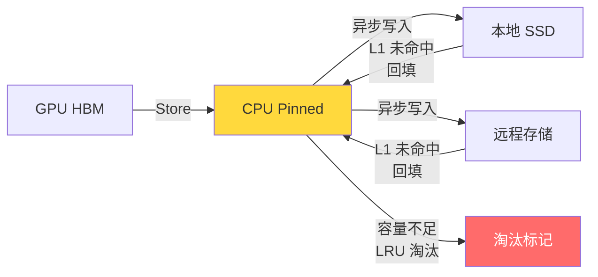

# LMCache 存储介质详解：从 GPU 显存到云端 S3 的五层存储体系

> **系列**: LMCache 技术博客系列 | **类型**: 核心技术详解篇
> 深入每种存储介质的物理特性、LMCache 实现细节、容量管理与淘汰策略

### 引言

在全景篇中，我们建立了 LMCache 存储与传输的全局认知。本文将深入存储介质这一维度——从 GPU HBM 到云端 S3，逐一剖析每种介质的物理特性、LMCache 中的实现方式、内存分配策略、容量管理和错误处理。

为什么需要这么多种存储介质？答案在一个不等式中：

```
单请求 KV Cache 大小 (1-10 GB) × 并发请求数 (10-100) >> GPU HBM 容量 (80-192 GB)
```

GPU 放不下，就必须溢出到更便宜的介质。但每种介质的延迟差了 3-6 个数量级，LMCache 需要在容量、延迟、成本之间找到最优平衡。

### 一、L0：GPU HBM — 计算的"工作台"

##### 1.1 物理特性

| 属性 | 典型值 |
|------|--------|
| 类型 | HBM3 / HBM3e |
| 容量 | 80 GB (A100) / 141 GB (H200) / 192 GB (B200) |
| 内部带宽 | ~3,000 GB/s (A100) / ~4,900 GB/s (H200) |
| 延迟 | ~0.5 μs |
| 持久性 | 掉电即失 |
| 成本 | ~$20-40/GB |

##### 1.2 LMCache 中的角色

GPU HBM 由推理引擎（vLLM/SGLang）管理，LMCache 不直接分配。它通过 `GPUConnector` 访问引擎的 KV Cache 布局，执行 D2H/H2D 操作。

唯一例外是 **GDS Backend** 和 **PD Buffer**——LMCache 在 GPU 上分配专用缓冲区：

```python
# GDS Backend: CuFileMemoryAllocator 分配 VRAM 缓冲区
class CuFileMemoryAllocator(GPUMemoryAllocator):
    def __init__(self, size, device=None):
        super().__init__(size, device, align_bytes=4096)  # 4K 对齐 (GDS 要求)
        self.base_pointer = self.tensor.data_ptr()
        cuFileBufRegister(ctypes.c_void_p(self.base_pointer), size, flags=0)

# PDBackend: GPU Buffer 用于 GPU Direct RDMA
paged_mem_allocator.init_gpu_memory_allocator(
    aligned_buffer_size, shapes, dtypes, MemoryFormat.KV_2LTD
)
```

##### 1.3 关键约束

- **容量有限**：70B 模型权重占 ~140 GB，留给 KV Cache 的空间极少
- **生命周期耦合**：推理引擎崩溃则 KV Cache 丢失（LMCache 的 No fate-sharing 设计正是为此）
- **格式差异**：不同引擎的 KV Cache 布局不同（PagedAttention / FlashInfer / MLA），GPUConnector 负责适配

### 二、L1：CPU Pinned Memory — 最高频的存取层

##### 2.1 物理特性

| 属性 | 典型值 |
|------|--------|
| 类型 | DDR5 / DDR4 (页锁定) |
| 容量 | 数十 - 数百 GB |
| 内部带宽 | ~100 GB/s |
| PCIe 带宽 | ~32 GB/s (PCIe 4.0) / ~64 GB/s (PCIe 5.0) |
| 延迟 | ~1 μs (内存) + ~50 ms/1.5GB (PCIe 传输) |
| 持久性 | 掉电即失 |
| 成本 | ~$5-10/GB |

##### 2.2 Pinned vs Pageable：为什么必须用页锁定内存

CPU 内存分两种，对 LMCache 的性能影响巨大：



LMCache 的 `MixedMemoryAllocator` 默认使用 Pinned Memory：

```python
class MixedMemoryAllocator(MemoryAllocatorInterface):
    def __init__(self, size, use_paging=False, use_hugepages=False, **kwargs):
        self.buffer = _allocate_cpu_memory(size, self.numa_mapping, self.shm_name, use_hugepages)
        if use_paging:
            self.pin_allocator = PagedTensorMemoryAllocator(self.buffer, shapes, dtypes, fmt)
        else:
            self.pin_allocator = TensorMemoryAllocator(self.buffer, align_bytes=self.align_bytes)
        self.buffer_allocator = BufferAllocator("cpu")  # Pageable 备用
```

##### 2.3 Pinned Memory 分配的 5 种模式

LMCache 根据部署场景选择不同的 Pinned Memory 分配策略：

| 模式 | 分配函数 | 适用场景 |
|------|---------|---------|
| **普通 Pinned** | `lmc_ops.alloc_pinned_ptr` | Standalone 默认模式 |
| **NUMA 感知** | `lmc_ops.alloc_pinned_numa_ptr` | 多 NUMA 节点服务器 |
| **HugePage** | `lmc_ops.alloc_hugepage_pinned_ptr` | 大页内存，减少 TLB miss |
| **NUMA + HugePage** | `lmc_ops.alloc_hugepage_pinned_numa_ptr` | 最高性能配置 |
| **共享内存** | `lmc_ops.alloc_shm_pinned_ptr` | MP 模式跨进程共享 |

```python
def _resolve_pinned_alloc_free(numa_mapping, shm_name, size, use_hugepages):
    if shm_name:
        return lmc_ops.alloc_shm_pinned_ptr       # 共享内存
    elif numa_mapping:
        if use_hugepages:
            return lmc_ops.alloc_hugepage_pinned_numa_ptr  # NUMA + HugePage
        else:
            return lmc_ops.alloc_pinned_numa_ptr   # NUMA 感知
    else:
        if use_hugepages:
            return lmc_ops.alloc_hugepage_pinned_ptr       # HugePage
        else:
            return lmc_ops.alloc_pinned_ptr        # 普通 Pinned
```

##### 2.4 分页 vs 非分页分配

`use_paging` 参数决定内存分配策略：

| 模式 | 分配器 | 分配复杂度 | 适用场景 |
|------|--------|-----------|---------|
| **非分页** | `TensorMemoryAllocator` | O(n) 最优适配 | Standalone，固定大小 chunk |
| **分页** | `PagedTensorMemoryAllocator` | O(1) 出队 | NIXL/P2P/PD，预注册需求 |

分页模式下，缓冲区按 chunk 大小切分为固定页，每页恰好一个 KV Cache chunk：

```python
class PagedTensorMemoryAllocator(MemoryAllocatorInterface):
    def __init__(self, tensor, shapes, dtypes, fmt):
        self.align_bytes = get_size_bytes(shapes, dtypes)  # 一个 chunk = 一页
        self.paged_buffers = torch.split(self.buffer, self.align_bytes, dim=0)
        self.free_blocks: deque[TensorMemoryObj] = deque()
        for idx, buf in enumerate(self.paged_buffers):
            metadata = MemoryObjMetadata(shapes[0], dtypes[0], idx, ...)
            self.free_blocks.append(TensorMemoryObj(raw_data=buf, metadata=metadata))

    def allocate(self, shapes, dtypes, fmt):
        return self.free_blocks.popleft()  # O(1) 出队
```

##### 2.5 LocalCPUBackend 的淘汰策略

L1 容量有限，必须淘汰。淘汰策略由 `cache_policy` 驱动（默认 LRU）：

```python
def allocate(self, shapes, dtypes, fmt, eviction=True, busy_loop=True):
    memory_obj = self.memory_allocator.allocate(shapes, dtypes, fmt)
    if memory_obj is not None or not eviction:
        return memory_obj

    while True:
        if self.use_hot:
            evict_keys = self.cache_policy.get_evict_candidates(
                self.hot_cache, num_candidates=1
            )
            if evict_keys:
                self.batched_remove(evict_keys, force=False)  # 淘汰到 L2
        if not busy_loop:
            break
        time.sleep(0.1)
        memory_obj = self.memory_allocator.allocate(shapes, dtypes, fmt)
        if memory_obj is not None:
            break
```

关键设计：**淘汰不是丢弃，而是降级**——被淘汰的 KV Cache 如果已写入 L2（磁盘/远程），后续仍可从 L2 恢复。

### 三、L2a：本地 SSD — 持久化的"区域仓库"

##### 3.1 物理特性

| 属性 | 典型值 |
|------|--------|
| 类型 | NVMe SSD |
| 容量 | 数 TB |
| 顺序读带宽 | ~7 GB/s (PCIe 4.0) |
| 顺序写带宽 | ~5 GB/s |
| 随机读延迟 | ~100 μs (4K) |
| 顺序读延迟 | ~10 μs (大块) |
| 持久性 | 掉电保留 |
| 成本 | ~$0.1-0.3/GB |

##### 3.2 两种磁盘后端

LMCache 提供两种本地磁盘后端：

| 后端 | 缓冲区位置 | 写入路径 | 适用场景 |
|------|-----------|---------|---------|
| **LocalDiskBackend** | CPU 内存 (staging) | GPU→D2H→CPU→POSIX→SSD | 通用场景 |
| **GdsBackend** | GPU 显存 (VRAM) | GPU→GDS→SSD (绕过 CPU) | 低延迟场景 |

##### 3.3 LocalDiskBackend：POSIX I/O 路径



关键实现细节：

**O_DIRECT 支持**——绕过操作系统页缓存，直接写入磁盘：

```python
def write_file(self, buffer, path):
    if size % self.os_disk_bs != 0 or not self.use_odirect:
        with open(path, "wb") as f:
            f.write(buffer)  # 普通 I/O（经页缓存）
    else:
        fd = os.open(path, os.O_CREAT | os.O_WRONLY | os.O_DIRECT, 0o644)
        os.write(fd, buffer)  # O_DIRECT（绕过页缓存）
        os.close(fd)
```

**异步写入**——通过 `LocalDiskWorker` 和 `AsyncPQThreadPoolExecutor` 实现不阻塞推理：

```python
def submit_put_task(self, key, memory_obj, on_complete_callback=None):
    memory_obj.ref_count_up()
    asyncio.run_coroutine_threadsafe(
        self.disk_worker.submit_task("put", self.async_save_bytes_to_disk, ...),
        self.loop,
    )
```

**容量管理**——基于字节数的容量检查和 LRU 淘汰：

```python
while self.current_cache_size + required_size > self.max_cache_size:
    evict_keys = self.cache_policy.get_evict_candidates(self.dict, num_candidates=1)
    if not evict_keys:
        evict_success = False
        break
    self.batched_remove(evict_keys, force=False)
```

##### 3.4 GdsBackend：GPU Direct Storage 路径



GDS 让 GPU 直接读写 NVMe SSD，**完全绕过 CPU 内存**：

```python
def _save_gds(self, path, tmp, kv_chunk, fmt, base_pointer, device_offset):
    addr = ctypes.c_void_p(kv_chunk.data_ptr())  # GPU 指针
    # GDS 直接写入
    with self.gds_module.CuFile(tmp_path, "r+", use_direct_io=True) as f:
        f.write(addr, kv_chunk.nbytes, file_offset=offset, dev_offset=0)
```

**自动降级机制**——当 GDS 不可用时降级到 POSIX + cudaMemcpy：

```python
# 文件系统类型检测
if self.fstype in ["tmpfs", "overlayfs"]:
    self.use_gds = False  # 自动禁用 GDS

# 降级路径：mmap + cudaMemcpy
if not self.use_gds:
    self.cudrt = ctypes.CDLL("libcudart.so")
    # POSIX 写入：mmap 文件 → cudaMemcpy(GPU→mmap) → msync
    mm = mmap.mmap(fd, nbytes, prot=mmap.PROT_WRITE, flags=mmap.MAP_SHARED)
    self.cudrt.cudaMemcpy(mmap_addr, gpu_addr, size, cudaMemcpyHostToDevice)
```

##### 3.5 LocalDiskBackend vs GdsBackend 选择

| 维度 | LocalDiskBackend | GdsBackend |
|------|-----------------|------------|
| CPU 参与 | 需要（staging 内存） | 不需要 |
| 写入路径 | GPU→CPU→SSD | GPU→SSD |
| 读取路径 | SSD→CPU→GPU | SSD→GPU |
| 内存分配 | CPU Pinned (staging) | GPU VRAM (CuFile) |
| 淘汰支持 | 支持 (LRU) | 不支持 |
| 硬件要求 | 通用 | NVIDIA GPU + cuFile |
| 适用场景 | 通用、大容量 | 低延迟、GPU 内存充裕 |

### 四、L2b：远程内存 — 跨实例的"共享仓库"

##### 4.1 物理特性

| 介质 | 带宽 | 延迟 | 连接方式 |
|------|------|------|---------|
| InfiniStore (RDMA) | ~100 Gb/s | ~5 μs | RDMA (IB/RoCE) |
| Mooncake (RDMA) | ~100 Gb/s | ~5 μs | RDMA |
| Mooncake (TCP) | ~10 Gb/s | ~50 μs | TCP/IP |
| Redis/Valkey | ~10 Gb/s | ~100 μs | TCP/IP |
| PDBackend (NIXL) | ~400 Gb/s | ~30 μs/1.5GB | RDMA/NVLink |

##### 4.2 InfiniStore：专用 RDMA 远程存储

`InfiniStoreConnector` 使用 RDMA 实现低延迟的远程 KV Cache 存取：

```python
class InfiniStoreConnector(RemoteConnector):
    def __init__(self, host, port, dev_name, link_type, loop, memory_allocator):
        config = infinistore.ClientConfig(
            host_addr=host,
            connection_type=infinistore.TYPE_RDMA,
            link_type=link_type,   # "IB" 或 "RoCE"
        )
        self.rdma_conn = infinistore.InfinityConnection(config)
        self.rdma_conn.connect()

        # 注册发送/接收缓冲区
        for i in range(MAX_BUFFER_CNT):
            send_buffer = bytearray(self.buffer_size)
            self.rdma_conn.register_mr(_get_ptr(send_buffer), self.buffer_size)
```

关键设计：**预注册缓冲区池**——16 个发送缓冲区 + 16 个接收缓冲区，通过 `asyncio.Queue` 管理并发访问。

##### 4.3 Mooncake：双模远程存储

`MooncakeStoreConnector` 支持 RDMA 和 TCP 两种传输模式，并提供**零拷贝**优化：

```python
# 零拷贝写入：直接从 Pinned Memory 传输
async def _put_without_metadata(self, key_str, memory_obj):
    buffer_ptr = memory_obj.data_ptr
    buffer_size = memory_obj.get_size()
    await asyncio.to_thread(
        self.store.put_from, key_str, buffer_ptr, buffer_size, self.replica_config
    )

# 零拷贝批量读取：直接写入预分配的 Pinned Memory
async def _batch_get_into(self, keys):
    for i, _ in enumerate(keys):
        obj = self.local_cpu_backend.allocate(...)
        buffer_ptrs.append(obj.data_ptr)
        buffer_sizes.append(obj.get_size())
    bytes_read_list = await asyncio.to_thread(
        self.store.batch_get_into, key_strs, buffer_ptrs, buffer_sizes
    )
```

零拷贝的关键：**CPU 缓冲区预注册**——将 Pinned Memory 缓冲区注册到 Mooncake，后续传输无需额外拷贝：

```python
def _register_cpu_buffer(self):
    allocator = self.local_cpu_backend.memory_allocator
    if hasattr(allocator, "pin_allocator"):
        buffer = allocator.pin_allocator.buffer
        self.store.register_buffer(buffer.data_ptr(), buffer.numel())
```

##### 4.4 Redis/Valkey：通用远程 KV 存储

最通用的远程存储选择，基于 TCP 连接：

```python
async def _put(self, key, memory_obj):
    kv_bytes = memory_obj.byte_array
    metadata_bytes = RemoteMetadata(...).serialize()
    async with self.sem:  # 连接池信号量 (max 150)
        await self.connection.set(key_str + "kv_bytes", kv_bytes)
        await self.connection.set(key_str + "metadata", metadata_bytes)
```

**一致性处理**——KV 数据和元数据分开存储，可能出现不一致：

```python
async def _get(self, key):
    metadata_bytes = await self.connection.get(key_str + "metadata")
    kv_bytes = await self.connection.get(key_str + "kv_bytes")
    if kv_bytes is None and metadata_bytes is not None:
        # KV 不存在但 metadata 存在 → 删除孤立 metadata
        await self.connection.delete(key_str + "metadata")
        return None
```

##### 4.5 远程存储对比

| 维度 | InfiniStore | Mooncake | Redis/Valkey |
|------|------------|----------|-------------|
| 传输方式 | RDMA | RDMA + TCP | TCP |
| 延迟 | ~5 μs | ~5-50 μs | ~100 μs |
| 零拷贝 | 是 (MR 注册) | 是 (缓冲区注册) | 否 (byte_array 拷贝) |
| 批量操作 | 单条 | batch_get_into | Pipeline |
| 生态 | 专用 | 专用 | 通用 |
| 部署复杂度 | 高 (RDMA 硬件) | 中 | 低 |

### 五、L2c：云端存储 — 冷数据的"海外仓"

##### 5.1 S3 / Azure Blob

`S3Connector` 实现基于 AWS S3 或兼容接口的对象存储：

**零拷贝上传**——`MemoryViewStream` 包装 memoryview，避免额外内存拷贝：

```python
def _s3_upload(self, key_str, memory_obj):
    stream = MemoryViewStream(memory_obj.byte_array)  # 零拷贝流
    req = HttpRequest("PUT", path, headers, body_stream=stream)
    s3_req = s3.S3Request(client=self.s3_client, type=s3.S3RequestType.PUT_OBJECT, ...)
```

**直接写入内存**——下载时通过 `ctypes.memmove` 直接写入 MemoryObj，避免中间缓冲：

```python
def _s3_download(self, key_str, mem_obj):
    def on_body(chunk, offset, **kwargs):
        ctypes.memmove(mem_obj.data_ptr + offset, chunk, len(chunk))
    s3_req = s3.S3Request(client=self.s3_client, type=s3.S3RequestType.GET_OBJECT, ...)
```

**熔断器机制**——连续连接失败 3 次后自动禁用 S3，避免拖慢推理：

```python
self.max_connection_failures = 3
self.connection_disabled = False

def _update_connection_failures(self, error_msg):
    if is_connection_error:
        self.connection_failures += 1
        if self.connection_failures >= self.max_connection_failures:
            self.connection_disabled = True  # 熔断
```

##### 5.2 NIXL 存储后端

`NixlStoreL2Adapter` 通过 NIXL 支持多种存储介质，包括文件系统和对象存储：

| NIXL 后端 | 存储类型 | 特点 |
|-----------|---------|------|
| GDS / GDS_MT | 本地 SSD | GPU Direct Storage |
| POSIX | 本地 SSD | 标准 POSIX I/O |
| HF3FS | 分布式文件系统 | HuggingFace 3FS |
| OBJ | 对象存储 | NIXL 原生 |
| AZURE_BLOB | 云端对象存储 | Azure Blob |

NIXL 存储的核心优势：**DMA 直传**——数据在 L1 内存和存储介质之间通过 NIXL DMA 传输，无需 CPU 拷贝：

```python
# 写入：L1 内存 → 存储介质
handle = self.nixl_agent.get_mem_to_storage_handle(mem_indices, storage_indices)
await self.nixl_agent.post_non_blocking(handle)

# 读取：存储介质 → L1 内存
handle = self.nixl_agent.get_storage_to_mem_handle(mem_indices, storage_indices)
await self.nixl_agent.post_non_blocking(handle)
```

### 六、新兴介质：CXL 共享内存

##### 6.1 MaruBackend

`MaruBackend` 是基于 CXL 共享内存的后端，数据直接存储在 CXL mmap 内存中：



关键特性：

- **零拷贝存取**：数据已在 CXL 内存中，Put 仅注册 key→location 映射，Get 直接映射 CXL 内存
- **Pin/Unpin 机制**：服务端维护 pin_count，防止被淘汰的 CXL 页正在被使用
- **MLA Worker ID 映射**：多 worker 场景下，非 0 号 worker 读取时自动映射 key

```python
# 写入：数据已在 CXL 内存，仅注册映射
async def _async_store(self, key, memory_obj, on_complete_callback):
    handle = allocator.create_store_handle(memory_obj)  # 提取 (region_id, page_index)
    success = await asyncio.to_thread(self._handler.store, key_str, handle)  # RPC 注册

# 读取：直接映射 CXL 内存，零拷贝
def get_blocking(self, key):
    mem_info = self._handler.retrieve(key_str)  # 查询元数据
    memory_obj = allocator.get_by_location(
        region_id=mem_info.region_id, page_index=mem_info.page_index,
    )  # 直接映射，零拷贝
```

### 七、介质间的数据流转：淘汰与回填

##### 7.1 淘汰路径



##### 7.2 回填路径

当 Retrieve 请求在 L1 未命中时，从 L2 回填到 L1：

1. 查找 L2a（磁盘）→ 命中则加载到 CPU Pinned Memory
2. 查找 L2b（远程）→ 命中则通过网络传输到 CPU Pinned Memory
3. 回填完成后，后续 Retrieve 可直接从 L1 命中

##### 7.3 引用计数：防止淘汰正在使用的数据

LMCache 使用引用计数（`ref_count`）防止正在使用的 KV Cache 被淘汰：

```python
# Store 时引用计数 +1
memory_obj.ref_count_up()
self.hot_cache[key] = memory_obj

# Retrieve 时引用计数 +1
memory_obj = self.hot_cache[key]
memory_obj.ref_count_up()

# 使用完毕引用计数 -1
memory_obj.ref_count_down()
# ref_count == 0 时才可被淘汰
```

### 八、容量规划实践

##### 8.1 L1 容量估算

```
L1 容量 = 平均 KV Cache 大小 × 期望并发缓存数
        = chunk_size_bytes × num_layers × 2(K+V) × num_concurrent_requests
```

以 Llama-3-70B 为例：
- chunk_size = 256 tokens
- num_layers = 80
- 每层 KV Cache ≈ 2 × 8 × 256 × 128 × 2 (fp16) = 1 MB
- 80 层合计 ≈ 80 MB/chunk
- 期望缓存 1000 个 chunk → L1 容量 ≈ 80 GB

##### 8.2 L2 容量估算

```
L2 容量 = L1 容量 × 溢出因子 (通常 3-10 倍)
```

L2 不需要像 L1 那样低延迟，可以用更便宜的介质（SSD/远程存储）。

##### 8.3 配置示例

```yaml
# Standalone 模式
max_local_cpu_size: 80       # L1: 80 GB Pinned Memory
max_local_disk_size: 500     # L2a: 500 GB NVMe SSD
remote_url: "redis://..."    # L2b: Redis

# PD 分离模式
pd_buffer_size: 5368709120   # PD Buffer: 5 GB
pd_buffer_device: "cuda"     # GPU Buffer (GPU Direct RDMA)
nixl_backends: ["UCX"]       # NIXL 后端

# MP 模式 + NIXL 存储
local_cpu_use_hugepages: true # L1: HugePage Pinned Memory
nixl_store_backend: "GDS"     # L2: GPU Direct Storage
nixl_store_pool_size: 1000    # 存储 slot 数量
```

### 设计哲学

> **用分层换弹性** — L1 热缓存保延迟，L2 冷存储保容量，淘汰降级保可用。
>
> **用 Pinned 换延迟** — 页锁定内存比可分页内存贵，但消除了 D2H/H2D 的中转开销。
>
> **用零拷贝换吞吐** — Mooncake 注册缓冲区、GDS 绕过 CPU、CXL 直接映射，都是用零拷贝减少数据搬运。

### 总结

LMCache 的存储介质体系是一个精心设计的 5 层架构：

| 层级 | 介质 | 核心价值 | LMCache 实现 |
|------|------|---------|-------------|
| L0 | GPU HBM | 计算现场 | 推理引擎管理，GPUConnector 访问 |
| L1 | CPU Pinned | 热缓存，最低延迟的存储层 | LocalCPUBackend + MixedMemoryAllocator |
| L2a | 本地 SSD | 持久化，进程重启不丢失 | LocalDiskBackend (POSIX) / GdsBackend (GPU Direct) |
| L2b | 远程内存 | 跨实例共享，分布式缓存 | InfiniStore/Mooncake/Redis/PDBackend |
| L2c | 云端存储 | 冷数据归档，无限容量 | S3/Azure Blob/NIXL OBJ |

每层介质的选择都是在**延迟-容量-成本**三角中找到最优平衡点。LMCache 通过分层存储、LRU 淘汰、引用计数、零拷贝优化等机制，让 KV Cache 在正确的时机出现在正确的介质上。

### 延伸阅读
- LMCache开源地址：https://github.com/LMCache/LMCache
- LMCache 官方文档：https://docs.lmcache.ai
- [LMCache 存储与传输全景](./09-storage-transport-panorama.md)
- [D2H 与 H2D 深度解析](./07-d2h-h2d-explained.md)

---

*本文属于 [LMCache 技术博客系列](./series-index.md)，欢迎持续关注。*
