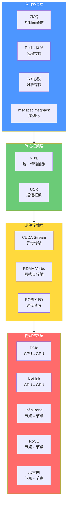
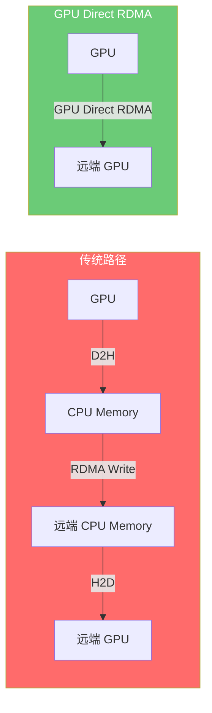
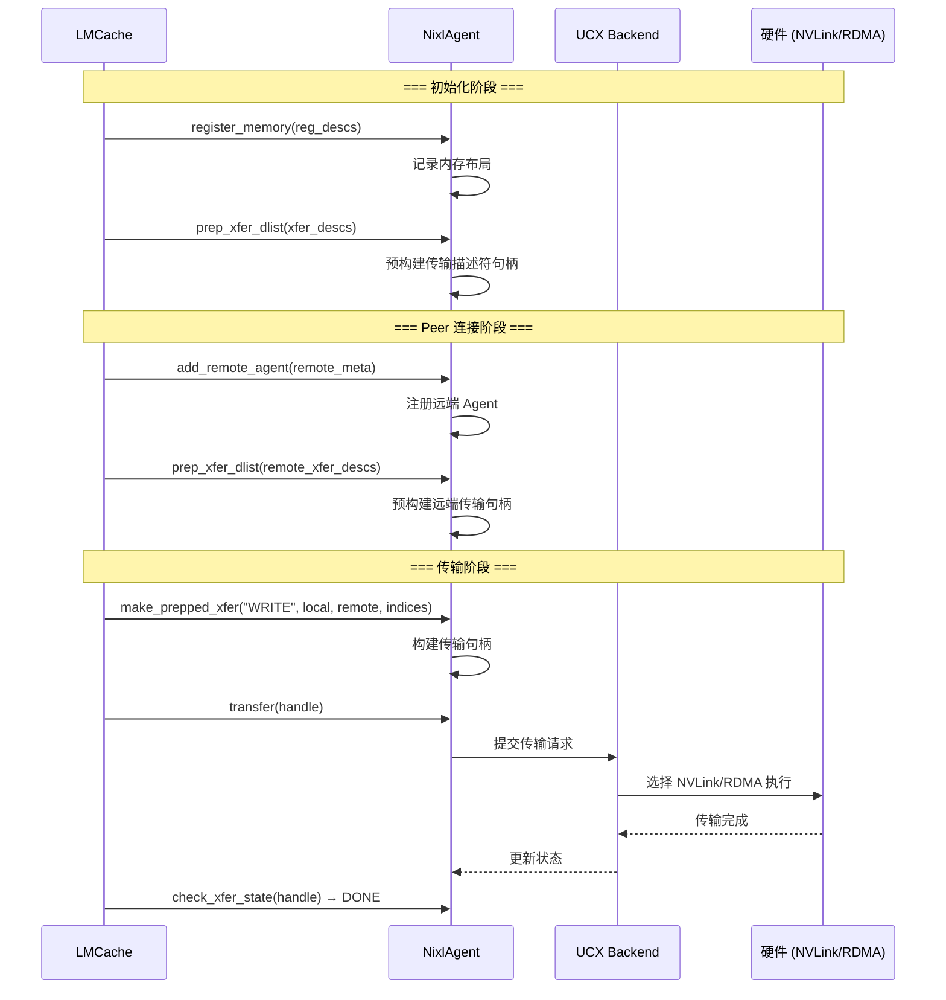
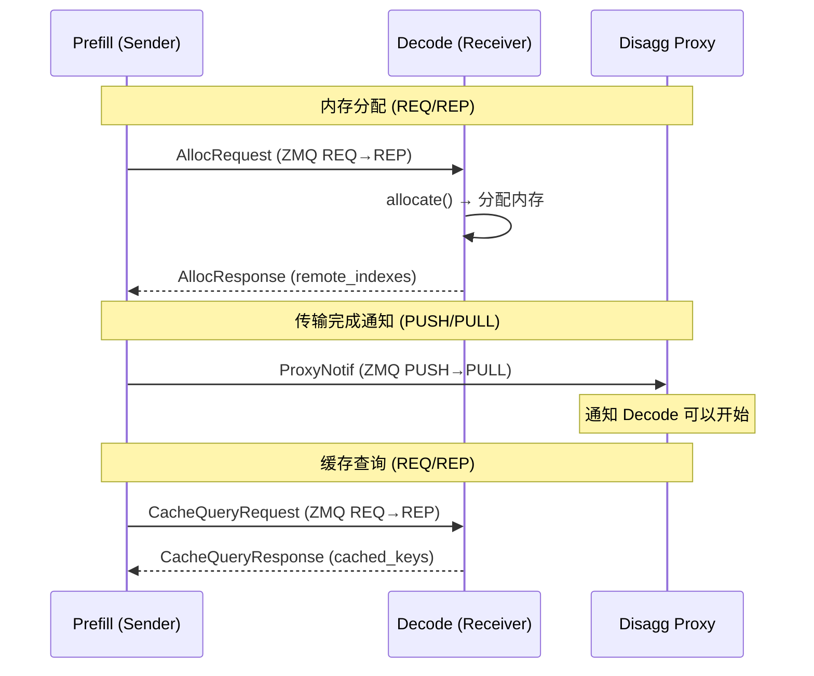
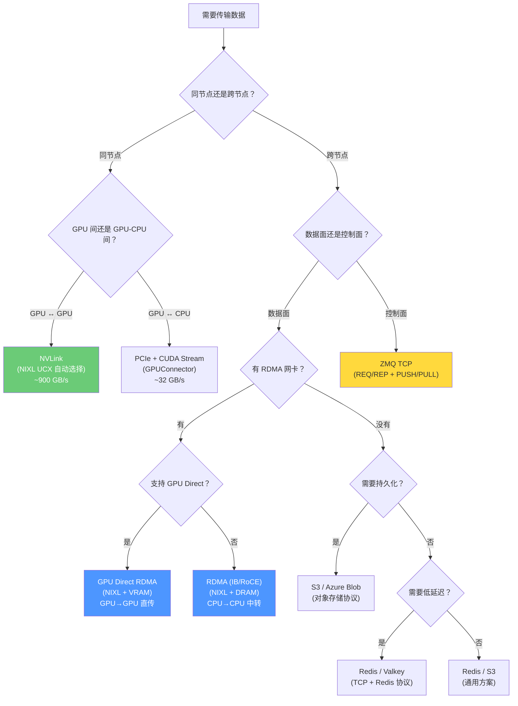

# LMCache 传输协议详解：从 PCIe 到 RDMA 的协议栈全景

> **系列**: LMCache 技术博客系列 | **类型**: 核心技术详解篇
> 深入 PCIe、NVLink、RDMA、CUDA Stream、NIXL、ZMQ 等协议的原理与 LMCache 实现

### 引言

在全景篇中，我们建立了存储介质、传输协议、物理网络的三维认知。本文深入传输协议这一维度——从节点内的 PCIe/CUDA Stream，到节点间的 RDMA/NIXL，再到控制面的 ZMQ，逐一剖析每种协议的原理、LMCache 中的使用方式和性能优化技巧。

协议选择的核心矛盾：**硬件通路越快，使用门槛越高**。PCIe 最简单但最慢，GPU Direct RDMA 最快但需要特殊硬件和注册流程。LMCache 的协议栈设计目标：让上层代码用最简单的方式享受最快的硬件通路。

### 一、协议分层架构

LMCache 的传输协议分为四层：



### 二、PCIe：GPU 与 CPU 之间的"公共道路"

##### 2.1 协议原理

PCIe（Peripheral Component Interconnect Express）是 CPU 与 GPU 之间的标准互连总线。采用点对点串行传输，数据通过 TLP（Transaction Layer Packet）包在 CPU Root Complex 和 GPU 之间传输。

| 版本 | x16 带宽 | 编码开销 | 有效带宽 |
|------|---------|---------|---------|
| PCIe 3.0 | ~16 GB/s | 128b/130b | ~15.8 GB/s |
| PCIe 4.0 | ~32 GB/s | 128b/130b | ~31.5 GB/s |
| PCIe 5.0 | ~64 GB/s | 128b/130b | ~63.0 GB/s |
| PCIe 6.0 | ~128 GB/s | 1b/1b PAM4 | ~121 GB/s |

##### 2.2 LMCache 中的使用

PCIe 是 LMCache 所有 D2H/H2D 操作的物理通路，通过 CUDA API 封装：

```python
# GPUConnector 中的 PCIe 传输
class VllmGPUConnector(GPUConnectorInterface):
    def from_gpu(self, memory_obj, start, end, **kwargs):
        """D2H: GPU → CPU (通过 PCIe)"""
        lmc_ops.multi_layer_kv_transfer(
            gpu_ptrs, cpu_ptrs, self.load_stream, layers, ...
        )

    def to_gpu(self, memory_obj, start, end, **kwargs):
        """H2D: CPU → GPU (通过 PCIe)"""
        lmc_ops.multi_layer_kv_transfer(
            cpu_ptrs, gpu_ptrs, self.load_stream, layers, ...
        )
```

##### 2.3 PCIe 传输的性能特征

**关键瓶颈**：PCIe 带宽远低于 GPU HBM 带宽（32 GB/s vs 3000 GB/s），D2H/H2D 的传输时间几乎完全由 PCIe 带宽决定。

| 数据量 | PCIe 4.0 | PCIe 5.0 |
|--------|---------|---------|
| 1 MB | ~31 μs | ~16 μs |
| 100 MB | ~3.1 ms | ~1.6 ms |
| 1.5 GB (70B KV Cache) | ~47 ms | ~24 ms |

**优化策略**：
1. **Pinned Memory**：消除 Pageable Memory 的中转开销（详见 D2H/H2D 篇）
2. **批量传输**：合并多次小传输为一次大传输
3. **CUDA Stream 异步**：传输与计算重叠

### 三、CUDA Stream：异步传输的"调度员"

##### 3.1 协议原理

CUDA Stream 是 GPU 上的任务队列——同一个 Stream 中的操作按序执行，不同 Stream 之间的操作可以并行。LMCache 利用 CUDA Stream 实现 D2H/H2D 的异步执行和计算-传输重叠。

```mermaid
gantt
    title CUDA Stream 并行执行
    dateFormat X
    axisFormat %s

    section Default Stream (计算)
    Prefill Layer 0-39    :0, 20
    Prefill Layer 40-79   :20, 40

    section Load Stream (传输)
    D2H Layer 0-39        :20, 35
    D2H Layer 40-79       :35, 50
```



##### 3.2 LMCache 中的使用

`GPUConnector` 使用独立的 `load_stream` 执行 D2H/H2D，不阻塞推理引擎的默认 Stream：

```python
class VllmGPUConnector(GPUConnectorInterface):
    def __init__(self, ...):
        self.load_stream = torch.cuda.Stream()  # 独立 Stream

    def from_gpu(self, memory_obj, start, end, **kwargs):
        with torch.cuda.stream(self.load_stream):
            # 在 load_stream 上执行 D2H
            lmc_ops.multi_layer_kv_transfer(...)
```

##### 3.3 Layerwise 传输：计算与传输重叠

`LayerwiseGPUConnector` 使用 Python generator 模式，逐层传输 KV Cache，实现计算与 D2H 的重叠：

```python
class LayerwiseGPUConnector(GPUConnectorInterface):
    def from_gpu(self, memory_obj, start, end, **kwargs):
        """逐层 D2H，yield 每层的结果"""
        for layer_id in range(num_layers):
            with torch.cuda.stream(self.load_stream):
                # D2H 当前层
                lmc_ops.multi_layer_kv_transfer(
                    [gpu_ptrs[layer_id]], [cpu_ptrs[layer_id]], ...
                )
            yield layer_id  # 让上层代码可以并行处理其他层
```

当 GPU 在计算第 N+1 层时，load_stream 已经在异步传输第 N 层的 KV Cache 到 CPU。传输延迟被计算"藏"起来了。

##### 3.4 多硬件 Stream 支持

| 硬件 | Stream API | LMCache 实现 |
|------|-----------|-------------|
| NVIDIA GPU | `torch.cuda.Stream` | `VllmGPUConnector` |
| AMD GPU (ROCm) | `torch.cuda.Stream` (兼容) | 同上 |
| Intel XPU | `torch.xpu.Stream` | `XpuGPUConnector` |
| Intel HPU | `htorch.core.mark_step()` | `HpuGPUConnector` |
| 摩尔线程 MUSA | `torch.musa.Stream` | `MusaGPUConnector` |

### 四、RDMA：零 CPU 参与的"传送门"

##### 4.1 协议原理

RDMA（Remote Direct Memory Access）允许网卡直接读写远端内存，CPU 完全不参与数据搬运。核心概念：

| 概念 | 说明 |
|------|------|
| **MR (Memory Region)** | 注册到网卡的内存区域，包含物理地址、大小、访问密钥 |
| **QP (Queue Pair)** | 发送/接收队列对，RDMA 操作的入口 |
| **CQ (Completion Queue)** | 完成队列，操作完成后产生 CQE |
| **WR (Work Request)** | 工作请求，描述一次 RDMA 操作 |
| **L_Key / R_Key** | 本地/远端内存访问密钥，确保安全访问 |

##### 4.2 三种 RDMA 操作模式

```mermaid
graph TB
    subgraph SendRecv["Send/Recv 模式"]
        SR1["发送方: post Send WR"]
        SR2["接收方: 必须 post Recv WR"]
        SR3["数据到达接收方缓冲区"]
        SR1 --> SR2 --> SR3
    end

    subgraph Write["RDMA Write 模式"]
        W1["发送方: 直接写入远端内存"]
        W2["接收方: 无需参与"]
        W3["远端内存被更新"]
        W1 --> W2 --> W3
    end

    subgraph Read["RDMA Read 模式"]
        R1["发起方: 直接读取远端内存"]
        R2["远端: 无需参与"]
        R3["数据到达本地缓冲区"]
        R1 --> R2 --> R3
    end

    style Write fill:#6bcb77,color:#fff
    style Read fill:#4d96ff,color:#fff
    style SendRecv fill:#ffd93d,color:#333
```



**LMCache 的选择**：PD 分离主要使用 RDMA Write（Push 模式），P2P 模式使用 RDMA Read/Write（双向）。

##### 4.3 LMCache 中的 RDMA 实现

LMCache 通过两个路径使用 RDMA：

**路径 1：NixlChannel（NIXL 封装）**

```python
class NixlChannel(BaseTransferChannel):
    def batched_write(self, objects, transfer_spec=None) -> int:
        handle = self.nixl_agent.make_prepped_xfer(
            "WRITE",                                    # RDMA Write
            self.nixl_wrapper.xfer_handler,             # 本地内存句柄
            self.get_local_mem_indices(objects),         # 本地地址索引
            self.remote_xfer_handlers_dict[receiver_id], # 远端内存句柄
            transfer_spec["remote_indexes"],             # 远端地址索引
        )
        self.nixl_agent.transfer(handle)                 # 发起传输
        while True:
            status = self.nixl_agent.check_xfer_state(handle)
            if status == "DONE": break
            elif status == "ERR": raise RuntimeError(...)
            time.sleep(0.001)
```

**路径 2：InfiniStoreConnector（直接 RDMA）**

```python
class InfiniStoreConnector(RemoteConnector):
    async def put(self, key, memory_obj):
        await self.rdma_conn.rdma_write_cache_async(
            [(key_str, 0)], METADATA_BYTES_LEN + size, _get_ptr(buffer)
        )

    async def get(self, key):
        await self.rdma_conn.rdma_read_cache_async(
            [(key_str, 0)], self.buffer_size, _get_ptr(buffer)
        )
```

##### 4.4 RDMA 的前置条件：Memory Registration

RDMA 要求内存必须提前注册为 MR。LMCache 在初始化时完成注册：

```python
# InfiniStore: 注册发送/接收缓冲区
for i in range(MAX_BUFFER_CNT):
    send_buffer = bytearray(self.buffer_size)
    self.rdma_conn.register_mr(_get_ptr(send_buffer), self.buffer_size)

# NIXL: 注册预分配缓冲区
memory_desc = [(buffer_ptr, buffer_size, tp_rank, "")]
reg_descs = nixl_agent.get_reg_descs(memory_desc, mem_type=mem_type)
nixl_agent.register_memory(reg_descs)
```

MR 注册的本质：告诉网卡这块内存的物理地址和大小，让网卡 DMA 引擎可以直接读写。

##### 4.5 GPU Direct RDMA

传统 RDMA 只能访问 CPU 内存。GPU Direct RDMA 让网卡直接访问 GPU 显存：



LMCache 通过 NIXL 的 VRAM 注册实现 GPU Direct RDMA：

```python
# NIXL Agent 注册 VRAM
if device_type in {"cuda", "xpu", "hpu"}:
    mem_type = "VRAM"  # 注册为 VRAM，NIXL 底层使用 GPU Direct RDMA
```

### 五、NIXL：统一传输的"万能适配器"

##### 5.1 NIXL 是什么

NIXL（NVIDIA Inference Exchange Layer）是 NVIDIA 推出的高性能数据传输抽象层。它提供统一的 API，底层自动选择最优硬件通路（NVLink/RDMA/GDS/TCP）。

##### 5.2 NIXL 的核心抽象

| NIXL 概念 | 说明 | LMCache 对应 |
|-----------|------|-------------|
| **NixlAgent** | 传输代理，管理内存注册和传输 | `NixlAgentWrapper.agent` |
| **Backend** | 底层传输后端 | UCX / GDS / POSIX 等 |
| **Reg Desc** | 内存注册描述符 | `NixlAgentWrapper.reg_descs` |
| **Xfer Desc** | 传输描述符，描述数据位置 | `NixlAgentWrapper.xfer_descs` |
| **Xfer Handler** | 预准备的传输句柄 | `NixlAgentWrapper.xfer_handler` |
| **Prepped Xfer** | 预构建的传输操作 | `make_prepped_xfer()` 返回值 |

##### 5.3 NIXL 的传输流程



##### 5.4 NIXL Backend 选择

LMCache 默认使用 UCX Backend，它自动选择最优硬件通路：

```python
if "backends" in kwargs:
    backends = kwargs["backends"]
else:
    backends = ["UCX"]  # 默认 UCX，自动选择 NVLink/RDMA/TCP
```

UCX 的路径选择逻辑：

| 场景 | UCX 选择 | 原因 |
|------|---------|------|
| 同节点 GPU→GPU | NVLink | 带宽最高 |
| 同节点 CPU→CPU | 共享内存/POSIX | 零拷贝 |
| 跨节点有 IB/RoCE | RDMA | 低延迟 |
| 跨节点无 RDMA | TCP | 兼容性 |

##### 5.5 NIXL 存储后端

NIXL 不仅支持网络传输，还支持存储 I/O：

| 后端 | 类型 | LMCache 使用 |
|------|------|-------------|
| GDS | GPU Direct Storage | `NixlStoreL2Adapter` |
| GDS_MT | GDS 多线程版 | `NixlStoreL2Adapter` |
| POSIX | 标准 POSIX I/O | `NixlStoreL2Adapter` |
| HF3FS | 3FS 分布式文件 | `NixlStoreL2Adapter` |
| OBJ | NIXL 对象存储 | `NixlStoreL2Adapter` |
| AZURE_BLOB | Azure Blob | `NixlStoreL2Adapter` |
| DOCA_MEMOS | DOCA 内存对象 | `NixlStorageBackend` |

### 六、ZMQ：控制面的"信使"

##### 6.1 协议原理

ZMQ（ZeroMQ）是高性能异步消息库，提供多种通信模式。LMCache 用它构建控制面——内存分配请求、传输完成通知、RPC 调用等。

##### 6.2 LMCache 中的 ZMQ 通信模式

| 模式 | 用途 | 场景 |
|------|------|------|
| **REQ/REP** | 请求-响应 | PD 内存分配、缓存查询、P2P Lookup |
| **PUSH/PULL** | 单向推送 | PD 传输完成通知（ProxyNotif） |
| **ROUTER/DEALER** | 多对多 | MP 模式 RPC 通信 |
| **IPC (ipc://)** | 同节点进程间 | MP 模式本地通信 |
| **TCP (tcp://)** | 跨节点通信 | PD/P2P 远程通信 |

##### 6.3 PD 控制面的 ZMQ 流程



##### 6.4 msgspec msgpack：高效序列化

所有 ZMQ 消息使用 msgspec msgpack 编码，比 JSON 快 10 倍以上：

```python
# 消息定义
class AllocRequest(msgspec.Struct, tag=True):
    keys: list[str]
    fmt: int
    shape: list[int]
    dtype: str
    last_chunk_toks: int

# 编码/解码
encoded = msgspec.msgpack.encode(alloc_request)
decoded = msgspec.msgpack.decode(encoded, type=PDMsg)
```

`tag=True` 启用多态反序列化——一条 ZMQ 消息可能是 AllocRequest、AllocResponse 或 ProxyNotif，msgspec 根据标签自动选择正确的类型。

##### 6.5 ZMQ 的超时和容错

```python
# 缓存查询超时 (5 秒)
if query_socket.poll(timeout=5000):
    resp_bytes = query_socket.recv()
else:
    # 超时：关闭并重建 socket
    query_socket.close()
    del self.cache_query_sockets[receiver_id]
    return CacheQueryResponse(cached_keys=[], cached_indexes=[])
```

REQ/REP 模式要求严格的 send-recv 交替。超时后 socket 进入不可用状态，必须关闭重建。

### 七、存储协议：Redis / S3 / GDS

##### 7.1 Redis 协议

LMCache 使用 Redis 的 String 类型存储 KV Cache，每个 key 拆分为 `kv_bytes` 和 `metadata` 两个条目：

```
key: "model_name:worker_id:chunk_hash:kv_bytes"  →  KV Cache 二进制数据
key: "model_name:worker_id:chunk_hash:metadata"   →  元数据 (shape/dtype/fmt)
```

**连接池管理**：`asyncio.Semaphore(150)` 限制最大并发连接数。

##### 7.2 S3 协议

S3 使用 PUT/GET 对象操作，LMCache 实现了零拷贝优化：

| 操作 | 优化方式 |
|------|---------|
| 上传 | `MemoryViewStream` 包装 memoryview，避免额外拷贝 |
| 下载 | `ctypes.memmove` 直接写入 MemoryObj，避免中间缓冲 |

##### 7.3 GDS 协议

GDS (GPU Direct Storage) 让 GPU 直接读写 NVMe SSD：

```python
# 写入：GPU 指针 → SSD
with cufile.CuFile(path, "r+") as f:
    f.write(ctypes.c_void_p(gpu_ptr), size, file_offset=offset)

# 读取：SSD → GPU 指针
with cufile.CuFile(path, "r") as f:
    f.read(ctypes.c_void_p(gpu_ptr), size, file_offset=offset)
```

GDS 要求 GPU 缓冲区 4K 对齐并注册到 cuFile：

```python
class CuFileMemoryAllocator(GPUMemoryAllocator):
    def __init__(self, size, device=None):
        super().__init__(size, device, align_bytes=4096)
        cuFileBufRegister(ctypes.c_void_p(self.tensor.data_ptr()), size, flags=0)
```

### 八、协议选择决策树



### 九、协议性能对比

以传输 1.5 GB KV Cache（Llama-3-70B, 4K tokens）为例：

| 协议 | 物理网络 | 传输时间 | CPU 参与 | 适用场景 |
|------|---------|---------|---------|---------|
| PCIe + Pinned | PCIe 4.0 | ~47 ms | 有 (DMA) | D2H/H2D |
| PCIe + Pageable | PCIe 4.0 | ~60 ms | 有 (拷贝+DMA) | 测试场景 |
| NVLink | NVLink 4.0 | ~0.8 ms | 无 | 同节点 GPU 间 |
| RDMA Write | IB NDR | ~30 ms | 无 | 跨节点 Push |
| RDMA Read | IB NDR | ~30 ms | 无 | 跨节点 Pull |
| GPU Direct RDMA | IB NDR | ~15 ms | 无 | 跨节点 GPU 直传 |
| GDS Write | NVMe | ~200 ms | 无 | GPU→SSD |
| POSIX Write | NVMe | ~300 ms | 有 | CPU→SSD |
| Redis SET | TCP 10G | ~1.2 s | 有 | 远程存储 |
| S3 PUT | 互联网 | ~5-30 s | 有 | 云端存储 |

### 设计哲学

> **用抽象换简洁** — NIXL 统一了 NVLink/RDMA/GDS 的 API，上层只需调用 `batched_write`。
>
> **用异步换吞吐** — CUDA Stream 让 D2H/H2D 不阻塞计算；NIXL 工作线程让 RDMA 不阻塞推理。
>
> **用分层换灵活** — 数据面用最快的 RDMA/NVLink，控制面用最可靠的 ZMQ，各司其职。

### 总结

LMCache 的传输协议栈是一个四层架构：

| 层次 | 协议 | 核心价值 | LMCache 实现 |
|------|------|---------|-------------|
| 物理链路层 | PCIe / NVLink / IB / RoCE | 提供原始带宽 | 硬件提供 |
| 硬件传输层 | CUDA Stream / RDMA Verbs / POSIX | 封装硬件操作 | GPUConnector / NixlChannel |
| 传输框架层 | NIXL / UCX | 统一传输抽象 | NixlChannel / NixlStoreL2Adapter |
| 应用协议层 | ZMQ / Redis / S3 / msgpack | 控制面与存储访问 | PDBackend / RemoteBackend |

核心选择原则：**快路径优先**——能用 NVLink 不用 PCIe，能用 RDMA 不用 TCP，能用 GPU Direct 不用 CPU 中转。NIXL 的 UCX Backend 在运行时自动选择最优路径，让上层代码无需关心底层差异。

### 延伸阅读
- LMCache开源地址：https://github.com/LMCache/LMCache
- LMCache 官方文档：https://docs.lmcache.ai
- [LMCache 存储与传输全景](./09-storage-transport-panorama.md)
- [D2H 与 H2D 深度解析](./07-d2h-h2d-explained.md)
- [NVLink 与 RDMA 深度解析](./08-nvlink-rdma-explained.md)

---

*本文属于 [LMCache 技术博客系列](./series-index.md)，欢迎持续关注。*
