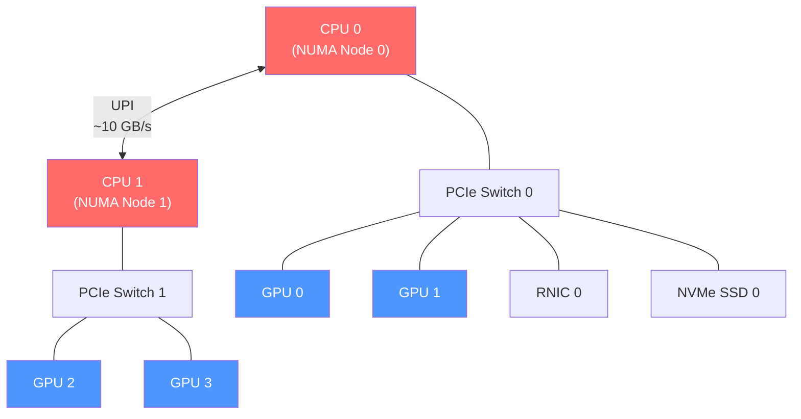
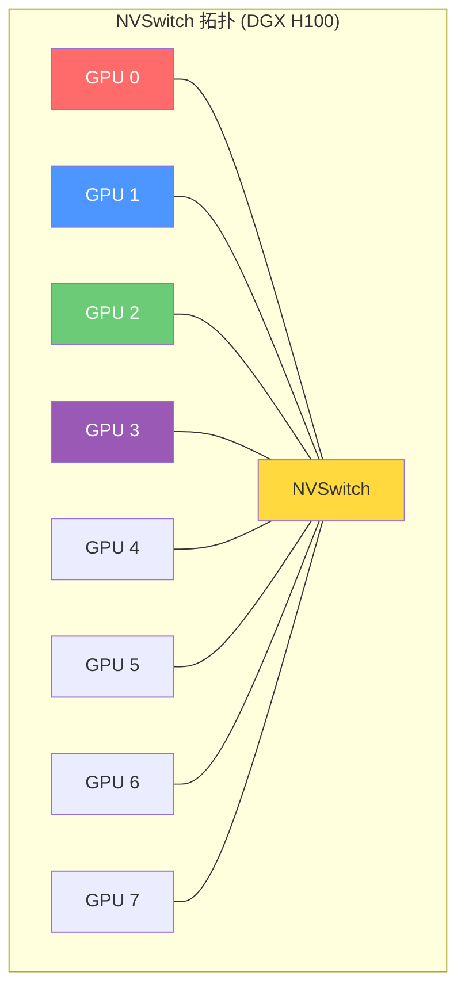
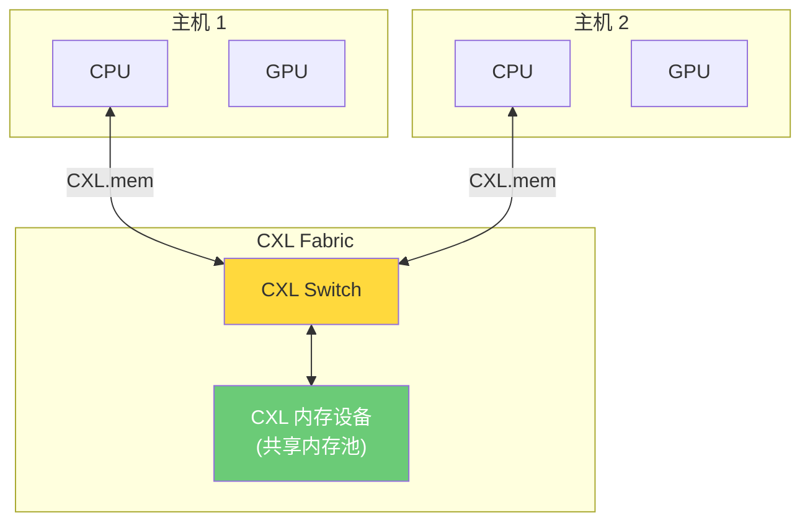
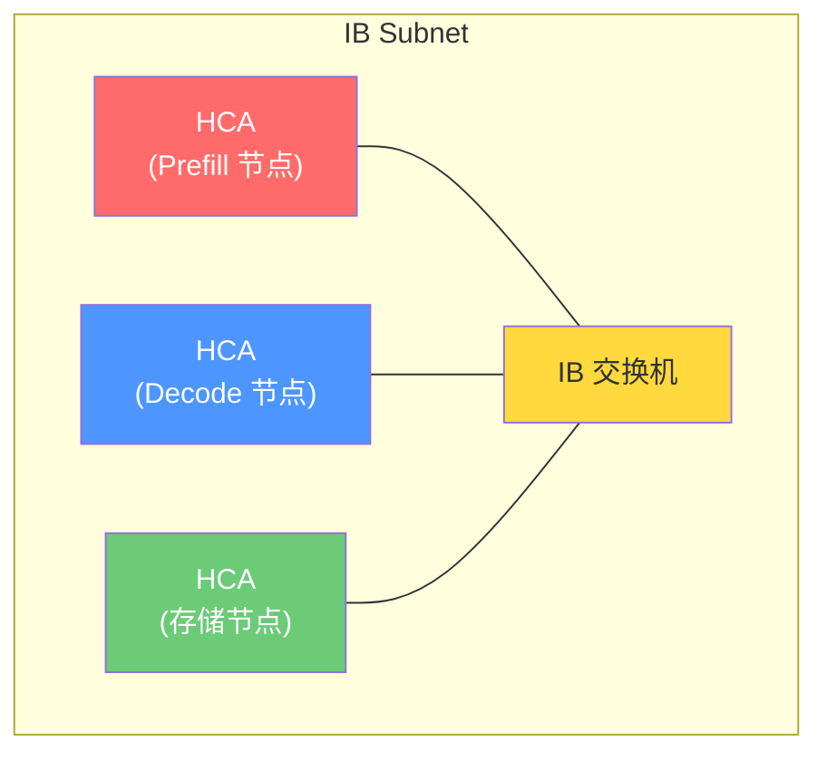
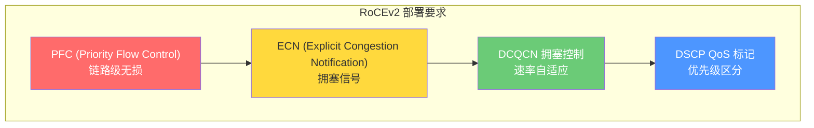
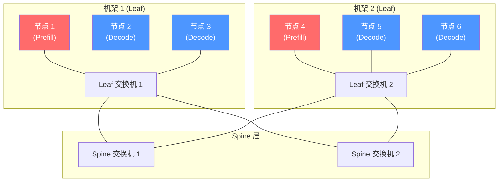
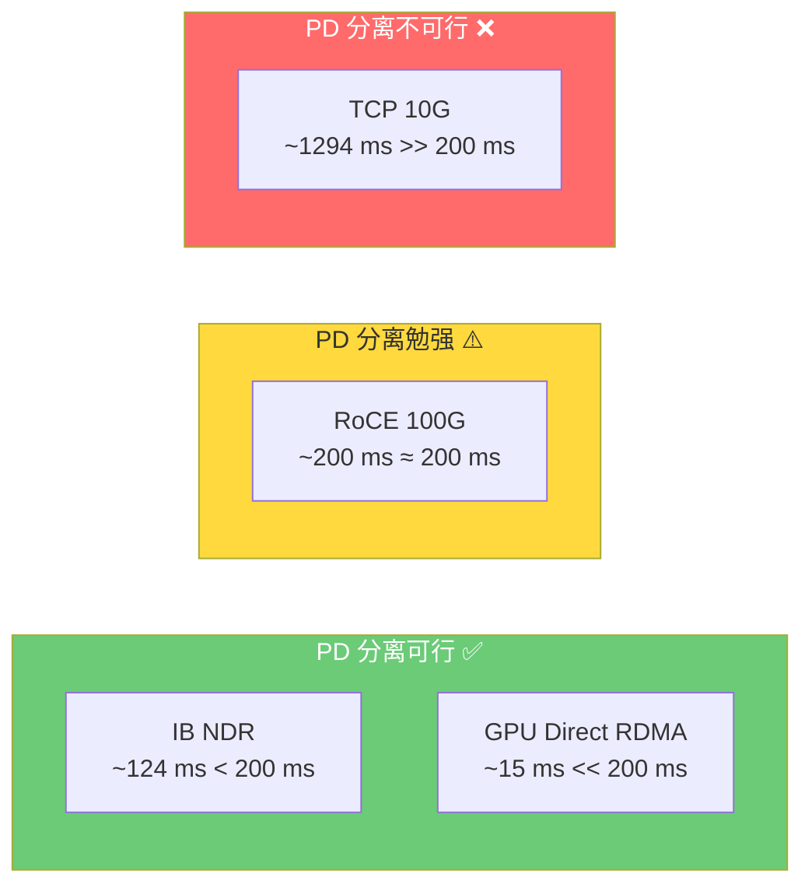

# LMCache 物理网络详解：从节点内总线到跨机架集群的网络基础设施

> **系列**: LMCache 技术博客系列 | **类型**: 核心技术详解篇
> 深入 PCIe、NVLink、InfiniBand、RoCE、CXL 等物理网络的拓扑、带宽规划与 LMCache 集群部署实践

### 引言

在前几篇文章中，我们讲了存储介质和传输协议。但协议跑在物理网络上，网络的拓扑和带宽决定了协议能否发挥出理论性能。PCIe 4.0 标称 32 GB/s，但如果 GPU 和 CPU 不在同一个 NUMA 节点，实际带宽可能腰斩。InfiniBand NDR 标称 400 Gb/s，但如果交换机配置不当，PFC 风暴可以让整个集群网络瘫痪。

本文深入物理网络这一维度——从节点内的 PCIe/NVLink/CXL 总线，到节点间的 InfiniBand/RoCE/以太网，再到集群级的拓扑设计。重点回答：**LMCache 的不同部署模式需要什么样的网络基础设施？如何规划带宽才能让 KV Cache 传输不成为瓶颈？**

### 一、节点内网络：总线与互连

##### 1.1 PCIe：CPU 与 GPU 之间的"主干道"

###### 拓扑结构

现代服务器的 PCIe 拓扑通常以 CPU 为根，GPU 作为 Endpoint 挂在 PCIe Switch 下：



###### NUMA 感知：LMCache 的隐藏优化

GPU 挂在不同的 CPU NUMA 节点上，D2H/H2D 的 PCIe 带宽会因跨 NUMA 访问而降低。LMCache 通过 `NUMADetector` 自动检测 NUMA 拓扑，分配 Pinned Memory 时绑定到 GPU 所在的 NUMA 节点：

```python
# NUMA 感知的 Pinned Memory 分配
numa_mapping = NUMADetector.get_numa_mapping(config)
buffer = _allocate_cpu_memory(size, numa_mapping=numa_mapping)

# 底层调用 lmc_ops.alloc_pinned_numa_ptr
# 将内存分配到指定 NUMA 节点，确保 PCIe 路径最短
```

###### PCIe 带宽规划

| 场景 | 数据量 | PCIe 4.0 耗时 | PCIe 5.0 耗时 | 对 TTFT 影响 |
|------|--------|-------------|-------------|------------|
| D2H (70B, 4K tokens) | ~1.5 GB | ~47 ms | ~24 ms | 显著 |
| D2H (70B, 1K tokens) | ~375 MB | ~12 ms | ~6 ms | 中等 |
| H2D (恢复 4K tokens) | ~1.5 GB | ~47 ms | ~24 ms | 显著 |
| Token 输出 (1 token) | ~4 KB | ~0.1 μs | ~0.05 μs | 无感 |

**结论**：对于 70B 模型的长上下文场景，PCIe 4.0 的 D2H/H2D 延迟接近 50ms，已占 TTFT 的相当比例。PCIe 5.0 可以减半，但需要新一代硬件。

##### 1.2 NVLink：GPU 之间的"私人高速"

###### 拓扑结构

NVLink 的拓扑决定了 GPU 间的互连带宽。常见拓扑：

| 拓扑 | 连接方式 | GPU 间带宽 | 典型平台 |
|------|---------|-----------|---------|
| 4-way | 全连接 | 4 × 50 GB/s = 200 GB/s | DGX A100 |
| 6-way | 全连接 | 6 × 50 GB/s = 300 GB/s | DGX A100 (40GB) |
| 18-way | 全连接 | 18 × 25 GB/s = 450 GB/s | DGX H100 |
| NVSwitch | 交换式 | 全双工 900 GB/s | DGX H100/H200 |



###### NVLink 在 LMCache 中的角色

LMCache 通过 NIXL UCX Backend 自动使用 NVLink。当 PD 分离的 Prefill 和 Decode 在同一节点的不同 GPU 上时，NIXL 自动选择 NVLink 传输 KV Cache，带宽远超 RDMA：

| 传输路径 | 带宽 | 1.5 GB 传输时间 |
|---------|------|---------------|
| NVLink 4.0 (NVSwitch) | 900 GB/s | ~1.7 ms |
| NVLink 3.0 | 300 GB/s | ~5 ms |
| PCIe 4.0 (跨 GPU) | 32 GB/s | ~47 ms |

##### 1.3 CXL：新兴的共享内存互连

###### 协议原理

CXL（Compute Express Link）建立在 PCIe 物理层之上，提供三种协议：

| 协议 | 全称 | 用途 |
|------|------|------|
| CXL.io | I/O 协议 | 设备发现、配置、中断 |
| CXL.cache | 缓存协议 | 设备缓存主机内存 |
| CXL.mem | 内存协议 | 主机访问设备内存 |

CXL 2.0 支持多主机交换，CXL 3.0 支持跨节点内存共享。

###### LMCache 中的 CXL 实现

`MaruBackend` 使用 CXL 共享内存作为存储介质，数据直接存储在 CXL mmap 内存中：



CXL 的优势：**零拷贝**——多个主机可以直接访问同一块 CXL 内存，无需网络传输。Put 仅注册 key→location 映射，Get 直接映射 CXL 内存页。

### 二、节点间网络：InfiniBand 与 RoCE

##### 2.1 InfiniBand：低延迟的"专用高速"

###### 网络架构

InfiniBand 是专用网络，需要专用的 HCA（Host Channel Adapter）网卡和交换机：



###### InfiniBand 代际

| 代际 | 速率 | 每端口带宽 | LMCache 场景 |
|------|------|-----------|-------------|
| HDR | 200 Gb/s | ~25 GB/s | PD 分离 (小规模) |
| NDR | 400 Gb/s | ~50 GB/s | PD 分离 (主流) |
| XDR | 800 Gb/s | ~100 GB/s | 下一代集群 |

###### InfiniBand 的关键特性

| 特性 | 说明 | 对 LMCache 的影响 |
|------|------|-----------------|
| **PFC (Priority Flow Control)** | 链路级流控，防止丢包 | 必须正确配置，否则 PFC 风暴 |
| **ECN + DCQCN** | 拥塞通知和速率控制 | RDMA 传输的拥塞管理 |
| **Subnet Manager** | 管理网络拓扑和路由 | 节点加入/退出需 SM 重新路由 |
| **Partition Key** | 网络分区隔离 | 不同 PD 集群可用不同 PKey |

##### 2.2 RoCE：以太网上的 RDMA

###### 两种版本

| 版本 | 全称 | 网络层 | 要求 |
|------|------|--------|------|
| RoCEv1 | RDMA over Converged Ethernet | 仅 L2 (同一广播域) | 有限部署 |
| RoCEv2 | RDMA over UDP | L3 (可路由) | 需要无损以太网 |

RoCEv2 将 RDMA 封装在 UDP 中，可以在标准 IP 网络上运行，但**必须配置无损以太网**：



###### RoCE vs InfiniBand 选择

| 维度 | InfiniBand | RoCEv2 |
|------|-----------|--------|
| 延迟 | ~0.5 μs | ~2-5 μs |
| 带宽 | 400-800 Gb/s | 100-400 Gb/s |
| 成本 | 高 (专用硬件) | 中 (以太网硬件) |
| 运维复杂度 | 中 (SM 管理) | 高 (无损配置) |
| 生态 | HPC/AI 集群 | 数据中心通用 |
| LMCache 推荐 | PD 分离 (生产) | PD 分离 (测试/小规模) |

##### 2.3 GPU Direct RDMA 的网络要求

GPU Direct RDMA 让 RNIC 直接访问 GPU 显存，对网络有额外要求：

| 要求 | 说明 | 配置方式 |
|------|------|---------|
| **GPU BAR 空间** | RNIC 需要映射 GPU BAR 地址 | `nvidia-persistenced` 保持 GPU 激活 |
| **IOMMU** | 可能干扰 DMA 映射 | 通常禁用 IOMMU 或配置 VT-d |
| **PCIe ATS** | Address Translation Service | GPU 和 RNIC 在同一 PCIe Switch 下 |
| **Peer-to-Peer DMA** | RNIC 与 GPU 的 P2P 能力 | 检查 `nvidia-smi topo -m` |

LMCache 通过 NIXL 的 VRAM 注册自动处理这些配置，但底层硬件必须满足要求。

### 三、集群级拓扑：从单机架到多机架

##### 3.1 典型 AI 集群拓扑



##### 3.2 同机架 vs 跨机架的带宽差异

| 路径 | 跳数 | 带宽 | 延迟 | LMCache 影响 |
|------|------|------|------|-------------|
| 同节点 GPU↔GPU | 0 (NVLink) | 900 GB/s | ~0.1 μs | 最优 |
| 同机架 节点↔节点 | 1 (Leaf) | 400 Gb/s | ~1 μs | 推荐 |
| 跨机架 节点↔节点 | 3 (Leaf-Spine-Leaf) | 200 Gb/s | ~3-5 μs | 可用 |
| 跨集群 | 5+ | 取决于互联 | ~10+ μs | 不推荐 |

**关键原则**：PD 分离的 Prefill 和 Decode 应尽量部署在同一机架，避免跨机架带宽减半。

##### 3.3 LMCache 集群部署的网络规划

###### Standalone 模式

无节点间网络需求，仅依赖 PCIe（D2H/H2D）和本地磁盘 I/O。

###### MP 模式

同节点内进程间通信，使用共享内存 + ZMQ IPC。无外部网络需求。

###### PD 分离模式

| 组件 | 网络需求 | 推荐配置 |
|------|---------|---------|
| 数据面 (NIXL) | RDMA (IB/RoCE) | IB NDR 400 Gb/s 或 RoCEv2 400G |
| 控制面 (ZMQ) | TCP | 10 Gb/s 以太网即可 |
| Proxy 通知 (ZMQ PUSH) | TCP | 10 Gb/s 以太网即可 |

**带宽计算**：

```
所需 RDMA 带宽 = KV Cache 大小 / 目标传输延迟

以 70B 模型为例：
- KV Cache 大小 (4K tokens): ~1.5 GB
- 目标传输延迟: < 30 ms
- 所需带宽: 1.5 GB / 0.03 s = 50 GB/s = 400 Gb/s

结论：IB NDR 400 Gb/s 刚好满足，建议预留 20% 余量
```

###### P2P 模式

| 组件 | 网络需求 | 推荐配置 |
|------|---------|---------|
| 数据面 (NIXL) | RDMA (IB/RoCE) | IB NDR 400 Gb/s |
| 控制面 (ZMQ) | TCP | 10 Gb/s |
| Lookup (Controller) | TCP | 10 Gb/s |

P2P 模式的网络需求与 PD 类似，但需要额外的 Lookup 通道查询 Controller。

### 四、网络性能调优

##### 4.1 InfiniBand 调优

```bash
# 1. 检查 IB 链路状态
ibstat

# 2. 检查 IB 速率
ibstatus

# 3. 测试 RDMA 带宽
ib_write_bw -d mlx5_0 -s 1500000000  # 1.5 GB 写入带宽测试

# 4. 测试 RDMA 延迟
ib_write_lat -d mlx5_0 -s 1500000000

# 5. GPU Direct RDMA 检查
nvidia-smi topo -m  # 确认 GPU 和 RNIC 的拓扑关系
```

##### 4.2 RoCE 调优

```bash
# 1. 启用 PFC (Priority 3 用于 RDMA)
mlnx_qos -i eth0 --pfc 0,0,0,1,0,0,0,0

# 2. 启用 ECN
sysctl -w net.ipv4.tcp_ecn=1

# 3. 设置 DSCP 标记 (RDMA 流量)
tc qdisc add dev eth0 root mqprio num_tc 4 map 0 1 2 3 queues 2@0 2@2 2@4 2@6 hw 1

# 4. 测试 RoCE 带宽
ib_write_bw -d rocep1s0f0 -s 1500000000 --use_exp=1
```

##### 4.3 NUMA 绑定

LMCache 的 NUMA 感知配置确保 Pinned Memory 分配在 GPU 所在的 NUMA 节点：

```bash
# 查看 NUMA 拓扑
lscpu | grep NUMA
numactl --hardware

# 查看 GPU NUMA 归属
nvidia-smi topo -m

# LMCache 配置
# local_cpu_use_hugepages: true
# extra_config:
#   numa_mapping: {"0": 0, "1": 0, "2": 1, "3": 1}  # GPU→NUMA 映射
```

##### 4.4 常见网络问题排查

| 问题 | 症状 | 排查方法 |
|------|------|---------|
| RDMA 连接失败 | NIXL 初始化超时 | `ibstat` 检查链路状态 |
| PFC 风暴 | 网络吞吐骤降 | `ethtool -S eth0 | grep pfc` |
| NUMA 跨节点 | D2H 带宽低于预期 | `numactl -H` + `nvidia-smi topo -m` |
| GPU Direct 不可用 | NIXL 退回 CPU 路径 | `nvidia-smi topo -m` 检查 P2P |
| 交换机拥塞 | 跨机架延迟不稳定 | `ibqueryerrors` 检查错误计数 |

### 五、网络带宽的量化影响：PD 分离是否可行？

PD 分离架构的可行性取决于一个关键问题：**KV Cache 传输时间是否小于本地重算时间？**

##### 5.1 传输时间 vs 重算时间

以 Llama-3-70B 为例，4K token 的 Prefill：

| 方案 | 操作 | 耗时 |
|------|------|------|
| 本地重算 | GPU Prefill 4K tokens | ~200 ms |
| IB NDR 传输 | D2H + RDMA + H2D | ~47 + 30 + 47 = ~124 ms |
| GPU Direct RDMA | GPU→GPU 直传 | ~15 ms |
| TCP 10G 传输 | D2H + TCP + H2D | ~47 + 1200 + 47 = ~1294 ms |



##### 5.2 带宽需求随模型规模增长

| 模型 | KV Cache (4K tokens) | IB NDR 传输时间 | 本地 Prefill 时间 | PD 可行？ |
|------|---------------------|----------------|-----------------|----------|
| Llama-3-8B | ~150 MB | ~3 ms | ~30 ms | ✅ |
| Llama-3-70B | ~1.5 GB | ~30 ms | ~200 ms | ✅ |
| Llama-4-405B | ~8 GB | ~160 ms | ~1000 ms | ✅ (勉强) |
| Llama-4-405B (32K) | ~64 GB | ~1280 ms | ~8000 ms | ✅ |

**结论**：模型越大、上下文越长，PD 分离的收益越明显——因为 KV Cache 传输是线性的（带宽决定），而 Prefill 计算是超线性的（计算量随 token 数二次增长）。

### 六、未来趋势

##### 6.1 NVLink-Network (NVLink-N)

NVLink-N 将 NVLink 扩展到跨节点，带宽远超 RDMA：

| 互连 | 带宽 | 延迟 | 适用范围 |
|------|------|------|---------|
| NVLink 4.0 | 900 GB/s | ~0.1 μs | 节点内 |
| NVLink-N | ~数百 GB/s | ~1 μs | 节点间 (短距) |
| IB NDR | 50 GB/s | ~1 μs | 节点间 (长距) |

NVLink-N 目前仅用于 DGX SuperPOD 等专用系统，LMCache 未来可通过 NIXL 自动适配。

##### 6.2 Ultra Ethernet Consortium (UEC)

UEC 正在定义下一代以太网标准，目标是提供类似 InfiniBand 的低延迟和 RDMA 能力，同时保持以太网的成本优势。未来 LMCache 可能受益于 UEC 网卡的原生 RDMA 支持。

##### 6.3 CXL 3.0 跨节点共享

CXL 3.0 支持多主机共享 CXL 内存设备，LMCache 的 MaruBackend 已经为此做好了准备。CXL 共享内存的延迟介于本地内存和 RDMA 之间，但提供零拷贝的共享语义。

### 设计哲学

> **用拓扑换带宽** — Prefill 和 Decode 部署在同一机架，避免跨机架带宽减半。
>
> **用 NUMA 感知换延迟** — Pinned Memory 绑定到 GPU 所在 NUMA 节点，确保 PCIe 路径最短。
>
> **用专用网络换确定性** — InfiniBand 的确定性延迟优于 RoCE 的尽力而为，生产环境优先选择 IB。

### 总结

LMCache 的物理网络需求按部署模式递增：

| 部署模式 | 节点内 | 节点间 | 推荐网络 |
|---------|--------|--------|---------|
| Standalone | PCIe 4.0+ | 无 | — |
| MP | PCIe + 共享内存 | 无 | — |
| PD (测试) | PCIe 4.0+ | RoCE 100G | 以太网 |
| PD (生产) | PCIe 5.0+ | IB NDR 400G | InfiniBand |
| PD (GPU Direct) | PCIe 5.0+ | IB NDR 400G + GPU Direct | InfiniBand |
| P2P | PCIe 5.0+ | IB NDR 400G | InfiniBand |

核心原则：

1. **同机架优先**：Prefill 和 Decode 部署在同一 Leaf 交换机下
2. **NUMA 感知**：Pinned Memory 绑定到 GPU NUMA 节点
3. **RDMA 必选**：PD 分离的可行性取决于 RDMA 带宽是否足够
4. **GPU Direct 最优**：当硬件支持时，GPU Direct RDMA 是最低延迟的跨节点路径

### 延伸阅读
- LMCache开源地址：https://github.com/LMCache/LMCache
- LMCache 官方文档：https://docs.lmcache.ai
- [LMCache 存储与传输全景](./09-storage-transport-panorama.md)
- [NVLink 与 RDMA 深度解析](./08-nvlink-rdma-explained.md)

---

*本文属于 [LMCache 技术博客系列](./series-index.md)，欢迎持续关注。*
