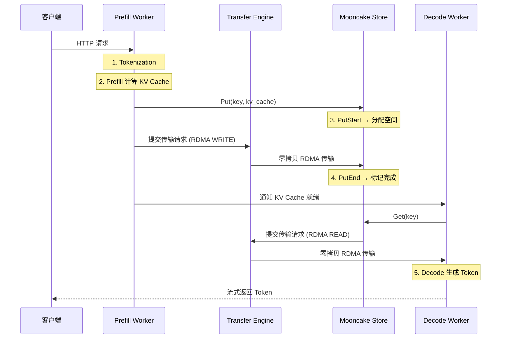

# 一文读懂 Mooncake：让 KV Cache 在 GPU 之间"瞬移"的解耦架构

> **系列**: Mooncake 技术博客系列 | **类型**: 架构概览篇
>
> 一个 LLM 推理请求从到达 Prefill 节点，到 KV Cache 跨网络"瞬移"至 Decode 节点，再到 Token 流式返回——中间经历了怎样的"千里之行"？答案藏在 Mooncake 的解耦架构里。

---

前面通过 LMCache 和 vLLM 两个业界最有名的开源项目拆解，分别写了两个系列的技术博客文章，想必各位读者、一线工程师、想要转行AI Infer Infra的朋友们已经对推理系统和KV Cache已经了解的非常清楚了。

接下来将拆解另一个非常有名的系统，Mooncake，企业级解耦式（也叫分离式，与推理系统解耦，独立KV Cache存储）分布式 KVCache 标杆。

在前面【大模型推理降本提速的“幕后英雄”：主流开源分布式KV Cache系统大盘点】文章中，提到成熟的开源推理系统有两大体系，“独立分布式缓存中间件”和“推理引擎生态框架”，都为Serving LLM服务。因此，核心指导思想一脉相承，部分内容会存在重叠，已经了解掌握的权当快速复习，想要深入研究Mooncake的运作机理，也有必要单独详细拆解。

在正式进入正文之前，先理解清楚 Mooncake 的核心定位。Mooncake的核心思想，在前面 vLLM 的一篇文章中，已经讲过了，不想深究 Mooncake 系统细节的也可以快速浏览。

Mooncake是Kimi的推理服务平台，为月之暗面（Kimi）与清华大学MADSys实验室联合推出（FAST’25 最佳论文项目），是目前线上落地规模最大、稳定性最强的分离式 + 分布式 KVCache 系统之一，已支撑 Kimi 等大规模商用业务稳定迭代。

Mooncake 是一个用于大规模大语言模型（LLM）推理和训练的基础设施项目。它采用以键值缓存（KV cache）为中心的解耦架构，将预填充（prefill）和解码（decode）集群分离，同时利用 GPU 集群中原本未被充分利用的 CPU、DRAM 和 SSD 资源，构建一个解耦的键值缓存池。

Mooncake 包含一个高性能的传输引擎，用于在异构网络和加速器之间实现低延迟的数据传输；Mooncake Store 用于分布式 KV 缓存和模型权重管理；以及 Mooncake EP & PG 用于弹性 MoE 服务。Mooncake 与 SGLang 和 vLLM 等生态系统深度集成，帮助大语言模型系统提高缓存复用率、降低服务延迟，并在多节点集群中高效扩展。

### 引言

想象一座大型物流中心：收货区负责快速拆包分拣（Prefill 节点），发货区负责精细打包投递（Decode 节点），中间有一条高速传送带（Transfer Engine）把货物从收货区送到发货区。传统做法是收货和发货共用同一个车间，结果拆包的噪音干扰打包的精度，忙时互相抢人手。Mooncake 的核心洞察是：**把收货区和发货区分成独立车间，用高速传送带连接，各车间按自己的节奏运转**。

这就是 Mooncake 的 KVCache-centric 解耦架构——以 KV Cache 为中心，将 Prefill 和 Decode 集群分离，利用集群中闲置的 CPU、DRAM、SSD 资源构建分布式 KV Cache 池。在真实负载下，这个架构让 Kimi 的请求吞吐提升了 75%，并荣获 FAST 2025 最佳论文奖。

今天这篇文章，我们从宏观到微观，完整走一遍 Mooncake 的架构拆解。

---

### 从传统架构到解耦架构：为什么需要 Mooncake？

传统 LLM 推理采用**耦合架构**——Prefill 和 Decode 运行在同一组 GPU 上。这在早期模型规模下尚可应对，但随着 LLM 服务需求的爆炸式增长，三大痛点日益尖锐：

| 痛点 | 耦合架构具体表现 |
|------|----------------|
| 资源互相争抢 | Prefill 是计算密集型，Decode 是内存带宽密集型，两者共享 GPU 导致互相干扰 |
| 扩展性受限 | Prefill 和 Decode 无法独立扩缩容，必须整体扩展，浪费资源 |
| KV Cache 无法复用 | 相同前缀的 KV Cache 在不同实例间重复计算，浪费算力与显存 |

Mooncake 的核心决策是**解耦**：将 Prefill 和 Decode 分配到不同的 GPU 集群，通过高性能数据传输引擎在两者之间传递 KV Cache。这带来了三个直接收益：

1. **Prefill 和 Decode 各自独立扩展**，不再互相阻塞
2. **闲置资源被激活**——集群中大量 CPU、DRAM、SSD 资源被用于构建 KV Cache 池
3. **KV Cache 跨实例复用**，相同前缀只计算一次，后续请求直接命中缓存

> 笔者注：Mooncake 不是简单的"把 Prefill 和 Decode 拆开"，而是一个以 KV Cache 为中心的完整基础设施——从传输引擎到分布式存储，从专家并行到弹性恢复，形成了一套完整的 LLM 推理基础设施栈。

---

### Mooncake 架构全景

##### 整体架构图

```
┌─────────────────────────────────────────────────────────────────────┐
│                        上层推理引擎                                  │
│              (vLLM / SGLang / TensorRT-LLM / LMDeploy)             │
└──────────────────────────────┬──────────────────────────────────────┘
                               │
┌──────────────────────────────▼──────────────────────────────────────┐
│                    mooncake-integration/                            │
│         (Python 绑定: store_py.cpp, transfer_engine_py.cpp)        │
└──────────────────────────────┬──────────────────────────────────────┘
                               │
        ┌──────────────────────┼──────────────────────┐
        │                      │                      │
        ▼                      ▼                      ▼
┌───────────────┐      ┌───────────────┐      ┌───────────────┐
│mooncake-store │      │ mooncake-ep/  │      │ mooncake-pg/  │
│(KV Cache 存储) │      │(专家并行通信)  │      │(进程组后端)    │
└───────┬───────┘      └───────┬───────┘      └───────┬───────┘
        │                      │                      │
        └──────────────────────┼──────────────────────┘
                               │
        ┌──────────────────────▼──────────────────────┐
        │       mooncake-transfer-engine/              │
        │    (零拷贝 RDMA/TCP/NVLink 数据传输)          │
        └──────────────────────┬──────────────────────┘
                               │
        ┌──────────────────────▼──────────────────────┐
        │          mooncake-common/                    │
        │    (etcd, k8s-lease, 配置, 环境变量)          │
        └─────────────────────────────────────────────┘
```

##### 核心模块一览

| 模块 | 代码位置 | 核心职责 | 语言 |
|------|---------|---------|------|
| Transfer Engine | `mooncake-transfer-engine/` | 高性能零拷贝数据传输 | C++/Rust/Python |
| Mooncake Store | `mooncake-store/` | 分布式 KV Cache 存储 | C++/Go/Rust |
| Expert Parallel | `mooncake-ep/` | MoE 专家并行通信 | C++/CUDA |
| Process Group | `mooncake-pg/` | PyTorch 分布式后端 | C++/CUDA |
| P2P Store | `mooncake-p2p-store/` | P2P 模型权重分发 | Go |
| Integration | `mooncake-integration/` | 推理引擎集成 | C++/Python |
| Common | `mooncake-common/` | 共享基础设施 | C++/Go |

---

### 核心抽象：Segment 与 BatchTransfer

Mooncake 的传输引擎建立在两个核心抽象之上——**Segment** 和 **BatchTransfer**。理解了这两个概念，就抓住了 Mooncake 数据传输的灵魂。

##### Segment：可远程访问的地址空间

Segment 代表一段**可被远程节点读写的连续地址空间**。每个进程拥有一个 Segment，以 `local_hostname` 命名。Segment 内部进一步划分为 **Buffer**——注册到 RDMA 的内存区域。

```
进程 A (Prefill Worker)              进程 B (Decode Worker)
┌──────────────────────┐             ┌──────────────────────┐
│ Segment: "node-A"    │             │ Segment: "node-B"    │
│  ┌──── Buffer 0 ───┐ │   RDMA     │  ┌──── Buffer 0 ───┐ │
│  │ KV Cache Block 0│ │◄──────────►│  │ KV Cache Block 0│ │
│  └─────────────────┘ │  零拷贝     │  └─────────────────┘ │
│  ┌──── Buffer 1 ───┐ │  传输      │  ┌──── Buffer 1 ───┐ │
│  │ KV Cache Block 1│ │            │  │ KV Cache Block 1│ │
│  └─────────────────┘ │             │  └─────────────────┘ │
└──────────────────────┘             └──────────────────────┘
```

Segment 有两种类型：

| 类型 | 说明 | 典型用途 |
|------|------|---------|
| RAM Segment | DRAM/VRAM 提供的内存空间 | KV Cache 传输、模型权重同步 |
| NVMeof Segment | 通过 NVMe-oF 协议访问的持久存储 | SSD 层 KV Cache 读取 |

##### BatchTransfer：批量异步传输

BatchTransfer 封装了**非连续地址空间之间的异步数据传输**请求。它支持 READ/WRITE 操作，一次调用可以传输多个不连续的地址范围——本质上是一个异步的 AllScatter/AllGather。

```cpp
// mooncake-transfer-engine/include/transport/transport.h
struct TransferRequest {
    enum OpCode { READ, WRITE };
    OpCode opcode;
    void *source;           // 本地内存地址
    SegmentID target_id;    // 目标 Segment ID
    uint64_t target_offset; // 目标偏移量
    size_t length;          // 传输长度
};
```

> 笔者注：BatchTransfer 的设计让 Mooncake 可以一次性提交多个传输请求，然后异步等待完成。这种批量提交模式极大地减少了 CPU-GPU 同步开销，特别适合 KV Cache 这种"大量小块数据"的传输场景。

---

### Transfer Engine：数据高速通道

Transfer Engine 是 Mooncake 的"心脏"，负责在异构网络和加速器之间进行高性能数据传输。

##### 支持的传输协议

| 协议 | 代码位置 | 典型场景                   |
|------|---------|------------------------|
| RDMA/RoCE | `transport/rdma_transport/` | 节点间高带宽传输               |
| TCP | `transport/tcp_transport/` | 无 RDMA 硬件的降级方案         |
| NVLink | `transport/nvlink_transport/` | 节点内 GPU 间传输            |
| EFA | `transport/efa_transport/` | AWS EC2 实例             |
| HIP | `transport/hip_transport/` | AMD GPU                |
| Ascend | `transport/ascend_transport/` | 华为 NPU (HCCL, ubshmem) |
| CXL | `transport/cxl_transport/` | CXL 内存架构               |
| NVMe-oF | `transport/nvmeof_transport/` | 远程 NVMe 存储             |

##### 关键性能指标

在 40GB 数据传输（相当于 LLaMA3-70B 模型 128K Token 的 KV Cache 大小）下：

| 网络配置 | Mooncake 带宽 | 相比 TCP 提升 |
|---------|-------------|-------------|
| 4×200 Gbps RoCE | 87 GB/s | 2.4x |
| 8×400 Gbps RoCE | 190 GB/s | 4.6x |

##### 三大核心特性

1. **多网卡带宽聚合**：大传输被切分为 64KB 的 Slice，每个 Slice 可以走不同的 NIC/路径，充分利用聚合带宽
2. **拓扑感知路径选择**：根据 NUMA 亲和性自动选择最优 NIC，避免跨 NUMA 访问的性能损失
3. **自动故障转移**：传输失败时自动切换到备用路径，对上层应用透明

---

### Mooncake Store：分布式 KV Cache 的"中央仓储"

Mooncake Store 是建立在 Transfer Engine 之上的分布式 KV Cache 存储引擎，提供 `Put/Get/Remove` 等对象级操作。

##### 两大组件

| 组件 | 职责 | 部署方式 |
|------|------|---------|
| **Master Service** | 集群协调、空间分配、元数据管理 | 独立进程，不在数据路径上 |
| **Client** | 提供 Put/Get 接口，同时贡献内存给集群 | 嵌入推理引擎或独立运行 |

关键设计：**Master 永远不在数据路径上**。数据的实际传输是 Client-to-Client 直传，通过 Transfer Engine 的零拷贝 RDMA 完成，Master 只负责元数据协调。

##### 两阶段 Put：防止脏读

```
Client                     Master                    存储 Client
  │                          │                          │
  │── PutStart(key, size) ──►│                          │
  │                          │── 分配空间 ──────────────►│
  │◄── 分配结果 ─────────────│                          │
  │                                                     │
  │── 直接写入数据到存储 Client (零拷贝 RDMA) ──────────►│
  │                                                     │
  │── PutEnd(key) ─────────►│                          │
  │                          │── 标记完成 ──────────────►│
  │◄── 确认 ────────────────│                          │
```

`PutStart` 分配空间但不暴露数据，`PutEnd` 标记完成。这保证了 `Get` 永远读到完整一致的数据——不会出现"写了一半被读到"的脏读问题。

##### 三种部署模式

| 模式 | 说明 | 适用场景 |
|------|------|---------|
| Embedded | Client 嵌入推理引擎进程 | 单实例部署 |
| Dummy-Real | Dummy Client 转发到 Real Client | 多 GPU 推理 |
| Standalone | Client 作为独立存储服务 | 存储与计算分离 |

---

### Expert Parallel：MoE 模型的"跨车间协作"

Mooncake EP 为 MoE（Mixture of Experts）模型提供专家并行通信运行时，遵循 DeepEP 低延迟编程模型，并增加了**故障容忍**能力。

##### 三阶段 MoE 推理流程

```
本地 Token x + topk_idx
        │
        ▼
   ┌─ Dispatch ──► 打包的本地专家输入
   │                    │
   │              ┌─────▼──────┐
   │              │ 本地专家计算  │
   │              └─────┬──────┘
   │                    │
   └─ Combine ◄──── 打包的专家输出
        │
        ▼
   合并后的本地 Token 输出
```

- **Dispatch**：将 Token 发送到拥有对应专家的 Rank，按本地专家打包
- **Expert Compute**：本地专家对打包的输入执行计算
- **Combine**：将专家输出按路由权重合并回原始 Token 所有者

##### 故障容忍：active_ranks 机制

Mooncake EP 的关键创新是 `active_ranks` 张量——它标记了哪些 Rank 是健康的。Dispatch 和 Combine 操作会自动绕过故障 Rank，将 Token 路由到健康的专家副本。

---

### Process Group：给 PyTorch 装上"弹性骨架"

Mooncake PG 是一个 `torch.distributed` ProcessGroup 后端，提供集合通信、点对点通信和**弹性 Rank 恢复**能力。

##### 弹性恢复协议

```
健康 Ranks                    加入 Rank
   │                             │
   │── init_process_group(       │── init_process_group(
   │    world_size=M,            │    world_size=N,
   │    max_world_size=N,        │    is_extension=True)
   │    activeRanks=[1,1,0,1])   │
   │                             │── 发布本地元数据
   │                             │
   │── get_peer_state() ─────────│── 等待恢复
   │── recover_ranks() ─────────►│── join_group() 返回
   │                             │
   │◄──── 集合通信现在包含恢复的 Rank ──►│
```

当某个 Rank 故障时，`activeRanks` 张量标记其为非活跃，集合操作自动跳过。替换 Rank 通过 `is_extension=True` 加入，健康 Ranks 调用 `recover_ranks()` 将其激活。

---

### P2P Store：像 BitTorrent 一样分发模型权重

P2P Store 采用无中心化的 P2P 架构，用于大规模训练场景中的模型权重分发。

| 操作 | 类比 | 说明 |
|------|------|------|
| Register | 做种 | 注册本地数据元数据，不传输数据 |
| GetReplica | 下载 | 从 Peer 拉取数据，拉取后自己也成为数据源 |
| Unregister | 停止做种 | 停止共享数据 |

这种 BitTorrent 式的分发模型避免了单一节点的出站带宽饱和。在生产中，Kimi-K2 模型（1T 参数）的权重更新在数千张 GPU 上只需约 20 秒。

---

### 数据流全景：一个 KV Cache 的"瞬移"之旅

当我们在 PD 解耦模式下发送一个推理请求，KV Cache 经历了怎样的旅程？



这段旅程可以拆解为五大阶段：

1. **Prefill 计算**：输入 Token 经过模型前向传播，生成 KV Cache
2. **KV Cache 存储**：通过 Mooncake Store 的两阶段 Put 写入分布式缓存池
3. **零拷贝传输**：Transfer Engine 通过 RDMA 将 KV Cache 从 Prefill 节点传输到存储节点
4. **KV Cache 读取**：Decode Worker 通过 Store 的 Get 接口读取 KV Cache
5. **Decode 生成**：Decode Worker 使用 KV Cache 进行自回归生成

---

### 设计哲学：Mooncake 架构的三大原则

回顾整个 Mooncake 架构，三大设计原则贯穿始终：

| 原则 | 含义 | 典型体现 |
|------|------|---------|
| **以 KV Cache 为中心** | KV Cache 是一等公民，所有组件围绕它设计 | Store、Transfer Engine、PD 解耦都以 KV Cache 为核心数据 |
| **控制面与数据面分离** | Master 只管元数据，数据直传 | Store 的 Master 不在数据路径上，Client-to-Client 零拷贝 |
| **故障容忍与弹性** | 系统在部分故障下继续服务 | EP 的 active_ranks、PG 的弹性恢复、TE 的自动路径切换 |

第一条原则是 Mooncake 区别于其他推理框架的根本——它不是在推理引擎上"外挂"缓存，而是从 KV Cache 出发重新设计整个推理架构。第二条原则确保了性能——Master 协调元数据的开销微乎其微，数据传输走零拷贝 RDMA 直通。第三条原则则是生产可靠性的保障——在大规模集群中，部分故障是常态而非例外。

---

### 总结与行动指南

| 核心概念 | 一句话总结 |
|---------|----------|
| 解耦架构 | Prefill 与 Decode 分离，各自独立扩展 |
| Transfer Engine | 零拷贝 RDMA/TCP/NVLink 多协议传输，拓扑感知，自动故障转移 |
| Mooncake Store | Master-Client 架构，两阶段 Put，分布式 KV Cache 池 |
| Expert Parallel | DeepEP 兼容的 Dispatch/Combine，故障容忍 active_ranks |
| Process Group | PyTorch ProcessGroup 后端，弹性 Rank 恢复 |
| P2P Store | BitTorrent 式 P2P 权重分发，无中心化 |

**一行建议**: 部署 Mooncake 时，先用 TCP 模式跑通全链路，确认功能正确后再切换到 RDMA——RDMA 环境的配置（驱动、网卡、权限）是最大的踩坑点。

**延伸阅读**：
- Mooncake 论文：https://www.usenix.org/system/files/fast25-qin.pdf
- Mooncake 官方文档：https://kvcache-ai.github.io/Mooncake/
- Mooncake GitHub 仓库：https://github.com/kvcache-ai/Mooncake

---

*本文属于 [Mooncake 技术博客系列]，欢迎持续关注。*
