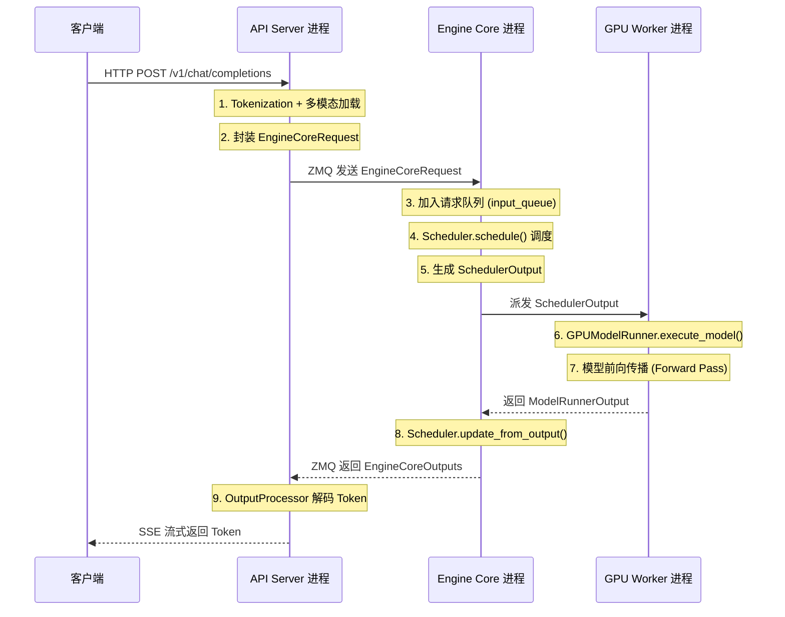

# 一文读懂 vLLM V1架构：从 Prompt 请求到 Token 生成的千里之行

> **系列**: vLLM 技术博客系列 | **类型**: 架构概览篇
>
> 一个请求从 HTTP 到达，到第一个 Token 流式返回，中间究竟经历了怎样的"千里之行"？答案藏在 vLLM V1 的多进程架构里。

---

### 引言

想象一座繁忙的国际机场：航站楼负责接待旅客、办理登机手续（API Server + Tokenization）；塔台统筹所有航班的起降调度（Engine Core）；每架飞机则由专属机组驾驶，精确执行飞行任务（GPU Worker）。旅客不必关心塔台如何排班，机组也无须过问登机口的排队策略——各司其职，高效运转。

vLLM V1 的多进程架构正是这种"机场模型"的工程实现。它将请求接收、调度决策与模型执行解耦到独立进程中，通过 ZMQ 管道高速通信，让每个环节都能全速运转而不互相阻塞。今天这篇文章，我们就从宏观到微观，完整走一遍 V1 架构的千里之行。

---

### 从 V0 到 V1：一次脱胎换骨的重构

vLLM V0 时代采用单进程架构，调度器、模型执行、输入输出处理全部跑在一个进程里。这在早期模型规模下尚可应对，但随着 LLM 推理需求的爆炸式增长，三大痛点日益尖锐：

| 痛点 | V0 具体表现 |
|------|------------|
| CPU 与 GPU 互相等待 | 调度逻辑与模型前向传播共享 GIL，调度期间 GPU 空转 |
| 扩展性不足 | 数据并行时调度器无法独立扩展，成为吞吐瓶颈 |
| 代码耦合严重 | 输入处理、调度、执行、输出处理全部耦合在 `LLMEngine` 类中 |

V1 的核心决策是**进程级解耦**：API Server、Engine Core、GPU Worker 各自运行在独立进程中，通过 ZMQ 和进程间队列通信。这带来了三个直接收益：

1. **Engine Core 的 busy loop 不受 API Server 事件循环影响**，调度与执行可以连续运转
2. **GPU Worker 独占 GPU**，模型前向传播不被 Python GIL 打断
3. **数据并行时 Engine Core 可按 DP rank 独立扩展**，调度不再成为单点瓶颈

> 笔者注：V1 不是 V0 的"修补升级"，而是一次从架构根基出发的重新设计。如果你在 V0 代码中寻找 V1 的影子，会发现只有 `PagedAttention` 这个灵魂设计被完整继承了下来。

---

### V1 多进程架构全景

##### 进程架构图

```
+------------------------------------------------------------------+
|                      API Server Process                          |
|  (vllm/entrypoints/openai/api_server.py)                        |
|  - HTTP 请求处理 (FastAPI + Uvicorn)                             |
|  - Tokenization / 多模态数据加载                                  |
|  - 结果流式返回                                                   |
|  - ZMQ Client ────────┐                                          |
+────────────────────────┼─────────────────────────────────────────+
                         │ ZMQ Socket
                         ▼
+------------------------------------------------------------------+
|                    Engine Core Process                            |
|  (vllm/v1/engine/core.py)                                        |
|  - Scheduler (调度请求)                                           |
|  - KV Cache 管理                                                  |
|  - 协调 GPU Worker 执行                                           |
|  - Busy Loop: schedule → execute → update                        |
|  - Input Queue ←──────── API Server                              |
|  - Output Queue ────────→ API Server                             |
+────────────────────────┼─────────────────────────────────────────+
                         │ Process Queue / IPC
                         ▼
+------------------------------------------------------------------+
|                    GPU Worker Processes                           |
|  (vllm/v1/worker/gpu_worker.py)                                  |
|  ┌────────────┐  ┌────────────┐  ┌────────────┐  ┌────────────┐ |
|  │  Worker 0  │  │  Worker 1  │  │  Worker 2  │  │  Worker 3  │ |
|  │  GPUModel  │  │  GPUModel  │  │  GPUModel  │  │  GPUModel  │ |
|  │  Runner    │  │  Runner    │  │  Runner    │  │  Runner    │ |
|  └────────────┘  └────────────┘  └────────────┘  └────────────┘ |
+------------------------------------------------------------------+
          (每个 GPU 一个 Worker，TP x PP 个 Worker)
```

##### 四大核心进程一览

| 进程 | 代码位置 | 核心职责 | 数量 |
|------|---------|---------|------|
| API Server | `vllm/entrypoints/openai/api_server.py` | HTTP 处理、Tokenization、多模态加载、流式返回 | `A`（默认 = DP size） |
| Engine Core | `vllm/v1/engine/core.py` | 调度器、KV Cache 管理、协调 Worker 执行 | `DP`（默认 1） |
| GPU Worker | `vllm/v1/worker/gpu_worker.py` | 模型加载、前向传播、GPU 内存管理 | `TP x PP`（每 Core） |
| DP Coordinator | `vllm/v1/engine/coordinator.py` | 跨 DP rank 负载均衡、MoE 同步 | 1（仅 DP > 1 时） |

> 💡 **部署速算**: 典型单节点 4 卡部署 (`vllm serve -tp=4`)，进程数 = 1 API Server + 1 Engine Core + 4 GPU Worker = **6 个进程**。8 卡数据并行部署 (`vllm serve -tp=2 -dp=4`) 则为 4 + 4 + 8 + 1 = **17 个进程**。

---

### 请求的千里之行：从 HTTP 请求 到 Token 生成

当我们发送一个 `/v1/chat/completions` 请求，数据经历了怎样的旅程？下面用时序图完整呈现：



这段旅程可以拆解为三大阶段，我们逐一深入。

---

### 第一站：API Server —— 旅客登机口

API Server 是整个系统的"门面"，负责接待所有外部请求。它基于 FastAPI + Uvicorn 构建，核心代码在 `vllm/entrypoints/openai/api_server.py`。

##### 启动流程

```python
# vllm/entrypoints/openai/api_server.py
async def run_server_worker(listen_address, sock, args, client_config=None, **uvicorn_kwargs):
    """Run a single API server worker."""
    async with build_async_engine_client(args, client_config=client_config) as engine_client:
        shutdown_task = await build_and_serve(
            engine_client, listen_address, sock, args, **uvicorn_kwargs
        )
```

关键步骤：

1. **`build_async_engine_client`**: 创建 `AsyncLLM` 实例，它是 API Server 与 Engine Core 之间的桥梁
2. **`AsyncLLM.from_vllm_config`**: 初始化输入处理器（`InputProcessor`）、输出处理器（`OutputProcessor`）和引擎核心客户端（`EngineCoreClient`）
3. **`build_and_serve`**: 构建 FastAPI 应用，初始化应用状态，启动 HTTP 服务

##### 输入处理：从自然语言到 Token ID

```python
# vllm/v1/engine/async_llm.py
class AsyncLLM(EngineClient):
    def __init__(self, vllm_config, executor_class, ...):
        # 将 EngineInput 转换为 EngineCoreRequest
        self.input_processor = InputProcessor(self.vllm_config, renderer)
        # 将 EngineCoreOutputs 转换为 RequestOutput
        self.output_processor = OutputProcessor(renderer.tokenizer, ...)
        # 通过 ZMQ 与 Engine Core 通信
        self.engine_core = EngineCoreClient.make_async_mp_client(...)
```

`InputProcessor` 做了三件事：Tokenization（文本转 Token ID）、多模态数据加载（图像/音频编码）、采样参数封装。这些 CPU 密集操作在 API Server 进程中完成，不会阻塞 Engine Core 的调度循环。

> 💡 **性能提示**: API Server 使用多线程加载多模态数据，线程数由 `VLLM_MEDIA_LOADING_THREAD_COUNT` 控制（默认 8）。如果你的模型接收大量图像输入，适当调大此值可以减少排队时间。

---

### 第二站：Engine Core —— 航管塔台

Engine Core 是 V1 架构的"大脑"，运行着调度器的 busy loop，永不停歇地安排请求的调度与执行。

##### Busy Loop：引擎的心跳

```python
# vllm/v1/engine/core.py — EngineCoreProc
def run_busy_loop(self):
    """Core busy loop of the EngineCore."""
    while self._handle_shutdown():
        # 1) 轮询输入队列，直到有工作要做
        self._process_input_queue()
        # 2) 执行一步引擎核心，返回输出
        self._process_engine_step()
```

这个循环只有两步，却撑起了整个推理引擎：

1. **`_process_input_queue`**: 从 `input_queue` 中取出 `EngineCoreRequest`，交给调度器管理。如果队列为空且没有待处理请求，则阻塞等待（让出 CPU）。
2. **`_process_engine_step`**: 调用 `step()` 方法执行一轮 schedule → execute → update 循环。

##### 一步之遥：step() 方法详解

```python
# vllm/v1/engine/core.py — EngineCore
def step(self) -> tuple[dict[int, EngineCoreOutputs], bool]:
    # 1. 调度：决定哪些请求在这一步被执行
    scheduler_output = self.scheduler.schedule(self._should_throttle_prefills())
    # 2. 执行：将调度结果派发给 GPU Worker
    future = self.model_executor.execute_model(scheduler_output, non_block=True)
    # 3. 采样：从 logits 中采样 Token
    grammar_output = self.scheduler.get_grammar_bitmask(scheduler_output)
    model_output = future.result()
    if model_output is None:
        model_output = self.model_executor.sample_tokens(grammar_output)
    # 4. 更新：根据输出更新请求状态和 KV Cache
    engine_core_outputs = self.scheduler.update_from_output(
        scheduler_output, model_output
    )
    return engine_core_outputs, scheduler_output.total_num_scheduled_tokens > 0
```

每一步的核心是"调度-执行-更新"三段式：

| 阶段 | 操作 | 关键输出 |
|------|------|---------|
| Schedule | `scheduler.schedule()` | `SchedulerOutput`（哪些请求参与、KV Block 分配） |
| Execute | `model_executor.execute_model()` | `ModelRunnerOutput`（logits / 采样 Token） |
| Update | `scheduler.update_from_output()` | `EngineCoreOutputs`（完成的请求、新 Token） |

##### 调度器：智慧的大脑

V1 的调度器（`vllm/v1/core/sched/scheduler.py`）实现了连续批处理（Continuous Batching）策略，核心思路是：

- **Prefill 请求**：新请求首次进入时，需要完整计算所有输入 Token 的 KV Cache。调度器会根据 GPU 内存和计算预算，决定每次 prefill 多少请求、每个请求 chunk 多少 Token。
- **Decode 请求**：已进入生成阶段的请求，每步只产生一个新 Token。调度器尽量让 decode 请求常驻批中，保证吞吐。
- **Chunked Prefill**：长 Prompt 可以被切分为多个 chunk，跨多步完成 prefill，避免单个长请求独占 GPU。

> 💡 **性能提示**: `enable_chunked_prefill` 是 V1 的默认行为。对于长 Prompt 场景（如 RAG），chunked prefill 可以显著降低首 Token 延迟（TTFT），因为短请求不必等长请求完成 prefill 才能开始 decode。


Chunked Prefill 与 Block Size 具体是什么关系？

核心关系：chunk 的边界要对齐 block 边界。 Block size 是 KV Cache 分配的最小单位（比如默认 16 tokens），而 Chunked Prefill 把长 prefill 拆成多个 chunk 分步执行。每次 chunk 处理的 token 数必须是 block_size 的整数倍——否则 KV Cache 写到半个 block 里，无法正确管理和复用。

---

### 第三站：GPU Worker —— 飞行机组

每个 GPU 由一个独立的 Worker 进程管理。Worker 负责：加载模型权重、执行前向传播、管理 GPU 内存（包括 KV Cache）。

##### Worker 类结构

```python
# vllm/v1/worker/gpu_worker.py
class Worker(WorkerBase):
    def __init__(self, vllm_config, local_rank, rank,
                 distributed_init_method, is_driver_worker=False):
        super().__init__(vllm_config=vllm_config, local_rank=local_rank,
                         rank=rank, ...)
        # 根据 use_v2_model_runner 选择 V1 或 V2 版本的 ModelRunner
        if self.use_v2_model_runner:
            self.model_runner = GPUModelRunnerV2(vllm_config, device)
        else:
            self.model_runner = GPUModelRunnerV1(vllm_config, device)
```

Worker 的核心是它持有的 `GPUModelRunner`——真正的"执行引擎"。

##### GPUModelRunner：模型执行的核心

```python
# vllm/v1/worker/gpu_model_runner.py
class GPUModelRunner(LoRAModelRunnerMixin, KVConnectorModelRunnerMixin,
                     ECConnectorModelRunnerMixin):
    def __init__(self, vllm_config, device):
        self.vllm_config = vllm_config
        self.model_config = vllm_config.model_config
        self.cache_config = vllm_config.cache_config
        self.scheduler_config = vllm_config.scheduler_config
        self.max_num_tokens = scheduler_config.max_num_batched_tokens
        self.max_num_reqs = scheduler_config.max_num_seqs
        # ... 注意力后端、采样器、CUDA Graph 等初始化
```

`GPUModelRunner` 的职责包括：

| 职责 | 说明 |
|------|------|
| 模型加载 | 根据 `VllmConfig` 创建 `torch.nn.Module` 实例，支持分片加载和量化 |
| 输入准备 | 将 `SchedulerOutput` 转换为模型输入张量（input_ids, positions, KV Cache 索引等） |
| 前向传播 | 执行模型 forward，生成 logits |
| 采样 | 从 logits 中根据 `SamplingParams` 采样 Token |
| CUDA Graph | 捕获和重放 CUDA Graph，减少 kernel launch 开销 |
| KV Cache | 管理显存中的 KV Cache Tensor |

##### 类层次结构：VllmConfig 的全局贯穿

V1 的类层次有一个重要的设计哲学——**全局配置穿透**：

```
VllmConfig (全局配置)
    ├── LLMEngine / AsyncLLM  (引擎层)
    │       ├── InputProcessor   (输入处理)
    │       ├── OutputProcessor  (输出处理)
    │       └── EngineCoreClient (通信客户端)
    │
    └── EngineCore (核心层)
            ├── Scheduler       (调度器)
            └── ModelExecutor   (执行器)
                    └── Worker  (工作进程)
                        └── GPUModelRunner (模型运行器)
                            └── Model (torch.nn.Module)
```

所有类都接受同一个 `VllmConfig` 对象。这意味着新增配置项只需修改 `VllmConfig`，无需层层传递参数。例如，你想给 `GPUModelRunner` 加一个新特性，只需在 `VllmConfig` 中增加字段，`GPUModelRunner` 直接读取即可——不需要改 Worker、EngineCore、Engine 的构造函数。

---

### 核心创新：PagedAttention 与分页 KV Cache

如果 V1 架构的进程解耦是"骨架"，那么 PagedAttention 就是让它跑起来的"心脏"。

##### 问题：KV Cache 的内存碎片

传统 LLM 推理中，每个请求的 KV Cache 是一块连续的显存。请求长度不可预知，只能按最大长度预分配。这导致严重的内存浪费（内部碎片），且请求完成后释放的空间难以被新请求复用（外部碎片）。

##### 解法：分页管理，按需分配

PagedAttention 借鉴了操作系统的虚拟内存分页思想：

- 将 KV Cache 划分为固定大小的 **Block**（如每 Block 存 16 个 Token 的 KV）
- 每个请求维护一个 **Block Table**，记录逻辑 Block 到物理 Block 的映射
- 请求需要新空间时才分配新 Block，无需预分配最大长度
- 请求完成后，物理 Block 立即归还全局池，可被新请求复用

```
传统 KV Cache (预分配连续内存):
请求 A: [████████████████░░░░░░]  (12/20 槽位使用，8 槽位浪费)
请求 B: [████░░░░░░░░░░░░░░░░░░]  (4/20 槽位使用，16 槽位浪费)

PagedAttention (分页 KV Cache):
Block Pool: [B0][B1][B2][B3][B4][B5][B6][B7]...
请求 A: Block Table → [B0][B1][B2]  (仅用 3 个 Block)
请求 B: Block Table → [B3]           (仅用 1 个 Block)
请求 C: Block Table → [B4][B5]       (复用或新分配)
```

在 V1 中，KV Cache 的初始化流程在 `EngineCore.__init__` 中完成：

```python
# vllm/v1/engine/core.py — EngineCore.__init__
# 1. 初始化模型执行器
self.model_executor = executor_class(vllm_config)

# 2. Profile GPU 内存，确定可用于 KV Cache 的显存
kv_cache_config = self._initialize_kv_caches(vllm_config)

# 3. 初始化调度器
self.scheduler = Scheduler(vllm_config=vllm_config,
                           kv_cache_config=kv_cache_config, ...)
```

`_initialize_kv_caches` 方法会调用 `model_executor.determine_available_memory()` 来 Profile 峰值显存占用，然后计算能分配多少个 KV Cache Block，并把这个信息传递给调度器。

---

### CUDA Graph：消除 Kernel Launch 开销

GPU 执行一次前向传播需要数百个 CUDA Kernel，每个 Kernel 的 launch 都有微秒级的 CPU 开销。当 batch size 较小（decode 阶段常见）时，这些 launch 开销可能占总延迟的 30% 以上。

CUDA Graph 的做法是：**将整个前向传播的 Kernel 序列"录制"下来，之后每步只需重放（replay）即可**。重放时 CPU 只需一次调用，大幅减少了 launch 开销。

`GPUModelRunner` 中通过 `CudagraphDispatcher` 管理不同 batch size 下的多个 CUDA Graph：

```python
# vllm/v1/worker/gpu_model_runner.py (简化)
class GPUModelRunner(...):
    # CUDA Graph 分发器，根据 batch size 选择对应的 Graph
    self.cudagraph_dispatcher = CudagraphDispatcher(...)
```

> 💡 **性能提示**: 如果你想观察 CUDA Graph 的效果，可以设置 `enforce_eager=True` 关闭 CUDA Graph，对比 decode 阶段的延迟差异。在生产环境中，建议始终启用 CUDA Graph（默认行为）。

---

### 两种部署模式：离线推理 vs 在线服务

V1 提供两种入口，适用于不同场景：

##### 离线推理：LLM 类

```python
# vllm/entrypoints/llm.py — 简化使用示例
from vllm import LLM, SamplingParams

llm = LLM(model="facebook/opt-125m")
outputs = llm.generate(["Hello, my name is", "The capital of France is"],
                        SamplingParams(temperature=0.8))
```

`LLM` 类的内部架构：

```
LLM (用户接口)
 └── LLMEngine (vllm/v1/engine/llm_engine.py)
      ├── InputProcessor   (输入处理)
      ├── OutputProcessor  (输出处理)
      └── EngineCoreClient (同步模式，可同进程或跨进程)
           └── EngineCore  (调度 + 执行)
                └── Workers (GPU 模型执行)
```

`LLMEngine` 使用同步的 `EngineCoreClient`，适合批量推理场景：一次性提交所有 Prompt，等待全部结果返回。

##### 在线服务：OpenAI API Server

```bash
vllm serve facebook/opt-125m
```

在线模式的架构：

```
HTTP Client
    │
    ▼
API Server Process (FastAPI + Uvicorn)
    │
    │ ZMQ
    ▼
AsyncLLM (vllm/v1/engine/async_llm.py)
 ├── InputProcessor
 ├── OutputProcessor
 └── EngineCoreClient (异步多进程客户端)
      │ ZMQ
      ▼
EngineCoreProc (独立进程)
 └── Busy Loop: schedule → execute → update
```

`AsyncLLM` 使用异步的 `EngineCoreClient.make_async_mp_client()`，Engine Core 运行在独立进程中，通过 ZMQ 与 API Server 通信。这确保了调度循环不被 HTTP 事件循环阻塞。

##### 两种模式对比

| 维度 | LLM 类（离线） | OpenAI API Server（在线） |
|------|---------------|------------------------|
| 入口 | `vllm/entrypoints/llm.py` | `vllm/entrypoints/openai/api_server.py` |
| 引擎 | `LLMEngine`（同步） | `AsyncLLM`（异步） |
| Engine Core | 可同进程 / 跨进程 | 独立进程（ZMQ 通信） |
| 请求模式 | 批量提交，等待全部完成 | 流式返回，SSE 推送 |
| 适用场景 | 离线批量推理、评测 | 在线服务、生产部署 |
| API 兼容 | Python API | OpenAI 兼容 REST API |

> 💡 **性能提示**: 离线推理时，尽量把所有 Prompt 放入一个列表传给 `llm.generate()`，而不是循环调用。V1 的调度器会自动对请求做连续批处理，一次提交越多，吞吐越高。

---

### 设计哲学：V1 架构的三大原则

回顾整个 V1 架构，三大设计原则贯穿始终：

| 原则 | 含义 | 典型体现 |
|------|------|---------|
| **进程级解耦** | 各组件独立进程，互不阻塞 | API Server / Engine Core / GPU Worker 三进程分离 |
| **全局配置穿透** | `VllmConfig` 作为全局状态，所有类共享 | 新增配置项无需修改构造函数链 |
| **零拷贝调度** | 调度只传递索引和元数据，不搬运 Tensor | `SchedulerOutput` 只含 Block Table 和 Token ID 列表 |

第一条原则带来了最大的架构收益：Engine Core 的 busy loop 可以在无 GIL 干扰的环境中连续运转，调度延迟从毫秒级降到微秒级。第二条原则让 vLLM 在快速迭代中保持代码可维护性——50+ 种模型的统一构造函数签名就是最好的证明。第三条原则则确保了调度开销不会随 batch size 增长而膨胀。

---

### 总结与行动指南

| 核心概念 | 一句话总结 |
|---------|----------|
| 多进程架构 | API Server / Engine Core / GPU Worker 各司其职，ZMQ 互联 |
| Engine Core Busy Loop | schedule → execute → update，永不停止的心跳 |
| PagedAttention | 分页 KV Cache，消除内存碎片，按需分配 |
| Continuous Batching | 请求级调度，完成的请求立即让出位置 |
| CUDA Graph | 录制 Kernel 序列，重放消除 launch 开销 |
| VllmConfig 穿透 | 全局配置对象，所有类共享，新增字段零改动 |

**一行建议**: 部署 vLLM 时，先用 `vllm serve` 跑起来，观察 Engine Core 进程的 CPU 占用——如果接近 100%，说明调度器满负荷工作，你的 GPU 利用率大概率已经很高了。

**延伸阅读**：
- vLLM 官方文档：https://docs.vllm.ai
- PagedAttention 论文：https://arxiv.org/abs/2309.06180
- vLLM GitHub 仓库地址：https://github.com/vllm-project/vllm

---

*本文属于 [vLLM 技术博客系列]，欢迎持续关注。*
