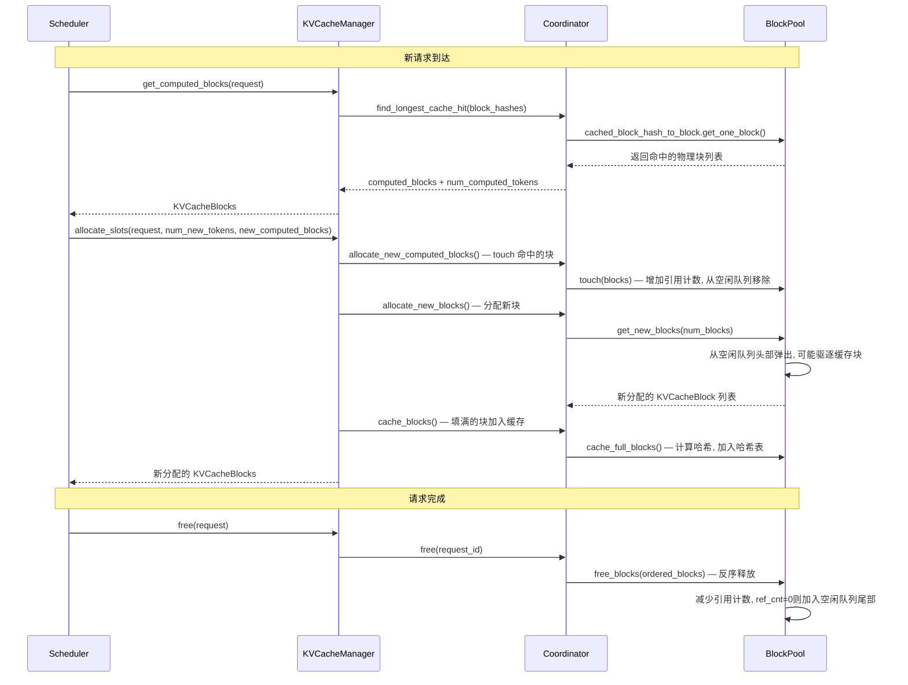
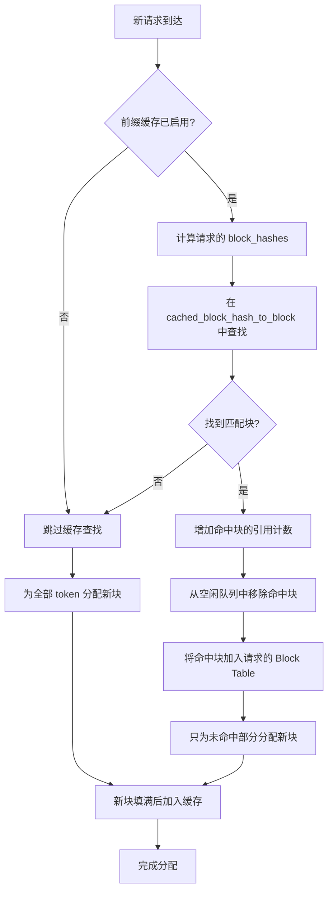

# vLLM PagedAttention 详解：让 KV Cache 从"一维长条"变"乐高拼图"

> **系列**: vLLM 技术博客系列 | **类型**: 核心模块深潜篇
>
> 当 GPU 显存变成一本"散装笔记本"，PagedAttention 就是那个把散页装订成册、还能随时拆借的图书管理员。

### 引言

想象你正在管理一间自习室。每个学生（请求）都要占一张长桌来摊开笔记（KV Cache），有的学生只写了两页，有的学生写了厚厚一摞。最让人头疼的是——你没法预知每个学生到底要写多少页。如果给每人预留一整张长桌，很快自习室就满了；如果让他们挤在一起，笔记又会互相覆盖。这就是大模型推理中 KV Cache 管理的经典难题。

vLLM 给出了一个精妙的答案：**PagedAttention**。它借鉴了操作系统中虚拟内存的分页思想，把 KV Cache 从"一维长条"切成了固定大小的"乐高积木"，再通过一张映射表（Block Table）把逻辑顺序和物理位置解耦。就像散页笔记本一样——每页可以单独分配、回收、共享，而学生翻阅时完全感知不到物理位置的变化。

本文将带你深入 vLLM V1 的 PagedAttention 实现细节，从问题出发，逐层拆解其核心数据结构、管理机制与前缀缓存优化。

---

### 传统 KV Cache 的三大痛点

在 PagedAttention 出现之前，主流 LLM 推理框架采用**连续内存分配**策略——为每个请求预分配一段连续的显存空间来存放 KV Cache。这种方式看似简单，实则暗藏三个致命问题：

| 痛点 | 描述 | 后果 |
|------|------|------|
| **内部碎片** | 预分配最大长度，但实际生成长度未知 | 大量显存被预留却未使用，GPU 利用率低下 |
| **外部碎片** | 请求长短不一，释放后留下无法复用的"空洞" | 可用显存充足却无法分配连续空间 |
| **无法共享** | 不同请求的前缀（如 system prompt）重复存储 | 相同前缀被计算和存储多次，浪费算力与显存 |

用一个 ASCII 图来感受这种痛苦：

```
传统连续分配 (一维长条)

GPU 显存
┌──────────────────────┐┌────────────┐┌────────────────────────┐┌──────┐
│   Request A (预留2K)   ││  Req B     ││   Request C (预留2K)    ││ 空洞 │
│   实际用了 800         ││  用满      ││   实际用了 600           ││      │
│   ████░░░░░░░░░░      ││  ████████  ││   ████░░░░░░░░░░░░     ││  ??  │
└──────────────────────┘└────────────┘└────────────────────────┘└──────┘
  ▓▓ 已使用    ░ 浪费(内部碎片)             ?? 外部碎片(无法利用)
```

> 笔者注：在实际生产中，LLM 输出长度差异极大——一个翻译请求可能只需 50 tokens，而一个代码生成请求可能输出 2000+ tokens。连续分配策略在这种场景下简直是显存杀手。

---

#### 从操作系统借智慧：虚拟内存与分页

PagedAttention 的灵感来自操作系统中最成功的抽象之一——**虚拟内存分页（Paging）**。让我们先建立这个核心类比：

```
操作系统虚拟内存                     vLLM PagedAttention
┌──────────────────┐               ┌──────────────────────┐
│ 进程的虚拟地址空间 │   ← 类比 →   │ 请求的逻辑 Token 序列  │
│ 页表 (Page Table) │   ← 类比 →   │ 块表 (Block Table)    │
│ 物理页帧 (Frame)  │   ← 类比 →   │ 物理块 (KVCacheBlock) │
│ 页面大小 (4KB)    │   ← 类比 →   │ 块大小 (block_size)   │
│ 缺页中断          │   ← 类比 →   │ 块分配失败 → 抢占     │
│ 共享内存          │   ← 类比 →   │ 前缀缓存共享          │
└──────────────────┘               └──────────────────────┘
```

核心思想：**逻辑上连续，物理上离散**。每个请求看到的 KV Cache 是一段连续的 Token 序列，但在物理显存中，这些 Token 被拆成固定大小的块，散布在 GPU 显存的各处。一张 Block Table 记录了"逻辑块号 → 物理块号"的映射关系。

---

### PagedAttention 核心数据结构

#### KVCacheBlock：物理块的基本单元

一切始于 `KVCacheBlock`——这是物理块在代码中的表示，定义在 `vllm/v1/core/kv_cache_utils.py` 中：

```python
# vllm/v1/core/kv_cache_utils.py
@dataclass(slots=True)
class KVCacheBlock:
    """KV-cache block metadata."""
    block_id: int         # 物理块 ID (0 ~ num_gpu_blocks-1)
    ref_cnt: int = 0      # 引用计数，支持多个请求共享同一块
    _block_hash: BlockHashWithGroupId | None = None  # 块哈希(前缀缓存用)
    _block_hash_num_tokens: int | None = None        # 哈希覆盖的 token 数

    # 双向链表指针，用于空闲队列
    prev_free_block: "KVCacheBlock | None" = None
    next_free_block: "KVCacheBlock | None" = None

    is_null: bool = False  # 是否为占位块
```

几个关键设计点：

1. **`ref_cnt` 引用计数**：允许多个请求共享同一个物理块——这是前缀缓存共享的基础。当 `ref_cnt` 降为 0 时，块才被回收。
2. **`_block_hash` 块哈希**：当块被填满后计算哈希值，用于前缀缓存命中查询。
3. **双向链表指针**：直接内嵌在 `KVCacheBlock` 中，构建空闲块队列，实现 O(1) 的中间节点移除。

##### 一个物理块有多大？

每个物理块存储 `block_size` 个 token 的 KV 数据。以常见的 `block_size=16`、`head_size=128`、FP16 为例：

```
单个物理块容量 (一个 head):
  block_size * head_size * 2 (K+V) * sizeof(FP16)
  = 16 * 128 * 2 * 2 bytes
  = 8,192 bytes = 8 KB

整个物理块 (所有 KV heads):
  = 8 KB * num_kv_heads
```

> 笔者注：`block_size` 是 PagedAttention 最关键的超参数之一。太大会导致内部碎片，太小会增加 Block Table 的查询开销。vLLM 默认值 16 是在大量实验后的平衡点；注意：有可能结合你的模型，比如GLM5.1还是KIMI2.6等，使用场景，比如coding场景还是claw办公场景等，实测下来 128 是最佳性能，那就修改默认值为 128，需要实事求是的来。

#### Block Table：逻辑到物理的映射

Block Table 是 PagedAttention 的灵魂——它将请求的逻辑 Token 序列映射到离散的物理块。在 GPU 端，它是一个二维张量：

```
Block Table 示例 (block_size=4)

请求 "A gentle breeze stirred the leaves"
逻辑 Token:  [A, gen, tle, bree] [ze, stir, red, the] [leav, es, ?, ?]

Block Table:
┌─────────┬─────────┬─────────┐
│ Block 0 │ Block 1 │ Block 2 │  ← 逻辑块索引
│    7    │    3    │   12    │  ← 物理块 ID
└─────────┴─────────┴─────────┘

物理显存中:
  Block 7  →  [A, gen, tle, bree]  (物理位置: 显存偏移 7*block_size)
  Block 3  →  [ze, stir, red, the]
  Block 12 →  [leav, es,  ?,   ? ]  (最后一个块可能未填满)
```

在代码中，Block Table 在 Worker 侧实现为 `BlockTable` 类（`vllm/v1/worker/block_table.py`），并在 GPU 上以 `torch.int32` 张量存储：

```python
# vllm/v1/worker/block_table.py
class BlockTable:
    def __init__(self, block_size, max_num_reqs, max_num_blocks_per_req, ...):
        # [max_num_reqs, max_num_blocks_per_req] 的二维张量
        self.block_table = self._make_buffer(
            self.max_num_reqs, self.max_num_blocks_per_req, dtype=torch.int32
        )
        self.num_blocks_per_row = np.zeros(max_num_reqs, dtype=np.int32)
```

Slot Mapping 则是 Block Table 的"加速索引"——直接将每个 Token 的位置映射到物理 slot：

```
Slot Mapping 计算:
  slot_id = block_table[req_idx, position // block_size] * block_size
            + position % block_size

示例 (block_size=4):
  Position 5 → 逻辑块 1, 偏移 1 → block_table[1]=3 → slot = 3*4+1 = 13
```

这部分通过 Triton 内核高效计算，定义在 `vllm/v1/worker/gpu/block_table.py` 的 `_compute_slot_mappings_kernel` 中。

---

### KV Cache Manager：显存的"大管家"

如果说 `KVCacheBlock` 是乐高积木，`Block Table` 是拼装说明书，那么 `KVCacheManager` 就是那个管理所有积木的"大管家"。

#### 整体架构

```
┌────────────────────────────────────────────────────────────────────┐
│                        KVCacheManager                              │
│  (vllm/v1/core/kv_cache_manager.py)                               │
│                                                                    │
│  ┌─────────────────────────────────────────────────────────────┐   │
│  │                   KVCacheCoordinator                        │   │
│  │  (vllm/v1/core/kv_cache_coordinator.py)                    │   │
│  │                                                             │   │
│  │  ┌───────────────────┐  ┌───────────────────┐              │   │
│  │  │ FullAttention     │  │ SlidingWindow     │              │   │
│  │  │ Manager           │  │ Manager           │              │   │
│  │  └───────┬───────────┘  └───────┬───────────┘              │   │
│  │          │                      │                           │   │
│  │          └──────────┬───────────┘                           │   │
│  │                     │                                       │   │
│  │            ┌────────▼────────┐                              │   │
│  │            │    BlockPool    │                              │   │
│  │            │ (vllm/v1/core/  │                              │   │
│  │            │  block_pool.py) │                              │   │
│  │            │                 │                              │   │
│  │            │ ┌─────────────┐ │                              │   │
│  │            │ │ Free Block  │ │    ┌────────────────────┐   │   │
│  │            │ │   Queue     │ │    │ cached_block_hash  │   │   │
│  │            │ │ (双向链表)   │ │    │   get_one_block   │   │   │
│  │            │ └─────────────┘ │    │ (哈希→物理块映射)   │   │   │
│  │            └─────────────────┘    └────────────────────┘   │   │
│  └─────────────────────────────────────────────────────────────┘   │
└────────────────────────────────────────────────────────────────────┘
```

这个三层架构各有分工：

| 层次 | 类名 | 职责 |
|------|------|------|
| **门面层** | `KVCacheManager` | 对外暴露统一接口（allocate/free/get_computed_blocks），隐藏内部复杂性 |
| **协调层** | `KVCacheCoordinator` | 协调多个 KV Cache Group（如 FullAttention + SlidingWindow 混合架构） |
| **执行层** | `BlockPool` + `SingleTypeKVCacheManager` | 实际的块分配、释放、缓存与驱逐操作 |

> 笔者注：V1 架构引入了"KV Cache Group"的概念，支持同一模型中存在不同类型的注意力层（如 Full Attention + Sliding Window）。每种类型由独立的 `SingleTypeKVCacheManager` 管理，但共享同一个 `BlockPool`。

---

### 块的生命周期：分配、使用、释放

让我们跟踪一个请求从"进门"到"离场"的完整过程，看看块是如何流转的。



#### 分配：新请求的"入住登记"

当调度器为一个新请求分配 KV Cache 时，经过以下关键步骤：

**Step 1 — 查找前缀缓存命中**（`get_computed_blocks`）

```python
# vllm/v1/core/kv_cache_manager.py
def get_computed_blocks(self, request: Request) -> tuple[KVCacheBlocks, int]:
    if not self.enable_caching or request.skip_reading_prefix_cache:
        return self.empty_kv_cache_blocks, 0

    # 注意：全命中时必须重算最后一个 token 以获取 logits
    max_cache_hit_length = request.num_tokens - 1
    computed_blocks, num_new_computed_tokens = (
        self.coordinator.find_longest_cache_hit(
            request.block_hashes, max_cache_hit_length
        )
    )
    return self.create_kv_cache_blocks(computed_blocks), num_new_computed_tokens
```

**Step 2 — Touch 命中的块**（增加引用计数，防止被驱逐）

```python
# vllm/v1/core/block_pool.py
def touch(self, blocks: Sequence[KVCacheBlock]) -> None:
    for block in blocks:
        # ref_cnt=0 意味着该块在空闲队列中(可被驱逐)
        # 所以必须先移除出队列
        if block.ref_cnt == 0 and not block.is_null:
            self.free_block_queue.remove(block)
        block.ref_cnt += 1
```

**Step 3 — 分配新块**

```python
# vllm/v1/core/block_pool.py
def get_new_blocks(self, num_blocks: int) -> list[KVCacheBlock]:
    if num_blocks > self.get_num_free_blocks():
        raise ValueError(f"Cannot get {num_blocks} free blocks")

    ret = self.free_block_queue.popleft_n(num_blocks)
    if self.enable_caching:
        for block in ret:
            self._maybe_evict_cached_block(block)  # 可能驱逐缓存块
            block.ref_cnt += 1
    return ret
```

#### 释放：请求的"退房清场"

当请求完成时，其块按**反序**释放（尾部块先释放），这是一个精妙的设计：

```python
# vllm/v1/core/kv_cache_manager.py
def free(self, request: Request) -> None:
    self.coordinator.free(request.request_id)
```

反序释放的原因：**一个请求尾部的块包含更多哈希信息，被其他请求复用的概率更低**。因此尾部块应该先进入空闲队列，优先被驱逐，而前缀块（更可能被共享）则后进队列、后被驱逐。

```python
# vllm/v1/core/block_pool.py
def free_blocks(self, ordered_blocks: Iterable[KVCacheBlock]) -> None:
    blocks_with_hash = []
    blocks_without_hash = []
    for block in ordered_blocks:
        block.ref_cnt -= 1
        if block.ref_cnt == 0 and not block.is_null:
            if block.block_hash is None:
                blocks_without_hash.append(block)
            else:
                blocks_with_hash.append(block)

    # 无哈希块优先被驱逐(追加到尾部前面)
    self.free_block_queue.prepend_n(blocks_without_hash)
    # 有哈希块后追加(更晚被驱逐)
    self.free_block_queue.append_n(blocks_with_hash)
```

---

### 淘汰机制：当显存不够时的"断舍离"

当空闲块不足时，PagedAttention 需要驱逐一些缓存块来腾出空间。这类似于操作系统的页面替换算法。

#### LRU 驱逐策略

vLLM 采用**最近最少使用（LRU）**策略，通过 `FreeKVCacheBlockQueue` 实现：

```
FreeKVCacheBlockQueue (双向链表)

  头部 (最先被驱逐)                          尾部 (最后被驱逐)
  ┌─────┐   ┌─────┐   ┌─────┐       ┌─────┐   ┌─────┐
  │ Blk7│◄─►│ Blk8│◄─►│ Blk9│◄─►...◄─►│ Blk3│◄─►│ Blk2│
  └─────┘   └─────┘   └─────┘       └─────┘   └─────┘
   LRU                                        MRU
  (最久未用)                                  (最近使用)
  
  ↑ 从头部弹出用于分配
  ↑ 头部如果是缓存块 → 先驱逐再分配
```

当从空闲队列头部弹出一个块时，如果该块仍有哈希（被缓存），就需要执行驱逐：

```python
# vllm/v1/core/block_pool.py
def _maybe_evict_cached_block(self, block: KVCacheBlock) -> bool:
    if self.metrics_collector:
        self.metrics_collector.on_block_evicted(block)

    evicted_hashes = self._remove_cached_block_hashes(block)
    if not evicted_hashes:
        return False  # 无哈希，无需驱逐

    self._emit_block_removed_events(evicted_hashes)
    return True
```

驱逐操作包含三步：
1. 从空闲队列头部弹出块
2. 从 `cached_block_hash_to_block` 哈希表中移除该块的映射
3. 重置块的哈希信息（`reset_hash`）

> 💡 **性能提示**: 驱逐是一个"双刃剑"——它释放了空间，但也可能破坏前缀缓存命中率。在高并发场景中，可以通过设置 `watermark` 参数保留一定的空闲块余量，避免频繁驱逐导致的性能抖动。

---

### 前缀缓存：让共享前缀"只算一次"

前缀缓存（Prefix Caching / Automatic Prefix Caching）是 PagedAttention 最优雅的优化之一。核心思想：**如果多个请求共享相同的前缀 Token，它们的 KV Cache 可以共享同一组物理块，无需重复计算和存储。**

#### 哈希方案：链式哈希

vLLM 采用**链式哈希**来唯一标识每个块。一个块的哈希由三部分组成：

```
Block Hash = hash(parent_hash, block_tokens, extra_hashes)

        Block 0              Block 1              Block 2
  [A gentle breeze]    [stirred the leaves]   [as children laugh]
  hash(None, "A gen..") hash(Hash0, "stir..") hash(Hash1, "as ch..")
        │                     │                      │
    parent=None          parent=Hash0          parent=Hash1
```

- **`parent_hash`**：父块的哈希值，确保前缀唯一性
- **`block_tokens`**：当前块中的 Token ID 元组，降低哈希碰撞概率
- **`extra_hashes`**：额外标识信息，如 LoRA ID、多模态输入哈希、`cache_salt`（多租户安全隔离）

> 💡 **安全提示**: v0 版本使用 Python 内置 `hash()` 函数，哈希碰撞风险较高。v0.11 起默认采用 `sha256`，并通过 `--prefix-caching-hash-algo` 参数支持 `sha256_cbor`（跨语言可复现）和 `xxhash`（更快但非加密安全）。在多租户环境中，建议使用 `sha256` 并配合 `cache_salt` 参数进行缓存隔离。

#### 前缀缓存命中流程



#### 前缀缓存实战示例

假设 `block_size=4`，共 10 个物理块：

```
Time 1: 请求 0 到达 (14 个 prompt tokens)
┌───────────────────────────────────────────────────────────────┐
│ 物理块:  0[A gen tle bree] 1[ze stir red the] 2[leav es ?? ??]│
│ 空闲块:  3 4 5 6 7 8 9                                       │
│ 缓存块:  0(已满), 1(已满)                                      │
│ 块 2:   3/4 满, 尚未缓存                                       │
└───────────────────────────────────────────────────────────────┘

Time 2: 请求 0 解码使块 2 填满, 需要新块
┌───────────────────────────────────────────────────────────────┐
│ 物理块:  0 1 2[leav es out today] 3[ne??]                     │
│ 缓存块:  0, 1, 2 (全部缓存)                                    │
│ 空闲块:  4 5 6 7 8 9                                          │
└───────────────────────────────────────────────────────────────┘

Time 3: 请求 1 到达 (14 tokens, 前 10 个与请求 0 相同)
┌───────────────────────────────────────────────────────────────┐
│ 请求 1 的 Block Table: [0, 1, 7, 8]                           │
│   块 0, 1 → 前缀缓存命中! (共享请求 0 的物理块, ref_cnt=2)    │
│   块 7, 8 → 新分配 (前 8 个 token 命中缓存, 节省 50% 计算)    │
│ 空闲块:  4 5 6 9                                              │
└───────────────────────────────────────────────────────────────┘
```

> 笔者注：注意块 2 没有被请求 1 命中——虽然它包含的 4 个 token 中有 2 个与请求 1 匹配，但前缀缓存只匹配**完整的块**。这是"块粒度"缓存的固有特性，也是 `block_size` 不宜过大的原因之一。

#### 多模态前缀缓存

对于包含图像的请求，vLLM 将 `[IMG]` 标记替换为占位符 Token，并将图像哈希作为 `extra_hash` 加入块哈希计算，确保不同图像不会错误地共享缓存：

```
Block 0: hash(None,  [1, 3, 7493, ..., <p>, ..., <p>],  <image_hash>)
Block 1: hash(Hash0, [<p>, ..., <p>],                    <image_hash>)
Block 2: hash(Hash1, [<p>, ..., <p>, 4],                 <image_hash>)
```

---

### Block Table 的 GPU 端实现

PagedAttention 的精妙不仅在于管理逻辑，更在于注意力内核如何高效地使用 Block Table。

#### Slot Mapping：Token 到物理位置的直通车

在 GPU 端，注意力内核不直接查询 Block Table，而是通过预先计算的 **Slot Mapping** 直接定位每个 Token 的物理 slot：

```python
# vllm/v1/worker/gpu/block_table.py (Triton 内核)
@triton.jit
def _compute_slot_mappings_kernel(...):
    # 对每个 token:
    block_index = position // block_size           # 逻辑块索引
    block_number = block_table[req_idx, block_index] # 物理块号
    block_offset = position % block_size           # 块内偏移
    slot_id = block_number * block_size + block_offset  # 物理 slot
```

这个计算过程通过 Triton 内核并行化，在 GPU 上高效完成。

#### 注意力内核中的 PagedAttention

在 CUDA 内核层面（`csrc/libtorch_stable/attention/paged_attention_v1.cu` 和 `paged_attention_v2.cu`），PagedAttention 的核心流程如下：

```
对于每个 Sequence (由一个 Thread Block 处理):

1. 查询 (Query):
   q_ptr → 从全局内存读取 Query 数据到共享内存

2. 键 (Key) — 按 Block 遍历:
   for each physical_block in block_table:
     k_ptr = k_cache + physical_block_number * kv_block_stride + ...
     → 从全局内存读取 Key 数据到寄存器

3. QK 点积:
   qk = scale * dot(q_vecs, k_vecs)

4. Softmax (跨所有 Key Block):
   qk_max → 全线程块规约
   exp_sum → 全线程块规约
   logits = softmax(qk)

5. 值 (Value) — 按 Block 遍历:
   for each physical_block in block_table:
     v_ptr = v_cache + physical_block_number * kv_block_stride + ...
     accs += dot(logits_vec, v_vec)

6. 输出:
   写回全局内存
```

KV Cache 在物理显存中的布局：

```
k_cache: [num_blocks, num_kv_heads, head_size/x, block_size, x]
v_cache: [num_blocks, num_kv_heads, head_size, block_size]

其中 x = THREAD_GROUP_SIZE * VEC_SIZE
```

> 💡 **性能提示**: PagedAttention 内核通过 `block_table` 间接访问 Key/Value 数据，相比连续内存访问多了一次间接寻址。但 vLLM 通过精心设计的内存布局（将 block_size 维度放在内层）和 Warp 级别的内存合并访问，将这一开销降到了最低。

---

### V1 架构的关键演进

vLLM V1 对 PagedAttention 的管理进行了重大重构，相比 V0 有以下核心变化：

| 方面 | V0 | V1 |
|------|----|----|
| **块管理** | `BlockSpaceManager` + `ImmutableBlockManager` | `KVCacheManager` + `KVCacheCoordinator` |
| **块共享** | 支持 Block Table 修改（替换共享块） | Block Table 只追加（append-only），允许重复块 |
| **空闲队列** | `deque` | 内嵌双向链表的 `FreeKVCacheBlockQueue`，O(1) 中间移除 |
| **缓存映射** | `dict[hash, block_id]` | `BlockHashToBlockMap`，支持同一哈希多块 |
| **组管理** | 单一注意力类型 | `SingleTypeKVCacheManager` 支持多种注意力混合 |
| **驱逐** | 引入 `deque` 操作 | 直接操作链表指针，零 Python 对象分配 |

V1 最关键的变化是 **Block Table 变为 append-only**。在 V0 中，当检测到重复块时，会修改 Block Table 使其指向已有块。但在 V1 中，Block Table 一旦写入就不再修改，即使出现重复块也暂时保留，直到请求释放时再统一清理。这个简化避免了复杂的并发修改问题，代价是短暂的冗余存储。

```python
# V1 的去重策略：释放时处理
# vllm/v1/core/block_pool.py
def free_blocks(self, ordered_blocks: Iterable[KVCacheBlock]) -> None:
    # 无哈希块(不会被复用)优先驱逐
    # 有哈希块(可能被其他请求共享)后驱逐
    self.free_block_queue.prepend_n(blocks_without_hash)
    self.free_block_queue.append_n(blocks_with_hash)
```

---

### 全景对照：PagedAttention vs. OS 虚拟内存

| 维度 | OS 虚拟内存 | vLLM PagedAttention |
|------|------------|---------------------|
| **分页单位** | 4KB 页面 | `block_size` 个 Token 的 KV 数据 |
| **映射结构** | 多级页表 / TLB | 一维 Block Table + Slot Mapping |
| **分配策略** | 按需分配 + 写时复制 | 按需分配 + 前缀缓存共享 |
| **替换策略** | LRU / Clock / FIFO | LRU（FreeKVCacheBlockQueue） |
| **共享机制** | 共享页表项 + COW | `ref_cnt` 引用计数 + 前缀缓存 |
| **碎片处理** | 内存压缩 / 碎片整理 | 物理块天然无外部碎片 |
| **换出机制** | Swap 到磁盘 | 抢占（Preemption）+ 重算 |
| **TLB 加速** | 硬件 TLB | Slot Mapping 预计算 |

---

### 核心收获与行动建议

| 要点 | 说明 |
|------|------|
| **核心思想** | 逻辑连续、物理离散，Block Table 解耦映射 |
| **关键数据结构** | `KVCacheBlock`（物理块）+ `BlockTable`（映射表）+ `FreeKVCacheBlockQueue`（空闲管理） |
| **分配流程** | 查缓存 → Touch → 分配新块 → 缓存满块 |
| **释放流程** | 反序释放 → 尾部优先驱逐 → 前缀块后驱逐 |
| **前缀缓存** | 链式哈希 + 引用计数 + LRU 驱逐 |
| **V1 改进** | append-only Block Table + 内嵌双向链表 + 多组管理 |

> **一句话行动建议**：调优 PagedAttention 时，优先关注 `block_size` 和 `watermark` 两个参数——前者决定碎片与开销的平衡，后者决定驱逐与抖动的边界。

---

### 延伸阅读

- vLLM 原始论文Efficient Memory Management for Large Language Model Serving with PagedAttention (Kwon et al., SOSP 2023)：https://arxiv.org/abs/2309.06180
- vLLM 官方设计文档PagedAttention：https://github.com/vllm-project/vllm/blob/main/docs/design/paged_attention.md
- vLLM 官方设计文档Automatic Prefix Caching：https://github.com/vllm-project/vllm/blob/main/docs/design/prefix_caching.md
- 操作系统虚拟内存与分页机制 — CMU 15-410：https://www.cs.cmu.edu/~410/

---

*本文属于 [vLLM 技术博客系列]，欢迎持续关注。*
