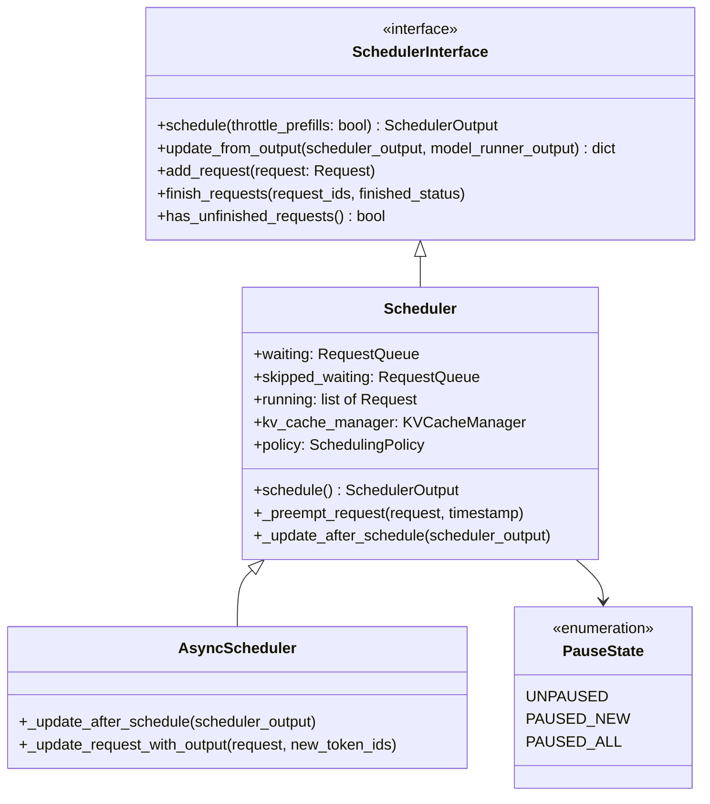
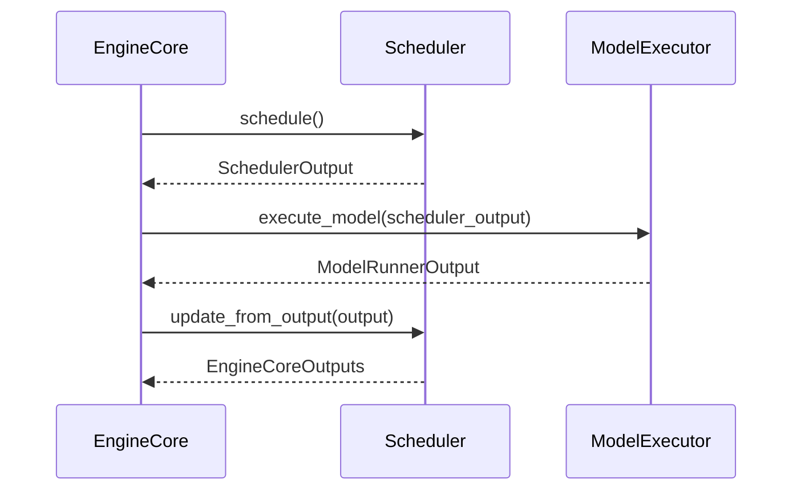
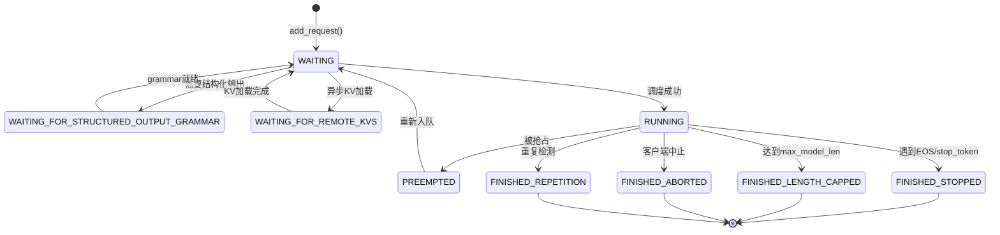
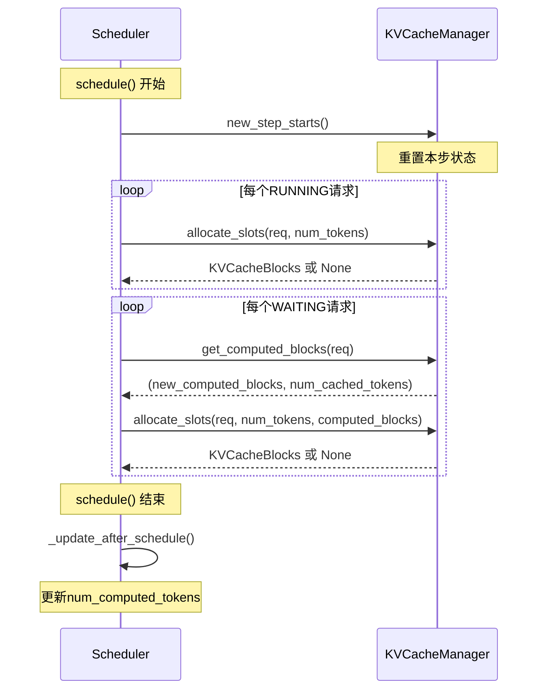

# vLLM调度器与连续批处理：当请求像潮水般涌来

> **系列**: vLLM 技术博客系列 | **类型**: 核心模块深潜篇
>
> 每一次推理系统迭代，调度器都在回答同一个问题：在有限的 GPU 资源下，这一步该让哪些请求"上场"？

### 引言

你去银行办业务，取号排队。前面有个人办贷款，要填十几张表、审半小时。你只是取个钱，1 分钟就能搞定，但你必须等他办完——这就是静态批处理的困境：**一刀切，短的等长的，谁也别想快**。

要是银行换个规矩呢？柜员每办完一个步骤，就看一眼等候区——谁简单就先叫谁，办贷款的继续填表但不占柜台，取钱的进来 1 分钟办完就走。这样等候区的人一直在流动，柜台从不空转——这就是 vLLM 连续批处理的核心思想：**不按"批"等，按"步"调度**，每一个时间步灵活决定谁上场、谁让位，GPU 永远在干有用的活。

---

### 从静态到连续：批处理的进化之路

##### 静态批处理的困境

在早期 LLM 推理系统中，批处理是"静态"的：一批请求同时进入，所有请求必须全部完成，才能接纳新请求。这种方式有两个致命缺陷：

| 痛点 | 表现 | 后果 |
|------|------|------|
| **Padding 浪费** | 不同请求长度差异大，短请求必须 pad 到与最长请求等长 | GPU 算力大量浪费在 padding token 上 |
| **Head-of-Line 阻塞** | 一个长请求卡住整批，短请求被迫等待 | 尾部延迟 (tail latency) 极差 |
| **资源闲置** | 已完成的请求仍然占据 batch 槽位 | 吞吐量随 batch 内请求完成而递减 |

用一个例子说明：假设 batch 中有 3 个请求，长度分别为 10、50、200 tokens。静态批处理需要将所有请求 pad 到 200，前两个请求 90% 以上的计算都是无效的。

Padding 就是"补零凑齐"——把短请求用无意义的占位符填到和最长请求一样长，这样它们才能组成一个规整的矩阵，一起送进 GPU 计算。

为什么需要 Padding？ GPU 喜欢规整的矩阵运算。一批请求要一起算，就得拼成一个大矩阵。但每个请求的长度不同，矩阵就对不齐——短的要补齐到最长的那个。

##### 连续批处理：迭代级调度

vLLM 采用**连续批处理 (Continuous Batching)**，核心思想是：

> 每一次前向传播（一个 scheduling step），调度器独立决定哪些请求参与、各分配多少 token，已完成的请求立即退出，新请求随时加入。

```
  静态批处理                          连续批处理
  ──────────                          ──────────
  Step 1: [A B C D]                   Step 1: [A B C D]
  Step 2: [A B C D]  ← D已完成但占位   Step 2: [A B C E]  ← D完成, E加入
  Step 3: [A B C D]  ← C也完成了       Step 3: [A B E F]  ← C完成, F加入
  Step 4: [A B - -]  ← 终于能空了      Step 4: [A E F G]  ← 持续流动
```

在 vLLM V1 的代码中，这一点体现得淋漓尽致——`Scheduler.schedule()` 方法在每一次迭代中被调用，产生一个 `SchedulerOutput`，包含本轮所有被调度的请求及其 token 分配。

> 💡 **性能提示**: 连续批处理使得 vLLM 的 GPU 利用率在稳态下几乎可以始终保持在高位，因为不存在"等最慢请求"的空闲窗口。

---

### V1 调度器架构总览

##### 核心文件结构

vLLM V1 的调度器代码位于 `vllm/v1/core/sched/` 目录下，结构清晰：

```
vllm/v1/core/sched/
├── __init__.py           # 模块导出
├── interface.py          # SchedulerInterface 抽象接口 + PauseState
├── scheduler.py          # 核心调度器实现 (~2000行)
├── async_scheduler.py    # 异步调度器 (继承Scheduler)
├── output.py             # SchedulerOutput / NewRequestData / CachedRequestData
├── request_queue.py      # 请求队列 (FCFS / Priority)
└── utils.py              # 辅助函数 (check_stop等)
```

##### 调度器类图



##### 调度器与引擎核心的交互

调度器并不独立运行，它被 `EngineCore` 驱动。引擎核心的主循环非常简洁：

```python
# vllm/v1/engine/core.py — EngineCore.step()
def step(self) -> tuple[dict[int, EngineCoreOutputs], bool]:
    if not self.scheduler.has_requests():
        return {}, False
    scheduler_output = self.scheduler.schedule(self._should_throttle_prefills())
    future = self.model_executor.execute_model(scheduler_output, non_block=True)
    grammar_output = self.scheduler.get_grammar_bitmask(scheduler_output)
    model_output = future.result()
    if model_output is None:
        model_output = self.model_executor.sample_tokens(grammar_output)
    self._process_aborts_queue()  # 处理模型执行期间的客户端中断
    engine_core_outputs = self.scheduler.update_from_output(
        scheduler_output, model_output
    )
    return engine_core_outputs, scheduler_output.total_num_scheduled_tokens > 0
```

每一次 `step()` 调用，就是一次完整的 **schedule -> execute -> update** 循环：



---

### 请求的生命周期：从 WAITING 到 FINISHED

##### 请求状态机

每个请求 (`Request`) 在调度器中经历明确的状态流转。`RequestStatus` 枚举定义了所有可能的状态：

```python
# vllm/v1/request.py
class RequestStatus(enum.IntEnum):
    WAITING = enum.auto()
    WAITING_FOR_STRUCTURED_OUTPUT_GRAMMAR = enum.auto()
    WAITING_FOR_REMOTE_KVS = enum.auto()
    WAITING_FOR_STREAMING_REQ = enum.auto()
    RUNNING = enum.auto()
    PREEMPTED = enum.auto()
    # 以下均视为 finished
    FINISHED_STOPPED = enum.auto()
    FINISHED_LENGTH_CAPPED = enum.auto()
    FINISHED_ABORTED = enum.auto()
    FINISHED_IGNORED = enum.auto()
    FINISHED_ERROR = enum.auto()
    FINISHED_REPETITION = enum.auto()
```

状态之间的流转可以用如下状态机描述：



##### 调度器内部的三大容器

调度器维护三个核心容器来管理请求：

```python
# vllm/v1/core/sched/scheduler.py — Scheduler.__init__()
self.waiting: RequestQueue         # 等待调度的请求队列
self.skipped_waiting: RequestQueue # 本轮因约束跳过的请求
self.running: list[Request]        # 正在运行的请求列表
```

| 容器 | 类型 | 入口 | 出口 | 说明 |
|------|------|------|------|------|
| `waiting` | `RequestQueue` | 新请求加入、被抢占请求重新入队 | 被调度到 running | 主等待队列 |
| `skipped_waiting` | `RequestQueue` | 本轮因 LoRA/encoder 约束跳过 | 下一轮优先调度 | 避免饿死 |
| `running` | `list[Request]` | 从 waiting 提升 | 完成或被抢占 | 当前活跃请求 |

> 笔者注：`skipped_waiting` 的设计非常精妙。当某个请求因为 LoRA 配额满、encoder 预算不足等临时约束被跳过时，它不会回到 `waiting` 队尾，而是进入 `skipped_waiting`，并在下一轮调度时被优先考虑。这避免了"永远排不上队"的饿死问题。

---

### schedule() 深度拆解：一次迭代的决策逻辑

`Scheduler.schedule()` 是整个调度器的核心方法，约有 600+ 行代码。让我们逐段拆解其逻辑。

##### 第一步：调度 RUNNING 请求

调度器优先保证已经在运行的请求继续推进：

```python
# vllm/v1/core/sched/scheduler.py — schedule() 节选
# First, schedule the RUNNING requests.
req_index = 0
while req_index < len(self.running) and token_budget > 0:
    request = self.running[req_index]

    # 计算该请求还需要多少 token
    num_new_tokens = (
        request.num_tokens_with_spec
        + request.num_output_placeholders
        - request.num_computed_tokens
    )
    num_new_tokens = min(num_new_tokens, token_budget)

    # 尝试为该请求分配 KV cache blocks
    new_blocks = self.kv_cache_manager.allocate_slots(
        request, num_new_tokens,
        num_lookahead_tokens=self.num_lookahead_tokens,
    )
    # ...如果分配失败，触发抢占
```

关键设计点：

- **Token 预算机制**：每一步有 `max_num_scheduled_tokens` 的总预算，所有请求共享
- **Running 优先**：已在运行的请求优先分配资源，确保解码连续性
- **与 KV Cache Manager 的协作**：每个请求需要通过 `allocate_slots()` 获取 KV cache 空间

##### 第二步：调度 WAITING 请求

Running 请求调度完毕后，如果有剩余 token 预算且没有被抢占发生，调度器开始从等待队列中提升新请求：

```python
# vllm/v1/core/sched/scheduler.py — schedule() 节选
# Next, schedule the WAITING requests.
if not preempted_reqs and self._pause_state == PauseState.UNPAUSED:
    while (self.waiting or self.skipped_waiting) and token_budget > 0:
        if len(self.running) == self.max_num_running_reqs:
            break

        request = request_queue.peek_request()
        # ...检查 LoRA 约束、prefix cache命中、encoder预算等

        # 为新请求分配 KV cache blocks
        new_blocks = self.kv_cache_manager.allocate_slots(
            request, num_new_tokens,
            num_new_computed_tokens=num_new_local_computed_tokens,
            new_computed_blocks=new_computed_blocks,
            ...
        )
        if new_blocks is None:
            break  # 无法调度，停止

        # 调度成功，从 waiting 移入 running
        request = request_queue.pop_request()
        self.running.append(request)
```

这里有一个非常重要的细节：当 `allocate_slots()` 返回 `None` 时，调度器直接 `break`，而不是尝试下一个请求。这意味着**一旦 KV cache 不足，后续所有 waiting 请求都会被阻塞**，即使它们可能只需要很少的 KV cache 空间。

> 💡 **性能提示**: `scheduler_reserve_full_isl`（默认为 True）会让调度器在接纳新请求前检查其**完整输入序列长度**是否能放入 KV cache，而非仅检查第一个 chunk。这有效防止了"先接纳再抢占"的颠簸现象（KV cache thrashing）。

##### Prefill 与 Decode 的统一视角

vLLM V1 调度器的一个设计亮点是：**它没有显式的 "prefill phase" 或 "decode phase"**。每个请求只有一个核心量——`num_computed_tokens`，调度器的目标是让每个请求的 `num_computed_tokens` 追上 `num_tokens_with_spec`。

```python
# vllm/v1/core/sched/scheduler.py — schedule() 注释
# NOTE(woosuk) on the scheduling algorithm:
# There's no "decoding phase" nor "prefill phase" in the scheduler.
# Each request just has the num_computed_tokens and num_tokens_with_spec.
# At each step, the scheduler tries to assign tokens to the requests
# so that each request's num_computed_tokens can catch up its
# num_tokens_with_spec. This is general enough to cover
# chunked prefills, prefix caching, speculative decoding,
# and the "jump decoding" optimization in the future.
```

| 场景 | num_computed_tokens | num_tokens_with_spec | 调度行为 |
|------|---------------------|----------------------|----------|
| 新请求首次调度 (Prefill) | 0 | len(prompt) | 分配 prompt 长度 tokens |
| Chunked Prefill 中间步 | N (已计算) | len(prompt) | 分配 min(chunk, remaining) tokens |
| Decode 阶段 | len(prompt)+已输出 | len(prompt)+已输出+1 | 分配 1 token |
| 推测解码 Decode | len(prompt)+已输出 | len(prompt)+已输出+1+K | 分配 1+K tokens |

这种统一视角使得调度逻辑极为简洁且具有可扩展性。

---

### 抢占与驱逐：资源不够时的"急诊分流"

当 GPU 内存不足以为 running 请求分配 KV cache 时，调度器必须做出艰难的抉择——抢占 (Preemption)。

##### 抢占触发条件

抢占发生在 `allocate_slots()` 返回 `None` 时。调度器会循环尝试抢占最低优先级的 running 请求，直到有足够空间：

```python
# vllm/v1/core/sched/scheduler.py — schedule() 中的抢占逻辑
while True:
    new_blocks = self.kv_cache_manager.allocate_slots(
        request, num_new_tokens,
        num_lookahead_tokens=self.num_lookahead_tokens,
    )
    if new_blocks is not None:
        break  # 分配成功

    # 选择抢占对象
    if self.policy == SchedulingPolicy.PRIORITY:
        # 优先级策略：抢占优先级最低的（priority值最大）
        preempted_req = max(
            self.running,
            key=lambda r: (r.priority, r.arrival_time),
        )
        self.running.remove(preempted_req)  # max() 只返回不删除，需手动移除
    else:
        # FCFS策略：抢占最后加入的（最近来的先让位）
        preempted_req = self.running.pop()

    self._preempt_request(preempted_req, scheduled_timestamp)
    preempted_reqs.append(preempted_req)
    if preempted_req == request:
        break  # 自己也被抢占，无法继续
```

##### 抢占策略对比

| 策略 | 抢占对象 | 适用场景 | 实现方式 |
|------|----------|----------|----------|
| **FCFS** | `self.running.pop()` — 最后加入的请求 | 通用场景，保证先来请求的权益 | 从 running 列表末尾取出 |
| **Priority** | `max(running, key=priority)` + `remove()` — 优先级最低的 | SLA 敏感场景，VIP 请求不被抢占 | 遍历 running 找最低优先级，需手动移除 |

##### 抢占的具体行为

```python
# vllm/v1/core/sched/scheduler.py
def _preempt_request(self, request: Request, timestamp: float) -> None:
    """Preempt a request and put it back to the waiting queue."""
    assert request.status == RequestStatus.RUNNING
    self._free_request_blocks(request)        # 释放 KV cache blocks
    self.encoder_cache_manager.free(request)   # 释放 encoder cache
    self._inflight_prefills.discard(request)   # 从预填充追踪中移除
    if request.spec_token_ids:
        request.spec_token_ids = []            # 清除推测解码的 draft tokens
    request.status = RequestStatus.PREEMPTED
    request.num_computed_tokens = 0            # 重置已计算token数！
    request.num_preemptions += 1
    self.waiting.prepend_request(request)      # 放回等待队列头部
```

> 笔者注：注意 `request.num_computed_tokens = 0`——这意味着被抢占的请求需要**从头重新计算**（recompute），而非从断点续算。这是 vLLM V1 当前的设计选择，牺牲了部分计算效率换取了实现简洁性。在实际部署中，抢占频率越低越好，`watermark` 参数正是为此而设。

##### Watermark：预防抢占的缓冲区

`SchedulerConfig.watermark`（默认 0.0）指定了 KV cache 中保留的空闲比例作为水位线。当空闲空间低于此水位线时，调度器将不再接纳新请求，从而避免频繁抢占。

```
┌─────────────────────────────────────────────────────┐
│                   KV Cache 容量                      │
│                                                     │
│  ┌──────────┬────────────────────────┬────────────┐ │
│  │ Watermark│   可用于分配的空间       │  已使用    │ │
│  │ (保留区)  │                        │  Blocks    │ │
│  └──────────┴────────────────────────┴────────────┘ │
│                                                     │
│  watermark=0.1 时，始终保留10%的block不被分配          │
└─────────────────────────────────────────────────────┘
```

---

### 调度策略：FCFS vs Priority

vLLM V1 支持两种调度策略，通过 `SchedulerConfig.policy` 配置。

##### FCFS (First Come First Served)

默认策略，请求按到达时间顺序处理。实现上使用 `deque`：

```python
# vllm/v1/core/sched/request_queue.py
class FCFSRequestQueue(deque[Request], RequestQueue):
    def add_request(self, request: Request) -> None:
        self.append(request)          # 新请求入队尾

    def pop_request(self) -> Request:
        return self.popleft()         # 从队首取出
```

##### Priority

优先级策略，请求按 `(priority, arrival_time)` 排序。实现上使用最小堆：

```python
# vllm/v1/core/sched/request_queue.py
class PriorityRequestQueue(RequestQueue):
    def __init__(self) -> None:
        self._heap: list[Request] = []

    def add_request(self, request: Request) -> None:
        heapq.heappush(self._heap, request)  # 堆插入 O(log n)

    def pop_request(self) -> Request:
        return heapq.heppop(self._heap)       # 堆弹出 O(log n)
```

##### 策略选择指南

| 维度 | FCFS | Priority |
|------|------|----------|
| **公平性** | 完全按到达顺序 | 高优先级请求始终优先 |
| **延迟可预测性** | 尾部延迟受长请求影响 | VIP 请求延迟有保障 |
| **实现复杂度** | O(1) 入队/出队 | O(log n) 入队/出队 |
| **适用场景** | 通用推理服务 | SLA 分级服务、在线/离线混部 |
| **抢占行为** | 抢占最后加入的 | 抢占优先级最低的 |

> 💡 **性能提示**: 在 Priority 策略下，抢占会遍历 running 列表找最低优先级请求（O(n)）。如果 running 列表很大且抢占频繁，这会成为瓶颈。此时可考虑增大 `watermark` 减少抢占。

---

### 调度器与 KV Cache Manager 的协作

调度器不是孤军作战。每一步调度决策都需要与 KV Cache Manager 紧密配合。

##### 交互流程



##### 核心交互 API

| 方法 | 调用时机 | 作用 |
|------|----------|------|
| `kv_cache_manager.new_step_starts()` | `schedule()` 开头 | 重置每步状态，释放上一步的 blocks |
| `kv_cache_manager.get_computed_blocks(req)` | 调度 WAITING 请求时 | 获取 prefix cache 命中的 blocks |
| `kv_cache_manager.allocate_slots(req, num_tokens)` | 为请求分配 KV 空间 | 返回新分配的 blocks，或 None 表示空间不足 |
| `kv_cache_manager.get_blocks(req_id)` | 构建 SchedulerOutput 时 | 获取请求当前所有 block IDs |
| `kv_cache_manager.cache_blocks(req, ...)` | `_update_request_with_output()` 时 | 将新生成的 block 写入缓存 |
| `_free_request_blocks(req)` | 抢占/完成时 | 释放请求的所有 KV cache blocks |

##### Prefix Cache 加速调度

当一个新请求进入 WAITING 状态时，调度器会先查询 KV Cache Manager 是否已有可复用的 prefix blocks：

```python
# vllm/v1/core/sched/scheduler.py — schedule() 节选
if request.num_computed_tokens == 0:
    # 查询本地 prefix cache 命中
    new_computed_blocks, num_new_local_computed_tokens = (
        self.kv_cache_manager.get_computed_blocks(request)
    )
    # 查询远程 KV cache 命中 (如果使用 KV Connector)
    if self.connector is not None:
        ext_tokens, load_kv_async = (
            self.connector.get_num_new_matched_tokens(
                request, num_new_local_computed_tokens
            )
        )
    # 总共已计算的 tokens = 本地命中 + 远程命中
    num_computed_tokens = num_new_local_computed_tokens + num_external_computed_tokens
```

这意味着如果两个请求共享相同的 system prompt，第二个请求可以跳过已缓存的 prefix tokens，直接从差异部分开始计算。

---

### Chunked Prefill：长请求的分段入场

当请求的 prompt 非常长（比如 100K tokens）时，一次性为其分配所有 KV cache 空间是不现实的。vLLM 的 **Chunked Prefill** 机制允许将长 prompt 分成多个 chunk，逐步调度。

##### 核心配置参数

```python
# vllm/config/scheduler.py
class SchedulerConfig:
    enable_chunked_prefill: bool = True           # 是否启用分块预填充
    max_num_batched_tokens: int = 2048            # 每步最大 token 预算
    max_num_partial_prefills: int = 1              # 并发部分预填充最大数
    max_long_partial_prefills: int = 1             # 长请求并发预填充最大数
    long_prefill_token_threshold: int = 0          # "长请求"阈值 (0=自动，max_num_partial_prefills>1时为max_model_len*4%)
    max_num_seqs: int = 128                        # 最大并发序列数
```

##### Chunked Prefill 的工作方式

```
Step 1:  [Prefill Chunk 1 (1024 tokens)]  [Decode Req A]  [Decode Req B]
Step 2:  [Prefill Chunk 2 (1024 tokens)]  [Decode Req A]  [Decode Req C]
Step 3:  [Decode Req New]  [Decode Req A]  [Decode Req C]
                   ↑
          Prefill完成，转入Decode
```

关键约束：

- `max_num_partial_prefills`：限制同时处于 chunked prefill 状态的请求数量
- `max_long_partial_prefills`：对长 prompt 进一步限制并发，允许短 prompt "插队"
- `long_prefill_token_threshold`：超过此值的 prompt 被视为"长请求"（默认为 0，当 `max_num_partial_prefills > 1` 时自动设为 `max_model_len * 4%`）

> 💡 **性能提示**: `max_long_partial_prefills` 小于 `max_num_partial_prefills` 时，短 prompt 可以"插队"到长 prompt 前面。这显著改善了短请求的尾部延迟，而对整体吞吐量影响很小。

---

### 异步调度：AsyncScheduler

vLLM V1 还提供了 `AsyncScheduler`，它继承自 `Scheduler`，支持调度与模型执行重叠，进一步提升 GPU 利用率。

```python
# vllm/v1/core/sched/async_scheduler.py
class AsyncScheduler(Scheduler):
    def _update_after_schedule(self, scheduler_output: SchedulerOutput) -> None:
        super()._update_after_schedule(scheduler_output)
        # 为推测解码设置占位符
        for req_id in scheduler_output.num_scheduled_tokens:
            request = self.requests[req_id]
            if request.is_prefill_chunk:
                continue
            # 预分配 spec token 占位符
            request.num_output_placeholders += (
                self.num_sampled_tokens_per_step + cur_num_spec_tokens
            )
            request.spec_token_ids = self._spec_token_placeholders
            # PP+异步: 设置下次decode的合法步骤
            if self.use_v2_model_runner:
                request.next_decode_eligible_step = self.current_step + self.pp_size
```

异步调度器的核心优势：

| 特性 | 同步调度 | 异步调度 |
|------|----------|----------|
| 调度与执行 | 串行：先调度，再执行 | 重叠：调度下一步的同时执行当前步 |
| GPU 空闲窗口 | 存在调度开销导致的间隙 | 几乎消除 |
| Spec Token | 需等待 draft token 再调度 | 用占位符预分配，后续更新 |
| 适用场景 | 简单部署 | 高吞吐生产环境 |

---

### SchedulerOutput：调度决策的数据包

`schedule()` 方法返回的 `SchedulerOutput` 是调度器与模型执行器之间的"合同"，精确描述了这一步要做什么：

```python
# vllm/v1/core/sched/output.py
@dataclass
class SchedulerOutput:
    scheduled_new_reqs: list[NewRequestData]       # 本轮首次调度的请求
    scheduled_cached_reqs: CachedRequestData        # 之前已调度过的请求（增量更新）
    num_scheduled_tokens: dict[str, int]            # 每个请求分配的 token 数
    total_num_scheduled_tokens: int                  # 总 token 数
    scheduled_spec_decode_tokens: dict[str, list]   # 推测解码的 draft tokens
    scheduled_encoder_inputs: dict[str, list[int]]  # 多模态 encoder 输入
    num_common_prefix_blocks: list[int]              # 公共前缀 block 数
    finished_req_ids: set[str]                       # 本轮完成的请求
    preempted_req_ids: set[str] | None               # 本轮被抢占的请求
    new_block_ids_to_zero: list[int] | None          # 需要清零的新 blocks
    # ... 还有 free_encoder_mm_hashes、has_structured_output_requests、
    #     kv_connector_metadata、num_spec_tokens_to_schedule 等字段
```

其中 `scheduled_new_reqs` 和 `scheduled_cached_reqs` 的区分非常关键：

- **NewRequestData**：包含请求的完整数据（prompt_token_ids、sampling_params 等），因为 worker 进程还没有缓存
- **CachedRequestData**：只包含增量数据（新 block IDs、新 token IDs），大幅减少通信开销

```
┌──────────────────────────────────────────────────────────┐
│                    SchedulerOutput                        │
│                                                          │
│  ┌─────────────────┐  ┌──────────────────────────────┐  │
│  │ NewRequestData   │  │ CachedRequestData             │  │
│  │ (首次调度)       │  │ (增量更新)                    │  │
│  │                  │  │                               │  │
│  │ - prompt_tokens  │  │ - req_ids                     │  │
│  │ - sampling_params│  │ - new_block_ids (增量)        │  │
│  │ - block_ids(全量)│  │ - new_token_ids (增量)        │  │
│  │ - mm_features    │  │ - num_computed_tokens         │  │
│  └─────────────────┘  └──────────────────────────────┘  │
│                                                          │
│  + num_scheduled_tokens: {req_id: num_tokens}            │
│  + finished_req_ids: {id1, id2, ...}                     │
└──────────────────────────────────────────────────────────┘
```

---

### 调度器的暂停机制

在某些特殊场景下，调度器需要暂停调度。`PauseState` 定义了三种状态：

```python
# vllm/v1/core/sched/interface.py
class PauseState(enum.IntEnum):
    UNPAUSED = 0    # 正常调度
    PAUSED_NEW = 1  # 不调度新请求，但继续运行中的请求
    PAUSED_ALL = 2  # 完全暂停，不调度任何请求
```

| 状态 | 新请求 | 运行中请求 | 典型场景 |
|------|--------|------------|----------|
| `UNPAUSED` | 正常调度 | 正常调度 | 日常运行 |
| `PAUSED_NEW` | 不调度 | 继续调度 | 模型权重热更新、DP 对齐 |
| `PAUSED_ALL` | 不调度 | 不调度 | 紧急资源回收 |

在 `schedule()` 方法中，当 `_pause_state == PauseState.PAUSED_ALL` 时，`token_budget` 直接被设为 0，所有调度逻辑都被跳过。

---

### 实战：理解一次完整调度循环

让我们用一个具体例子，追踪一次完整的调度循环。

假设当前状态：
- Running: [ReqA(decode), ReqB(decode), ReqC(chunked prefill, 已计算512/1024)]
- Waiting: [ReqD(新请求, prompt=256), ReqE(新请求, prompt=2048)]
- Token 预算: 4096

```
Step N: schedule() 被调用
━━━━━━━━━━━━━━━━━━━━━━━━━━━━━━━━━━━━━━━━━━━━━━━━━

1. 调度 RUNNING 请求:
   ReqA: decode, num_new_tokens=1     → token_budget: 4096-1=4095
   ReqB: decode, num_new_tokens=1     → token_budget: 4095-1=4094
   ReqC: chunked prefill, 剩余512    → token_budget: 4094-512=3582

2. 调度 WAITING 请求:
   ReqD: 新请求, prompt=256
     → prefix cache 命中 128 tokens
     → 实际需要计算 256-128=128 tokens
     → token_budget: 3582-128=3454
   ReqE: 新请求, prompt=2048
     → 无 prefix cache 命中
     → 需要计算 2048 tokens, 但 long_prefill_token_threshold=512
     → num_new_tokens = min(512, 3454) = 512
     → token_budget: 3454-512=2942

3. 构建 SchedulerOutput:
   scheduled_new_reqs: [ReqD, ReqE]
   scheduled_cached_reqs: [ReqA, ReqB, ReqC]
   num_scheduled_tokens: {A:1, B:1, C:512, D:128, E:512}

4. _update_after_schedule():
   ReqA.num_computed_tokens += 1
   ReqB.num_computed_tokens += 1
   ReqC.num_computed_tokens += 512  → 1024, prefill完成!
   ReqD.num_computed_tokens = 128   → 仍 < 256, is_prefill_chunk=True
   ReqE.num_computed_tokens = 512   → 仍 < 2048, is_prefill_chunk=True
```

---

### 总结与行动建议

##### 核心要点

| 要点 | 说明 |
|------|------|
| 连续批处理 | 每个迭代独立调度，已完成请求立即退出，新请求随时加入 |
| 统一视角 | 没有 prefill/decode phase 区分，统一用 `num_computed_tokens` 追赶 `num_tokens_with_spec` |
| 请求状态流转 | WAITING -> RUNNING -> FINISHED，PREEMPTED 是折返状态 |
| 抢占机制 | KV cache 不足时抢占低优先级请求，被抢占请求从头重算 |
| KV Cache 协作 | 每步调度都与 KV Cache Manager 紧密交互：分配、查询命中、释放 |
| Chunked Prefill | 长 prompt 分段调度，短请求可"插队"改善延迟 |
| 异步调度 | 调度与执行重叠，进一步消除 GPU 空闲窗口 |

##### 一句话行动建议

> 如果你的部署中观察到频繁抢占（`num_preemptions` 持续增长），优先调大 `watermark` 或减少 `max_num_seqs`，而不是盲目增加 GPU 内存。

##### 延伸阅读

- vLLM 官方文档 — Scheduling：https://docs.vllm.ai/en/latest/serving/scheduling.html
- Orca: A Distributed Serving System for Transformer-Based Generative Models (OSDI 2022) — 连续批处理的奠基论文：https://www.usenix.org/conference/osdi22/presentation/yu
- SARATHI: Efficient LLM Inference by Piping Parallelism with Chunked Prefills — Chunked Prefill 的理论支撑：https://arxiv.org/abs/2308.16369

---

*本文属于 [vLLM 技术博客系列]，欢迎持续关注。*
