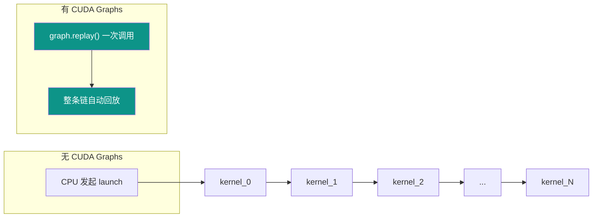
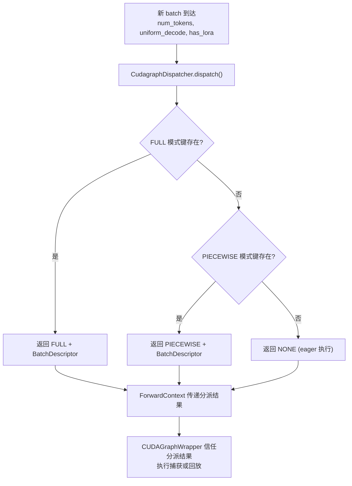
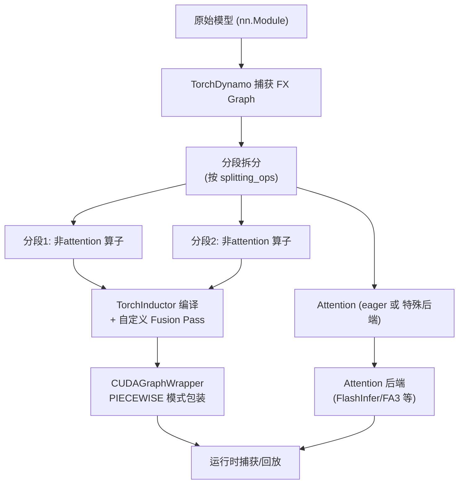

# vLLM 推理引擎 CUDA Graphs 与编译优化：用编译换速度，用融合换吞吐

> **系列**: vLLM 技术博客系列 | **类型**: 性能优化篇
>
> 当每个 decode step 要启动上千个 CUDA kernel 时，驱动层的开销本身就成了瓶颈——CUDA Graphs 把整条执行链"录音"下来一遍回放，这才是推理引擎真正的"加速挡"。

---

## 引言

想象你是一位交响乐指挥。每拍一下指挥棒，乐手才开始演奏自己的乐段。一场演出下来，你挥了上千次棒——即使乐手已经烂熟于心，也得等你那一拍。CUDA Graphs 的思路就像给整支乐团发一张总谱，然后你只需要说一句"开始"，所有人同步演奏，中间不再需要你一下下指挥了。

LLM 推理的 decode 阶段正是这样一个场景：每一步都是相同的计算图结构，只是输入数据变了。此时，上千次 kernel launch 的驱动层开销（每次约 5-10 微秒）可以占到总延迟的 10%-30%。vLLM 通过 CUDA Graphs 捕获与回放、torch.compile 编译管线、以及一系列自定义融合算子，把这上万次"挥棒"压缩成一次"按下播放键"，让 GPU 真正全速运转。

本文将带你深入 vLLM 的 CUDA Graphs 机制与编译优化体系，从"为什么需要"到"怎么做到"，再到"有哪些取舍"。

---

### 1 痛点：Kernel Launch Overhead——推理中的"隐形杀手"

LLM 推理的 decode 阶段有一个鲜明的特征：**计算量小，但算子极多**。一个 Transformer 层包含 RMSNorm、QKV 投影、Rotary Embedding、Attention、MLP（SiLU + Gate + 投影）、残差连接等十几个小算子，一个 32 层的模型就有数百个 kernel launch。

##### 1.1 开销从哪来

```
CPU 侧 (驱动层)                     GPU 侧
┌──────────────────┐               ┌──────────────────┐
│  kernel_launch()  │─── 5-10us ──▶│  kernel_0 执行    │
│  kernel_launch()  │─── 5-10us ──▶│  kernel_1 执行    │
│  kernel_launch()  │─── 5-10us ──▶│  kernel_2 执行    │
│       ...         │               │       ...         │
│  kernel_launch()  │─── 5-10us ──▶│  kernel_N 执行    │
└──────────────────┘               └──────────────────┘
         ▲
         │  每次 launch 都要穿越用户态→内核态
         │  GPU 在两次 launch 之间可能空转
```

对于一个 decode step（num_tokens=1，即每步只处理 1 个 token），GPU 计算时间可能只有 1-2ms，但 kernel launch 开销累加就可能达到 0.5-1ms。**GPU 越快，这个"指挥开销"占比越高**。

##### 1.2 为什么 Prefill 不那么痛

Prefill 阶段处理的 token 数多，计算量大（compute-bound），kernel launch 开销在总延迟中占比很小。但 decode 阶段是 memory-bound，每个 kernel 本身跑得快，launch 开销就成了大头。

| 阶段 | 计算特征                | 每步 kernel 数 | Launch 开销占比 |
|------|---------------------|---------------|----------------|
| Prefill | Compute-bound（计算密集） | 数百 | < 2% |
| Decode | Memory-bound（内存密集）  | 数百 | 10%-30% |

> 💡 **性能提示**: Kernel Launch 开销 | Decode 阶段占比 10%-30% | CUDA Graphs 后降至 < 1% | 延迟降低 15%-25%

---

### 2 CUDA Graphs：把"指挥"录下来一遍回放

CUDA Graphs 是 NVIDIA CUDA 10 引入的特性，核心思想是：**把一系列 CUDA 操作（kernel launch、内存拷贝等）捕获成一张图，之后每次只需要"回放"这张图，不再需要 CPU 逐个发起 launch**。

##### 2.1 基本原理



CUDA Graphs 的工作分为两步：

1. **捕获（Capture）**：在 warmup 阶段，用 `torch.cuda.graph()` 上下文把整个模型前向过程录制下来，生成一张 CUDA Graph
2. **回放（Replay）**：在实际推理时，只需调用 `graph.replay()`，CUDA 驱动自动按图执行，CPU 侧只需一次调用

##### 2.2 为什么 Decode 最适合

CUDA Graphs 有一个前提：**捕获后的计算图结构不能变**。好消息是，decode 阶段的每一步计算图结构完全相同——相同的层、相同的算子、相同的执行顺序，只有输入数据（token embedding）和 KV cache 指针不同。这恰好是 CUDA Graphs 的最佳应用场景。

而 prefill 阶段，token 数量变化导致很多算子的形状（shape）改变，无法用同一张图捕获。这就是 vLLM 引入"分段"（piecewise）CUDA Graphs 的原因——把不兼容的部分（如 attention）留在外面，其余部分捕获。

---

### 3 vLLM 的 CUDA Graphs 架构：从"一刀切"到"灵活分派"

vLLM V1 的 CUDA Graphs 实现经历了从"编译与图捕获紧耦合"到"正交解耦、灵活分派"的架构演进。当前设计引入了 `CudagraphDispatcher` 作为中央控制器，将 CUDA Graphs 逻辑与编译逻辑分离。

##### 3.1 五种 CUDA Graph 模式

vLLM 定义了五种 `CUDAGraphMode`，对应不同的性能/兼容性权衡：

| 模式 | Decode 阶段 | Prefill/Mixed 阶段 | 适用场景 |
|------|------------|-------------------|---------|
| `NONE` | 无 CUDA Graphs | 无 CUDA Graphs | 调试 |
| `PIECEWISE` | 分段 CUDA Graphs | 分段 CUDA Graphs | 兼容性优先 |
| `FULL` | 全图 CUDA Graphs | 全图 CUDA Graphs | 小模型/短 prompt |
| `FULL_DECODE_ONLY` | 全图 CUDA Graphs | 无 CUDA Graphs | P/D 分离的 Decode 实例 |
| `FULL_AND_PIECEWISE` | 全图 CUDA Graphs | 分段 CUDA Graphs | **默认模式，性能最优** |

```python
# vllm/config/compilation.py
class CUDAGraphMode(enum.Enum):
    NONE = 0                    # 关闭，调试用
    PIECEWISE = 1               # 分段，最灵活
    FULL = 2                    # 全图，仅一种模式
    FULL_DECODE_ONLY = (2, 0)   # Decode=全图, Prefill=关闭
    FULL_AND_PIECEWISE = (2, 1) # Decode=全图, Prefill=分段 (默认)
```

关键洞察：`FULL_DECODE_ONLY` 和 `FULL_AND_PIECEWISE` 是**双模式**配置，运行时根据 batch 特征动态分派到不同的 CUDA Graph 策略。

##### 3.2 核心架构：三分件协作

```
┌──────────────────────────────────────────────────────────────────┐
│                      GPUModelRunner                              │
│                                                                  │
│  ┌──────────────────────┐    ┌───────────────────────────────┐  │
│  │  CudagraphDispatcher │    │      CUDAGraphWrapper          │  │
│  │  (中央控制器)         │    │  ┌─────────┐  ┌───────────┐  │  │
│  │                      │    │  │FULL模式  │  │PIECEWISE  │  │  │
│  │  - 维护两套分派键     │    │  │ 外层包装  │  │ 内层包装   │  │  │
│  │  - 运行时选择模式     │──▶│  │ (整个模型)│  │ (每个分段) │  │  │
│  │  - BatchDescriptor   │    │  └─────────┘  └───────────┘  │  │
│  │    作为分派键         │    └───────────────────────────────┘  │
│  └──────────────────────┘                                       │
│                                                                  │
│  ┌──────────────────────────────────────────────────────────┐   │
│  │               BatchDescriptor (分派键)                    │   │
│  │  num_tokens | num_reqs | uniform | has_lora | num_active_loras │   │
│  └──────────────────────────────────────────────────────────┘   │
└──────────────────────────────────────────────────────────────────┘
```

三大核心组件各司其职：

- **CudagraphDispatcher**：唯一真相源（single source of truth），维护 FULL 和 PIECEWISE 两套分派键集合，运行时根据 batch 特征决定走哪条路径
- **CUDAGraphWrapper**：包装可执行对象，负责 CUDA Graph 的捕获与回放，FULL 模式包装整个模型，PIECEWISE 模式包装每个编译分段
- **BatchDescriptor**：唯一标识一个 padded batch，作为分派键，包含 `num_tokens`、`num_reqs`、`uniform`、`has_lora`、`num_active_loras` 等最少必要字段

##### 3.3 分派流程：运行时的"交通警察"



分派优先级为 **FULL > PIECEWISE > NONE**。如果 batch 是 uniform decode 且 FULL 键存在，就回放全图；如果是 mixed batch 或 cascade attention，就退到 PIECEWISE 或 eager。

```python
# vllm/v1/cudagraph_dispatcher.py — dispatch 核心逻辑
def dispatch(self, num_tokens, uniform_decode=False, has_lora=False, ...):
    # 1. 优先查找 FULL 模式
    if CUDAGraphMode.FULL in allowed_modes:
        if batch_desc in self.cudagraph_keys[CUDAGraphMode.FULL]:
            return CUDAGraphMode.FULL, batch_desc

    # 2. 其次查找 PIECEWISE 模式
    if CUDAGraphMode.PIECEWISE in allowed_modes:
        relaxed_desc = replace(batch_desc, num_reqs=None, uniform=False)
        if relaxed_desc in self.cudagraph_keys[CUDAGraphMode.PIECEWISE]:
            return CUDAGraphMode.PIECEWISE, relaxed_desc

    # 3. 兜底：eager 执行
    return CUDAGraphMode.NONE, BatchDescriptor(num_tokens)
```

##### 3.4 嵌套包装：FULL 与 PIECEWISE 共存

vLLM 使用**嵌套包装**设计实现双模式共存：一个 FULL 模式的 CUDAGraphWrapper 包装整个模型，而每个 piecewise 编译分段内部又有自己的 PIECEWISE 模式 CUDAGraphWrapper。

```
┌─────────────────────────────────────────────────────────┐
│  CUDAGraphWrapper (FULL 模式) — 包装整个模型              │
│  ┌─────────────────────────────────────────────────────┐│
│  │              编译后的模型 (单个 piecewise FX Graph)    ││
│  │  ┌───────────────────┐  ┌─────────────────────────┐││
│  │  │ CUDAGraphWrapper  │  │ CUDAGraphWrapper        │││
│  │  │ (PIECEWISE 模式)   │  │ (PIECEWISE 模式)        │││
│  │  │ 分段0: 非attention  │  │ 分段1: 非attention       │││
│  │  └───────────────────┘  └─────────────────────────┘││
│  │        ↕ attention (eager) ↕                        ││
│  └─────────────────────────────────────────────────────┘│
└─────────────────────────────────────────────────────────┘

运行时行为:
- FULL 模式激活 → 外层捕获/回放，内层 PIECEWISE 不激活
- PIECEWISE 模式激活 → 外层透传，内层分段捕获/回放
- NONE 模式 → 两层都透传，走 eager 执行
```

这种设计的精妙之处在于：三种模式之间互不冲突，CUDAGraphWrapper 只需要检查 `forward_context` 中的运行时模式是否匹配自身——匹配则捕获/回放，不匹配则直接调用底层可执行对象。

---

### 4 捕获与 Warmup：用"预演"换"零延迟"

##### 4.1 捕获过程

CUDA Graph 捕获发生在 GPUModelRunner 首次调用模型前向时（`_dummy_run`）。vLLM 为不同的 num_tokens（即每步的 token 总数，源码中变量名为 `batch_size`，但实际含义是 token 数而非请求数）预先捕获多张 CUDA Graph，并通过 padding 机制减少需要捕获的图数量：

```python
# vllm/compilation/cuda_graph.py — CUDAGraphWrapper 核心逻辑
def __call__(self, *args, **kwargs):
    forward_context = get_forward_context()
    cudagraph_runtime_mode = forward_context.cudagraph_runtime_mode
    batch_descriptor = forward_context.batch_descriptor

    # 模式不匹配 → 透传给底层可执行对象
    if (cudagraph_runtime_mode == CUDAGraphMode.NONE
        or cudagraph_runtime_mode != self.runtime_mode):
        return self.runnable(*args, **kwargs)

    entry = self.concrete_cudagraph_entries.get(batch_descriptor)
    if entry is None or entry.cudagraph is None:
        # 首次遇到此 BatchDescriptor → 捕获新 CUDA Graph
        cudagraph = torch.cuda.CUDAGraph()
        with torch.cuda.graph(cudagraph, pool=self.graph_pool, ...):
            output = self.runnable(*args, **kwargs)
        entry.cudagraph = cudagraph
        return output
    else:
        # 已有 CUDA Graph → 直接回放
        entry.cudagraph.replay()
        return entry.output
```

##### 4.2 Padding 策略：用空间换图数

实际推理中每步的 num_tokens 不断变化（1, 3, 5, 7, ...），不可能为每个 num_tokens 都捕获一张图。vLLM 采用 **padding 策略**：将实际 num_tokens 向上对齐到最近的 `cudagraph_capture_sizes` 中的值。

```
cudagraph_capture_sizes = [1, 2, 4, 8, 16, 24, 32, 40, 48, 56, 64, ...]
# 实际生成规则: [1,2,4] + range(8,256,8) + range(256, max+1, 16)

实际 num_tokens=5 → pad 到 8 → 使用 num_tokens=8 的 CUDA Graph
实际 num_tokens=12 → pad 到 16 → 使用 num_tokens=16 的 CUDA Graph
```

Padding 带来少量计算浪费（多算了几个 padding token），但大幅减少了需要捕获和存储的图数量。

##### 4.3 Warmup 的关键细节

捕获前需要做 warmup，让 PyTorch 完成内存分配和初始化。vLLM 的 warmup 由 GPUModelRunner 控制，通过分配 `NONE` 运行时模式来执行 eager 前向：

> **注意**：warmup 时必须确保 attention 后端也执行，否则捕获时 attention kernel 的初始化状态不正确，会导致 CUDA Graph 回放失败。

---

### 5 编译管线：torch.compile 与分段编译

CUDA Graphs 的分段捕获（PIECEWISE 模式）依赖于 vLLM 的分段编译（piecewise compilation）——先通过 `torch.compile` (TorchDynamo + TorchInductor) 编译模型，在编译过程中将计算图按"分段点"（splitting ops）拆分，每个分段独立编译和捕获 CUDA Graph。

##### 5.1 编译管线总览



##### 5.2 vLLM 的 Inductor 适配器

vLLM 实现了两种 Inductor 编译适配器：

| 适配器 | PyTorch 版本 | 特点 |
|--------|-------------|------|
| `InductorAdaptor` | 2.5-2.7 | 通过 monkey-patch 劫持编译流程，支持缓存 |
| `InductorStandaloneAdaptor` | 2.8+ | 使用 `standalone_compile` API，更稳定，支持二进制缓存 |

关键挑战是 **Inductor 缓存**：vLLM 需要在 Dynamo 字节码编译上下文之外进行多次不同 shape 的编译，而 Inductor 默认依赖 Dynamo 提供的 ShapeEnv。vLLM 通过 `AlwaysHitShapeEnv`（一个总是返回"命中"的假 ShapeEnv）绕过了这个限制：

```python
# vllm/compilation/compiler_interface.py
class AlwaysHitShapeEnv:
    """让 Inductor 缓存查找总是命中，
    从而支持在 Dynamo 上下文之外编译不同 shape"""
    def evaluate_guards_expression(self, *args, **kwargs):
        return True
    def get_pruned_guards(self, *args, **kwargs):
        return []
```

##### 5.3 自定义编译 Pass

vLLM 在 Inductor 编译管线中插入了大量自定义 Pass，分为三类：

| Pass 类型 | 示例 | 作用 |
|-----------|------|------|
| IR 层 Pass | `CloneEliminationPass`, `InplaceFunctionalization` | 在 IR 层面消除冗余、处理原地操作 |
| Fusion Pass | `QKNormRoPEFusionPass`, `RopeKVCacheFusionPass`, `RMSNormQuantFusionPass` | 将多个小算子融合为一个自定义 CUDA kernel |
| Utility Pass | `NoOpEliminationPass`, `FixFunctionalizationPass` | 清理无用算子、修复函数化 |

这些 Pass 由 `PostGradPassManager` 统一管理，按序执行，且支持按 `compile_range` 过滤——某些 fusion pass 只对小 batch（decode 场景）有效，大 batch 时自动跳过。

---

### 6 算子融合：把"串行小步"合并成"并行大步"

算子融合（Kernel Fusion）是编译优化的另一个利器。它把多个小 kernel 合并成一个，减少 kernel launch 次数的同时，还能消除中间结果的显存读写。

##### 6.1 融合模式全景

```
┌─────────────────────────────────────────────────────────────────┐
│                    vLLM 算子融合全景                               │
├─────────────────┬───────────────────────────────────────────────┤
│  QKV + Norm     │  fused_qk_norm_rope:                         │
│  + RoPE 融合    │  Q split → RMSNorm → RoPE    ─┐              │
│                 │  K split → RMSNorm → RoPE    ──┤→ 单个 kernel │
│                 │  V split                      ─┘              │
├─────────────────┼───────────────────────────────────────────────┤
│  RoPE + KV      │  fused_rope_and_unified_kv_cache_update:     │
│  Cache 融合     │  RoPE(Q,K) + 写入 KV Cache  → 单个 kernel   │
├─────────────────┼───────────────────────────────────────────────┤
│  RMSNorm +      │  rms_norm + static_scaled_fp8_quant:         │
│  量化融合        │  归一化 → FP8量化  → 单个 kernel             │
├─────────────────┼───────────────────────────────────────────────┤
│  AllReduce +    │  AllReduce + RMSNorm + 量化:                 │
│  RMSNorm 融合   │  通信 → 归一化 → 量化  → 流水线重叠          │
├─────────────────┼───────────────────────────────────────────────┤
│  Activation     │  SiluAndMul / SwiGLU 量化融合:               │
│  融合           │  激活函数 + 逐元素运算 → 单个 kernel          │
└─────────────────┴───────────────────────────────────────────────┘
```

##### 6.2 QK Norm + RoPE 融合

这是一个经典的高收益融合。在许多模型（如 Llama 3.1、DeepSeek）中，Q 和 K 在进入 attention 前需要经历：split → reshape → RMSNorm → reshape → RoPE，共 5 个小操作。vLLM 将其融合为 `fused_qk_norm_rope` 单个 CUDA kernel：

```python
# vllm/compilation/passes/fusion/qk_norm_rope_fusion.py
# 融合前 (5 个 kernel launch):
q, k, v = qkv.split([qsz, kvsz, kvsz], -1)       # 1. split
qh = reshape(q, [-1, num_heads, head_dim])          # 2. reshape
qn = rms_norm(qh, q_weight, eps)                    # 3. RMSNorm
qf = reshape(qn, [-1, num_heads * head_dim])        # 4. reshape
qf, kf = rotary_embedding(positions, qf, kf, ...)   # 5. RoPE

# 融合后 (1 个 kernel launch):
result = fused_qk_norm_rope(qkv, num_heads, num_kv_heads,
                            head_dim, eps, q_weight, k_weight,
                            cos_sin_cache, is_neox, positions)
q, k, v = result.split([qsz, kvsz, kvsz], -1)
```

这个融合通过 Inductor 的 PatternMatcher 实现：注册 pattern-replacement 对，编译时自动匹配并替换。

##### 6.3 RoPE + KV Cache Update 融合

decode 阶段，RoPE 计算 K 的旋转位置编码后，紧接着就是将 K 写入 KV Cache。这两个操作共享 K 的数据，融合后可以避免 K 的中间结果回写显存：

```python
# vllm/compilation/passes/fusion/rope_kvcache_fusion.py
# 融合前: RoPE(K) → 写回 K → 读取 K → 写入 KV Cache
# 融合后: fused_rope_and_unified_kv_cache_update(Q, K, V, ...)
#         计算 RoPE 的同时直接写入 KV Cache，K 无需中间回写
```

这个融合还支持与 FP8 量化进一步组合（`RopeStaticQQuantKVCachePattern`），将 RoPE + Q 量化 + KV Cache 写入三者合一。

> 💡 **性能提示**: RoPE+KV Cache 融合 | 原来需要 3 次 kernel launch + 2 次 K 显存读写 | 融合后 1 次 launch + 0 次中间读写 | decode 延迟降低约 5%-8%

##### 6.4 RMSNorm + 量化融合

FP8 量化推理中，RMSNorm 后紧接 FP8 量化是常见模式。vLLM 将两者融合为 `RMSNormQuantFusionPass`，避免归一化结果写回 FP16/BF16 再读出来量化为 FP8：

```
融合前: RMSNorm(BF16) → 写出 BF16 → 读取 → 量化为 FP8
融合后: RMSNorm(BF16) → 直接量化为 FP8 (零中间显存写入)
```

##### 6.5 AllReduce + RMSNorm 融合

在张量并行（TP）场景中，每个 Transformer 层的 MLP 输出需要 AllReduce 通信，然后紧接着 RMSNorm。vLLM 的 `AllReduceFusionPass` 将通信与归一化流水线化：

```
融合前: AllReduce(等待所有 rank) → RMSNorm → 量化
融合后: AllReduce + PDL Advance(提前启动 RMSNorm) → 量化
        利用 NVIDIA PDL (Programmatic Dependent Launch) 技术，
        RMSNorm 不等 AllReduce 完成就开始处理已到达的数据
```

---

### 7 Attention 后端的 CUDA Graphs 兼容性

不是所有 attention 后端都支持 CUDA Graphs。vLLM 定义了 `AttentionCGSupport` 枚举来标识各后端的兼容级别：

```python
# vllm/v1/attention/backend.py
class AttentionCGSupport(enum.Enum):
    ALWAYS = 3              # 全场景支持 (如 FlashAttention v3)
    UNIFORM_BATCH = 2       # 仅均匀 batch 支持 (如 FlashInfer)
    UNIFORM_SINGLE_TOKEN_DECODE = 1  # 仅单 token decode 支持
    NEVER = 0               # 不支持
```

| Attention 后端 | 兼容级别 | 备注 |
|---------------|---------|------|
| FlashAttention v2 | `UNIFORM_BATCH` | FA2 的 packed-GQA 处理不支持 mixed prefill-decode |
| FlashAttention v3 | `ALWAYS` | 统一内核，FULL 模式最佳 |
| Triton Attention | `ALWAYS` | 偏好 FULL_AND_PIECEWISE（prefill/decode 用不同内核） |
| FlashInfer | `UNIFORM_SINGLE_TOKEN_DECODE` | Blackwell+TRTLLM 可升级为 UNIFORM_BATCH |
| FlashMLA | `UNIFORM_BATCH` | MLA 专用 |
| Mamba | `UNIFORM_BATCH` | SSM 混合模型需要取最小兼容级别 |

当模型使用混合 attention 后端（如 Mamba + 标准 Attention）时，vLLM 取**所有后端的最小兼容级别**，并自动降级 CUDA Graph 模式。例如，如果最小级别是 `UNIFORM_BATCH`，`FULL` 模式会被降级为 `FULL_AND_PIECEWISE`。

---

### 8 自定义 CUDA 内核：csrc/ 下的硬核优化

vLLM 的 `csrc/` 目录下包含了大量自定义 CUDA 内核，是性能优化的最后一道防线。

##### 8.1 核心 CUDA 内核一览

| 内核 | 路径 | 用途 |
|------|------|------|
| PagedAttention | `csrc/attention/` | 分页 KV Cache 的 attention 计算 |
| Activation Kernels | `csrc/activation_kernels.cu` | SiLU、GELU 等激活函数融合 |
| Quantization Kernels | `csrc/quantization/` | FP8/INT8 量化/反量化 |
| Custom All-Reduce | `csrc/custom_all_reduce.cu` | 低延迟张量并行通信 |
| Fused MoE | `csrc/moe/` | 混合专家模型的融合门控+分发+计算 |
| MLA Kernels | `csrc/attention/mla/` | Multi-head Latent Attention 专用内核 |

##### 8.2 PagedAttention 内核

PagedAttention 是 vLLM 的基石创新——它让 KV Cache 不再需要连续显存，而是通过页表映射到物理块。自定义 CUDA 内核在 attention 计算时直接通过 `block_table` 索引 KV Cache，避免了一次额外的 gather 操作：

```cuda
// csrc/attention/attention_generic.cuh (简化)
// 每个 thread block 处理一个 query head 的一个 block
__global__ void paged_attention_kernel(
    /* query */, /* key_cache */, /* value_cache */,
    /* block_table */,  // 页表：逻辑块 → 物理块
    /* seq_lens */,     // 每个请求的实际长度
    /* max_num_blocks_per_seq */,
    /* ... */) {
    // 通过 block_table 间接索引 KV Cache
    const int64_t physical_block = block_table[seq_idx * ... + logical_block];
    // 从 physical_block 读取 K/V
}
```

---

### 9 权衡：Warmup 代价 vs. 运行时收益

CUDA Graphs 和编译优化并非免费的午餐。理解这些权衡，才能做出正确的配置选择。

##### 9.1 启动开销

| 开销项 | 典型值 | 说明 |
|--------|--------|------|
| torch.compile 编译 | 30s - 5min | 首次启动，可缓存到磁盘 |
| CUDA Graph 捕获 | 每个 num_tokens 约 0.5-2s | 数量 = capture_sizes 数 x 层数 (piecewise) |
| 显存占用 | 每张图约 10-100MB | 取决于模型大小和 num_tokens |

`FULL_AND_PIECEWISE` 模式虽然性能最优，但需要捕获最多的 CUDA Graph（FULL 模式的图 + PIECEWISE 模式下每个分段每个 num_tokens 的图），启动最慢、显存占用最大。

##### 9.2 配置选择指南

| 场景 | 推荐模式 | 理由 |
|------|---------|------|
| 生产服务、低延迟优先 | `FULL_AND_PIECEWISE` | 默认模式，decode 和 prefill 都有最优加速 |
| P/D 分离架构的 Decode 实例 | `FULL_DECODE_ONLY` | 节省 prefill 图的显存，decode 仍然全速 |
| 显存紧张 / 大模型 | `FULL_DECODE_ONLY` 或 `PIECEWISE` | 减少图数量，降低显存压力 |
| 调试 | `NONE` | 可读性好，无需等待编译和捕获 |
| 兼容性优先 | `PIECEWISE` | attention 后端无需支持 CUDA Graphs |

使用示例：

```bash
# 生产环境默认
vllm serve --model meta-llama/Llama-3.1-8B-Instruct \
    --compilation-config '{"cudagraph_mode": "FULL_AND_PIECEWISE"}'

# P/D 分离的 Decode 实例
vllm serve --model meta-llama/Llama-3.1-8B-Instruct \
    --compilation-config '{"cudagraph_mode": "FULL_DECODE_ONLY"}'

# 调试模式
vllm serve --model meta-llama/Llama-3.1-8B-Instruct \
    --compilation-config '{"cudagraph_mode": "NONE"}'
```

---

### 10 总结

| 优化技术 | 核心思想 | 适用阶段 | 收益 |
|----------|---------|---------|------|
| CUDA Graphs (FULL) | 整个模型前向捕获为一张图 | Uniform Decode | kernel launch 开销降至 ~0 |
| CUDA Graphs (PIECEWISE) | 分段捕获，attention 保持 eager | Mixed Batch | 兼容性好，仍大幅减少 launch |
| torch.compile | Dynamo+Inductor 编译优化 | 全阶段 | 算子融合、内存优化 |
| QK Norm + RoPE 融合 | 5 个小算子 → 1 个 kernel | Decode | 减少 4 次 launch + 中间显存 |
| RoPE + KV Cache 融合 | 计算与写入合并 | Decode | 消除 K 中间回写 |
| RMSNorm + 量化融合 | 归一化直接出量化结果 | FP8 推理 | 消除 BF16 中间结果 |
| AllReduce + RMSNorm 融合 | 通信与计算流水线化 | TP Decode | 隐藏通信延迟 |

> **一行建议**：生产环境直接用默认的 `FULL_AND_PIECEWISE` 模式——启动多等几秒，但 decode 延延降低 15%-25%，这笔账怎么算都划算。

---

### 延伸阅读

- [vLLM CUDA Graphs 设计文档](https://github.com/vllm-project/vllm/blob/main/docs/design/cuda_graphs.md) — 官方设计文档，包含完整的架构图和 API 说明
- [PR #20059: Flexible CUDA Graphs](https://github.com/vllm-project/vllm/pull/20059) — 双模式分派的核心实现 PR
- [torch.compile 文档](https://pytorch.org/docs/stable/torch.compiler.html) — PyTorch 官方编译文档
- [NVIDIA CUDA Graphs 文档](https://docs.nvidia.com/cuda/cuda-c-programming-guide/index.html#cuda-graphs) — CUDA Graphs 原理与 API

---

*本文属于 [vLLM 技术博客系列](./series-index.md)，欢迎持续关注。*
