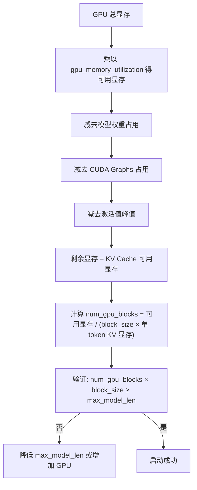
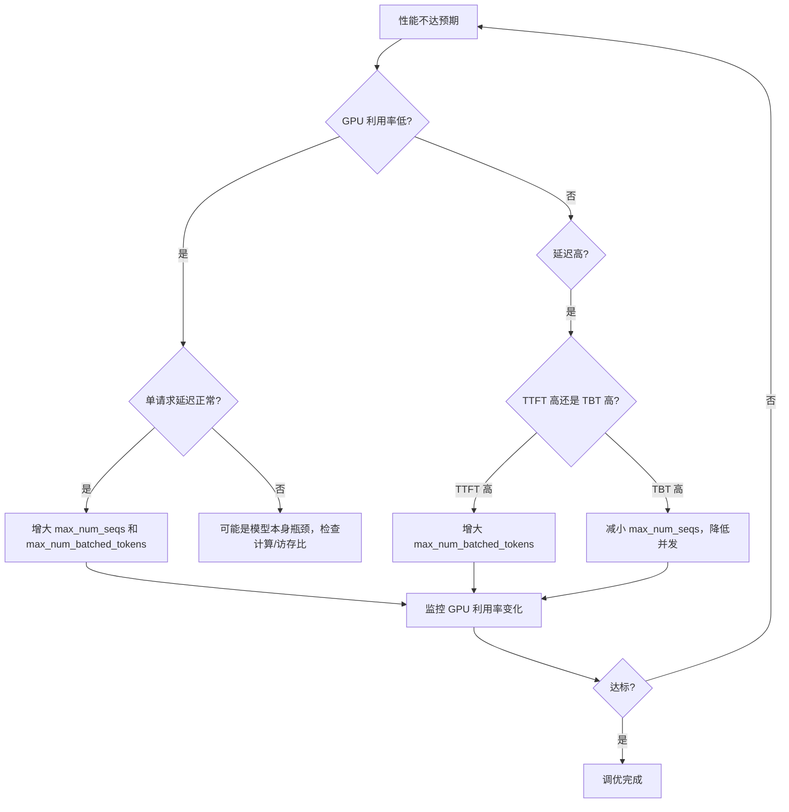
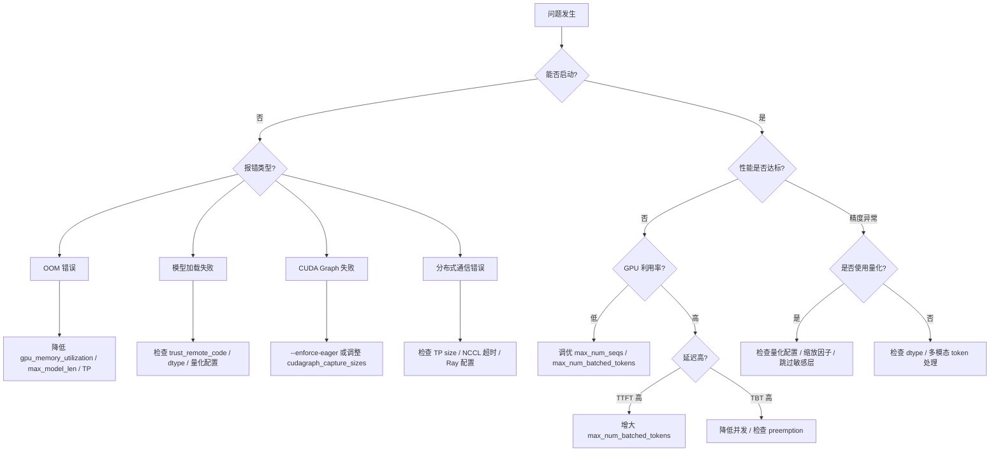

# vLLM暗礁与灯塔：vLLM 运行踩坑实录，那些文档没告诉你的事

> **系列**: vLLM 技术博客系列 | **类型**: 踩坑避坑篇
>
> 部署 vLLM 就像驾驶一艘巨轮穿越暗礁密布的海峡——海图上标注的航道很清晰，但真正让船搁浅的，往往是那些藏在水面下的礁石。

---

### 引言：航行中的暗礁

想象你是一名远洋船长，手握一张标注了主航道的海图，满怀信心地驶向目的地。海图上清清楚楚地画着从 A 到 B 的最优路径，就像 vLLM 官方文档告诉你的：`vllm serve meta-llama/Llama-3.1-8B-Instruct`，一行命令，模型跑起来。然而，真正让你心惊肉跳的从来不是主航道上的风浪，而是那些海图上没有标注的暗礁——GPU 显存突然告罄、模型加载莫名报错、KV Cache 容量估算偏差导致吞吐断崖式下跌……

我们团队在部署 vLLM 的过程中，踩过形形色色的坑。有些坑源于参数默认值与生产环境的错配，有些坑来自配置之间的隐式依赖，还有些坑则是因为量化、多模态等高级功能本身的复杂性。这些经验，文档里往往一笔带过，甚至只字未提。

今天这篇文章，就是我们在 vLLM 部署航行中绘制的"暗礁分布图"。每一个坑位，我们都按照"症状 -> 原因 -> 解法 -> 预防"的格式完整记录，希望能帮你在部署路上少走弯路。

---

### 一、GPU 显存不足：最常见也最让人头疼的暗礁

GPU 显存 OOM 是 vLLM 部署中排名第一的坑。它可能发生在模型加载阶段，也可能在推理运行时突然跳出来。理解显存是怎么被吃掉的，是绕开这块暗礁的关键。

#### 1.1 症状：各种各样的 OOM

最典型的错误信息长这样：

```
torch.cuda.OutOfMemoryError: CUDA out of memory.
Tried to allocate XXX MiB. GPU 0 has a total capacity of XXX GiB
of which XXX MiB is free.
```

vLLM 在源码中对模型加载阶段的 OOM 做了专门的捕获和提示（见 `vllm/v1/worker/gpu_model_runner.py`）：

```
Failed to load model - not enough GPU memory.
Try lowering --gpu-memory-utilization to free memory for weights,
increasing --tensor-parallel-size, or using --quantization.
```

##### 运行时 OOM vs 加载时 OOM

加载时 OOM 发生在模型权重加载到 GPU 的过程中，通常是因为模型本身的参数量就超过了单卡显存。运行时 OOM 则更隐蔽：模型加载成功了，但在实际推理时，KV Cache 和激活值占用的显存超出了预期。

#### 1.2 原因：显存被谁吃掉了？

GPU 显存主要由以下几部分瓜分：

| 显存消费者 | 占比 | 说明 |
|:---|:---|:---|
| 模型权重 | 40-60% | 取决于参数量和数据类型 |
| KV Cache | 20-40% | 由 `gpu_memory_utilization` 和 `max_model_len` 决定 |
| CUDA Graphs | 5-15% | 默认会捕获多种 batch size 的图 |
| 激活值/临时张量 | 5-10% | forward pass 中的中间计算结果 |
| 框架开销 | 2-5% | PyTorch CUDA 上下文等 |

vLLM 默认的 `gpu_memory_utilization` 是 **0.92**（源码 `CacheConfig` 中定义），这意味着它会尝试使用 92% 的 GPU 显存。但这个值是"单实例限制"——如果你在同一张 GPU 上跑两个 vLLM 实例，每个实例都会尝试占满 92%，结果必然 OOM。

#### 1.3 解法：精准控显存

**第一步：估算模型权重显存需求**

一个简单的估算公式：

```
模型权重显存(GB) ≈ 参数量(B) × 每参数字节数
- FP32: 4 字节/参数
- FP16/BF16: 2 字节/参数
- FP8: 1 字节/参数
- INT4: 0.5 字节/参数
```

例如，Llama-3.1-70B 在 BF16 下约需 140GB，两张 A100-80G 才能放下（需 `tensor_parallel_size=2`）。

**第二步：调整 `gpu_memory_utilization`**

```bash
# 降低 GPU 显存使用比例，给操作系统和其他进程留余量
vllm serve meta-llama/Llama-3.1-8B-Instruct \
    --gpu-memory-utilization 0.85
```

> ⚠️ **踩坑警告**: 同一张 GPU 上运行多个 vLLM 实例时，必须确保每个实例的 `gpu_memory_utilization` 之和不超过 1.0。例如两个实例，各设 0.45。

**第三步：减小 `max_model_len` 限制上下文长度**

```bash
# 限制最大上下文长度，减少 KV Cache 占用
vllm serve meta-llama/Llama-3.1-8B-Instruct \
    --max-model-len 4096
```

vLLM 源码中 `max_model_len` 支持人类可读格式（如 `1k` = 1000，`1K` = 1024），非常方便。

**第四步：减少 CUDA Graphs 的显存占用**

```bash
# 方案一：完全禁用 CUDA Graphs（调试用，会降低性能）
vllm serve meta-llama/Llama-3.1-8B-Instruct --enforce-eager

# 方案二：只捕获少量 batch size 的图
vllm serve meta-llama/Llama-3.1-8B-Instruct \
    --compilation-config '{"cudagraph_capture_sizes": [1, 2, 4, 8]}'
```

#### 1.4 预防

- 部署前用公式估算显存需求，确保"模型权重 + KV Cache + CUDA Graphs"在可用显存范围内
- 生产环境建议 `gpu_memory_utilization` 设为 0.85-0.90，留出安全余量
- 使用 `kv_cache_memory_bytes` 参数精确控制 KV Cache 大小（源码中该参数会覆盖 `gpu_memory_utilization`）

---

### 二、模型加载失败：信任危机与数据类型迷途

模型加载失败是第二大坑。它的表现形式多样，但根因往往集中在 `trust_remote_code` 和 `dtype` 两个参数上。

#### 2.1 坑位总览

| 坑位 | 症状 | 原因 | 解法 |
|:---|:---|:---|:---|
| trust_remote_code 缺失 | `ValueError: ... requires trust_remote_code=True` | 自定义模型架构需要执行远程代码 | 添加 `--trust-remote-code` |
| dtype 不匹配 | 精度异常或 OOM | `auto` 推断的 dtype 与预期不符 | 显式指定 `--dtype bfloat16` |
| 量化配置冲突 | `ValueError: quantization config conflict` | checkpoint 中的量化配置与命令行参数矛盾 | 统一量化方式或清理配置 |
| config_format 不兼容 | `KeyError` 或配置解析失败 | 模型使用了非标准配置格式 | 指定 `--config-format` |

#### 2.2 trust_remote_code：不得不开的"后门"

许多国产模型（如 Qwen、ChatGLM 系列）和社区微调模型使用了自定义的模型架构代码。vLLM 默认 `trust_remote_code=False`，出于安全考虑拒绝执行来自 HuggingFace 的自定义代码。

```bash
# 错误：不加信任参数
vllm serve Qwen/Qwen2.5-72B-Instruct
# 报错：ValueError: The repository contains custom code...

# 正确：显式信任远程代码
vllm serve Qwen/Qwen2.5-72B-Instruct --trust-remote-code
```

> ⚠️ **踩坑警告**: `--trust-remote-code` 意味着你信任该模型仓库中的任意 Python 代码。仅对可信来源的模型启用此选项，生产环境务必确认模型来源安全。

#### 2.3 dtype 的自动推断陷阱

vLLM 的 `dtype` 默认值是 `"auto"`，其推断逻辑（见 `ModelConfig`）为：

- FP32 和 FP16 模型 -> 使用 FP16
- BF16 模型 -> 使用 BF16

这个推断看似合理，但在以下场景中会出问题：

1. **模型 config 中声明 `torch_dtype: float32`，但实际权重是 BF16**：vLLM 会选择 FP16 而非 BF16，可能导致精度损失
2. **量化模型搭配错误的 dtype**：如 AWQ 模型建议搭配 FP16，但你可能误用 BF16
3. **多卡 TP 场景下 dtype 不一致**：不同 rank 的模型加载可能出现微妙的数值差异

```bash
# 显式指定 dtype，避免自动推断的歧义
vllm serve meta-llama/Llama-3.1-8B-Instruct --dtype bfloat16
```

#### 2.4 量化配置冲突

当你使用带有内置量化配置的 checkpoint（如 GPTQ 格式的模型），同时又通过命令行指定了 `--quantization`，两者可能产生冲突：

```bash
# 错误：checkpoint 自带 GPTQ 量化，又指定了 AWQ
vllm serve TheBloke/Llama-2-7B-Chat-GPTQ --quantization awq

# 正确：要么用 checkpoint 自带的量化，要么显式指定匹配的方式
vllm serve TheBloke/Llama-2-7B-Chat-GPTQ --quantization gptq
```

#### 2.5 预防

- 始终显式指定 `--dtype`，不要依赖 `auto` 推断
- 使用量化模型时，确认 checkpoint 中的量化配置与命令行参数一致
- 对自定义架构模型提前了解是否需要 `--trust-remote-code`

---

### 三、KV Cache 容量估算偏差：算不对的"油箱"

KV Cache 的容量直接决定了系统能同时处理多少请求、支持多长的上下文。估算偏差会导致要么显存浪费，要么吞吐量远低于预期。

#### 3.1 症状

- 启动日志中 `num_gpu_blocks` 远小于预期
- 高并发时请求频繁被抢占（preemption），吞吐量断崖式下跌
- 设置了较大的 `max_model_len`，但实际能处理的并发请求数极少

#### 3.2 原因：block_size 与 num_gpu_blocks 的计算

vLLM 的 KV Cache 以 block 为单位管理。源码中 `CacheConfig` 定义的默认 `block_size` 为 **16** 个 token。整个计算流程如下：



关键公式：

```
单 token KV 显存（单层）= 2 × num_kv_heads × head_dim × dtype_bytes

单 Block 显存（单层）= block_size × 单 token KV 显存（单层）

单 Block 显存（全部层）= 单 Block 显存（单层）× num_layers

num_gpu_blocks = KV Cache 可用显存 / 单 Block 显存（全部层）

最大并发请求数 ≈ num_gpu_blocks × block_size / max_model_len
```

容易踩坑的几个点：

1. **`max_model_len` 设得太大**：如果设为模型最大支持的 128K，那即使你实际只处理 4K 长度的请求，每个请求也会按 128K 预留 KV Cache 空间（vLLM V1 默认 `scheduler_reserve_full_isl=True`，即检查完整输入序列长度）
2. **FP8 KV Cache 的显存节省被高估**：使用 `--kv-cache-dtype fp8` 确实能将 KV Cache 显存减半，但缩放因子（scale）本身也占空间，实际节省约 40-45%
3. **多模态模型的 KV Cache 估算偏差**：图像/视频 token 会占用额外的 KV Cache 空间，容易被忽略

#### 3.3 解法

```bash
# 1. 根据实际业务需求设置合理的 max_model_len
vllm serve meta-llama/Llama-3.1-8B-Instruct \
    --max-model-len 8192

# 2. 使用 FP8 KV Cache 节省显存
vllm serve meta-llama/Llama-3.1-8B-Instruct \
    --kv-cache-dtype fp8_e4m3

# 3. 精确控制 KV Cache 大小（高级用法）
vllm serve meta-llama/Llama-3.1-8B-Instruct \
    --kv-cache-memory-bytes 10G
```

> ⚠️ **踩坑警告**: `--kv-cache-memory-bytes` 会覆盖 `--gpu-memory-utilization` 的效果。如果你之前通过调低 `gpu_memory_utilization` 来解决问题，切换到 `kv-cache-memory-bytes` 后需要重新估算。

#### 3.4 预防

- 部署前用公式手动估算 `num_gpu_blocks`，与启动日志中的实际值比对
- `max_model_len` 设为业务实际需要的最大长度，而非模型理论上限
- 关注启动日志中的 `# GPU blocks: XXX` 行，确认 KV Cache 容量是否合理

---

### 四、CUDA Graph 捕获失败：编译之路上的绊脚石

CUDA Graphs 是 vLLM V1 中重要的性能优化手段，但它的捕获过程本身就是一个大坑。

#### 4.1 症状

```
RuntimeError: CUDA error: an illegal memory access was encountered
# 或
RuntimeError: CUDA graph capture is not supported for...
# 或
Capturing CUDA graphs took XX.XX seconds  # 启动时间异常长
```

#### 4.2 原因

vLLM V1 的 CUDA Graphs 支持五种模式（见 `CompilationConfig`），默认使用 `FULL_AND_PIECEWISE`：

| 模式 | 适用场景 | 显存占用 | 启动时间 |
|:---|:---|:---|:---|
| `NONE` | 调试 | 最低 | 最快 |
| `PIECEWISE` | 注意力后端不支持全图 | 中等 | 中等 |
| `FULL` | 小模型，短 prompt | 较高 | 较长 |
| `FULL_DECODE_ONLY` | P/D 分离的 Decode 实例 | 中等 | 中等 |
| `FULL_AND_PIECEWISE` | 默认，性能最优 | 最高 | 最长 |

捕获失败的常见原因：

1. **注意力后端不支持**：不是所有后端都支持全图捕获。FlashInfer 仅支持 `UNIFORM_SINGLE_TOKEN_DECODE`，FlashAttention v2 支持 `UNIFORM_BATCH`，只有 FlashAttention v3 支持 `ALWAYS`
2. **动态形状问题**：CUDA Graph 要求输入形状固定，但不同 batch size 的输入形状不同，因此需要为每种 batch size 分别捕获
3. **batch size 变化**：默认 `cudagraph_capture_sizes` 从 1 到 `max_num_seqs`，数量多导致捕获时间长、显存占用大
4. **warmup 不充分**：首次 forward pass 中的某些操作（如注意力）需要先 warmup，否则图捕获会失败

#### 4.3 解法

```bash
# 方案一：调试阶段完全禁用 CUDA Graphs
vllm serve meta-llama/Llama-3.1-8B-Instruct --enforce-eager

# 方案二：只捕获关键的 batch size（推荐）
vllm serve meta-llama/Llama-3.1-8B-Instruct \
    --compilation-config '{"cudagraph_capture_sizes": [1, 2, 4, 8, 16]}'

# 方案三：使用 FULL_DECODE_ONLY 模式（仅 decode 场景）
vllm serve meta-llama/Llama-3.1-8B-Instruct \
    --compilation-config '{"cudagraph_mode": "FULL_DECODE_ONLY"}'
```

#### 4.4 预防

- 部署前确认注意力后端的 CUDA Graphs 兼容性
- 生产环境中通过 `cudagraph_capture_sizes` 精确控制捕获的 batch size 集合
- 监控启动时间，如果 CUDA Graph 捕获超过 2 分钟，考虑减少捕获大小

---

### 五、分布式推理配置错误：多卡协同的暗礁群

当你从单卡走向多卡、从单机走向多机，新的暗礁群就会出现。

#### 5.1 坑位总览

| 坑位 | 症状 | 原因 | 解法 |
|:---|:---|:---|:---|
| TP size 与 GPU 数量不匹配 | `ValueError: World size (X) is larger than the number of available GPUs (Y)` | `tensor_parallel_size` 大于可见 GPU 数 | 设置 `CUDA_VISIBLE_DEVICES` 或调低 TP |
| NCCL 超时 | `RuntimeError: NCCL error: unhandled system error` | 多机通信初始化超时 | 增大 `--distributed-timeout-seconds` |
| Ray 未初始化 | `RuntimeError: Ray is not initialized` | 多机场景需要 Ray 但未启动 | 启动 Ray 集群或使用 `mp` 后端 |
| 端口冲突 | `EADDRINUSE` 或连接被拒绝 | 多实例默认端口重叠 | 自定义 `--master-port` |
| CUDA 初始化冲突 | `RuntimeError: Cannot re-initialize CUDA in forked subprocess` | 在 vLLM 初始化前调用了 CUDA 相关函数 | 用 `CUDA_VISIBLE_DEVICES` 控制设备 |

#### 5.2 tensor_parallel_size 的常见错误

源码 `ParallelConfig` 中的验证逻辑会检查 TP size 与 GPU 数量的关系：

```bash
# 错误：4 张 GPU 但 TP 设为 8
vllm serve meta-llama/Llama-3.1-70B-Instruct --tensor-parallel-size 8
# 报错：World size (8) is larger than the number of available GPUs (4)

# 正确：4 张 GPU 用 TP=4
CUDA_VISIBLE_DEVICES=0,1,2,3 vllm serve meta-llama/Llama-3.1-70B-Instruct \
    --tensor-parallel-size 4
```

#### 5.3 NCCL 超时

多机场景中，模型下载可能很慢，导致 NCCL 初始化超时。vLLM 默认使用 PyTorch 的 600 秒超时（NCCL），但在某些网络环境下可能不够：

```bash
# 增大分布式通信超时时间
vllm serve meta-llama/Llama-3.1-70B-Instruct \
    --tensor-parallel-size 8 \
    --distributed-timeout-seconds 1200
```

#### 5.4 数据并行的陷阱

vLLM 的数据并行（DP）主要面向 MoE 模型。源码中明确校验了这一点：

```
Non-MoE models do not support external data parallel mode.
For external load balancing, launch independent vLLM instances
without --data-parallel-* arguments.
```

对于非 MoE 的 dense 模型，不要使用 `--data-parallel-size`，而是直接启动多个独立的 vLLM 实例，通过外部负载均衡器分发请求。

#### 5.5 预防

- 单机多卡用 `mp` 后端（默认），多机用 `ray` 后端
- 多机部署时提前增大 `--distributed-timeout-seconds`
- Dense 模型不要用数据并行，直接多实例 + 外部 LB

---

### 六、量化精度丢失：省了显存，丢了质量

量化是节省显存的利器，但精度丢失是它的副作用。在 vLLM 中，量化的坑主要集中在 FP8 和 INT8 两种场景。

#### 6.1 症状

- 模型输出出现乱码或重复
- 推理结果的 BLEU/ROUGE 分数显著下降
- 特定层输出 NaN 或 Inf

#### 6.2 原因：量化方式的精度差异

vLLM 支持多种量化方式（源码 `QuantizationConfigArgs` 中定义了完整的量化规格体系）：

| 量化方式 | 精度影响 | 适用场景 | 校准要求 |
|:---|:---|:---|:---|
| FP8 per-tensor static | 中等 | 离线量化模型 | 需要校准数据集 |
| FP8 per-token dynamic | 低 | 在线量化 | 无需校准 |
| FP8 per-channel static | 较低 | 大模型推荐 | 需要校准数据集 |
| INT8 per-channel | 中等 | MoE 模型权重 | 需要校准数据集 |
| AWQ / GPTQ | 低 | 离线量化模型 | 已内置于 checkpoint |

FP8 量化中一个关键的精度杀手是**缩放因子（scale）**。源码 `CacheConfig` 中有明确的日志提示：

```
Using fp8_e4m3 data type to store kv cache. It reduces the GPU
memory footprint and boosts the performance. Meanwhile, it may
cause accuracy drop without a proper scaling factor.
```

#### 6.3 KV Cache 量化的精度陷阱

对 KV Cache 做 FP8 量化时，缩放因子至关重要：

- **静态缩放因子**：从模型 checkpoint 中加载，如果 checkpoint 没有提供则默认 1.0，精度可能很差
- **动态缩放因子**：运行时根据实际数据计算，精度更好但有少量计算开销

```bash
# FP8 KV Cache（使用动态缩放因子，精度更好）
vllm serve meta-llama/Llama-3.1-8B-Instruct \
    --kv-cache-dtype fp8_e4m3

# FP8 KV Cache（如果模型提供了缩放因子，从 checkpoint 加载）
# 注意：已弃用的 --calculate-kv-scales 选项将在 v0.19 移除
```

> ⚠️ **踩坑警告**: `--calculate-kv-scales` 选项已弃用，将在 v0.19 版本中移除。现在缩放因子会自动从模型 checkpoint 加载（如果有的话），否则默认为 1.0。

#### 6.4 预防

- 优先选择 per-token 或 per-channel 动态量化，避免 per-tensor 静态量化
- 量化部署后务必跑基准测试，对比 FP16 的精度差异
- 使用 `--kv-cache-dtype-skip-layers` 跳过对精度敏感层的 KV Cache 量化

---

### 七、Serving 性能不达预期：调了参数却调不出吞吐

很多时候，vLLM 跑起来了，但性能就是上不去。这往往不是因为引擎本身慢，而是调度参数没有调对。

#### 7.1 症状

- GPU 利用率低，始终在 30-50% 徘徊
- 单请求延迟正常，但并发吞吐量远低于预期
- 请求排队严重，首 token 时间（TTFT）偏高

#### 7.2 原因：两个关键参数的调优

vLLM 的调度器（`SchedulerConfig`）中有两个核心参数：

**`max_num_seqs`**（默认 128）：单次迭代中处理的最大序列数。这个值控制了并发请求的上限。

**`max_num_batched_tokens`**（默认 2048）：单次迭代中处理的最大 token 数。这个值控制了每次 forward pass 的计算量。

两者的关系必须满足约束：

```
max_num_batched_tokens >= max_num_seqs
max_num_batched_tokens >= max_model_len（未启用 chunked prefill 时）
```

源码 `SchedulerConfig.verify_max_model_len()` 中明确校验了这些约束，违反会直接报错。

#### 7.3 调优决策树



#### 7.4 典型配置示例

```bash
# 高吞吐场景：大 batch，长上下文
vllm serve meta-llama/Llama-3.1-8B-Instruct \
    --max-num-seqs 256 \
    --max-num-batched-tokens 8192

# 低延迟场景：小 batch，快速响应
vllm serve meta-llama/Llama-3.1-8B-Instruct \
    --max-num-seqs 32 \
    --max-num-batched-tokens 2048

# 长上下文 + chunked prefill
vllm serve meta-llama/Llama-3.1-8B-Instruct \
    --max-model-len 32768 \
    --max-num-batched-tokens 4096 \
    --enable-chunked-prefill
```

> ⚠️ **踩坑警告**: `max_num_batched_tokens` 会被纳入 CUDA Graph 的编译哈希计算中（源码 `SchedulerConfig.compute_hash()`），修改此参数可能导致需要重新编译 CUDA Graphs，启动时间变长。

#### 7.5 预防

- 先用默认参数跑基准测试，然后逐步调优
- 关注 vLLM 暴露的 Prometheus 指标（`vllm:num_requests_running`、`vllm:gpu_cache_usage_perc` 等）
- 使用 `--stream-interval` 控制流式输出的 token 缓冲粒度，默认为 1（每个 token 立即发送）

---

### 八、多模态处理异常：第三只眼的"视觉障碍"

多模态模型（如 Qwen2.5-VL、LLaVA、Gemma-3 等）在 vLLM 中的部署有其独特的坑。

#### 8.1 症状

- 图像 token 无法被正确处理，输出与图像内容无关
- Vision Tower 加载失败或 OOM
- 多模态请求导致 KV Cache 空间不足
- 启动时显存占用远超预期

#### 8.2 原因

**图像 token 的显存开销被低估**：一张高分辨率图片可能被编码为数千个 token，每个 token 都需要 KV Cache 空间。例如 Qwen2.5-VL 默认最大像素为 `1280 × 28 × 28`，单张图片可能产生上千个 token。

**Vision Tower 的显存占用**：多模态模型的视觉编码器（如 ViT）会占用额外的显存，这部分在纯文本模型中不存在。

**多模态输入的批量调度冲突**：图像 token 不能被随意分块（chunked），vLLM 源码中 `disable_chunked_mm_input` 选项就是为这个问题设计的：

```
If set to true and chunked prefill is enabled, we do not want to
partially schedule a multimodal item. Only used in V1.
This ensures that if a request has a mixed prompt... where only
some image tokens can be scheduled... it will be scheduled as
text tokens in one step and image tokens in the next.
```

#### 8.3 解法

```bash
# 1. 限制每请求的多模态输入数量，节省显存
vllm serve Qwen/Qwen2.5-VL-7B-Instruct \
    --limit-mm-per-prompt '{"image": 3, "video": 1}'

# 2. 用更精细的配置控制图像尺寸（影响内存 profiling）
vllm serve Qwen/Qwen2.5-VL-7B-Instruct \
    --limit-mm-per-prompt '{"image": {"count": 5, "width": 512, "height": 512}}'

# 3. 调整多模态处理器参数，减少图像 token 数量
vllm serve Qwen/Qwen2.5-VL-7B-Instruct \
    --mm-processor-kwargs '{"max_pixels": 768000}'

# 4. 纯文本场景下完全禁用图像输入
vllm serve google/gemma-3-27b-it \
    --limit-mm-per-prompt '{"image": 0}'

# 5. 调整多模态缓存大小（默认 4 GiB）
vllm serve Qwen/Qwen2.5-VL-7B-Instruct \
    --mm-processor-cache-gb 2
```

#### 8.4 预防

- 部署多模态模型前，估算图像/视频 token 的 KV Cache 需求
- 使用 `limit_mm_per_prompt` 的可配置格式，精确控制 profiling 用的输入尺寸
- 纯文本场景下设置 `limit_mm_per_prompt` 为 0，避免不必要的显存分配

---

### 九、踩坑排查决策树

当你遇到问题时，按以下流程快速定位坑位：



---

### 十、踩坑速查表

| 编号 | 坑位 | 症状 | 根因 | 一句话解法 |
|:---|:---|:---|:---|:---|
| 1 | GPU 显存 OOM | `CUDA out of memory` | 显存预算超限 | 降 `gpu_memory_utilization` / `max_model_len`，增 TP |
| 2 | 模型加载失败 | `trust_remote_code` / dtype 报错 | 自定义代码或数据类型不匹配 | 加 `--trust-remote-code`，显式指定 `--dtype` |
| 3 | KV Cache 偏差 | 吞吐低 / 频繁抢占 | `max_model_len` 过大或估算不准 | 按业务需求设 `max_model_len`，检查 `num_gpu_blocks` |
| 4 | CUDA Graph 失败 | 捕获报错或启动慢 | 注意力后端不兼容 / batch size 过多 | 用 `--enforce-eager` 或调 `cudagraph_capture_sizes` |
| 5 | 分布式配置错误 | NCCL 超时 / World size 报错 | TP 不匹配 / 端口冲突 / Ray 未启动 | 检查 GPU 数量 / 增大超时 / 正确选后端 |
| 6 | 量化精度丢失 | 输出乱码 / 质量下降 | 缩放因子不当 / 量化方式选择错误 | 用动态量化 / 跑基准对比 / 跳过敏感层 |
| 7 | 性能不达标 | GPU 利用率低 / 延迟高 | 调度参数未调优 | 调 `max_num_seqs` / `max_num_batched_tokens` |
| 8 | 多模态异常 | 图像处理失败 / OOM | 图像 token 过多 / Vision Tower 显存 | 用 `limit_mm_per_prompt` / `mm_processor_kwargs` |

---

### 写在最后

部署 vLLM 就像远洋航行——主航道上海图标注得很清楚，但真正考验船长功力的，永远是那些藏在水面下的暗礁。我们今天梳理的八大坑位，每一个都是实打实的踩坑经验。好消息是，只要理解了显存模型、配置依赖和调度原理，这些暗礁都可以被提前规避。

**一句话建议：部署前先估算，启动后看日志，调优时一步步来。**

如果这篇文章帮你避开了一个坑，那就值了。祝部署顺利！

---

#### 延伸阅读

- [vLLM 官方文档：Conserving Memory](https://docs.vllm.ai/en/latest/configuration/conserving_memory/) — 显存优化全攻略
- [vLLM 官方文档：CUDA Graphs 设计](https://docs.vllm.ai/en/latest/design/cuda_graphs.html) — CUDA Graphs 模式详解
- [vLLM 源码：`vllm/config/cache.py`](https://github.com/vllm-project/vllm/blob/main/vllm/config/cache.py) — KV Cache 配置类
- [vLLM 源码：`vllm/config/scheduler.py`](https://github.com/vllm-project/vllm/blob/main/vllm/config/scheduler.py) — 调度器配置类
- 本系列上一篇文章：[CUDA Graphs 与编译优化：用编译换速度，用融合换吞吐](./05-cuda-graphs.md)
- 本系列下一篇文章：[推测解码：让大模型学会"预判对手的下一步棋"](./07-speculative-decoding.md)

---

*本文属于 [vLLM 技术博客系列]，欢迎持续关注。*
