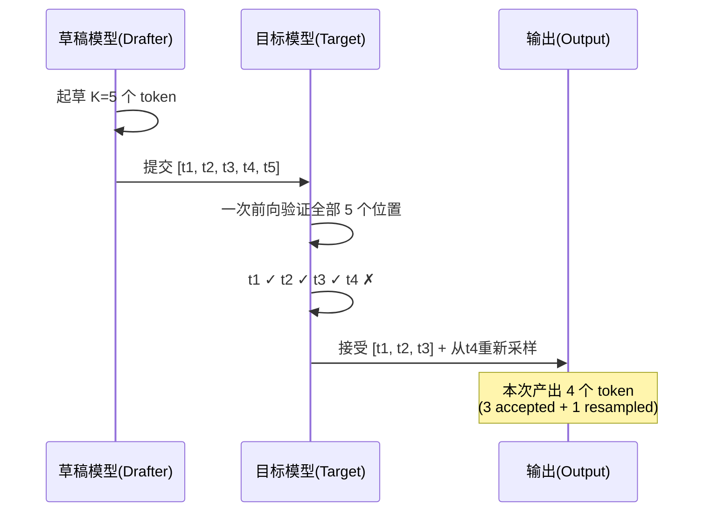

# vLLM 推测解码：让大模型学会"预判对手的下一步棋"

> **系列**: vLLM 技术博客系列 | **类型**: 核心概念深潜篇
>
> 一次前向只吐一个 token，大模型的推理像蜗牛爬行？推测解码让小模型先"猜"，大模型再"判"——猜对就白赚，猜错也不亏。

---

## 引言

想象你和一个棋力远高于你的棋手下快棋。你每走一步，对手都需要深思熟虑，但你发现：如果你先快速"预判"对手可能走的几步棋，提前思考应对方案，对手只需要验证你的预判是否正确——对了他直接落子，错了他再重新想。这样，对手的思考时间就被大幅压缩了。

这正是**推测解码**（Speculative Decoding）的核心思想。在自回归生成中，大模型每次前向传播只能产出一个 token，这是推理延迟的根本瓶颈。推测解码引入一个"草稿模型"（drafter），让它快速猜出接下来的 K 个 token，再由目标模型一次性验证——通过一个前向传播就能同时判断 K 个 token 是否正确。通过的 token 直接采纳，未通过的从断点重新生成。整个过程**不损失任何精度**，因为目标模型拥有最终决定权。

在 vLLM V1 架构中，推测解码已经发展出一套成熟的体系：从零额外 GPU 开销的 N-gram 方法，到复用目标模型隐藏状态的 EAGLE/DFlash，再到基于独立小模型的 draft model 方案，覆盖了不同场景下的性能需求。本文将深入 vLLM V1 的 `spec_decode/` 模块，拆解其架构设计、验证机制和调度策略。

---

## 自回归的"单行道"困境

### 为什么一次只能出一个 token？

大语言模型的生成过程本质上是**自回归**（autoregressive）的：每生成第 t 个 token，都需要把前 t-1 个 token 全部送入模型做前向传播，才能得到第 t 个 token 的概率分布。这意味着：

```
Forward 1: [prompt]           → token_1
Forward 2: [prompt, token_1]  → token_2
Forward 3: [prompt, token_1, token_2] → token_3
...
```

每次前向传播的计算量几乎相同（受 KV Cache 加速，新 token 的注意力计算仅涉及新增的 Q 向量），但 GPU 的并行能力在这"一步一步"的过程中被严重浪费——GPU 本可以同时处理多个 token 的计算，却被自回归的串行依赖硬生生地变成了单线程。

##### 延迟瓶颈量化

| 场景 | 模型大小 | 单次前向耗时 | 生成 100 token 总耗时 |
|------|---------|------------|---------------------|
| 单卡 A100 | Llama-70B | ~30ms | ~3s |
| 单卡 H100 | Llama-8B | ~5ms | ~0.5s |
| 单卡 A100 | Llama-8B | ~8ms | ~0.8s |

> 💡 **性能提示**: 延迟（latency）和吞吐（throughput）是推理的两条战线。推测解码主要优化的是**延迟**——让单个请求更快完成。对吞吐的改善是"副产品"而非"主菜"。

### 推测解码的破局思路

推测解码的核心洞察是：**验证比生成便宜**。

如果把目标模型的前向传播比作"做一道大题"，那么验证 K 个草稿 token 就像"批改 K 道选择题"——目标模型对 K 个 token 的概率分布可以在一次前向中同时获得（因为它们共享同一个 prefix 的 KV Cache），我们只需要比对草稿 token 与目标模型分布是否匹配。

```
传统自回归：  生成 5 个 token → 需要 5 次前向
推测解码：    草稿猜 5 个 + 目标验证 1 次 → 1+1=2 次前向（最理想情况）
```

---

## 推测解码核心原理：Draft-Verify-Reject 循环

### 三个阶段一览

推测解码的每一步都遵循 **Draft → Verify → Reject** 三段循环：

1. **Draft（起草）**：草稿模型（或非模型方法）快速生成 K 个候选 token
2. **Verify（验证）**：目标模型对 K 个草稿 token 做一次前向传播，获取每个位置的概率分布
3. **Reject（拒绝/接受）**：逐一比对草稿 token 与目标模型分布，接受匹配的，拒绝第一个不匹配的

```
┌─────────────────────────────────────────────────────────────────┐
│                    Speculative Decoding Loop                     │
│                                                                  │
│  ┌──────────┐    ┌──────────┐    ┌──────────────────────────┐  │
│  │  Draft    │───▶│  Verify  │───▶│  Reject / Accept         │  │
│  │  K tokens │    │  Target  │    │  第1个不匹配处截断        │  │
│  └──────────┘    └──────────┘    │  + bonus token            │  │
│       ▲                          └──────────┬───────────────┘  │
│       │                                    │                    │
│       └──────────── 从断点重新起草 ◀────────┘                    │
└─────────────────────────────────────────────────────────────────┘
```

### 验证机制详解

验证过程的关键在于**拒绝采样**（rejection sampling）。假设草稿模型在第 i 个位置生成了 token $x_i$，目标模型在该位置的概率为 $p(x_i)$，草稿模型的概率为 $q(x_i)$：

- **接受条件**：以 $\min(1, p(x_i) / q(x_i))$ 的概率接受
- **拒绝时**：从调整后的分布 $p(x) - q(x)$（归一化后）重新采样

这保证了最终输出的分布与**纯目标模型采样完全一致**——推测解码是无损的。

vLLM 在 `SpeculativeConfig` 中提供了两种拒绝采样方法：

| 参数 | 方法 | 说明 |
|------|------|------|
| `rejection_sample_method=standard` | 标准拒绝采样 | 基于概率比的经典方法 |
| `rejection_sample_method=synthetic` | 合成接受率 | 按衰减概率接受，用于草稿分布不可用的场景 |

> 笔者注：`synthetic` 方法适用于 ngram、suffix decoding 等没有概率分布的草稿方法。它通过 `synthetic_acceptance_rates` 或 `synthetic_acceptance_length` 参数控制每个位置的接受概率，实现一种"模拟"的拒绝效果。

### Bonus Token：拒绝后的"补偿"

当验证通过所有 K 个草稿 token 时，目标模型在位置 K+1 的概率分布已经计算完毕，可以直接采样一个"bonus token"——这是推测解码"只赚不亏"的数学基础：

- 最差情况：K=0（第一个草稿就被拒绝），等效于一次普通自回归
- 最好情况：K 个全部通过 + 1 个 bonus = 一次前向产出 K+1 个 token



---

## vLLM V1 推测解码架构

### 模块总览

vLLM V1 将推测解码的实现集中在 `vllm/v1/spec_decode/` 目录下，采用**策略模式**（Strategy Pattern），通过不同的 Proposer 类实现各种起草策略：

```
vllm/v1/spec_decode/
├── __init__.py
├── metadata.py               # SpecDecodeMetadata 数据结构
├── metrics.py                 # 接受率、吞吐等监控指标
├── utils.py                   # Triton kernel、slot mapping 工具
├── llm_base_proposer.py       # ⭐ SpecDecodeBaseProposer 基类
├── ngram_proposer.py          # N-gram 起草（CPU, Numba 加速）
├── ngram_proposer_gpu.py      # N-gram 起草（GPU, 向量化）
├── eagle.py                   # EAGLE 起草
├── dflash.py                  # DFlash 并行起草
├── medusa.py                  # Medusa 起草
├── draft_model.py             # 独立小模型起草
├── step3p5.py                 # Step3.5 MTP 起草
├── gemma4.py                  # Gemma4 MTP 起草
├── suffix_decoding.py         # Suffix Decoding 起草
├── extract_hidden_states.py   # 隐藏状态提取器
├── custom_class_proposer.py   # 自定义 Proposer 加载器
└── dynamic/
    ├── __init__.py
    └── utils.py               # 动态推测调度（按 batch size 调整 K）
```

### SpecDecodeMetadata：验证的"护照"

每次推测解码步骤都会生成一份 `SpecDecodeMetadata`，它携带了验证阶段所需的全部索引信息：

```python
# vllm/v1/spec_decode/metadata.py
@dataclass
class SpecDecodeMetadata:
    draft_token_ids: torch.Tensor       # [num_tokens] 所有草稿 token
    num_draft_tokens: list[int]         # [batch_size] 每请求的草稿数
    cu_num_draft_tokens: torch.Tensor   # [batch_size] 累积草稿数
    cu_num_sampled_tokens: torch.Tensor # [batch_size] 累积采样数
    target_logits_indices: torch.Tensor # [num_tokens] 目标 logits 索引
    bonus_logits_indices: torch.Tensor  # [batch_size] bonus token 索引
    logits_indices: torch.Tensor        # [num_tokens + batch_size] 合并索引
```

这些索引的设计是为了在**批量处理**中高效地定位每个请求的草稿 token 和对应的验证 logits——不同请求可能有不同数量的草稿 token，`cu_num_draft_tokens`（累积前缀和）实现了类似 CSR 格式的高效索引。

> 💡 **性能提示**: `cu_num_sampled_tokens` 比草稿数多 1，因为每个请求还需要一个 bonus token 的采样位置。这是理解整个验证流程的关键"偏移量"。

### SpecDecodeBaseProposer：万法归一的基类

`SpecDecodeBaseProposer` 是所有基于 LLM 的起草器的基类（EAGLE、DFlash、Draft Model、Gemma4 等），它管理了起草过程中的通用逻辑：

```python
# vllm/v1/spec_decode/llm_base_proposer.py (简化)
class SpecDecodeBaseProposer:
    def __init__(self, vllm_config, device,
                 pass_hidden_states_to_model: bool, runner=None):
        self.speculative_config = vllm_config.speculative_config
        self.num_speculative_tokens = self.speculative_config.num_speculative_tokens
        self.pass_hidden_states_to_model = pass_hidden_states_to_model
        self.parallel_drafting = self.speculative_config.parallel_drafting
        # ... 缓冲区分配：input_ids, positions, hidden_states 等
```

基类的核心设计决策体现在构造参数 `pass_hidden_states_to_model` 上：

| Proposer | `pass_hidden_states` | `parallel_drafting` | 含义 |
|----------|---------------------|---------------------|------|
| DraftModelProposer | `False` | `False` | 独立小模型，自回归逐步起草 |
| EagleProposer | `True` | `False` | 复用目标模型隐藏状态，逐步起草 |
| DFlashProposer | `True` | `True` | 复用隐藏状态 + 并行起草 |
| Gemma4Proposer | `True` | `False` | 复用隐藏状态，跨模型 KV 共享 |

---

## 起草方法全景

### 方法分类

| 类别 | 方法 | 是否需要额外模型 | 起草方式 | 额外 GPU 开销 |
|------|------|----------------|---------|-------------|
| 非模型 | N-gram | 否 | 模式匹配 | 几乎为零 |
| 非模型 | Suffix Decoding | 否 | 后缀树匹配 | 几乎为零 |
| 轻量头 | Medusa | 轻量 MLP 头 | 并行多 token | 很小 |
| 轻量头 | EAGLE/EAGLE3 | 轻量 Transformer | 复用隐藏状态 | 中等 |
| 轻量头 | DFlash | 轻量 Transformer | 并行起草 | 中等 |
| MTP | Step3.5/Gemma4/DeepSeek | MTP 头 | 复用隐藏状态 | 中等 |
| 独立模型 | Draft Model | 独立小模型 | 自回归生成 | 较大 |
| 自定义 | Custom Class | 用户自定义 | 用户自定义 | 用户自定义 |

### N-gram：零成本的"历史回声"

N-gram 是最轻量的推测解码方法，核心思想是：**在已生成的 token 序列中寻找与当前尾部匹配的历史模式，并"复用"该模式后续出现的 token 作为草稿**。

vLLM 提供了两种 N-gram 实现：

##### CPU 版本（Numba 加速）

```python
# vllm/v1/spec_decode/ngram_proposer.py
class NgramProposer:
    def __init__(self, vllm_config: VllmConfig):
        self.min_n = vllm_config.speculative_config.prompt_lookup_min
        self.max_n = vllm_config.speculative_config.prompt_lookup_max
        self.k = vllm_config.speculative_config.num_speculative_tokens
```

CPU 版本使用 KMP 算法的变种（Longest Prefix Suffix）来查找最长匹配的 N-gram。其核心函数 `_find_longest_matched_ngram_and_propose_tokens` 在反转的 token 序列上执行 LPS（Longest Proper Prefix which is also Suffix）计算，时间复杂度为 O(n)，并由 Numba JIT 加速。

关键参数：
- `prompt_lookup_min`：匹配的 N-gram 最小长度（默认 5，与 prompt_lookup_max 一致）
- `prompt_lookup_max`：匹配的 N-gram 最大长度（默认 5）
- `num_speculative_tokens`：每次提议的草稿 token 数

##### GPU 版本（向量化）

```python
# vllm/v1/spec_decode/ngram_proposer_gpu.py
@support_torch_compile()
class NgramGPUKernel(nn.Module):
    def _find_first_and_extract_all_n_parallel(self, ...):
        # 使用 unfold + argmax 在 GPU 上并行查找
```

GPU 版本利用 PyTorch 的 `unfold` 和 `argmax` 操作，在 GPU 上并行处理整个 batch 的 N-gram 匹配，避免了 CPU↔GPU 的数据传输。

> 💡 **性能提示**: N-gram 方法特别适合代码生成、重复模板文本等场景——因为这些场景中，历史模式的复用率极高。对于高度创造性的文本生成，N-gram 的接受率可能较低。

### Suffix Decoding：后缀树上的"路线预测"

Suffix Decoding 是 N-gram 的高阶版本，使用**后缀树**（Suffix Tree）数据结构来更高效地匹配和预测：

```python
# vllm/v1/spec_decode/suffix_decoding.py
class SuffixDecodingProposer:
    def __init__(self, vllm_config: VllmConfig):
        self.suffix_cache = SuffixDecodingCache(
            max_tree_depth=config.suffix_decoding_max_tree_depth,
            max_cached_requests=config.suffix_decoding_max_cached_requests,
        )
```

它为每个请求维护 prompt 后缀树和全局后缀树，支持动态草稿长度——不同请求可以提议不同数量的 token，而非固定 K 个。配置参数包括：

| 参数 | 默认值 | 说明 |
|------|--------|------|
| `suffix_decoding_max_tree_depth` | 24 | 后缀树最大深度 |
| `suffix_decoding_max_cached_requests` | 10000 | 全局缓存的最大请求数 |
| `suffix_decoding_max_spec_factor` | 1.0 | 草稿长度 / 匹配长度上限 |
| `suffix_decoding_min_token_prob` | 0.1 | 最小 token 频率阈值 |

### EAGLE：借力打力的"隐藏状态复用"

EAGLE（Extrapolation Algorithm for Greater Language-model Efficiency）是当前最主流的推测解码方法之一。它的核心创新在于**复用目标模型的隐藏状态**（hidden states），而非从零计算草稿：

```python
# vllm/v1/spec_decode/eagle.py
class EagleProposer(SpecDecodeBaseProposer):
    # EagleProposer 是一个轻量包装器，核心逻辑在基类 SpecDecodeBaseProposer
    def __init__(self, vllm_config, device, runner=None):
        super().__init__(
            vllm_config, device,
            pass_hidden_states_to_model=True,  # ← 关键：复用隐藏状态
            runner=runner,
        )
```

EAGLE 的起草流程是**自回归的**（逐步起草），每一步：
1. 接收目标模型上一位置的隐藏状态
2. 用轻量 EAGLE Transformer 预测下一个 token
3. 将预测结果作为下一步的输入
4. 重复 K 次

这比独立的 draft model 高效得多，因为：
- 跳过了目标模型已经计算过的表示
- EAGLE 模型本身很小（通常仅 1-2 层 Transformer）

### DFlash：并行起草的"火力全开"

DFlash 在 EAGLE 的基础上更进一步，采用**并行起草**（parallel drafting）策略——所有草稿 token 在一次前向传播中同时生成：

```python
# vllm/v1/spec_decode/dflash.py
class DFlashProposer(SpecDecodeBaseProposer):
    def __init__(self, vllm_config, device, runner=None):
        super().__init__(
            vllm_config, device,
            pass_hidden_states_to_model=True,
            runner=runner,
        )
        self.parallel_drafting: bool = True  # DFlash 始终并行起草
        # 仅 query token（bonus + mask）参与注意力计算
        self.max_query_tokens = self.max_batch_size * (1 + self.num_speculative_tokens)
```

DFlash 的关键设计是**交叉注意力**（cross-attention）：上下文的 K/V 从目标模型隐藏状态获取（通过 `precompute_and_store_context_kv`），Q 仅来自草稿 token 的嵌入。这样上下文部分不需要重新计算注意力，大幅降低了计算开销。

```
┌────────────────────────────────────────────────────┐
│                DFlash 并行起草                       │
│                                                     │
│  目标模型 Hidden States ──▶ precompute_and_store   │
│                              context_kv             │
│                                   │                 │
│  [next_token, mask, mask, ..., mask]               │
│       │       │     │           │                   │
│       ▼       ▼     ▼           ▼                   │
│  ┌────────────────────────────────────┐            │
│  │   DFlash Model (1 forward pass)    │            │
│  │   Cross-Attn: K/V=context, Q=qry  │            │
│  └────────────────────────────────────┘            │
│       │       │     │           │                   │
│       ▼       ▼     ▼           ▼                   │
│     [t1]    [t2]  [t3]  ...  [tK]  ← K个草稿token  │
└────────────────────────────────────────────────────┘
```

### Medusa：多头并出的"章鱼策略"

Medusa 采用了完全不同的策略——在目标模型的最后一层隐藏状态上附加多个**独立的 MLP 头**，每个头直接预测不同位置的 token：

```python
# vllm/v1/spec_decode/medusa.py
class MedusaProposer:
    def propose(self, num_speculative_tokens, target_hidden_states, ...):
        blocks = self.model(target_hidden_states)
        logits = self.model.compute_logits(blocks)
        # 每个头独立 argmax
        draft_tokens = torch.stack(
            [logit.argmax(dim=-1) for logit in logits], dim=1
        )
        return draft_tokens
```

Medusa 的优势是**极低的延迟**——一次前向就产出所有草稿 token。但代价是每个头的预测是**条件独立的**（不考虑其他头的输出），因此接受率通常低于 EAGLE 等自回归方法。

### Draft Model：小模型当"先锋"

最经典的推测解码方法——使用一个**完全独立的小模型**作为草稿模型：

```python
# vllm/v1/spec_decode/draft_model.py
class DraftModelProposer(SpecDecodeBaseProposer):
    def __init__(self, vllm_config, device, runner=None):
        super().__init__(
            vllm_config=vllm_config,
            device=device,
            pass_hidden_states_to_model=False,  # 不复用隐藏状态
            runner=runner,
        )
        self._raise_if_vocab_size_mismatch()  # 词汇表必须一致
        self._raise_if_draft_tp_mismatch()    # TP 大小必须一致
```

Draft Model 的关键约束是**词汇表大小必须与目标模型一致**——否则拒绝采样的概率比计算无意义。此外，当前版本要求草稿模型和目标模型使用相同的张量并行度（TP）。

### MTP 方法家族：DeepSeek/Step/Gemma4 的"原生多 token 预测"

vLLM 支持多种模型的**原生多 token 预测头**（Multi-Token Prediction, MTP），这些方法在模型训练时就内置了多 token 预测能力：

| MTP 方法 | Proposer 类 | 特点 |
|----------|------|------|
| DeepSeek MTP | EagleProposer | 通过 hf_config_override 映射为 EAGLE 兼容架构 |
| Step3.5 MTP | Step3p5MTPProposer | 支持多层草稿步骤选择 |
| Gemma4 MTP | Gemma4Proposer | 跨模型 KV 共享，constant positions |
| Qwen3.5 MTP | EagleProposer | 通过 hf_config_override 映射为 EAGLE3 兼容架构 |

Gemma4 的特殊之处在于 `constant_draft_positions = True`——所有草稿步骤使用相同的位置（目标模型的最后位置），因为其注意力层通过 KV 共享直接读取目标模型的 KV Cache。

---

## 验证与拒绝：目标模型的"一票否决"

### 验证流程的工程实现

在 vLLM V1 中，验证阶段的核心数据流如下：

```
草稿 token_ids ──▶ 目标模型前向传播
                       │
                       ▼
              每个位置的 logits（概率分布）
                       │
                       ▼
              逐一与草稿 token 比对
                       │
               ┌───────┴───────┐
               ▼               ▼
           接受 ✓          拒绝 ✗
           继续比对      从此截断+重采样
```

验证阶段需要精确地处理批量请求中每个请求的草稿 token 数量差异。`SpecDecodeMetadata` 中的索引张量正是为此而设计：

- `target_logits_indices`：指示目标模型 logits 中哪些位置对应草稿验证
- `bonus_logits_indices`：每个请求的 bonus token 位置
- `logits_indices`：合并了以上两者的统一索引

### 拒绝后的清理工作

当草稿 token 被拒绝时，vLLM 需要做两项关键清理：

1. **KV Cache 回滚**：被拒绝的 token 已经写入了 KV Cache，需要标记为无效。`utils.py` 中的 `compute_new_slot_mapping` 函数会将被拒绝 token 的 slot 映射设为 `PADDING_SLOT_ID = -1`，确保这些位置不会被后续注意力计算使用。

2. **序列长度修正**：`update_num_computed_tokens_for_batch_change` 函数修正 `num_computed_tokens`——对于有草稿的请求，修正为 `prev_computed + valid_count`；对于新请求或非草稿请求，直接使用 CPU 值。

```python
# vllm/v1/spec_decode/utils.py (简化)
def update_num_computed_tokens_for_batch_change(
    num_computed_tokens, num_accepted_tokens, prev_positions,
    valid_sampled_token_count, prev_num_draft_tokens, cpu_num_computed_tokens
):
    participating = (prev_positions >= 0) & (prev_drafts > 0)
    corrected = prev_computed + valid_counts.int()
    num_computed_tokens[:n].copy_(
        torch.where(participating, corrected, cpu_num_computed_tokens)
    )
```

---

## 接受率与加速比：推测解码的"成绩单"

### 接受率指标

vLLM 的 `SpecDecodingStats` 类在每个调度步骤中记录推测解码的性能数据：

```python
# vllm/v1/spec_decode/metrics.py
@dataclass
class SpecDecodingStats:
    num_spec_tokens: int         # 配置的推测 token 数
    num_drafts: int = 0          # 起草次数
    num_draft_tokens: int = 0    # 总草稿 token 数
    num_accepted_tokens: int = 0 # 总接受 token 数
    num_accepted_tokens_per_pos: list[int]  # 每个位置的接受数
    num_draft_tokens_per_pos: list[int]     # 每个位置的草稿数
```

关键指标及其含义：

| 指标 | 计算方式 | 含义 |
|------|---------|------|
| 草稿接受率 | accepted / drafted | 整体接受比例 |
| 平均接受长度 | 1 + accepted / drafts | 含 bonus token 的平均产出长度 |
| 逐位置接受率 | accepted_per_pos / drafts | 每个位置的条件接受概率 |

vLLM 日志中会输出类似以下信息：

```
SpecDecoding metrics: Mean acceptance length: 3.42, Accepted throughput: 1523.20 tokens/s,
Drafted throughput: 4210.50 tokens/s, Per-position acceptance rate: 0.891, 0.743, 0.612,
0.502, 0.398, Avg Draft acceptance rate: 63.1%
```

> 笔者注：逐位置接受率是递减的——第一个位置最高（通常 > 80%），越往后越低。这是因为每个后续位置的接受都**条件依赖于**前面所有位置都被接受。`unconditional_to_conditional_rates` 工具函数可以在无条件率和条件率之间转换。

### 加速比的理论上界

推测解码的加速比取决于两个因素：

1. **接受率 $\alpha$**：草稿 token 被接受的概率
2. **草稿成本比 $\beta$**：草稿模型前向传播与目标模型前向传播的时间比

理论加速比约为：

$$
\text{Speedup} \approx \frac{1 + \alpha K}{1 + \beta}
$$

其中 K 是草稿 token 数。例如，K=5、$\alpha=0.8$、$\beta=0.1$（EAGLE 场景）时：

$$
\text{Speedup} \approx \frac{1 + 0.8 \times 5}{1 + 0.1} = \frac{5}{1.1} \approx 4.5\times
$$

但这是理想情况。实际加速比还受 KV Cache 管理、CUDA Graph 兼容性、调度开销等因素影响。

---

## 何时该用推测解码？何时该关掉？

### 推测解码的适用场景

推测解码并非"银弹"，它的效果高度依赖于运行时场景：

| 场景 | 推测解码效果 | 原因 |
|------|-------------|------|
| batch_size=1（单请求） | ⭐⭐⭐⭐⭐ | GPU 利用率低，推测解码填充空闲算力 |
| batch_size=2~8 | ⭐⭐⭐⭐ | 仍有空闲算力，加速明显 |
| batch_size=16~32 | ⭐⭐ | GPU 已接近饱和，加速递减 |
| batch_size=64+ | ⭐ 或负优化 | GPU 完全饱和，草稿验证变成额外开销 |

核心原因是：推测解码需要目标模型做一次"更大"的前向传播（验证 K+1 个位置而非 1 个位置），当 GPU 已经满载时，这次更大的前向传播本身就变慢了。

### 动态推测调度：按负载自适应

vLLM 提供了**动态推测调度**（Dynamic Speculative Decoding）功能，根据当前 batch size 动态调整推测 token 数：

```python
# vllm/v1/spec_decode/dynamic/utils.py
def build_dynamic_sd_schedule_lookup(
    num_speculative_tokens_per_batch_size,  # 配置的 batch-size 调度表
    vllm_max_batch_size,
    vllm_num_speculative_tokens,
) -> list[int]:
    # 生成 dense_schedule[batch_size] → K 的查找表
```

配置示例：

```bash
# batch_size 1~8 用 K=5, 9~32 用 K=3, 33+ 用 K=0（关闭推测解码）
--speculative-num-speculative-tokens-per-batch-size \
  '[[1, 8, 5], [9, 32, 3], [33, 128, 0]]'
```

这个设计非常优雅：低负载时激进推测，高负载时自动降级，避免负优化。

> 💡 **性能提示**: 动态调度是推测解码在生产环境落地的关键特性。建议所有部署都配置动态调度，而非使用固定的 K 值。

---

## 推测解码与 KV Cache / 调度器的协作

### KV Cache 的额外分配

推测解码对 KV Cache 有额外需求——被接受的草稿 token 需要写入 KV Cache，而 KV Cache 管理器需要提前预留空间。vLLM 在 `MambaSpec` 中引入了 `num_speculative_blocks` 字段（注意：仅 Mamba SSM 层需要此字段，Attention 层通过调度器动态管理）：

```python
# vllm/v1/kv_cache_interface.py — MambaSpec
@dataclass
class MambaSpec(KVCacheSpec):
    num_speculative_blocks: int = 0  # 推测解码额外预留的 block 数（仅 Mamba 层）
```

在 block 分配时，每个请求会额外分配 `num_speculative_blocks` 个 block，确保草稿 token 有足够的 KV Cache 空间。

### 调度器的感知

vLLM V1 的调度器（Scheduler）对推测解码有完整的感知：

1. **草稿 token 计入 batch token 数**：调度器在计算 `num_batched_tokens` 时会考虑草稿 token，避免超出 `max_num_batched_tokens` 限制
2. **acceptance stats 回传**：每个调度步骤的 `SpecDecodingStats` 会通过 `SchedulerOutput` 回传到前端，用于监控和日志
3. **Padded batch**：EAGLE 等方法需要 CUDA Graph 兼容的固定 batch shape，调度器通过 `padded_batch` 机制支持

---

## 实战配置指南

### 快速上手：N-gram

最简单的配置，无需任何额外模型：

```bash
vllm serve meta-llama/Llama-3.1-8B-Instruct \
  --speculative-method ngram \
  --num-speculative-tokens 5 \
  --speculative-prompt-lookup-min 2 \
  --speculative-prompt-lookup-max 5
```

### 中等配置：EAGLE

需要下载 EAGLE 权重：

```bash
vllm serve meta-llama/Llama-3.1-70B-Instruct \
  --speculative-model yuhuili/EAGLE-Llama-3.1-70B-Instruct \
  --num-speculative-tokens 5
```

### 高级配置：动态调度 + DFlash

```bash
vllm serve Qwen/Qwen3-8B \
  --speculative-model Qwen/Qwen3-DFlash-8B \
  --speculative-method dflash \
  --num-speculative-tokens 5 \
  --speculative-num-speculative-tokens-per-batch-size \
  '[[1, 8, 5], [9, 32, 3], [33, 128, 0]]'
```

### 自定义 Proposer

vLLM 支持用户自定义的 Proposer 类：

```python
# my_module.py
class MyCustomProposer:
    def __init__(self, vllm_config):
        self.num_spec_tokens = vllm_config.speculative_config.num_speculative_tokens

    def propose(self, num_speculative_tokens, ...):
        # 自定义起草逻辑
        return draft_token_ids
```

```bash
vllm serve meta-llama/Llama-3.1-8B-Instruct \
  --speculative-method custom_class \
  --speculative-model my_module.MyCustomProposer \
  --num-speculative-tokens 5
```

---

## 总结与建议

### 核心要点速览

| 维度 | 要点 |
|------|------|
| 核心思想 | 草稿模型先猜 K 个 token，目标模型一次验证，猜对白赚，猜错不亏 |
| 数学保证 | 拒绝采样确保输出分布与纯目标模型完全一致，无损精度 |
| 最佳场景 | batch_size 小（1~8），GPU 利用率低的延迟敏感场景 |
| 不适用场景 | batch_size 大（64+），GPU 已满载的吞吐优先场景 |
| 推荐方法 | 生产环境用 EAGLE/DFlash（性能/成本比最优），快速验证用 N-gram（零额外开销） |
| 必备配置 | 动态推测调度（按 batch size 自适应调整 K） |

### 一句话建议

**先开 N-gram 试试水，再用 EAGLE 追性能，一定别忘了配动态调度。**

### 延伸阅读

- [Fast Inference from Transformers via Speculative Decoding](https://arxiv.org/abs/2211.17192) — 推测解码原始论文
- [EAGLE: Speculative Sampling Requires Rethinking Feature Uncertainty](https://arxiv.org/abs/2401.15077) — EAGLE 论文
- [Medusa: Simple LLM Inference Acceleration Framework with Multiple Decoding Heads](https://arxiv.org/abs/2401.10774) — Medusa 论文
- [Suffix Decoding: A Model-Free Approach to Speeding Up LLM Inference](https://arxiv.org/abs/2411.04975) — Suffix Decoding 论文
- [vLLM Speculative Decoding 官方文档](https://docs.vllm.ai/en/latest/features/speculative_decoding.html)

---

*本文属于 [vLLM 技术博客系列]，欢迎持续关注。*
