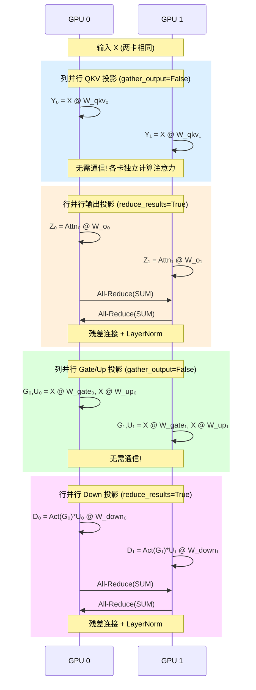

# vLLM 分布式推理：从单卡到千卡的并行之道——一张灶台炒不完所有菜

> **系列**: vLLM 技术博客系列 | **类型**: 核心概念深潜篇
> 一张 GPU 装不下 LLaMA-405B？那就多灶台并行、流水线接力、开分店扩容

### 引言

想象你经营一家繁忙的餐厅。一张灶台做不完所有菜——你会装多张灶台，让多个厨师同时炒菜；如果一道菜工序太多，你会安排厨师流水线，每人负责一道工序，盘子上菜速度反而更快；如果客人实在太多，你干脆开分店，每家分店独立接单。

大模型推理就是这家超负荷的餐厅。LLaMA-405B 的权重约 810 GB（FP16），而一张 H100 只有 80 GB 显存——十倍的差距。单卡不仅装不下模型权重，连 KV Cache 都无处安放。唯一的出路就是分布式推理：像餐厅扩容一样，让多张 GPU 协同工作。

本文将深入 vLLM 的分布式推理架构，从三种并行策略的原理，到 Executor 和 Worker 的代码实现，再到 NCCL 通信的底层机制，带你彻底搞懂 vLLM 如何在千卡规模上高效推理。

### 一、为什么必须分布式：一张灶台炒不完所有菜

##### 1.1 单卡的天花板

| 模型 | 参数量 | FP16 权重大小 | 单卡 H100 (80GB) | 能否单卡推理 |
|------|--------|-------------|-----------------|------------|
| LLaMA-7B | 7B | ~14 GB | 装得下，还有余量 | 可以 |
| LLaMA-70B | 70B | ~140 GB | 装不下，差 60 GB | 不行 |
| LLaMA-405B | 405B | ~810 GB | 装不下，差 730 GB | 不行 |
| DeepSeek-V3 | 671B | ~1342 GB | 装不下，差 1262 GB | 不行 |

问题不止是权重。推理时还需要为每个请求分配 KV Cache，而 KV Cache 的显存开销随序列长度线性增长。一个 70B 模型、2048 token 的请求，KV Cache 就可能消耗数 GB 显存。

##### 1.2 分布式的三种解法

面对"装不下"的问题，我们有三种基本策略：

```
┌─────────────────────────────────────────────────────────┐
│                  分布式推理三种并行策略                      │
├─────────────────────────────────────────────────────────┤
│                                                         │
│  1. 张量并行 (TP)         模型层内拆分                     │
│     ┌───┬───┐           把每层的权重矩阵切                  │
│     │A_0 │A_1 │           成多块，每张卡算一部分              │
│     └───┴───┘           → 通信频繁，延迟敏感                │
│                                                         │
│  2. 流水线并行 (PP)       模型层间拆分                     │
│     ┌────┐ ┌────┐       把模型按层切几段，                  │
│     │L0-5│→│L6-11│       每张卡算一段，接力传递              │
│     └────┘ └────┘       → 通信少，但有气泡                  │
│                                                         │
│  3. 数据并行 (DP)         模型复制多份                     │
│     ┌────┐ ┌────┐       同一个模型复制到多组卡，              │
│     │ 模型 │ │ 模型 │       不同请求分给不同组处理              │
│     └────┘ └────┘       → 无通信，纯提吞吐                  │
│                                                         │
└─────────────────────────────────────────────────────────┘
```

> 💡 **性能提示**：TP 是延迟导向的——同一请求由多卡协同计算，减少单步时间；DP 是吞吐导向的——多组卡各自处理不同请求，提高单位时间处理量。实际部署中，三者通常组合使用。

### 二、张量并行 (TP)：同一层，大家一起算

##### 2.1 核心思想

张量并行将模型每一层的权重矩阵沿某个维度切开，分给多张 GPU。每张卡只持有部分权重、算出部分结果，然后通过通信（All-Reduce 或 All-Gather）将结果合并。

Transformer 模型的每一层主要有两种线性变换，对应两种切分方式：

| 切分方式 | 对应层 | 权重切分维度 | 通信操作 | vLLM 实现 |
|---------|--------|-----------|---------|----------|
| **列并行 (Column Parallel)** | QKV 投影、MLP 的 gate/up 投影 | 输出维度 (dim=0) | All-Gather | `ColumnParallelLinear` |
| **行并行 (Row Parallel)** | 输出投影 (o_proj)、MLP 的 down 投影 | 输入维度 (dim=1) | All-Reduce | `RowParallelLinear` |

##### 2.2 列并行：切输出，All-Gather 合并

列并行将权重矩阵沿输出维度切开。以 QKV 投影为例：

```
完整权重 W_qkv: [hidden_size, 3 * hidden_size]
TP=2 时，每张卡持有:
  GPU 0: W_qkv_0 = W_qkv[:, :3*hidden_size/2]   (前半部分)
  GPU 1: W_qkv_1 = W_qkv[:, 3*hidden_size/2:]   (后半部分)

前向计算:
  GPU 0: Y_0 = X @ W_qkv_0   → 形状 [batch, seq, 3*hidden_size/2]
  GPU 1: Y_1 = X @ W_qkv_1   → 形状 [batch, seq, 3*hidden_size/2]
  
  All-Gather → Y = [Y_0 | Y_1]   → 形状 [batch, seq, 3*hidden_size]
```

在 vLLM 源码中，`ColumnParallelLinear` 的 `forward` 方法清晰地体现了这一逻辑：

```python
# vllm/model_executor/layers/linear.py — ColumnParallelLinear.forward
def forward(self, input_):
    bias = self.bias if not self.skip_bias_add else None
    # 每张卡用自己的局部权重计算局部输出
    output_parallel = self.quant_method.apply(self, input_, bias)

    if self.gather_output and self.tp_size > 1:
        # 通过 All-Gather 将各卡的局部输出拼接为完整输出
        output = tensor_model_parallel_all_gather(output_parallel)
    else:
        output = output_parallel
    return output, ...
```

注意 `gather_output` 参数：如果下一层是行并行（`RowParallelLinear`），则不需要 All-Gather，因为行并行本来就期望收到切分后的输入。这就是 Transformer 层中经典的"列并行 + 行并行"配对，中间省去一次通信。

##### 2.3 行并行：切输入，All-Reduce 求和

行并行将权重矩阵沿输入维度切开。以 MLP 的 down 投影为例：

```
完整权重 W_down: [4*hidden_size, hidden_size]
TP=2 时，每张卡持有:
  GPU 0: W_down_0 = W_down[:2*hidden_size, :]   (上半部分)
  GPU 1: W_down_1 = W_down[2*hidden_size:, :]   (下半部分)

前向计算:
  GPU 0: Y_0 = X_0 @ W_down_0   (X_0 是 gate/up 的局部输出)
  GPU 1: Y_1 = X_1 @ W_down_1
  
  All-Reduce(SUM) → Y = Y_0 + Y_1   (因为矩阵乘法可拆分为分块求和)
```

源码中 `RowParallelLinear` 的 `forward` 方法：

```python
# vllm/model_executor/layers/linear.py — RowParallelLinear.forward
def forward(self, input_):
    if self.input_is_parallel:
        input_parallel = input_    # 上一列并行的输出直接就是切分好的
    else:
        split_input = split_tensor_along_last_dim(input_, num_partitions=self.tp_size)
        input_parallel = split_input[self.tp_rank].contiguous()

    # 注意：只有 rank 0 加 bias，避免在 All-Reduce 后 bias 被重复加
    bias_ = None if (self.tp_rank > 0 or self.skip_bias_add) else self.bias
    output_parallel = self.quant_method.apply(self, input_parallel, bias_)

    if self.reduce_results and self.tp_size > 1:
        # All-Reduce 将各卡的部分和加总为完整输出
        output = tensor_model_parallel_all_reduce(output_parallel)
    else:
        output = output_parallel
    return output, ...
```

> 💡 **性能提示**：行并行中只有 rank 0 添加 bias，这是一个精妙的细节。All-Reduce 做的是求和（SUM），如果每个 rank 都加 bias，结果中 bias 会被加 `tp_size` 次。

##### 2.4 一个完整 Transformer 层的 TP 流程

将列并行和行并行组合起来，一个 Transformer 层在 TP=2 下的计算流程如下：



每个 Transformer 层只需要 **2 次 All-Reduce**（分别在输出投影和 down 投影之后），这就是经典的 Megatron-LM TP 策略。vLLM 完全继承了这一设计。

### 三、流水线并行 (PP)：层间接力，分段执行

##### 3.1 核心思想

如果说 TP 是"大家一起算同一层"，那 PP 就是"大家排好队，算不同的层"。PP 将模型按层切分为多个阶段（stage），每个 stage 部署在一组 GPU 上，数据像流水线一样依次通过各个 stage。

```
PP=4, 模型 32 层:

  Stage 0         Stage 1         Stage 2         Stage 3
  ┌────────┐     ┌────────┐     ┌────────┐     ┌────────┐
  │Layer 0-7│ ─→ │Layer 8-15│ ─→ │Layer 16-23│ ─→ │Layer 24-31│
  └────────┘     └────────┘     └────────┘     └────────┘
   GPU 0           GPU 1           GPU 2           GPU 3
```

##### 3.2 气泡问题与缓解

PP 的主要问题是流水线气泡（Pipeline Bubble）：当 Stage 0 在处理 micro-batch 1 时，Stage 1-3 都在空等。只有 Stage 0 算完把中间结果传给 Stage 1，Stage 1 才能开始。

```
理想情况（无气泡）:  ████████████████████████████████
PP=4 实际:          ████────────────────────────────
                    ────████────────────────────────
                    ────────────████────────────────
                    ────────────────────████────────
                    │← 气泡 →│←  有用计算  →│←气泡→│
```

vLLM 通过微批次（micro-batching）技术缓解气泡：将一个大请求拆分为多个微批次，让各 stage 尽可能重叠执行。

##### 3.3 vLLM 中的 PP 排布

在 vLLM 中，PP 与 TP 可以组合使用。rank 的编排遵循 `PP x TP` 的布局：

```python
# vllm/v1/executor/multiproc_executor.py — _get_output_rank
# 仅从最后一个 PP stage 的 TP rank 0 获取输出
# 示例: TP=8, PP=4, PCP=1, world_size=32
# PP rank 0: GPU 0-7
# PP rank 1: GPU 8-15
# PP rank 2: GPU 16-23
# PP rank 3: GPU 24-31  ← 输出 rank = 32 - 8*1 = 24
return (
    self.world_size
    - self.parallel_config.tensor_parallel_size
    * self.parallel_config.prefill_context_parallel_size
)
```

### 四、数据并行 (DP)：复制模型，各干各的

##### 4.1 核心思想

DP 是最简单的并行方式：将完整的模型复制到多组 GPU，每组 GPU 独立处理不同的请求。组与组之间没有任何通信，因此 DP 几乎没有通信开销，纯粹提升吞吐量。

```
DP=2, TP=2:

  DP Group 0                DP Group 1
  ┌──────────────┐         ┌──────────────┐
  │ GPU 0 (TP 0) │         │ GPU 2 (TP 0) │
  │ GPU 1 (TP 1) │         │ GPU 3 (TP 1) │
  └──────────────┘         └──────────────┘
  处理请求 A, B, C...       处理请求 D, E, F...
```

##### 4.2 DP 与调度器

vLLM V1 的调度器会根据 DP rank 将请求分配给不同的 DP group。每个 DP group 有自己独立的 KV Cache 空间和调度决策，互不干扰。

##### 4.3 三种并行策略对比

| 维度 | 张量并行 (TP) | 流水线并行 (PP) | 数据并行 (DP) |
|------|-------------|---------------|-------------|
| **拆分对象** | 层内权重矩阵 | 层间分组 | 整个模型复制 |
| **通信模式** | All-Reduce / All-Gather | 点对点 (Send/Recv) | 无通信 |
| **通信频率** | 每层 2 次 | 每个 micro-batch | 无 |
| **通信量** | 大（与 hidden_size 成正比） | 中（中间激活） | 无 |
| **延迟影响** | 降低单步延迟 | 可能增加延迟 | 无影响 |
| **吞吐影响** | 可能略降（通信开销） | 受气泡影响 | 线性提升 |
| **典型网络** | NVLink（需高带宽） | NVLink/InfiniBand | 任意 |
| **适用场景** | 单节点多卡 | 跨节点 | 提高吞吐 |

> 笔者注：在实际部署中，最常见的组合是 TP + DP。TP 用于让模型装进多张卡，DP 用于线性扩展吞吐。PP 通常只在跨节点且 NVLink 不可用时才考虑，因为它的气泡开销较难消除。

### 五、vLLM V1 的 Executor 架构：指挥官与士兵

理解了并行策略，现在我们来看看 vLLM 是如何在工程上组织这些 GPU 的。V1 架构采用 **Executor + Worker** 的两层模型。

##### 5.1 Executor 家族

vLLM 提供了三种 Executor 实现，对应不同的部署场景：

```python
# vllm/v1/executor/abstract.py — Executor.get_class
# 根据配置选择不同的 Executor 实现
if distributed_executor_backend == "ray":
    executor_class = RayDistributedExecutor       # Ray 集群部署
elif distributed_executor_backend == "mp":
    executor_class = MultiprocExecutor             # 单机多卡（多进程）
elif distributed_executor_backend == "uni":
    executor_class = UniProcExecutor               # 单卡调试
```

| Executor | 进程模型 | 适用场景 | 支持 PP | 关键特征 |
|----------|---------|---------|--------|---------|
| **UniProcExecutor** | 单进程 | 单卡调试/开发 | 否 | 最简单，主进程直接调 Worker |
| **MultiprocExecutor** | 多进程（multiprocessing） | 单机多卡 | 是 | 共享内存广播，零拷贝响应 |
| **RayDistributedExecutor** | Ray Actor | 多机集群 | 是 | Ray DAG 编译，NCCL 通道 |

##### 5.2 UniProcExecutor：最简单的起点

`UniProcExecutor` 是最简单的实现——整个推理过程在一个进程中完成，直接调用 Worker 的方法：

```python
# vllm/v1/executor/uniproc_executor.py
class UniProcExecutor(Executor):
    def _init_executor(self) -> None:
        # 只创建一个 Worker
        self.driver_worker = WorkerWrapperBase(rpc_rank=0)
        # ...初始化并加载模型
        self.driver_worker.init_worker(all_kwargs=[kwargs])
        self.driver_worker.init_device()
        self.driver_worker.load_model()

    def collective_rpc(self, method, timeout=None, args=(), kwargs=None, ...):
        # 直接在当前进程调用 Worker 方法
        result = run_method(self.driver_worker, method, args, kwargs)
        return result if single_value else [result]
```

`collective_rpc` 是 Executor 最核心的方法——它向所有 Worker 广播一个方法调用。在 `UniProcExecutor` 中，这只是一个本地的函数调用。在 `MultiprocExecutor` 中，它会通过共享内存消息队列将调用广播到所有子进程。

##### 5.3 MultiprocExecutor：单机多卡的主力

`MultiprocExecutor` 是生产环境中最常用的 Executor。它为每个 GPU 创建一个子进程，每个子进程运行一个 `WorkerProc`，主进程通过共享内存消息队列（MessageQueue）与之通信：

```python
# vllm/v1/executor/multiproc_executor.py — 核心流程
class MultiprocExecutor(Executor):
    def _init_executor(self) -> None:
        # 1. 创建共享内存广播消息队列
        self.rpc_broadcast_mq = MessageQueue(
            self.world_size, self.local_world_size, ...
        )

        # 2. 为每个 GPU 创建一个 Worker 子进程
        for local_rank in range(self.local_world_size):
            worker_handle = WorkerProc.make_worker_process(
                vllm_config=self.vllm_config,
                local_rank=local_rank,
                rank=global_rank,
                distributed_init_method=distributed_init_method,
                ...
            )

        # 3. 等待所有 Worker 准备就绪
        self.workers = WorkerProc.wait_for_ready(unready_workers)

    def collective_rpc(self, method, timeout=None, args=(), ...):
        # 通过消息队列广播方法调用
        self.rpc_broadcast_mq.enqueue((send_method, args, kwargs, output_rank))
        # 从响应消息队列获取结果
        response = mq.dequeue(timeout=deadline)
```

架构示意：

```
┌──────────────── Executor (主进程) ────────────────┐
│                                                    │
│  ┌──────────┐     ┌──────────────────────────────┐│
│  │ Scheduler │     │ rpc_broadcast_mq (共享内存)    ││
│  │ 调度器     │     │ 广播: SchedulerOutput → Workers ││
│  └──────────┘     └──────────────────────────────┘│
│                         │                          │
│                    ┌────┼────┐                     │
│                    ▼    ▼    ▼                     │
│  ┌──────────┐ ┌──────────┐ ┌──────────┐          │
│  │Worker 0  │ │Worker 1  │ │Worker 2  │  ...      │
│  │GPU 0     │ │GPU 1     │ │GPU 2     │          │
│  │(子进程)   │ │(子进程)   │ │(子进程)   │          │
│  └──────────┘ └──────────┘ └──────────┘          │
│       │             │            │                 │
│       └─────────────┼────────────┘                 │
│                     ▼                              │
│  ┌──────────────────────────────────────────────┐  │
│  │ response_mqs (共享内存)                         │  │
│  │ 响应: ModelRunnerOutput ← Workers             │  │
│  └──────────────────────────────────────────────┘  │
└────────────────────────────────────────────────────┘
```

> 💡 **性能提示**：`MultiprocExecutor` 使用共享内存（`shm_broadcast`）进行主进程与 Worker 之间的通信，避免了序列化/反序列化开销，实现了零拷贝的数据传输。这在高吞吐场景下至关重要。

##### 5.4 Worker 子进程：一卡一进程

每个 Worker 子进程的核心是一个忙循环（busy loop），不断从消息队列取任务执行：

```python
# vllm/v1/executor/multiproc_executor.py — WorkerProc.worker_busy_loop
def worker_busy_loop(self):
    assert self.rpc_broadcast_mq is not None
    while True:
        # 从共享内存消息队列取出一个方法调用
        method, args, kwargs, output_rank = self.rpc_broadcast_mq.dequeue(
            indefinite=True
        )
        # 执行方法
        if isinstance(method, str):
            func = getattr(self.worker, method)
        elif isinstance(method, bytes):
            func = partial(cloudpickle.loads(method), self.worker)

        output = func(*args, **kwargs)

        # 如果自己是输出 rank，将结果写入响应队列
        if output_rank is None or self.rank == output_rank:
            self.handle_output(output)
```

这种设计确保了每个 GPU 有自己独立的 Python 进程和 CUDA 上下文，避免了 GIL 锁的争用，也使得 Worker 之间可以通过 NCCL 进行高效的 GPU 间通信。

##### 5.5 RayDistributedExecutor：千卡集群的利器

当推理扩展到多机集群时，`RayDistributedExecutor` 登场。它用 Ray Actor 替代子进程，用 Ray Compiled DAG 优化跨机通信：

```python
# vllm/v1/executor/ray_executor.py — RayDistributedExecutor
class RayDistributedExecutor(Executor):
    uses_ray: bool = True
    supports_pp: bool = True

    def _init_executor(self) -> None:
        # 使用 Ray PlacementGroup 将 Worker 绑定到不同 GPU
        self._init_workers_ray(placement_group)
        # 构建 Compiled DAG 优化前向传播
        self.forward_dag = None  # 延迟构建

    def collective_rpc(self, method, timeout=None, args=(), ...):
        # 通过 Ray Actor 的 remote 调用实现
        ray_worker_outputs = [
            worker.execute_method.remote(sent_method, *args, **kwargs)
            for worker in self.workers
        ]
        return ray.get(ray_worker_outputs, timeout=timeout)
```

Ray Compiled DAG 的关键优势在于它可以将 PP 的中间激活通过 NCCL 通道直接在 GPU 之间传输，无需经过 CPU 中转：

```python
# Ray Compiled DAG 构建 — PP=2, TP=4 示例
# SchedulerOutput → [0,1,2,3] → 中间激活 → [4,5,6,7] → ModelRunnerOutput
with InputNode() as input_data:
    outputs = [input_data for _ in self.pp_tp_workers[0]]
    for pp_rank, tp_group in enumerate(self.pp_tp_workers):
        outputs = [
            worker.execute_model_ray.bind(outputs[i])
            for i, worker in enumerate(tp_group)
        ]
        # PP stage 之间通过 NCCL 直接传输中间张量
        if pp_rank < last_pp_rank:
            transport = envs.VLLM_USE_RAY_COMPILED_DAG_CHANNEL_TYPE
            outputs = [output.with_tensor_transport(transport=transport) ...]
```

### 六、并行状态管理：GroupCoordinator 与通信原语

##### 6.1 并行组的初始化

vLLM 在启动时通过 `initialize_model_parallel` 创建各种并行组。每个并行组对应一个 `GroupCoordinator`，管理组内进程间的通信：

```python
# vllm/distributed/parallel_state.py — initialize_model_parallel
# rank 布局: ExternalDP x DP x PP x PCP x TP
all_ranks = torch.arange(world_size).reshape(
    -1,
    data_parallel_size,
    pipeline_model_parallel_size,
    prefill_context_model_parallel_size,
    tensor_model_parallel_size,
)

# 构建 TP 组: 沿 TP 维度切分
# 示例: world_size=8, TP=2, PP=2
# TP 组: [0,1], [2,3], [4,5], [6,7]
group_ranks = all_ranks.view(-1, tensor_model_parallel_size).unbind(0)
_TP = init_model_parallel_group(group_ranks, ..., group_name="tp")

# 构建 PP 组: 沿 PP 维度切分
# PP 组: [0,2,4,6], [1,3,5,7]
group_ranks = all_ranks.transpose(2,4).reshape(-1, pipeline_model_parallel_size).unbind(0)
_PP = init_model_parallel_group(group_ranks, ..., group_name="pp")

# 构建 DP 组: 沿 DP 维度切分
group_ranks = all_ranks.transpose(1,4).reshape(-1, data_parallel_size).unbind(0)
_DP = init_model_parallel_group(group_ranks, ..., group_name="dp")
```

##### 6.2 GroupCoordinator：通信的统一入口

`GroupCoordinator` 封装了 PyTorch 的 `ProcessGroup`，提供统一的通信接口。每个 Coordinator 管理两个通信组：

| 通信组 | 后端 | 用途 |
|--------|------|------|
| `device_group` | NCCL / XCCL | GPU 间高速通信（All-Reduce、All-Gather 等） |
| `cpu_group` | Gloo | CPU 间控制面通信（广播元数据、Barrier 等） |

核心通信操作：

```python
# vllm/distributed/parallel_state.py — GroupCoordinator
class GroupCoordinator:
    def all_reduce(self, input_): ...       # All-Reduce (求和)
    def all_gather(self, input_, dim): ...  # All-Gather (拼接)
    def reduce_scatter(self, input_, dim): ... # Reduce-Scatter
    def broadcast(self, input_, src): ...   # 广播
    def send(self, tensor, dst): ...        # 点对点发送 (PP 用)
    def recv(self, size, dtype, src): ...   # 点对点接收 (PP 用)
```

##### 6.3 通信操作的高层封装

`vllm/distributed/communication_op.py` 提供了面向 TP 的便捷函数，它们都委托给 TP GroupCoordinator：

```python
# vllm/distributed/communication_op.py
def tensor_model_parallel_all_reduce(input_):
    """TP 组内 All-Reduce"""
    return get_tp_group().all_reduce(input_)

def tensor_model_parallel_all_gather(input_, dim=-1):
    """TP 组内 All-Gather"""
    return get_tp_group().all_gather(input_, dim)

def tensor_model_parallel_reduce_scatter(input_, dim=-1):
    """TP 组内 Reduce-Scatter"""
    return get_tp_group().reduce_scatter(input_, dim)
```

### 七、NCCL 通信：GPU 间对话的底层语言

##### 7.1 NCCL 是什么

NCCL（NVIDIA Collective Communications Library）是 NVIDIA 提供的 GPU 集体通信库，专门为 NVIDIA GPU 间的高效通信优化。它是 vLLM 分布式推理的通信基石。

```
┌──────────────────── vLLM 通信层次 ────────────────────┐
│                                                       │
│  应用层      ColumnParallelLinear / RowParallelLinear  │
│              ↓ 调用                                   │
│  原语层      tensor_model_parallel_all_reduce()        │
│              ↓ 委托                                   │
│  协调层      GroupCoordinator.all_reduce()             │
│              ↓ 分发                                   │
│  通信器层    CudaCommunicator / XpuCommunicator        │
│              ↓ 调用                                   │
│  后端层      NCCL / XCCL / Gloo                       │
│              ↓                                        │
│  硬件层      NVLink / PCIe / InfiniBand               │
│                                                       │
└───────────────────────────────────────────────────────┘
```

##### 7.2 关键集合通信操作

| 操作 | 语义 | 典型用途 | 数据量 |
|------|------|---------|--------|
| **All-Reduce** | 所有 rank 的数据做规约（如求和），结果发送给所有 rank | 行并行后的结果合并 | O(hidden_size) |
| **All-Gather** | 所有 rank 的数据拼接，结果发送给所有 rank | 列并行后的结果拼接 | O(hidden_size x tp_size) |
| **Reduce-Scatter** | All-Reduce + Scatter：先规约再均分给各 rank | 序列并行中的优化 | O(hidden_size) |
| **Send/Recv** | 点对点：一个 rank 发，一个 rank 收 | PP 中 stage 间传递激活 | O(hidden_size x seq_len) |

##### 7.3 自定义 All-Reduce 优化

vLLM 不仅使用标准 NCCL，还实现了多种自定义 All-Reduce 以降低延迟：

| 实现 | 文件路径 | 特点 |
|------|---------|------|
| **Custom All-Reduce** | `device_communicators/custom_all_reduce.py` | 基于 GPU kernel 的低延迟实现 |
| **Quick All-Reduce** | `device_communicators/quick_all_reduce.py` | 快速路径优化 |
| **FlashInfer All-Reduce** | `device_communicators/flashinfer_all_reduce.py` | 集成 FlashInfer 的实现 |
| **Symmetric Memory** | `device_communicators/symm_mem.py` | 利用 PyTorch 对称内存 |

> 💡 **性能提示**：在 TP 通信中，All-Reduce 的延迟直接影响推理的 TTFT（首 Token 延迟）和 TPOT（每 Token 延迟）。vLLM 的自定义 All-Reduce 可以比标准 NCCL 快 30-50%，在延迟敏感场景中建议开启。

### 八、实战配置：如何选择并行方案

##### 8.1 配置示例

```bash
# 单机 4 卡 H100, 运行 LLaMA-70B
# TP=4 (模型太大需要切), PP=1 (单机无需PP), DP=1
python -m vllm.entrypoints.openai.api_server \
    --model meta-llama/LLaMA-70B \
    --tensor-parallel-size 4

# 双机 8 卡 H100, 运行 LLaMA-405B
# TP=8 (跨机需要高带宽), PP=1, DP=1
python -m vllm.entrypoints.openai.api_server \
    --model meta-llama/LLaMA-405B \
    --tensor-parallel-size 8

# 双机 16 卡 H100, 运行 LLaMA-70B + 高吞吐
# TP=4, PP=1, DP=4 (4份模型副本处理不同请求)
python -m vllm.entrypoints.openai.api_server \
    --model meta-llama/LLaMA-70B \
    --tensor-parallel-size 4 \
    --data-parallel-size 4

# 4 机 32 卡 H100, 运行 LLaMA-405B + 高吞吐
# TP=8, PP=4, DP=1
python -m vllm.entrypoints.openai.api_server \
    --model meta-llama/LLaMA-405B \
    --tensor-parallel-size 8 \
    --pipeline-parallel-size 4
```

##### 8.2 选择策略速查表

| 场景 | TP | PP | DP | 理由 |
|------|----|----|-----|------|
| 单卡能装下模型 | 1 | 1 | 1 | 无需并行 |
| 单机多卡，模型稍大 | GPU数 | 1 | 1 | NVLink 带宽足够做 TP |
| 单机多卡，追求吞吐 | 最小TP | 1 | 尽量大 | DP 线性提升吞吐 |
| 跨机，模型极大 | 8 | 按需 | 1 | NVLink 不跨机，TP 不宜太大 |
| 跨机，追求吞吐 | 最小TP | 按需 | 尽量大 | DP 优先扩展吞吐 |

##### 8.3 Worker 进程命名：一目了然的并行拓扑

vLLM 的 Worker 进程名会携带完整的并行拓扑信息，方便调试：

```python
# vllm/v1/executor/multiproc_executor.py — setup_proc_title_and_log_prefix
# 进程命名格式: Worker_DP{dp}_PP{pp}_PCP{pcp}_TP{tp}_EP{ep}
# 示例: Worker_DP0_PP1_TP2 → DP rank 0, PP rank 1, TP rank 2
```

### 九、总结

| 概念 | 一句话总结 | 关键代码位置 |
|------|-----------|------------|
| 张量并行 (TP) | 层内切权重，列并行+行并行配对，每层2次 All-Reduce | `vllm/model_executor/layers/linear.py` |
| 流水线并行 (PP) | 层间分段接力，微批次减少气泡 | `vllm/v1/executor/multiproc_executor.py` |
| 数据并行 (DP) | 模型复制多份，各干各的，纯提吞吐 | `vllm/distributed/parallel_state.py` |
| UniProcExecutor | 单进程，单卡调试用 | `vllm/v1/executor/uniproc_executor.py` |
| MultiprocExecutor | 多进程+共享内存，单机多卡主力 | `vllm/v1/executor/multiproc_executor.py` |
| RayDistributedExecutor | Ray Actor+Compiled DAG，多机集群 | `vllm/v1/executor/ray_executor.py` |
| GroupCoordinator | 统一通信入口，管理 NCCL/Gloo 双通道 | `vllm/distributed/parallel_state.py` |
| Worker 进程 | 一卡一进程，忙循环处理任务 | `vllm/v1/executor/multiproc_executor.py` |

**一句话建议**：从最小 TP 开始（刚好装下模型），用 DP 扩展吞吐，只有跨机且模型极大时才考虑 PP。

### 延伸阅读

- [Megatron-LM 论文](https://arxiv.org/abs/1909.08053) — 张量并行与流水线并行的理论基础
- [vLLM Distributed Serving 文档](https://docs.vllm.ai/en/latest/serving/distributed_serving.html) — 官方部署指南
- [NCCL 文档](https://docs.nvidia.com/deeplearning/nccl/user-guide/docs/) — 集合通信操作详解
- 本系列 [PagedAttention 详解](./02-paged-attention.md) — 理解 KV Cache 如何在分布式下管理
- 本系列 [架构概览](./01-architecture.md) — 从全局视角理解 Executor 在 V1 架构中的位置

---

*本文属于 [vLLM 技术博客系列]，欢迎持续关注。*
