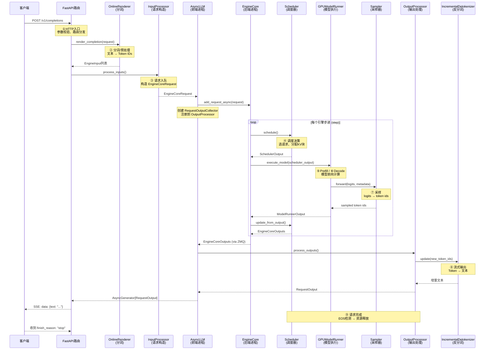

# 透过 vLLM 深入分析一次推理的完整旅程：从 HTTP 请求到 Token 流出

> **系列**: vLLM 技术博客系列 | **类型**: 全景概览篇
>
> 每一次大模型推理，都像一封信穿过九道驿站——从 HTTP 投递口出发，经过分词、入队、调度、前向、采样，最终以 Token 流的形式抵达你的终端。本文带你拆开这封"信"，看它如何翻山越岭。

### 引言

想象你寄出一封快递：填写地址、贴邮票、投入邮筒——然后快递在分拣中心被扫描、装车、运输、派送，最终抵达收件人手中。大模型推理的旅程与此如出一辙：用户的 HTTP 请求就是那封信，vLLM 的各个模块就是沿途的驿站，而最终流出的 Token 就是送达的包裹。

本文将完整追踪一次推理请求在 vLLM V1 架构中的生命周期，从 FastAPI 路由接收到 HTTP 请求开始，到客户端通过 SSE 收到最后一个 Token 结束。每一步都配有源码路径和关键代码引用，让你既能"看到全景"，又能"摸到代码"。

---

### 全景架构：一次推理的九大驿站

```
┌──────────────────────────────────────────────────────────────────────┐
│                       vLLM V1 推理请求生命周期                         │
├──────────────────────────────────────────────────────────────────────┤
│                                                                      │
│  ① HTTP入口        ② 分词/预处理       ③ 请求入队                    │
│  ┌──────────┐     ┌──────────────┐    ┌──────────────────┐          │
│  │ FastAPI  │────>│ OnlineRenderer│───>│ InputProcessor   │          │
│  │ /v1/cmpl │     │ + Tokenizer  │    │ → EngineCoreReq  │          │
│  └──────────┘     └──────────────┘    └────────┬─────────┘          │
│                                                 │                    │
│                    ZMQ IPC                       ▼                    │
│              ┌────────────────────────────────────┐                  │
│              │        AsyncLLM (前端进程)          │                  │
│              │  OutputProcessor + RequestOutputCollector            │
│              └────────────────┬───────────────────┘                  │
│                               │ add_request_async()                  │
│              ┌────────────────▼───────────────────┐                  │
│              │     EngineCore (后端进程)            │                  │
│              │                                     │                  │
│  ④ 调度决策  │  ┌─────────────────────────────┐   │                  │
│              │  │  Scheduler.schedule()         │   │                  │
│              │  │  → SchedulerOutput            │   │                  │
│              │  └──────────────┬──────────────┘   │                  │
│  ⑤ Prefill  │                 │                   │                  │
│  ⑥ Decode   │  ┌──────────────▼──────────────┐   │                  │
│              │  │  GPUModelRunner.execute_model │   │                  │
│              │  │  → forward pass → logits      │   │                  │
│              │  └──────────────┬──────────────┘   │                  │
│  ⑦ 采样     │  ┌──────────────▼──────────────┐   │                  │
│              │  │  Sampler.forward()            │   │                  │
│              │  │  → sampled token ids          │   │                  │
│              │  └──────────────┬──────────────┘   │                  │
│              │                 │                   │                  │
│              │  scheduler.update_from_output()     │                  │
│              │  → EngineCoreOutputs                │                  │
│              └────────────────┬───────────────────┘                  │
│                               │ ZMQ IPC                             │
│  ⑧ 流式输出  ┌───────────────▼──────────────────┐                   │
│              │  OutputProcessor.process_outputs()  │                   │
│              │  → Detokenizer → RequestOutput      │                   │
│              │  → SSE Stream → Client              │                   │
│  ⑨ 请求完成  └──────────────────────────────────┘                   │
│                                                                      │
└──────────────────────────────────────────────────────────────────────┘
```

#### 九大阶段总览

| 阶段 | 模块 | 核心职责 | 关键源码路径 |
|------|------|----------|-------------|
| ① HTTP入口 | FastAPI Route | 接收请求，参数校验 | `vllm/entrypoints/openai/completion/api_router.py` |
| ② 分词/预处理 | OnlineRenderer + Tokenizer | 文本→Token IDs，构造EngineInput | `vllm/renderers/online_renderer.py` |
| ③ 请求入队 | InputProcessor | EngineInput→EngineCoreRequest | `vllm/v1/engine/input_processor.py` |
| ④ 调度决策 | Scheduler | 选请求、分配KV Cache块 | `vllm/v1/core/sched/scheduler.py` |
| ⑤ Prefill | GPUModelRunner | 一次前向处理所有输入Token | `vllm/v1/worker/gpu_model_runner.py` |
| ⑥ Decode循环 | GPUModelRunner + Scheduler | 逐Token生成+连续批处理 | 同上 |
| ⑦ 采样 | Sampler | 从logits中选取下一个Token | `vllm/v1/sample/sampler.py` |
| ⑧ 流式输出 | OutputProcessor + Detokenizer | Token→文本，SSE推送 | `vllm/v1/engine/output_processor.py` |
| ⑨ 请求完成 | Scheduler + OutputProcessor | EOS检测，资源释放 | `vllm/v1/engine/core.py` |

---

### 完整请求生命周期序列图



---

### ① HTTP入口：请求投递的第一扇门

一切从一条 HTTP POST 请求开始。vLLM 使用 FastAPI 框架构建 OpenAI 兼容的 API 服务，当客户端发送 `POST /v1/completions` 时，请求首先抵达路由处理函数。

```python
# vllm/entrypoints/openai/completion/api_router.py
@router.post(
    "/v1/completions",
    dependencies=[Depends(validate_json_request)],
)
@with_cancellation
@load_aware_call
async def create_completion(request: CompletionRequest, raw_request: Request):
    handler = completion(raw_request)  # 获取 ServingCompletion 实例
    generator = await handler.create_completion(request, raw_request)

    if isinstance(generator, ErrorResponse):
        return JSONResponse(content=generator.model_dump(), ...)
    elif isinstance(generator, CompletionResponse):
        return JSONResponse(content=generator.model_dump(), ...)

    # 流式响应走 SSE
    return StreamingResponse(content=generator, media_type="text/event-stream")
```

路由层做了三件事：
1. **JSON 校验**：`validate_json_request` 依赖项确保请求体合法
2. **负载感知**：`load_aware_call` 装饰器在高负载时返回 503
3. **流式/非流式分流**：根据返回类型决定 JSON 响应还是 SSE 流

##### 从路由到引擎

`OpenAIServingCompletion.create_completion()` 是核心入口，它调用 `render_completion_request()` 进行预处理，然后通过 `engine_client.generate()` 将请求送入引擎。

```python
# vllm/entrypoints/openai/completion/serving.py
async def _create_completion(self, request, raw_request=None):
    result = await self.render_completion_request(request)
    engine_inputs = result

    request_id = f"cmpl-{self._base_request_id(raw_request)}"
    # ...
    generator = self.engine_client.generate(
        engine_input, sampling_params, request_id_item,
        lora_request=lora_request, trace_headers=trace_headers,
        priority=request.priority, data_parallel_rank=data_parallel_rank,
    )
    # generator 是 AsyncGenerator[RequestOutput, None]
```

> 💡 **性能提示**: `request_id` 格式为 `cmpl-{base_id}`，base_id 可通过 `X-Request-Id` HTTP 头传入，用于端到端追踪。

---

### ② 分词与预处理：把人类语言翻译成机器语言

在请求进入引擎之前，文本必须被转换为 Token ID 序列。vLLM V1 引入了 **Renderer** 架构，将分词、多模态处理统一在 `OnlineRenderer` 中完成。

```python
# vllm/entrypoints/openai/completion/serving.py
async def render_completion_request(self, request):
    error_check_ret = await self._check_model(request)
    if error_check_ret is not None:
        return error_check_ret
    return await self.online_renderer.render_completion(request)
```

`OnlineRenderer.render_completion()` 内部完成：
1. **Prompt 解析**：从请求中提取 `prompt` 字段（字符串或 Token ID 列表）
2. **分词**：如果 prompt 是字符串，调用 `tokenizer.encode()` 转为 Token IDs
3. **多模态处理**：如果请求包含图像等，调用多模态处理器
4. **构造 EngineInput**：返回结构化的输入字典

```
文本: "你好，世界"  ──tokenizer──>  [34567, 89234, 56789]
                                            │
                                    EngineInput dict
                                    {prompt_token_ids: [...],
                                     type: "token_ids"}
```

> 💡 **性能提示**: 如果客户端直接传入 `prompt_token_ids`（而非文本），可以跳过分词步骤，减少约 5-10ms 的前端延迟。

---

### ③ 请求入队：从"信件"到"快递包裹"

`EngineInput` 只是预处理的结果，真正进入引擎核心需要封装为 `EngineCoreRequest`。这一步由 `InputProcessor` 完成。

```python
# vllm/v1/engine/input_processor.py
def process_inputs(
    self, request_id, prompt, params, supported_tasks, ...
) -> EngineCoreRequest:
    self._validate_params(params, supported_tasks)
    self._validate_lora(lora_request)

    # 分词（如果传入的是原始文本而非 EngineInput）
    processed_inputs = self.input_preprocessor.preprocess(
        prompt, tokenization_kwargs=tokenization_kwargs,
    )

    # 分离编码器/解码器输入（针对 encoder-decoder 模型）
    encoder_inputs, decoder_inputs = split_enc_dec_input(processed_inputs)
    self._validate_model_inputs(encoder_inputs, decoder_inputs)

    # 提取 prompt_token_ids 和 prompt_embeds
    if decoder_inputs["type"] == "embeds":
        prompt_embeds = decoder_inputs["prompt_embeds"]
    else:
        prompt_token_ids = decoder_inputs["prompt_token_ids"]

    # 克隆并更新 SamplingParams（设置默认 max_tokens 等）
    sampling_params = params.clone()
    if sampling_params.max_tokens is None:
        sampling_params.max_tokens = self.model_config.max_model_len - seq_len

    return EngineCoreRequest(
        request_id=request_id,
        prompt_token_ids=prompt_token_ids,
        mm_features=mm_features,
        sampling_params=sampling_params,
        pooling_params=pooling_params,
        arrival_time=arrival_time,
        lora_request=lora_request,
        ...
    )
```

`EngineCoreRequest` 是一个 `msgspec.Struct`，它包含了推理所需的全部信息：

```python
# vllm/v1/engine/__init__.py
class EngineCoreRequest(msgspec.Struct, array_like=True, omit_defaults=True):
    request_id: str
    prompt_token_ids: list[int] | None
    mm_features: list[MultiModalFeatureSpec] | None
    sampling_params: SamplingParams | None
    pooling_params: PoolingParams | None
    arrival_time: float
    lora_request: LoRARequest | None
    cache_salt: str | None
    data_parallel_rank: int | None
    prompt_embeds: torch.Tensor | None = None
    priority: int = 0
    external_req_id: str | None = None
    ...
```

> 笔者注：`msgspec.Struct` 配合 `array_like=True` 和 `omit_defaults=True`，使序列化/反序列化极快——这在跨进程 ZMQ 通信中至关重要。

##### 双进程架构的关键一步

在 `AsyncLLM.add_request()` 中，请求被同时注册到两个地方：

```python
# vllm/v1/engine/async_llm.py
async def _add_request(self, request, prompt, parent_req, index, queue):
    # 注册到 OutputProcessor（前端进程，负责输出处理）
    self.output_processor.add_request(request, prompt, parent_req, index, queue)
    # 发送到 EngineCore（后端进程，负责调度+执行）
    await self.engine_core.add_request_async(request)
```

前端进程（AsyncLLM）和后端进程（EngineCore）通过 **ZMQ** 进行跨进程通信。`RequestOutputCollector` 作为桥梁，接收后端产出的结果并通知前端异步生成器。

---

### ④ 调度决策：在资源约束下运筹帷幄

请求到达 EngineCore 后，并非立即执行——它需要等待 Scheduler 的"宣判"。Scheduler 在每个 step 中做出关键决策：哪些请求可以运行、分配多少 KV Cache 块、多少 Token 可以参与计算。

```python
# vllm/v1/engine/core.py
def step(self) -> tuple[dict[int, EngineCoreOutputs], bool]:
    if not self.scheduler.has_requests():
        return {}, False

    # 1. 调度：选出要运行的请求和要计算的Token
    scheduler_output = self.scheduler.schedule(self._should_throttle_prefills())

    # 2. 执行：将调度结果交给模型执行器
    future = self.model_executor.execute_model(scheduler_output, non_block=True)

    # 3. 采样（如果模型输出为 None，由单独的采样步骤处理）
    model_output = future.result()
    if model_output is None:
        model_output = self.model_executor.sample_tokens(grammar_output)

    # 4. 更新：将模型输出反馈给调度器
    engine_core_outputs = self.scheduler.update_from_output(
        scheduler_output, model_output
    )
    return engine_core_outputs, scheduler_output.total_num_scheduled_tokens > 0
```

##### Scheduler 的核心逻辑

```python
# vllm/v1/core/sched/scheduler.py
class Scheduler(SchedulerInterface):
    def __init__(self, vllm_config, kv_cache_config, ...):
        self.max_num_running_reqs = self.scheduler_config.max_num_seqs
        self.max_num_scheduled_tokens = (
            self.scheduler_config.max_num_scheduled_tokens
        )
        self.requests: dict[str, Request] = {}
        # ...
```

Scheduler 维护三类请求队列：
- **waiting**：等待被调度的请求（新加入的请求）
- **running**：正在解码的请求（decode 阶段）
- **prefill**：等待预填充的请求

调度决策的约束条件：
1. **KV Cache 容量**：可用 GPU 块数决定能承载多少请求
2. **Token 预算**：`max_num_scheduled_tokens` 限制每步处理的 Token 总数
3. **请求数上限**：`max_num_running_reqs` 限制并发请求数
4. **策略优先级**：FCFS（默认）或优先级调度

调度输出 `SchedulerOutput` 包含每个请求的：
- 要计算的 Token 数量
- 分配的 KV Cache 块 ID
- 是否为新请求（需要 prefill）

> 💡 **性能提示**: `max_num_scheduled_tokens` 是吞吐和延迟的"旋钮"——值越大，吞吐越高但延迟也越高；值越小，延迟低但吞吐受限。

---

### ⑤ Prefill 阶段：一口气读完所有输入

当 Scheduler 将一个新请求纳入调度时，该请求进入 **Prefill** 阶段。在这个阶段，模型需要一次性"读完"用户输入的所有 Token，计算并缓存它们的 KV 向量。

```
输入: "请介绍一下人工智能的发展历史"
Token IDs: [4523, 78901, 23456, 34567, 89012, 12345, 67890, 54321, 98765]
         │
    ┌────▼────┐
    │ Prefill  │  ← 一次 forward pass 处理所有输入 Token
    │ 9 tokens │  ← 计算 KV Cache，生成第一个输出 Token
    └────┬────┘
         │
    输出 Token: "人"
```

在 `GPUModelRunner.execute_model()` 中，Prefill 和 Decode 共用同一个前向路径，区别在于输入的 Token 数量：

```python
# vllm/v1/worker/gpu_model_runner.py
@torch.inference_mode()
def execute_model(self, scheduler_output, intermediate_tensors=None):
    num_scheduled_tokens = scheduler_output.total_num_scheduled_tokens

    # 更新持久化批次状态
    deferred_state_corrections_fn = self._update_states(scheduler_output)

    # 准备输入
    logits_indices, spec_decode_metadata = self._prepare_inputs(
        scheduler_output, num_scheduled_tokens_np,
    )

    # ... 构造 attention metadata、加载 token IDs 到 GPU ...

    # 模型前向计算
    hidden_states = self.model(
        input_ids=input_ids,
        positions=positions,
        kv_caches=kv_caches,
        attn_metadata=attn_metadata,
    )

    # 采样
    logits = self.model.compute_logits(hidden_states, ...)
    sampler_output = self.sampler(logits, sampling_metadata)
    return ModelRunnerOutput(...)
```

Prefill 的关键特征：
- **一次性处理**：所有输入 Token 在一个 forward pass 中完成
- **KV Cache 写入**：计算结果写入 PagedAttention 的 KV Cache 块
- **首 Token 延迟**：Prefill 的计算量与输入长度成正比，是 TTFT 的主要贡献者

> 笔者注：vLLM V1 支持 **Chunked Prefill**——当输入很长时，可以将 Prefill 拆分为多个 chunk，与 Decode 请求交错执行，避免长输入阻塞短请求。

---

### ⑥ Decode 循环：一个 Token 一个 Token 地"吐字"

Prefill 完成后，请求进入 **Decode** 阶段——这是"逐字生成"的核心循环。每个 step 只为每个请求生成一个 Token，但多个请求通过 **连续批处理 (Continuous Batching)** 被打包在一起执行。

```
Step 1:  [Req-A: "人"] [Req-B: "在"] [Req-C: "深"]
              ↓              ↓              ↓
Step 2:  [Req-A: "工"] [Req-B: "工"] [Req-C: "度"]
              ↓              ↓              ↓
Step 3:  [Req-A: "智"] [Req-B: "作"] [Req-C: "学"]
              ↓              ↓              ↓
         ...            ... (EOS!)        ...
```

连续批处理的魔法在于：
1. **动态组批**：每个 step，Scheduler 自由组合 Prefill 和 Decode 请求
2. **即走即停**：请求完成后立即从批次中移除，新请求立即加入
3. **KV Cache 共享**：所有请求共享同一组 GPU 上的 KV Cache 块池

Decode 阶段的关键性能指标是 **TPOT**（Time Per Output Token），即每生成一个 Token 的延迟。在连续批处理下，TPOT 主要受批次大小影响——批次越大，每个 Token 的计算分摊越多，TPOT 越高。

---

### ⑦ 采样：从概率分布中挑选下一个词

模型前向计算的输出是 **logits**——一个形状为 `[num_tokens, vocab_size]` 的张量，表示每个位置上所有词的概率（未归一化）。Sampler 负责从这些 logits 中"挑选"下一个 Token。

```python
# vllm/v1/sample/sampler.py
class Sampler(nn.Module):
    """
    采样步骤（按顺序执行）:
    1. 如果需要 logprobs，计算原始 logprobs
    2. 将 logits 转为 float32
    3. 应用 allowed token ids 白名单
    4. 应用 bad words 排除
    5. 应用非 argmax 不变的 logit 处理器（min_tokens, logit_bias）
    6. 应用惩罚（repetition, frequency, presence）
    7. 采样（greedy 或 random，含 temperature/top_k/top_p）
    8. 收集 top logprobs
    9. 返回 SamplerOutput
    """

    def forward(self, logits, sampling_metadata, predict_bonus_token=False):
        # 转为 float32 精度
        logits = logits.to(torch.float32)

        # 应用 logit 处理器
        logits = self.apply_logits_processors(logits, sampling_metadata, ...)

        # 采样
        sampled, processed_logprobs = self.sample(logits, sampling_metadata)
        sampled = sampled.long()  # 确保 int64 兼容性

        return SamplerOutput(...)
```

采样的核心分支：

| 条件 | 采样方式 | 说明 |
|------|----------|------|
| `all_greedy=True` 或 `temperature < 1e-5` | Greedy | 取 argmax，确定性输出 |
| `temperature >= 1e-5` | Random | temperature 缩放 → top_k → top_p → 随机采样 |
| `top_k > 0` | Top-K 过滤 | 只保留概率最高的 K 个候选 |
| `top_p < 1.0` | Top-P (Nucleus) | 保留累积概率不超过 P 的最小候选集 |

> 💡 **性能提示**: `TopKTopPSampler` 使用 fused CUDA kernel 将 top-k 和 top-p 合并为一次操作，避免多次 GPU 往返。对于 greedy 采样（temperature=0），整个采样路径几乎是零开销的 argmax。

---

### ⑧ 流式输出：Token 变成文字，奔向客户端

采样产生的 Token ID 需要经过 **反分词 (Detokenization)** 才能变成人类可读的文字。vLLM V1 使用 `IncrementalDetokenizer` 实现增量反分词——每收到一个新 Token，只解码增量部分。

### 输出处理流程

```python
# vllm/v1/engine/async_llm.py — output_handler 后台任务
async def output_handler():
    while True:
        # 1) 从 EngineCore 拉取输出
        outputs = await engine_core.get_output_async()

        # 2) 分块处理（避免长时间阻塞事件循环）
        for start in range(0, num_outputs, chunk_size):
            outputs_slice = engine_core_outputs[start:end]
            # 3) 处理输出 → 反分词 + logprobs + 构造 RequestOutput
            processed_outputs = output_processor.process_outputs(
                outputs_slice, outputs.timestamp, iteration_stats
            )
            # 4) RequestOutput 被推送到对应请求的 queue
            # （由 RequestOutputCollector 管理）

        # 5) 终止需要 abort 的请求
        if processed_outputs.reqs_to_abort:
            await engine_core.abort_requests_async(processed_outputs.reqs_to_abort)
```

#### 增量反分词

```python
# vllm/v1/engine/detokenizer.py
class FastIncrementalDetokenizer(BaseIncrementalDetokenizer):
    def update(self, new_token_ids, stop_terminated):
        # 增量解码：只处理新增的 Token
        self.token_ids.extend(new_token_ids)
        # 使用 tokenizers 库的 DecodeStream 进行高效增量解码
        ...
```

反分词需要处理一个微妙问题——**UTF-8 边界**：一个中文字符可能由 2-3 个 Token 组成，如果只收到部分 Token，不能立即输出，需要"暂存"不完整的字节，等后续 Token 补全后再输出。`stop_buffer_length` 还需要处理 stop string 的检测——如果 stop string 被拆分到多个 Token 中，需要等收到完整序列才能决定是否截断。

#### 流式推送

最终，`RequestOutput` 通过 `AsyncGenerator` 推送到 FastAPI 层，再通过 **SSE (Server-Sent Events)** 格式发送给客户端：

```
data: {"id":"cmpl-abc123","choices":[{"text":"人","index":0}]}
data: {"id":"cmpl-abc123","choices":[{"text":"工","index":0}]}
data: {"id":"cmpl-abc123","choices":[{"text":"智","index":0}]}
...
data: {"id":"cmpl-abc123","choices":[{"text":"。","index":0,"finish_reason":"stop"}]}
data: [DONE]
```

> 💡 **性能提示**: `stream_interval` 参数控制输出推送频率——默认为 1（每 Token 都推送），设为更大值可以减少 SSE 帧数，降低网络开销。

---

### ⑨ 请求完成：打扫战场，释放资源

当以下任一条件满足时，请求被视为完成：
- **EOS Token**：模型输出了结束符号（`finish_reason: "stop"`）
- **长度限制**：输出达到 `max_tokens` 或 `max_model_len`（`finish_reason: "length"`）
- **Stop String**：输出了用户指定的停止字符串
- **客户端中断**：客户端断开连接（`finish_reason: "abort"`）
- **重复检测**：检测到重复性幻觉（`finish_reason: "repetition"`）

```python
# vllm/v1/engine/__init__.py
class FinishReason(enum.IntEnum):
    STOP = 0       # 遇到 stop string 或 EOS
    LENGTH = 1     # 达到 max_tokens 或 max_model_len
    ABORT = 2      # 客户端中断
    ERROR = 3      # 可重试的请求级内部错误（如 KV 加载失败）
    REPETITION = 4 # 检测到重复性幻觉
```

请求完成后的资源回收流程：

```
EngineCore                              AsyncLLM (前端)
    │                                       │
    │  scheduler.update_from_output()       │
    │  → 标记请求为 FINISHED                │
    │  → 释放 KV Cache 块                   │
    │  → 从 requests dict 中移除            │
    │                                       │
    │  ──── EngineCoreOutputs (via ZMQ) ──> │
    │                                       │  output_processor.process_outputs()
    │                                       │  → 检测 FinishReason
    │                                       │  → 构造最终 RequestOutput (finished=True)
    │                                       │  → 清理 RequestState
    │                                       │
    │                                       │  generate() 循环检测到 finished=True
    │                                       │  → 退出循环
    │                                       │  → q.close()
```

在 Scheduler 中，`update_from_output()` 是关键的"善后"步骤：

```python
# vllm/v1/engine/core.py
def step(self):
    scheduler_output = self.scheduler.schedule(...)
    future = self.model_executor.execute_model(scheduler_output, non_block=True)
    grammar_output = self.scheduler.get_grammar_bitmask(scheduler_output)  # 语法约束掩码
    model_output = future.result()
    if model_output is None:
        model_output = self.model_executor.sample_tokens(grammar_output)  # 采样
    self._process_aborts_queue()  # 处理模型执行期间的客户端中断
    engine_core_outputs = self.scheduler.update_from_output(
        scheduler_output, model_output
    )
    return engine_core_outputs, ...
```

`update_from_output()` 内部会：
1. 检查每个请求的 FinishReason
2. 对完成的请求调用 `finish_requests()`，释放 KV Cache 块
3. 构造 `EngineCoreOutput`，包含新生成的 Token ID 和完成信息

---

### 双进程架构：前端与后端的协同

理解 vLLM V1 的推理旅程，必须理解其**双进程架构**：

```
┌─────────────────────────────────────────────────────────┐
│                   前端进程 (Frontend)                     │
│                                                         │
│  ┌──────────┐  ┌────────────────┐  ┌────────────────┐  │
│  │ AsyncLLM  │  │ InputProcessor │  │OutputProcessor │  │
│  │ (主协调者) │  │ (请求构造)      │  │ (输出处理)      │  │
│  └─────┬────┘  └───────┬────────┘  └───────┬────────┘  │
│        │               │                   │            │
│        └───────────────┼───────────────────┘            │
│                        │ ZMQ IPC                        │
├────────────────────────┼────────────────────────────────┤
│                        ▼                                │
│                   后端进程 (Backend)                     │
│                                                         │
│  ┌──────────────┐  ┌──────────────┐  ┌──────────────┐  │
│  │  EngineCore   │  │  Scheduler   │  │ ModelExecutor│  │
│  │  (引擎核心)   │  │  (调度器)     │  │ (模型执行器)  │  │
│  └──────────────┘  └──────────────┘  └──────────────┘  │
│                                                         │
└─────────────────────────────────────────────────────────┘
```

**为什么要分离？**

1. **GIL 隔离**：Python GIL 会阻塞 GPU 操作。将 EngineCore 放在独立进程中，前端 asyncio 事件循环不会被模型计算阻塞
2. **容错**：后端进程崩溃不会直接拖垮前端，可以优雅地返回错误
3. **内存隔离**：CUDA 内存由后端独占管理，避免前端内存压力影响推理

`EngineCoreClient` 是跨进程通信的桥梁：

```python
# vllm/v1/engine/core_client.py
class EngineCoreClient(ABC):
    """子类:
    * InprocClient: 同进程（调试用）
    * SyncMPClient: ZMQ + 后台进程（LLM 同步模式）
    * AsyncMPClient: ZMQ + 后台进程 + asyncio（AsyncLLM 模式）
    """
```

> 笔者注：生产环境默认使用 `AsyncMPClient`，通过 ZMQ 的 `DEALER/ROUTER` 模式实现双向异步通信。请求通过 msgpack 序列化后发送，输出同理。`msgspec` 库的零拷贝反序列化使这一层的开销极低。

---

### 总结与行动指南

#### 九大阶段速查表

| 阶段 | 发生在哪里 | 耗时量级 | 关键优化点 |
|------|-----------|---------|-----------|
| ① HTTP入口 | 前端进程 | < 1ms | 传入 `prompt_token_ids` 跳过分词 |
| ② 分词/预处理 | 前端进程 | 5-10ms | 多模态输入使用 MM Cache |
| ③ 请求入队 | 前端→后端 | < 1ms | msgpack 序列化，ZMQ 零拷贝 |
| ④ 调度决策 | 后端进程 | < 1ms | `max_num_scheduled_tokens` 调优 |
| ⑤ Prefill | GPU | 与输入长度成正比 | Chunked Prefill 避免阻塞 |
| ⑥ Decode循环 | GPU | ~10-50ms/step | 连续批处理最大化 GPU 利用率 |
| ⑦ 采样 | GPU | < 1ms | Greedy 采样几乎零开销 |
| ⑧ 流式输出 | 前端进程 | < 1ms/Token | `stream_interval` 减少推送频率 |
| ⑨ 请求完成 | 双端 | < 1ms | KV Cache 块即时回收 |

#### 一句话行动建议

> **调优时，先量 TTFT（关注 Prefill），再量 TPOT（关注 Decode 批次大小），最后看端到端吞吐（关注调度参数 `max_num_scheduled_tokens`）。**

#### 延伸阅读

- vLLM 官方文档：https://docs.vllm.ai
- PagedAttention 论文：https://arxiv.org/abs/2309.06180
- vLLM GitHub 仓库地址：https://github.com/vllm-project/vllm

---

*本文属于 [vLLM 技术博客系列]，欢迎持续关注。*
