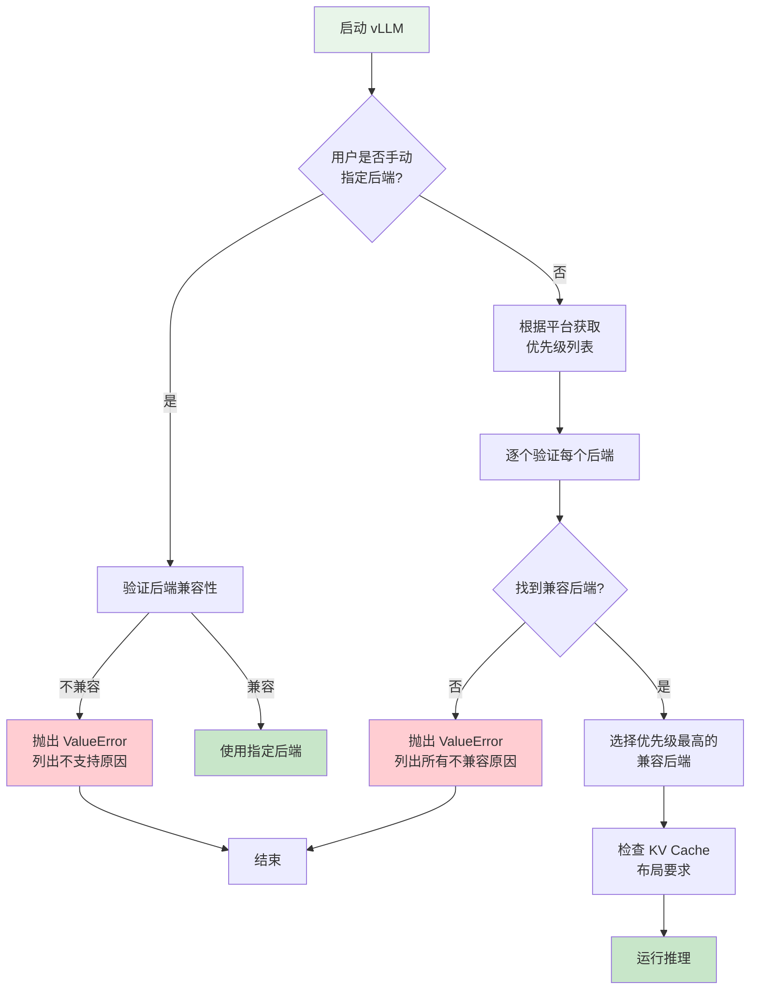

# 详解 vLLM 注意力后端：FlashAttention vs FlashInfer 的选择之道

> **系列**: vLLM 技术博客系列 | **类型**: 核心技术详解篇
> 当你的 LLM 推理遇到瓶颈，十有八九是注意力在"拖后腿"——本文带你摸清 vLLM 如何为不同硬件、不同场景选对注意力后端。

---

进入正文之前，笔者补充啰嗦两句，vLLM发展极快，看每天的MR就可以看出来，笔者个人是有点震惊的，同时感慨在商业世界里生态，生态，生态不是一朝一夕几个人建立起来的。回到这里最想说的，就在7月2号，也就是上周，vLLM同日合入三条重大信号PR：MRV2 默认启用、PagedAttention 退役、Rust 前端补齐 TLS/mTLS。

vLLM V2 代际切换：告别双轨维护！`PR #44443` 将 ModelRunner V2 设为所有 dense 模型的默认执行路径。这不只是 flag 切换：vLLM 长达两年的 V2 重写工程正式接棒，V1 执行引擎在同一天卸下维护负担。

`PR #47361`赫然写着 `Delete PagedAttention`，正文有一句也干脆利落，`It is time.`。PagedAttention 的原始实现被整体删除 ，让位给 `FlashInfer + TRTLLM attention` 后端。PagedAttention 是 vLLM 自 2023 年成名的标志性贡献，代码被删除说明 V2 的 attention 后端已覆盖所有场景，原始实现不再需要独立存在。

V2 的 FlashInfer/TRTLLM attention 后端也意味着 vLLM 对 kernel 层的控制从自研切换到跟随上游——这是一个值得长期关注的权衡。对金融和医疗场景，mTLS 的双向证书认证是硬需求——补上了 vLLM 在生产部署中的合规短板。

### 引言

想象你参加一场聚会：5 个人互相握手介绍，只需 10 次，谁都能轻松应付；但来了 50 个人呢？互相握手需要 1225 次——每多来一个人，不是多握 1 次手，而是要和在场的所有人各握一次。人数翻 10 倍，握手次数翻 100 倍，这就是 O(n²) 的威力。

LLM 推理中的注意力计算也是如此：每个 Token 都要"看"所有其他 Token，序列越长，计算量越爆炸。短序列时任何后端都撑得住，可一旦拉长到数万 Token，"怎么握手"就成了性能的生死线——有的后端逐对握手（朴素实现，O(n²) 显存爆炸），有的分批集体握手（FlashAttention Tiling，SRAM 中逐块归一化），有的按桌派代表（FlashInfer Paged KV Cache，Prefill/Decode 分离优化）。

vLLM 设计了一套智能的**注意力后端选择器**，根据硬件和场景自动为你挑出最优的"握手方案"。今天我们就来拆解这套机制，看看每种后端到底强在哪里、弱在哪里，以及 vLLM 如何帮我们做出正确选择。

---

### 一、为什么注意力是推理的瓶颈

##### 1.1 O(n²) 的诅咒

继续聚会的比喻：5 人聚会，每人要和其他 4 人握手，总共 5×4/2 = 10 次，轻松搞定。但 128K 人的聚会呢？握手对数约 82 亿次——而注意力矩阵要存 n² = 164 亿个分数，场地（显存）装不下握手记录，主持人（GPU）也数不过来。

注意力计算就是这个"全员握手"：每个 Token 都要和所有其他 Token 算一次相似度（"握一次手"），所以计算量随序列长度**平方级**增长。标准自注意力的计算公式为：

```
Attention(Q, K, V) = softmax(Q × K^T / √d) × V
```

其中 `Q × K^T` 这一步产生了 n×n 的注意力矩阵——这就是"握手记录本"，每对 Token 之间都有一个分数。推导链条：

```
序列长度 n → 握手对数 n² → 计算量 O(n²·d) → 注意力矩阵显存 n² × 2 bytes (FP16)
```

| 序列长度 n | 握手对数 n² | 相对 1K 的倍数 | 注意力矩阵显存 (FP16) | 体感 |
|:---|:---|:---|:---|:---|
| 1K | 1M (100万) | 1× | 1M × 2B = **2 MB** | 小菜一碟 |
| 4K | 16M | 16× | 16M × 2B = **32 MB** | 还行，有点热 |
| 16K | 256M | 256× | 256M × 2B = **512 MB** | 开始吃力了 |
| 128K | 16G (160亿) | 16384× | 16G × 2B = **32 GB** | 不优化根本跑不动 |

> 笔者注：128K 的 DeepSeek-R1 推理时，仅注意力这一步就可能吃掉 32 GB 显存——一块 H100 总共才 80 GB。一个写得不好的注意力内核，可以让 H100 变成 4090。

##### 1.2 标准实现的"三宗罪"

知道 O(n²) 很可怕之后，再看朴素实现为什么扛不住——它有三个致命问题：

| 罪状 | 比喻 | 技术本质 | 后果 |
|:---|:---|:---|:---|
| **显存爆炸** | 每次握手都拍照存档，128K 人聚会要存 80 亿张照片 | 中间结果 QK^T 是 n×n 矩阵，必须完整存入显存 | 长序列直接 OOM |
| **带宽瓶颈** | 每来一位新客人，要翻阅所有之前 10 万人的名片才能打招呼 | Decode 每生成 1 个 Token，要读取整个 KV Cache | GPU 算力闲置，等内存搬运 |
| **批量不友好** | 10 桌客人每桌人数不同，按最多那桌摆椅子，空座一大片 | 不同请求序列长度各异，padding 对齐浪费严重 | 显存和算力双重浪费 |

这些问题的解决方案就是**注意力后端**——有的后端不存照片只记摘要（FlashAttention Tiling），有的后端按桌派代表（FlashInfer Paged KV Cache），有的后端灵活拼桌（Triton 统一内核）。后文逐一拆解。

---

### 二、vLLM V1 的注意力后端抽象

##### 2.1 架构总览

vLLM V1 将注意力实现抽象为三层核心组件：

```
┌──────────────────────────────────────────────────────┐
│                   AttentionSelector                   │
│          (根据平台/配置选择最佳后端)                      │
├──────────────────────────────────────────────────────┤
│                  AttentionBackend (ABC)                │
│  ┌─────────────┐  ┌────────────────────┐             │
│  │ validate()  │  │ get_kv_cache_shape │             │
│  │ supports_*  │  │ get_impl_cls()     │             │
│  │ get_builder │  │ get_name()         │             │
│  └─────────────┘  └────────────────────┘             │
├──────────────────────────────────────────────────────┤
│              AttentionMetadataBuilder                  │
│          (构建每层的注意力元数据)                        │
├──────────────────────────────────────────────────────┤
│                 AttentionImplBase                      │
│  ┌──────────────┐  ┌───────────────────┐             │
│  │ AttentionImpl│  │ MLAAttentionImpl  │             │
│  │  forward()   │  │ forward_mha()     │             │
│  │              │  │ forward_mqa()     │             │
│  └──────────────┘  └───────────────────┘             │
└──────────────────────────────────────────────────────┘
```

`AttentionBackend` 是核心抽象基类，定义在 `vllm/v1/attention/backend.py` 中。每个后端必须实现：

- `get_name()` —— 返回后端名称字符串
- `get_impl_cls()` —— 返回具体的 `AttentionImpl` 实现类
- `get_builder_cls()` —— 返回元数据构建器类
- `get_kv_cache_shape()` —— 定义 KV Cache 的张量形状
- `validate_configuration()` —— 校验当前配置是否兼容

此外，`AttentionBackend` 还通过一系列 `supports_*` 类方法声明自身的能力：

```python
# vllm/v1/attention/backend.py
class AttentionBackend(ABC):
    supported_dtypes: ClassVar[list[torch.dtype]] = [torch.float16, torch.bfloat16]
    supported_kv_cache_dtypes: ClassVar[list["CacheDType"]] = ["auto", "float16", "bfloat16"]

    @classmethod
    def supports_head_size(cls, head_size: int) -> bool: ...
    @classmethod
    def supports_non_causal(cls) -> bool: ...    # 是否支持双向注意力
    @classmethod
    def supports_sink(cls) -> bool: ...          # 是否支持 Attention Sink
    @classmethod
    def supports_mm_prefix(cls) -> bool: ...     # 是否支持多模态前缀
    @classmethod
    def is_mla(cls) -> bool: ...                 # 是否为 MLA 注意力
    @classmethod
    def supports_compute_capability(cls, capability) -> bool: ...
```

> 笔者注： vLLM 的 `supports_*` 模式是一种"能力声明"机制——每个后端只声明自己能做什么，由选择器负责匹配。这种设计让新后端的接入变得极其简单：继承 `AttentionBackend`，实现必要的接口，注册到枚举中即可。

笔者曾在云原生系统中利用support接口模式做过后端组件和前端组件的解耦，这里总结出`supports_*`模式是一种`能力声明`机制，太棒了！通过动态的方式，后端声明支持什么，由前端自由匹配，匹配上就是支持，就按支持的逻辑显示，从而避免了大量的烦人的云服务各个region的不同特性的开关的变更。系统自适应，不需要人工干涉，妙哉。

##### 2.2 后端注册表

所有后端通过 `AttentionBackendEnum` 枚举注册，定义在 `vllm/v1/attention/backends/registry.py` 中：

```python
# vllm/v1/attention/backends/registry.py
class AttentionBackendEnum(Enum, metaclass=_AttentionBackendEnumMeta):
    FLASH_ATTN = "vllm.v1.attention.backends.flash_attn.FlashAttentionBackend"
    FLASHINFER = "vllm.v1.attention.backends.flashinfer.FlashInferBackend"
    TRITON_ATTN = "vllm.v1.attention.backends.triton_attn.TritonAttentionBackend"
    ROCM_ATTN = "vllm.v1.attention.backends.rocm_attn.RocmAttentionBackend"
    CPU_ATTN = "vllm.v1.attention.backends.cpu_attn.CPUAttentionBackend"
    FLEX_ATTENTION = "vllm.v1.attention.backends.flex_attention.FlexAttentionBackend"
    # ... 以及 MLA 系列、ROCm 系列、TURBOQUANT 等
```

枚举值是后端类的完整限定路径，运行时通过 `resolve_obj_by_qualname` 延迟导入，避免了循环依赖和不必要的 CUDA 初始化。

---

### 三、FlashAttention：高效注意力的基石

##### 3.1 核心思想：Tiling 消除中间矩阵

FlashAttention（由 Tri Dao 等人提出）解决的是 1.2 节的第一宗罪——**显存爆炸**。问题根源在于标准注意力必须先算出完整的 n×n 注意力矩阵 S = QK^T，再对整个矩阵做 softmax，最后乘以 V。这个 n×n 矩阵就是"8 亿张握手照片"——128K 序列要 32 GB，显存根本装不下。

FlashAttention 的核心创新是 **Tiling**（分块计算）：把 Q、K、V 切成小块，每次只把一小块搬进 GPU 的 SRAM（片上高速缓存，~192 KB，但带宽是 HBM 的 10 倍以上），在 SRAM 里算完再写回 HBM，从而**从不实例化完整的 n×n 矩阵**。

```
标准注意力（必须存完整矩阵）:          FlashAttention Tiling（逐块计算，不存矩阵）:

  Q (n×d)                                Q 切成 Q_1, Q_2, Q_3 ...
    │                                    K 切成 K_1, K_2, K_3 ...
    ▼                                    V 切成 V_1, V_2, V_3 ...
  S = QK^T (n×n)  ← 32 GB! 装不下
    │                                    逐块搬进 SRAM:
    ▼                                    ┌─────────────────────────────┐
  softmax(S)  ← 需要完整矩阵才能归一化    │  SRAM (~192 KB, 极快)        │
    │                                    │                             │
    ▼                                    │  第1轮: Q_1 × K_1^T → 分数  │
  O = S × V                              │  Online Softmax 归一化      │
                                          │  乘以 V_1 → 部分输出        │
  问题: n×n 矩阵必须完整存在显存中        │                             │
  → 长序列 OOM                           │  第2轮: Q_1 × K_2^T → 分数  │
                                          │  用 running sum 合并结果     │
                                          │  乘以 V_2 → 更新输出        │
                                          │  ...                        │
                                          └─────────────────────────────┘
                                                  │
                                                  ▼
                                           最终输出 O (n×d)
                                           从未出现 n×n 矩阵!
```

关键问题来了：softmax 需要知道所有分数才能归一化（分母是所有 exp 值之和），但 Tiling 每次只看到一小块分数，怎么做全局归一化？

答案是 **Online Softmax**：维护两个"跑步累加器"——`running_max`（目前见过的最大分数）和 `running_sum`（目前的归一化分母）。每处理一块新的 QK 分数，就用这两个累加器修正之前的结果，最终和完整 softmax 数学等价。

```
Online Softmax 的直觉（聚会比喻）:

  你在统计每位嘉宾的"受欢迎程度占比"：
  - 标准做法：等所有人投完票，统一计算占比 → 必须等所有票（完整矩阵）
  - Online 做法：每来一桌新票，就修正之前的占比 → 不用等所有票，逐桌更新

  关键技巧：新来一桌时，如果发现更高的票数（running_max 更新），
  之前的占比要按比例缩小，再加上新桌的占比。
  数学上和"等所有票到齐再算"完全等价。
```

这把 HBM 访问从 O(n²) 降低到了 O(n²d²/M)，其中 M 是 SRAM 大小——更大的 SRAM 意味着更少的 HBM 读写次数。

##### 3.2 vLLM 中的 FlashAttention 后端

vLLM 的 `FlashAttentionBackend` 封装了 FA2/FA3/FA4 三个版本，自动根据 GPU 架构选择：

```python
# vllm/v1/attention/backends/flash_attn.py
class FlashAttentionBackend(AttentionBackend):
    supported_dtypes: ClassVar[list[torch.dtype]] = [torch.float16, torch.bfloat16]
    supported_kv_cache_dtypes: ClassVar[list[CacheDType]] = [
        "auto", "float16", "bfloat16",
    ]

    @classmethod
    def supports_compute_capability(cls, capability: DeviceCapability) -> bool:
        return capability >= DeviceCapability(8, 0)  # 最低要求 SM80 (Ampere)
```

| 版本  | 最低 SM | FP8 KV Cache | Sink 支持 | MM Prefix | 备注                     |
| ----- | ------- | ------------ | --------- | --------- | ------------------------ |
| FA2   | SM80    | 否           | 否        | 否        | 稳定，兼容性最广         |
| FA3   | SM90    | 是           | 是        | 否        | Hopper 专用，FP8 原生    |
| FA4   | SM100   | 否           | 是        | 是        | Blackwell 专用，最新特性 |

> 笔者注： FA3 在 Hopper (H100) 上开启 FP8 KV Cache 可以节省约 50% 的 KV Cache 显存，同时维持精度。如果你用的是 A100 或更早的卡，FA2 是唯一选择。

FlashAttention 后端的 KV Cache 布局采用 **NHD** 格式（详情见 KV Cache 布局差异 章节）：

```python
# vllm/v1/attention/backends/flash_attn.py
@staticmethod
def get_kv_cache_shape(num_blocks, block_size, num_kv_heads, head_size, ...):
    return (num_blocks, 2, block_size, num_kv_heads, head_size)
    #             ↑  ↑       ↑            ↑             ↑
    #          块数 KV  块内Token数  KV头数       头维度
```

---

### 四、FlashInfer：为 LLM 推理量身定制的注意力

##### 4.1 核心优势：Prefill/Decode 分离 + Paged KV Cache

如果说 FlashAttention 是通用的"高效注意力"库，那 FlashInfer 就是专门为 LLM 推理场景优化的"推理注意力"库。它的核心设计理念是：

1. **Prefill 与 Decode 使用不同的内核**：Prefill 是计算密集型，Decode 是访存密集型，二者最优内核完全不同
2. **原生 Paged KV Cache 支持**：不需要将分页的 KV Cache 整理成连续内存，直接按页读取
3. **Batched Plan + Run 模式**：先 Plan（规划），再 Run（执行），Plan 阶段可以高效复用

```
FlashInfer 执行流程:
┌─────────────┐     ┌──────────────┐     ┌──────────────┐
│   Plan()    │────→│  Run Prefill │────→│  Run Decode  │
│ 规划内存布局 │     │ BatchPrefill │     │ BatchDecode  │
│ 计算索引偏移 │     │ WithPagedKV  │     │ WithPagedKV  │
│ 分配workspace│     │ CacheWrapper │     │ CacheWrapper │
└─────────────┘     └──────────────┘     └──────────────┘
```

##### 4.2 vLLM 中的 FlashInfer 后端

FlashInfer 后端支持两种底层实现：**Native 模式**（使用 FlashInfer 自带内核）和 **TRT-LLM 模式**（在 Blackwell 上使用 TensorRT-LLM 的注意力内核）。

```python
# vllm/v1/attention/backends/flashinfer.py
from flashinfer import (
    BatchDecodeWithPagedKVCacheWrapper,
    BatchPrefillWithPagedKVCacheWrapper,
    BatchPrefillWithRaggedKVCacheWrapper,
    MultiLevelCascadeAttentionWrapper,
)
```

FlashInfer 后端的关键特性对比：

| 特性               | Native 模式 (SM 8.x-9.x) | TRT-LLM 模式 (SM 10.x) |
| ------------------ | ------------------------- | ----------------------- |
| Prefill 内核       | FlashInfer CUTLASS        | TRT-LLM Ragged          |
| Decode 内核        | FlashInfer BatchDecode    | TRT-LLM BatchDecode     |
| FP8 KV Cache       | 支持                       | 支持                     |
| NVFP4 KV Cache     | 不支持                     | 支持                     |
| Attention Sink     | 不支持                     | 支持                     |
| Block Size         | 16/32/64/128/256/512/1024 | 16/32/64/128/256/512/1024 |
| Head Size          | 64/128/256/512             | 64/128/256/512           |

> 笔者注： FlashInfer 在 Blackwell (B200) 上默认切换到 TRT-LLM 内核，获得了 Sink 支持和 NVFP4 量化。如果你需要强制使用 Native 模式，可以设置 `--attention-config.use_trtllm_attention=0`。

FlashInfer 还支持 **Cascade Attention**（级联注意力）——当批次中多个请求共享公共前缀时（如系统提示词），可以只对共享前缀计算一次注意力，然后与各请求的独立部分合并，大幅节省计算。

---

### 五、Triton Attention：灵活可调的通用选手

##### 5.1 纯 Triton 实现的优势

Triton Attention 后端完全使用 OpenAI Triton 编写，不依赖任何外部 CUDA 库。这带来了几个独特优势：

1. **可读性与可调试性**：Triton 代码比手写 CUDA 内核可读得多，问题定位快
2. **跨平台适配**：自动适配 CUDA 和 XPU（Intel GPU），同一套代码
3. **量化支持最广**：支持 FP8、INT8、INT4 等多种 KV Cache 量化模式
4. **CUDA Graph 友好**：`_cudagraph_support = AttentionCGSupport.ALWAYS`

```python
# vllm/v1/attention/backends/triton_attn.py
class TritonAttentionBackend(AttentionBackend):
    supported_dtypes: ClassVar[list[torch.dtype]] = [
        torch.float16, torch.bfloat16, torch.float32,  # 额外支持 FP32
    ]
    supported_kv_cache_dtypes: ClassVar[list[CacheDType]] = [
        "auto", "float16", "bfloat16",
        "fp8", "fp8_e4m3", "fp8_e5m2",
        "int4_per_token_head", "int8_per_token_head", "fp8_per_token_head",
    ]

    @classmethod
    def supports_compute_capability(cls, capability: DeviceCapability) -> bool:
        return True  # 不限制计算能力！
```

Triton Attention 使用 **统一注意力内核** (`unified_attention`)，将 Prefill 和 Decode 合并在同一个内核中，根据序列长度动态选择 2D 或 3D 调度策略：

```
短序列 (batch < threshold): 3D Kernel
┌───────┐
│ Q x K │  每个 (seq, head) 启动一个 program
│ per   │  适合 batch 较小的 decode 场景
│ (seq, │
│ head) │
└───────┘

长序列 (batch >= threshold): 2D Kernel
┌───────────┐
│ 并行分段   │  将 softmax 分成 NUM_PAR_SOFTMAX_SEGMENTS 段
│ Softmax   │  多个 program 并行计算，最后合并
│ (并行归约) │  适合 batch 较大的 decode 场景
└───────────┘
```

> 笔者注：Triton Attention 虽然性能通常不如 FlashAttention/FlashInfer，但它是唯一支持所有量化模式的后端，也是唯一可以在 Intel XPU 上运行的标准注意力后端。在调试或使用特殊量化方案时，它是不可替代的"万金油"。

---

### 六、其他后端：百花齐放

##### 6.1 ROCm 注意力后端（AMD GPU）

vLLM 为 AMD GPU 提供了三个 ROCm 注意力后端：

| 后端                        | 底层实现                | 特点                               |
| --------------------------- | ----------------------- | ----------------------------------- |
| `ROCM_ATTN`                 | hipBLAS + Triton prefill | 最通用的 ROCm 后端，兼容性最广     |
| `ROCM_AITER_FA`             | AITER FlashAttention    | 高性能，支持 FP8 KV Cache          |
| `ROCM_AITER_UNIFIED_ATTN`  | AITER 统一注意力         | BF16 only，支持 FP8 量化           |

其中 AITER (AMD Integrated Transformer Extensions) 是 AMD 专门为 MI 系列加速卡开发的内核库，对标 NVIDIA 的 FlashAttention。

##### 6.2 CPU 注意力后端

`CPU_ATTN` 后端使 vLLM 可以在纯 CPU 环境下运行，使用 vLLM 自定义的 CPU 优化内核：

```python
# vllm/v1/attention/backends/cpu_attn.py
class CPUAttentionBackend(AttentionBackend):
    supported_dtypes: ClassVar[list[torch.dtype]] = [
        torch.float16, torch.bfloat16, torch.float32,
    ]
    # 支持 FP8 KV Cache（通过反量化）
    supported_kv_cache_dtypes: ClassVar[list["CacheDType"]] = [
        "auto", "fp8", "fp8_e4m3", "fp8_e5m2",
    ]
```

CPU 后端虽然吞吐远不及 GPU，但在推理验证、CI 测试、边缘部署等场景下非常有用。

##### 6.3 FlexAttention 后端

`FLEX_ATTENTION` 后端基于 PyTorch 2.5+ 的 `torch.nn.attention.flex_attention` API，支持自定义的 Score Mod 和 Mask Mod：

```python
# vllm/v1/attention/backends/flex_attention.py
from torch.nn.attention.flex_attention import (
    BlockMask, create_block_mask, flex_attention, and_masks, or_masks,
)
```

FlexAttention 的独特价值在于：
- 支持 **MM Prefix**（多模态前缀全注意力），允许某些 Token 区域使用双向注意力
- 支持 **自定义 Mask 和 Score 修改**，灵活度最高
- 可以与 `torch.compile` 协同优化

> 笔者注： FlexAttention 的性能通常不如 FlashAttention/FlashInfer，但在需要自定义注意力行为（如特殊的 Mask 模式、Sliding Window + Causal 混合等）时，它是唯一的选择。

##### 6.4 TurboQuant 后端

`TURBOQUANT` 是 vLLM 最新的注意力后端，专为极致量化推理设计：

```
Prefill: 标准 SDPA 注意力 → 量化 K → 存入合并 Cache 槽
Decode:  从压缩 Cache 读取 → 解压 → softmax + 加权求和

Cache 布局 (无前导 2 维度):
(num_blocks, block_size, num_kv_heads, slot_size)
其中 slot_size = key_packed_size + value_fp16_size
```

TurboQuant 支持 3-bit 和 4-bit 的 KV Cache 量化，在极低精度下仍能保持推理质量。

---

### 七、后端选择机制：vLLM 如何帮你做决策

##### 7.1 选择流程

当你启动 vLLM 时，注意力后端的选择流程如下：



##### 7.2 核心选择逻辑

选择入口在 `vllm/v1/attention/selector.py` 的 `get_attn_backend()` 函数：

```python
# vllm/v1/attention/selector.py
def get_attn_backend(head_size, dtype, kv_cache_dtype, ...) -> type[AttentionBackend]:
    # 1. 收集当前配置：head_size、dtype、kv_cache_dtype、
    #    use_mla、has_sink、use_sparse 等
    attn_selector_config = AttentionSelectorConfig(...)

    # 2. 委托给平台实现，每个平台有自己的优先级列表
    return _cached_get_attn_backend(
        backend=vllm_config.attention_config.backend,
        attn_selector_config=attn_selector_config,
        num_heads=num_heads,
    )
```

平台实现（以 CUDA 为例）定义在 `vllm/platforms/cuda.py` 中，核心是 `_get_backend_priorities()` 函数：

```python
# vllm/platforms/cuda.py
@cache
def _get_backend_priorities(use_mla, device_capability, num_heads, kv_cache_dtype):
    if use_mla:
        # MLA 注意力有自己的优先级列表
        if device_capability.major == 10:  # Blackwell
            return [FLASHINFER_MLA, TOKENSPEED_MLA, CUTLASS_MLA, ...]
        else:  # Ampere/Hopper
            return [FLASH_ATTN_MLA, FLASHMLA, FLASHINFER_MLA, TRITON_MLA, ...]
    else:
        # 标准注意力 (MHA/MQA/GQA)
        if device_capability.major == 10:  # Blackwell
            return [FLASHINFER, FLASH_ATTN, TRITON_ATTN, FLEX_ATTENTION, TURBOQUANT]
        else:  # Ampere/Hopper
            return [FLASH_ATTN, FLASHINFER, TRITON_ATTN, FLEX_ATTENTION, TURBOQUANT]
```

##### 7.3 CUDA 平台的标准注意力优先级

| 优先级 | Ampere/Hopper (SM 8.x-9.x) | Blackwell (SM 10.x)   | 选择理由                     |
| ------ | --------------------------- | ---------------------- | ---------------------------- |
| 1      | **FLASH_ATTN**              | **FLASHINFER**         | 综合性能最优                 |
| 2      | FLASHINFER                  | FLASH_ATTN             | 次优选择                     |
| 3      | TRITON_ATTN                 | TRITON_ATTN            | 量化/调试场景兜底            |
| 4      | FLEX_ATTENTION              | FLEX_ATTENTION         | 自定义 Mask 需求             |
| 5      | TURBOQUANT                  | TURBOQUANT             | 极致量化场景                 |

> 笔者注： 为什么 Blackwell 上 FlashInfer 优先级更高？因为 Blackwell 上 FlashInfer 使用了 TRT-LLM 内核，在 FP8 KV Cache 和 Sink 支持上优于 FlashAttention。而在 Ampere/Hopper 上，FlashAttention 的 FA2/FA3 内核更成熟稳定，因此优先。

##### 7.4 配置校验

每个后端在入选前必须通过 `validate_configuration()` 校验，这个方法会检查：

```python
# vllm/v1/attention/backend.py (简化)
@classmethod
def validate_configuration(cls, head_size, dtype, kv_cache_dtype,
                          block_size, use_mla, has_sink, use_sparse,
                          use_mm_prefix, device_capability, ...):
    invalid_reasons = []
    if not cls.supports_head_size(head_size):
        invalid_reasons.append("head_size not supported")
    if not cls.supports_dtype(dtype):
        invalid_reasons.append("dtype not supported")
    if not cls.supports_kv_cache_dtype(kv_cache_dtype):
        invalid_reasons.append("kv_cache_dtype not supported")
    if not cls.supports_compute_capability(device_capability):
        invalid_reasons.append("compute capability not supported")
    # ... 更多检查
    return invalid_reasons
```

如果所有后端都不兼容，vLLM 会抛出详细的错误信息，列出每个后端的不兼容原因，帮助用户快速定位问题。

---

### 八、全景对比：六大标准注意力后端

| 维度             | FlashAttention     | FlashInfer           | Triton Attn          | FlexAttention      | ROCm Attn       | CPU Attn        |
| ---------------- | ------------------ | -------------------- | -------------------- | ------------------ | --------------- | --------------- |
| **最低 SM**      | SM80               | SM80                 | 无限制               | 无限制             | N/A (AMD)       | N/A (CPU)       |
| **Dtypes**       | fp16, bf16         | fp16, bf16           | fp16, bf16, fp32     | fp16, bf16, fp32   | fp16, bf16, fp32| fp16, bf16, fp32|
| **FP8 KV**       | FA3 only           | 是                   | 是                   | 否                 | 部分            | 是(反量化)      |
| **INT4/8 KV**    | 否                 | 否                   | 是                   | 否                 | 否              | 否              |
| **Sink 支持**    | FA3/FA4            | TRT-LLM模式          | 是                   | 否                 | 部分            | 否              |
| **Non-Causal**   | 是                 | 是                   | 是                   | 是                 | 是              | 是              |
| **MM Prefix**    | FA4                | 否                   | 是                   | 是                 | 部分            | 否              |
| **DCP 支持**     | 是                 | 是                   | 否                   | 否                 | 否              | 否              |
| **CUDA Graph**   | FA3:ALWAYS, FA2:UNIFORM_BATCH | UNIFORM_SINGLE_TOKEN | ALWAYS             | NEVER              | ALWAYS          | NEVER           |
| **Block Size**   | 16的倍数           | 固定几种             | 16的倍数             | 16的倍数           | 16的倍数        | 16的倍数        |
| **Head Size**    | <=256(FA4:<=512)   | 64/128/256/512       | >=32                 | 无限制             | 固定几种        | 固定几种        |
| **Attn Types**   | 全部               | Decoder              | 全部                 | Decoder/EncOnly    | 部分            | 全部            |

---

### 九、PagedAttention 与后端的集成

vLLM 的核心竞争力之一是 PagedAttention——将 KV Cache 按固定大小的 Block 管理，避免显存碎片化。每个注意力后端都需要与 Paged KV Cache 深度集成，但集成方式各不相同：

##### 9.1 KV Cache 布局差异

不同后端对 KV Cache 的内存布局有不同的要求，这通过 `get_kv_cache_shape()` 和 `get_kv_cache_stride_order()` 两个方法定义。

**NHD vs HND：维度排列决定访存效率**

vLLM 支持两种 KV Cache 布局——**NHD** 和 **HND**，区别在于维度的排列顺序：

```
NHD 布局 (默认，FlashAttention/FlashInfer/Triton 使用):
(num_blocks, 2, block_size, num_kv_heads, head_size)
     ↑        ↑      ↑            ↑             ↑
   块数    K/V两半  块内Token数   KV头数       头维度
   物理最外维                              物理最内维

   内存中相邻的元素: 同一个 Token、同一个 Head 内的连续维度值
   → 内核按 Token 扫描时，head_size 维度连续，内存访问合并效率高

HND 布局 (NIXL Connector 使用):
(num_blocks, num_kv_heads, 2, block_size, head_size)
     ↑            ↑          ↑      ↑           ↑
   块数        KV头数     K/V两半  块内Token数  头维度

   内存中相邻的元素: 同一个 Head、同一个 K/V 半边的连续 Token
   → RDMA 传输时按 Head 整块搬运，网络传输效率高
```

为什么维度排列这么重要？GPU 访问显存时，连续地址的数据可以被"合并读取"（memory coalescing）——一次 128 字节的显存事务可以同时服务 32 个线程。如果线程需要的数据在内存中不连续，就要多次访问，性能骤降。

| 布局 | 连续维度 | 谁受益 | 典型场景 |
|:---|:---|:---|:---|
| **NHD** | 同 Token 同 Head 内的 head_size | 计算内核（FlashAttention） | 单机推理 |
| **HND** | 同 Head 同 K/V 内的 Token 序列 | RDMA 传输（NIXL） | 分离式 P/D 跨节点传输 |

> 笔者注：布局选择由 `get_kv_cache_layout()` 自动决定——默认 NHD；使用 NIXL Connector 做分离式推理时切换为 HND，因为 RDMA 传输按 Head 整块搬运更高效。也可通过 `VLLM_KV_CACHE_LAYOUT=HND` 手动覆盖。

**TurboQuant 的合并布局：**

```
TurboQuant (合并布局):
(num_blocks, block_size, num_kv_heads, slot_size)
     ↑          ↑            ↑             ↑
   块数     块内Token数    KV头数    K量化+V原始
```

`get_kv_cache_stride_order()` 更进一步，允许后端指定物理内存排列顺序——逻辑形状相同，但 stride 顺序不同，以优化特定内核的访存模式。

##### 9.2 Block Table 的传递

在 Decode 阶段，每个请求通过 `block_table` 找到其 KV Cache 的物理 Block：

```
请求 A 的 block_table: [5, 12, 3, 27, ...]  ← 逻辑页号到物理页号映射
请求 B 的 block_table: [8, 15, 22, ...]

KV Cache 物理内存:
┌────┬────┬────┬────┬────┬────┬────┬────┐
│ 0  │ 1  │ 2  │ 3  │ 4  │ 5  │ ...│ 27 │
└────┴────┴────┴────┴────┴────┴────┴────┘
                  ↑         ↑              ↑
              请求A的第3页  请求A的第1页   请求A的第4页
```

FlashInfer 后端在 Prefill 阶段使用 `BatchPrefillWithPagedKVCacheWrapper`，在 Decode 阶段使用 `BatchDecodeWithPagedKVCacheWrapper`，两者都原生接受 Paged KV Cache 的 block_table、indptr、last_page_len 等参数，无需将 Block 拼接成连续内存。

Triton Attention 后端的 `unified_attention` 内核直接接受 `block_table` 参数，在 Triton kernel 内部通过 block_table 索引到对应的物理 Block。

---

### 十、实战指南：如何选择与配置注意力后端

##### 10.1 方式一：命令行指定

```bash
# 简单指定
vllm serve Qwen/Qwen3-0.6B --attention-backend FLASH_ATTN

# 结构化配置
vllm serve Qwen/Qwen3-0.6B --attention-config.backend FLASHINFER

# 指定 FlashAttention 版本
vllm serve Qwen/Qwen3-0.6B --attention-config.flash_attn_version=3

# 完整 JSON 配置
vllm serve Qwen/Qwen3-0.6B --attention-config '{"backend": "FLASHINFER", "use_trtllm_attention": 0}'
```

##### 10.2 方式二：Python API

```python
from vllm import LLM
from vllm.config import AttentionConfig
from vllm.v1.attention.backends.registry import AttentionBackendEnum

# 方式 1：使用 AttentionConfig
llm = LLM(
    model="Qwen/Qwen3-0.6B",
    attention_config=AttentionConfig(backend=AttentionBackendEnum.FLASH_ATTN),
)

# 方式 2：使用字符串
llm = LLM(
    model="Qwen/Qwen3-0.6B",
    attention_backend="FLASH_ATTN",
)
```

##### 10.3 场景推荐

| 场景                             | 推荐后端          | 原因                                   |
| -------------------------------- | ----------------- | -------------------------------------- |
| A100/H100 通用推理               | FLASH_ATTN (默认) | 性能稳定，FA2/FA3 自动选择             |
| B200 Blackwell 推理              | FLASHINFER (默认) | TRT-LLM 内核 + NVFP4 + Sink 支持       |
| FP8 KV Cache 量化                | FLASHINFER        | 量化支持最完善                         |
| INT4/INT8 KV Cache 量化          | TRITON_ATTN       | 唯一支持 per-token-head 量化的标准后端  |
| 自定义 Mask (Sliding Window 混合) | FLEX_ATTENTION    | 支持自定义 BlockMask                   |
| 极致 KV Cache 量化 (3-bit/4-bit) | TURBOQUANT        | 专为低比特量化设计                     |
| AMD MI300 推理                   | ROCM_AITER_FA     | AITER 高性能内核                       |
| CPU 部署 / CI 测试               | CPU_ATTN          | 唯一 CPU 选项                          |
| 调试注意力内核                   | TRITON_ATTN       | 纯 Triton，可读可调试                  |
| DeepSeek MLA 模型 (Hopper)       | FLASHMLA          | MLA 专用后端，Hopper 优化              |
| DeepSeek MLA 模型 (Blackwell)    | FLASHINFER_MLA    | MLA 专用后端，Blackwell 优化           |

> 笔者注： 大多数情况下，**你不需要手动指定后端**。vLLM 的自动选择机制已经针对每种硬件和配置做了优化。只有在遇到特定问题（如量化需求、自定义 Mask）时，才需要手动介入。

---

### 十一、MLA 注意力后端：一个独立的世界

DeepSeek 系列模型使用的 MLA (Multi-head Latent Attention) 与标准 MHA/MQA/GQA 有本质区别——它将 KV 压缩到低维隐空间，因此需要完全不同的注意力后端。

vLLM 为 MLA 提供了独立的后端体系，包括 Prefill 和 Decode 两个阶段的不同选择：

```
MLA 注意力后端全景:

Prefill 阶段:
┌──────────────────┐  ┌──────────────────┐  ┌──────────────────┐
│ FLASH_ATTN_MLA   │  │ TRTLLM_RAGGED    │  │ FLASHINFER_MLA   │
│ (FA2/FA3/FA4)    │  │ (Blackwell)      │  │ (Blackwell)      │
└──────────────────┘  └──────────────────┘  └──────────────────┘

Decode 阶段:
┌────────────┐ ┌───────────────┐ ┌─────────────┐ ┌────────────┐ ┌──────────┐
│ FLASHMLA   │ │FLASHINFER_MLA │ │ CUTLASS_MLA │ │TRITON_MLA  │ │TOKENSPEED│
│ (Hopper)   │ │ (Blackwell)   │ │ (Blackwell) │ │ (通用)     │ │ (Blackwell)│
└────────────┘ └───────────────┘ └─────────────┘ └────────────┘ └──────────┘

稀疏 MLA (DeepSeek V4):
┌──────────────────────┐  ┌──────────────────────┐
│ FLASHMLA_SPARSE      │  │ FLASHINFER_MLA_SPARSE│
│ (Hopper, BF16 高头数)│  │ (Blackwell, FP8 优先)│
└──────────────────────┘  └──────────────────────┘
```

MLA 后端的选择逻辑更加复杂，涉及 head 维度组合、FP8 量化、稀疏注意力等因素，但核心机制与标准注意力一致：通过 `validate_configuration()` 校验，按优先级选择第一个兼容的后端。

---

### 总结

| 维度           | 要点                                                       |
| -------------- | ---------------------------------------------------------- |
| 瓶颈本质       | 注意力 O(n²) 复杂度使其成为长序列推理的核心瓶颈           |
| 抽象设计       | `AttentionBackend` + `AttentionImpl` + `MetadataBuilder` 三层解耦 |
| FlashAttention | Tiling + Online Softmax，Ampere/Hopper 默认首选，稳定可靠 |
| FlashInfer     | Prefill/Decode 分离 + Paged KV Cache，Blackwell 默认首选  |
| Triton Attn    | 纯 Triton 实现，量化支持最广，调试友好，兼容性最强         |
| 其他后端       | ROCm (AMD)、CPU、FlexAttention (自定义Mask)、TurboQuant (极低比特) |
| 选择机制       | 平台感知 + 配置校验 + 优先级排序，自动选择最佳兼容后端     |
| MLA 体系       | 独立后端族，Prefill/Decode 分离选择，稀疏 MLA 有专用后端   |

**一行建议**: 大多数场景下信任 vLLM 的自动选择；需要 FP8 量化时优先 FlashInfer；需要 INT4/INT8 量化时切换 Triton Attn；调试时用 Triton Attn；其他情况不要手动指定。

---

### 延伸阅读

- vLLM 官方文档：https://docs.vllm.ai
- vLLM GitHub 仓库地址：https://github.com/vllm-project/vllm
- ModelRunner V2 对所有 dense 模型默认启用：https://github.com/vllm-project/vllm/pull/44443
- 删除 PagedAttention：https://github.com/vllm-project/vllm/pull/47361

---

*本文属于 [vLLM 技术博客系列]，欢迎持续关注。*
