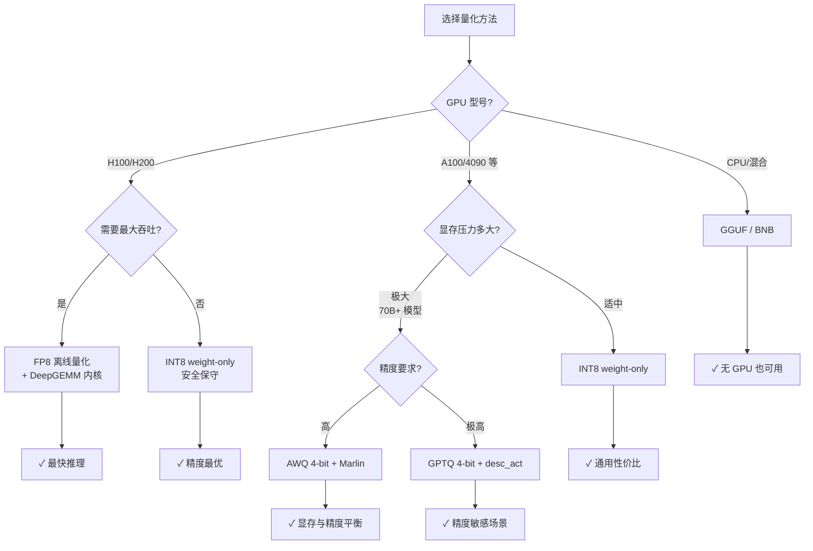

# 透过 vLLM 深入理解量化与精度：让大模型"瘦身飞奔"的秘密武器

> **系列**: vLLM 技术博客系列 | **类型**: 核心技术详解篇
> 当 70B 模型要塞进一张 GPU，量化就是你最忠实的压缩术。

### 引言

想象你拍了一张风景照：RAW 原图 50MB，每个像素 14-bit 精度，放大到 400% 都能看到叶片的纹理。但你要发朋友圈——压缩成 500KB 的 JPEG，看起来几乎一模一样，体积却缩小了 100 倍。没有人会逐像素对比原图和压缩图，但所有人都感受到了"秒开"的快感。

大模型推理也是一样：FP16 的权重就像 RAW 原图——每个数字用 16-bit 精心存储，但推理时真的需要这么高的精度吗？INT4 量化就像 JPEG 压缩——**用更少的比特表达几乎相同的语义，体积骤降，速度飞升**。当然，和照片一样，压缩太狠也会糊——关键在于找到"看不出差别"的压缩甜点。

vLLM 作为高性能推理引擎，内置了业界最丰富的量化支持。从硬件原生的 FP8（像 HEIF 格式，新一代硬件直接支持）到算法精巧的 AWQ/GPTQ（像智能压缩，重要区域保留更高精度），本文将带我们全景式地理解 vLLM 的量化世界。

---

### 一、为什么量化至关重要？

大模型推理面临三座大山：

| 瓶颈 | 表现 | 量化如何缓解 |
|------|------|-------------|
| **显存容量** | 70B 模型 FP16 需要 ~140GB，单卡装不下 | INT4 仅需 ~35GB，单卡可跑 |
| **内存带宽** | 权重从 HBM 加载到 SM 的速度远慢于计算 | 更小的权重 = 更少的搬运量 |
| **推理延迟** | batch 生成时权重反复加载 | Weight-only 量化让 GEMM 加速 |

> 笔者注： 在 LLM 推理中，memory-bound（内存受限）场景远多于 compute-bound（计算受限）场景。量化的核心收益不是"算得更快"，而是"搬得更少"——从显存到寄存器的数据通路才是真正的瓶颈。

一个直观的数字：Llama-2-70B 在 FP16 下需要约 140GB 显存，而 W4A16（4-bit 权重、16-bit 激活）量化后仅需约 35GB，**显存降低 4 倍，推理吞吐可提升 2-3 倍**。

---

### 二、量化基础：从概念到分类

在深入 vLLM 的具体实现之前，我们需要先理解量化的几个核心维度。继续照片压缩的比喻——量化不是一门技术，而是一整条"压缩工具箱"，不同场景选不同的工具。

##### 2.1 PTQ vs QAT：什么时候压缩？

```
┌─────────────────────────────────────────────────────────────┐
│                    量化两大范式                               │
├──────────────────────┬──────────────────────────────────────┤
│  PTQ (训练后量化)     │  QAT (量化感知训练)                   │
│  ──────────────────  │  ──────────────────────────────      │
│  训练完成后量化       │  训练过程中模拟量化                    │
│  无需重训练，成本低   │  精度更高，但训练开销大                 │
│  vLLM 支持的主力方式  │  通常用于极端低比特场景                 │
└──────────────────────┴──────────────────────────────────────┘
```

用照片比喻：PTQ 是"拍完照再压缩"——照片已经拍好了，直接用 JPEG/HEIF 压缩就行；QAT 是"拍照时就知道要压缩，所以调整拍摄参数"——比如提前避开容易糊的区域。显然 PTQ 更实用，vLLM 当前支持的所有量化方法都属于 PTQ 范畴。

##### 2.2 对称量化 vs 非对称量化：零点在哪里？

继续照片比喻：假设你要把一张照片的亮度从 0~255 压缩到 0~15（16 个等级）。

**对称量化**：假设亮度关于中间值对称——最暗 -128，最亮 +127，零就是中间。压缩时只需一个"缩放因子" $s$：

```
原始值:  -1.2   0.0   0.5   1.8
缩放 s=0.15
量化值:  -8      0     3     12      ← 关于零对称
还原值:  -1.2   0.0   0.45  1.8     ← 0.5 变成 0.45，小误差
```

**非对称量化**：亮度不一定关于零对称——可能整体偏亮（比如雪景照片，最暗处也有 50）。这时需要一个"零点偏移" $z$，先平移再缩放：

```
原始值:  0.3   0.5   0.8   1.2     ← 整体偏正，零附近没有数据
缩放 s=0.08, 零点 z=2
量化值:  2      4     8     13      ← 用上了 0~15 的完整范围
还原值:  0.3   0.46  0.72  1.12    ← 0.5→0.46, 0.8→0.72，误差更均匀
```

| 对比 | 对称量化 | 非对称量化 |
|:---|:---|:---|
| 公式 | $x_q = \text{round}(x / s)$ | $x_q = \text{round}(x / s) + z$ |
| 参数 | 仅缩放因子 $s$ | 缩放因子 $s$ + 零点 $z$ |
| 适用场景 | 权重（正负分布均匀） | 激活值（ReLU 后全为正数） |
| 计算效率 | 更快（无需减零点） | 稍慢（多一步减法） |
| 精度 | 分布对称时好 | 分布偏斜时更好 |

**在代码中的体现**

AWQ 用 `zero_point` 参数控制：

```python
# vllm/model_executor/layers/quantization/auto_awq.py
class AutoAWQConfig(QuantizationConfig):
    def __init__(self, weight_bits, group_size, zero_point, ...):
        self.zero_point = zero_point  # True = 非对称，False = 对称
```

GPTQ 用 `is_sym` 参数控制：

```python
# vllm/model_executor/layers/quantization/auto_gptq.py
class AutoGPTQConfig(QuantizationConfig):
    TYPE_MAP = {
        (4, True):  scalar_types.uint4b8,    # 4-bit 对称
        (8, True):  scalar_types.uint8b128,  # 8-bit 对称
    }
```

##### 2.3 Per-tensor vs Per-channel vs Per-block：一把尺子量到底，还是分段量？

照片比喻继续：你要压缩一整组照片。可以用一个压缩参数压所有照片（Per-tensor），也可以每张照片单独调参数（Per-channel），甚至每张照片的不同区域用不同参数（Per-block）。

```
Per-tensor: 一把尺子量整张图
┌─────────────────────────────┐
│  s=0.15                     │  整张图用同一个缩放因子
│  ┌───┬───┬───┬───┐          │  天空和暗部用同一把尺子
│  │   │   │   │   │          │  → 暗部细节丢失严重
│  ├───┼───┼───┼───┤          │
│  │   │   │   │   │          │
│  └───┴───┴───┴───┘          │
└─────────────────────────────┘

Per-channel: 每行用一把尺子
┌─────────────────────────────┐
│  s₁=0.08 (天空，亮度范围窄)  │  每行独立缩放
│  ┌───┬───┬───┬───┐          │  天空用精细尺子
│  │   │   │   │   │          │  暗部用粗尺子
│  ├───┼───┼───┼───┤ s₂=0.20 │  → 各行精度更均匀
│  │   │   │   │   │          │
│  └───┴───┴───┴───┘          │
└─────────────────────────────┘

Per-block: 每个小区域用一把尺子
┌─────────────────────────────┐
│  ┌─────┬─────┬─────┐        │
│  │s=0.06│s=0.10│s=0.08│      │  每个小块独立缩放
│  ├─────┼─────┼─────┤        │  天空左上角和右上角
│  │s=0.12│s=0.18│s=0.15│      │  可以用不同参数
│  ├─────┼─────┼─────┤        │  → 精度最高，但 scale
│  │s=0.20│s=0.22│s=0.19│      │    存储开销也最大
│  └─────┴─────┴─────┘        │
└─────────────────────────────┘
```

| 粒度 | Scale 数量 | 精度 | 存储开销 | 比喻 |
|:---|:---|:---|:---|:---|
| Per-tensor | 1 | 最低 | 最小 | 一把尺子量全图 |
| Per-channel | N（输出通道数） | 中等 | 小 | 每行一把尺子 |
| Per-block (group) | N × K / block_size | 最高 | 中等 | 每个小区域一把尺子 |

vLLM 的 FP8 实现中同时支持这三种粒度，在配置系统中用 `QuantKey` 精确描述：

```python
# vllm/config/quantization.py
QUANT_KEY_NAMES = {
    "fp8_per_tensor_static":   kFp8StaticTensorSym,    # 每张量
    "fp8_per_channel_static":  kFp8StaticChannelSym,   # 每通道
    "fp8_per_block_static":    kFp8Static128BlockSym,  # 每 128x128 块
    "fp8_per_tensor_dynamic":  kFp8DynamicTensorSym,   # 动态每张量
    "fp8_per_token":           kFp8DynamicTokenSym,    # 动态每 token
    "fp8_per_block_dynamic":   kFp8Dynamic128Sym,      # 动态每块
}
```

> 笔者注： FP8 的 "dynamic" 指的是激活值的 scale 在推理时实时计算，"static" 则来自校准数据集的预计算。对于权重，永远是 static 的——权重是已知的，不需要动态估计。

---

### 三、FP8：硬件原生的量化之王

##### 3.1 两种 FP8 格式

FP8 是 IEEE 754 标准定义的 8-bit 浮点格式，有两种变体：

```
┌──────────────────────────────────────────────────────────┐
│  float8_e4m3fn              float8_e5m2                   │
│  ┌───┬──────┬───────┐      ┌───┬───────┬──────┐          │
│  │ 1 │  4   │   3   │      │ 1 │   5   │   2  │          │
│  │ S │ Exp  │ Man   │      │ S │ Exp   │ Man  │          │
│  └───┴──────┴───────┘      └───┴───────┴──────┘          │
│  范围: ±448                 范围: ±57344                   │
│  精度: 更高(3位尾数)         精度: 较低(2位尾数)             │
│  用途: 权重量化 ★           用途: 梯度/激活量化             │
└──────────────────────────────────────────────────────────┘
```

在推理场景中，**float8_e4m3fn 是绝对主力**——它有更多的尾数位，适合表示权重这种精度敏感的数据。vLLM 的 FP8 实现也正是以 e4m3fn 为核心。

##### 3.2 vLLM 的 FP8 实现架构

```python
# vllm/model_executor/layers/quantization/fp8.py
class Fp8Config(QuantizationConfig):
    def __init__(self,
        is_checkpoint_fp8_serialized: bool = False,  # 离线 vs 在线
        activation_scheme: str = "dynamic",           # static / dynamic
        ignored_layers: list[str] | None = None,      # 跳过量化的层
        weight_block_size: list[int] | None = None,   # 块级量化粒度
    ):
```

vLLM 的 FP8 支持两条路径：

**离线路径**（Offline）：模型已经以 FP8 格式存储在检查点中，加载时直接使用。

**在线路径**（Online）：模型以 FP16/BF16 格式存储，加载时实时量化为 FP8。

```
离线 FP8 推理流程                  在线 FP8 推理流程
──────────────────                ──────────────────
  FP8 检查点                        FP16 检查点
      │                                 │
      ▼                                 ▼
  加载 FP8 权重                     加载 FP16 权重
  + weight_scale                    (meta device)
      │                                 │
      ▼                                 ▼
  Fp8LinearMethod                 Fp8PerTensorOnline
  (CutlassScaledMM /               LinearMethod
   MarlinFP8 /                      │
   DeepGEMM)                        ▼
      │                           实时量化为 FP8
      ▼                           + 计算 weight_scale
  推理输出                             │
                                      ▼
                                  推理输出
```

##### 3.3 FP8 内核选择策略

vLLM 会根据硬件能力自动选择最优的 FP8 GEMM 内核：

```python
# vllm/model_executor/layers/quantization/fp8.py — Fp8LinearMethod
self.fp8_linear = init_fp8_linear_kernel(
    activation_quant_key=self.activation_quant_key,
    weight_quant_key=self.weight_quant_key,
    weight_shape=layer.weight.shape,
    input_dtype=self.input_dtype,
    out_dtype=self.out_dtype,
    module_name=self.__class__.__name__,
)
```

内核优先级根据是否使用 block 量化有所不同：
- **Block 量化内核**：FlashInferDeepGEMM > DeepGEMM > Cutlass > MarlinFP8
- **非 Block 量化内核**：MarlinFP8 > FlashInferFP8 > CutlassFP8

其中 DeepGEMM 专为 Hopper (H100) 架构优化，MarlinFP8 则为不支持 FP8 原生硬件的 GPU 提供 weight-only 路径。

> 笔者注：vLLM 还有一个 `VLLM_BATCH_INVARIANT` 环境变量，当开启时，如果硬件不支持原生 FP8 GEMM，会退回到反量化为 BF16 再用 `torch.matmul` 的保守路径。这是一个可靠但较慢的 fallback。

##### 3.4 FP8 KV Cache 量化

除了权重量化，vLLM 还支持 **FP8 KV Cache** 量化——将注意力机制中的 Key/Value 缓存从 FP16 压缩为 FP8：

```python
# 使用示例：启用 FP8 KV Cache
from vllm import LLM

llm = LLM(
    model="meta-llama/Llama-3.1-8B-Instruct",
    kv_cache_dtype="fp8",          # 启用 FP8 KV Cache
    calculate_kv_scales=True,      # 从随机 token 估算 scale
)
```

KV Cache 量化的收益是"隐形的增长"：同样多的显存可以缓存更多的 token，直接提升长上下文吞吐。

---

### 四、INT8 Weight-Only：简洁之美

INT8 weight-only 量化是最朴素的方案：权重存为 INT8，激活保持 FP16/BF16。计算时先将权重反量化，再进行 FP16 矩阵乘法。

##### 4.1 vLLM 中的 INT8 实现

vLLM 提供了 `experts_int8` 和 `int8_per_channel_weight_only` 两种入口：

```python
# vllm/model_executor/layers/quantization/experts_int8.py
class ExpertsInt8Config(QuantizationConfig):
    """Online int8 quantization for MoE expert weights.
    Linear layers are left unquantized.

    Backward-compatible config for --quantization experts_int8.
    Prefer --quantization int8_per_channel
    """
```

可以看到，官方已经推荐使用 `int8_per_channel` 替代旧的 `experts_int8`。后者仅对 MoE 专家权重做在线量化，线性层保持原精度；前者通过统一的在线量化框架提供更灵活的配置。

##### 4.2 在线 INT8 量化流程

```python
# vllm/model_executor/layers/quantization/online/int8.py
class Int8OnlineMoEMethod(OnlineMoEMethodBase):
    """Online per-channel INT8 MoE quantization.
    Loads fp16/bf16 weights and quantizes them per-row to int8 during loading.
    """
    def _quantize_weights(self, layer):
        vmax = torch.iinfo(torch.int8).max
        w13 = torch.empty_like(layer.w13_weight, dtype=torch.int8)
        w2 = torch.empty_like(layer.w2_weight, dtype=torch.int8)
        # per-channel 量化：每行找最大值，计算 scale
```

INT8 weight-only 的优势在于**极简**：不需要校准数据集，不需要复杂的量化算法，加载时自动完成。精度损失通常在 0.1% 以内，是"最安全"的量化选择。

---

### 五、AWQ：激活感知的权重量化

AWQ（Activation-aware Weight Quantization）的核心洞察是：**不是所有权重通道都同等重要**。那些对应大激活值的权重通道对模型输出影响更大，应该保留更高精度。

##### 5.1 AWQ 的核心思想

```
传统量化: 所有通道一视同仁
─────────────────────────────
权重通道: [ch0] [ch1] [ch2] [ch3] [ch4] [ch5]
量化精度:  4b    4b    4b    4b    4b    4b

AWQ 量化: 保护重要通道
─────────────────────────────
激活幅值:  0.1   5.2   0.3   8.7   0.2   1.1
重要性:    低    ★     低    ★★    低    中
量化策略:  4b    缩放   4b    缩放   4b    4b

★ = 通过 per-channel 缩放因子保护
```

AWQ 的做法不是混合精度，而是**通过调整 per-channel 缩放因子来隐式保护重要通道**。缩放后的重要通道在量化后误差更小。

##### 5.2 vLLM 的 AWQ 实现

vLLM 的 AWQ 支持三种后端，会根据硬件自动选择：

```python
# vllm/model_executor/layers/quantization/auto_awq.py
class AutoAWQConfig(QuantizationConfig):
    def get_quant_method(self, layer, prefix):
        # 1. XPU 平台 → AutoAWQXPULinearMethod
        if current_platform.is_xpu():
            return AutoAWQXPULinearMethod(self)
        # 2. CUDA + Marlin 支持 → AutoAWQMarlinLinearMethod（推荐）
        if check_marlin_supported(...):
            return AutoAWQMarlinLinearMethod(self)
        # 3. Fallback → AutoAWQLinearMethod（Triton）
        return AutoAWQLinearMethod(self)
```

**Marlin 后端**是 AWQ 在 vLLM 中的最优选择。Marlin 是一种高度优化的 W4A16 kernel，专为 4-bit 权重量化设计，吞吐比 Triton 后端高出数倍。

> 笔者注： AWQ 有非标准的权重打包顺序（AWQ packing order），vLLM 在加载权重后会自动转换为标准的 GPTQ-like 格式。这个转换过程（`_convert_awq_to_standard_format`）是自动完成的，用户无需关心。

##### 5.3 AWQ 的参数特征

```python
# AWQ 4-bit 量化的典型配置
AutoAWQConfig(
    weight_bits=4,           # 4-bit 权重
    group_size=128,          # 每 128 个元素共享一个 scale
    zero_point=True,         # 使用非对称量化（AWQ 的特点）
    lm_head_quantized=False, # 通常不对 lm_head 量化
)
```

AWQ 使用**非对称量化**（zero_point=True），这是它和 GPTQ 对称量化方案的关键区别之一。

---

### 六、GPTQ：基于 Hessian 的后训练量化

GPTQ 的核心思想是：**逐层量化权重时，利用 Hessian 矩阵（二阶梯度信息）来最小化量化误差对层输出的影响**。它不是简单地逐通道独立量化，而是考虑了通道之间的相关性。

##### 6.1 GPTQ 的关键特性：desc_act

GPTQ 有一个独特参数 `desc_act`（activation order），它会对权重按激活幅值降序重排后再分组量化：

```python
# vllm/model_executor/layers/quantization/auto_gptq.py
class AutoGPTQConfig(QuantizationConfig):
    def __init__(self, weight_bits, group_size, desc_act, is_sym, ...):
        if desc_act and group_size == -1:
            desc_act = False  # per-channel 时 desc_act 无意义
        self.desc_act = desc_act
```

`desc_act=True` 能提升精度，但代价是推理时需要额外的重排操作（g_idx sort），对 Tensor Parallel 也不太友好。实践中需要权衡。

##### 6.2 GPTQ 的动态量化配置

GPTQModel 引入了 `dynamic` 配置，允许不同层使用不同比特数：

```python
# 示例：不同层使用不同量化精度
dynamic = {
    r"+:.*\.(?:1[0-5])\..*":  {"bits": 8},           # 层 10-15 用 8-bit
    r"+:.*\.(?:1[6-9]|20|21)\..*": {"bits": 8, "group_size": 64},  # 层 16-21 用 8-bit + 小分组
    r"-:.*\.moe\..*": {},      # 跳过所有 MoE 层
}
```

这种灵活的 per-module 配置让 GPTQ 在精度敏感场景中有更大调整空间。

##### 6.3 GPTQ 在 vLLM 中的内核选择

和 AWQ 类似，GPTQ 也使用 `choose_mp_linear_kernel` 自动选择最优内核：

```python
# vllm/model_executor/layers/quantization/auto_gptq.py
mp_linear_kernel_config = MPLinearLayerConfig(
    full_weight_shape=(input_size, output_size),
    weight_type=self.quant_config.quant_type,
    group_size=self.quant_config.group_size,
    zero_points=False,           # GPTQ 对称量化，无需 zero_point
    has_g_idx=self.quant_config.desc_act,
)
kernel_type = choose_mp_linear_kernel(mp_linear_kernel_config)
```

可选内核包括 Conch、Exllama 和 Marlin，vLLM 会根据硬件能力和模型特征自动挑选。

---

### 七、其他量化方案

##### 7.1 BitsAndBytes

BitsAndBytes（bnb）是 HuggingFace 生态的默认量化方案，支持 INT4/INT8 两种模式：

```python
# vllm/model_executor/layers/quantization/bitsandbytes.py
class BitsAndBytesConfig(QuantizationConfig):
    def __init__(self,
        load_in_8bit=False,
        load_in_4bit=True,
        bnb_4bit_quant_type="fp4",       # fp4 或 nf4
        bnb_4bit_use_double_quant=False,  # 双重量化（对 scale 再量化）
    ):
```

BNB 的优势在于与 HuggingFace 生态无缝集成，但推理速度通常不如 AWQ/GPTQ 的 Marlin 内核快。适合快速验证，不推荐用于生产环境的高吞吐场景。

##### 7.2 Compressed Tensors

Compressed Tensors 是 Neural Magic 开发的统一量化格式，支持非常丰富的量化方案组合：

```python
# vllm/model_executor/layers/quantization/compressed_tensors/compressed_tensors.py
# 支持的量化方案
CompressedTensorsW4A4Fp4       # 4-bit 权重 + 4-bit 激活 (FP4)
CompressedTensorsW4A4Mxfp4     # 4-bit 权重 + 4-bit 激活 (MXFP4)
CompressedTensorsW4A8Fp8       # 4-bit 权重 + 8-bit 激活 (FP8)
CompressedTensorsW4A8Int       # 4-bit 权重 + 8-bit 激活 (INT8)
CompressedTensorsW8A8Fp8       # 8-bit 权重 + 8-bit 激活 (FP8)
CompressedTensorsW8A8Int8      # 8-bit 权重 + 8-bit 激活 (INT8)
CompressedTensorsW8A8Mxfp8     # 8-bit 权重 + 8-bit 激活 (MXFP8)
CompressedTensorsW8A16Fp8      # 8-bit 权重 + 16-bit 激活 (FP8)
CompressedTensorsWNA16         # W-bit 权重 + 16-bit 激活 (通用)
CompressedTensorsWNA8O8Int     # W-bit 权重 + 8-bit 激活 + 8-bit 输出
```

Compressed Tensors 格式配合 llm-compressor 工具链使用，是 vLLM 生态中功能最丰富的量化方案。

##### 7.3 GGUF

GGUF 是 llama.cpp 生态的量化格式，主要面向 CPU 和 CPU+GPU 混合推理场景。vLLM 对 GGUF 的支持有限，主要用于兼容已有的 GGUF 检查点。如果你的场景是纯 GPU 推理，AWQ/GPTQ 是更好的选择。

##### 7.4 其他新兴方案

vLLM 还支持多种新兴量化方案：

| 方案 | 配置名 | 特点 |
|------|--------|------|
| ModelOpt | `modelopt` | NVIDIA 官方量化工具链 |
| MXFP4 | `mxfp4` | 微缩放浮点 4-bit |
| Quark | `quark` | AMD 量化方案 |
| INC | `inc` | Intel Neural Compressor |
| TorchAO | `torchao` | PyTorch 原生量化 |
| Humming | `humming` | 华为量化方案 |

---

### 八、vLLM 量化架构：统一的配置与调度

##### 8.1 量化方法注册表

vLLM 使用统一的注册机制管理所有量化方法：

```python
# vllm/model_executor/layers/quantization/__init__.py
QuantizationMethods = Literal[
    "awq", "auto_awq", "awq_marlin",
    "fp8", "fbgemm_fp8",
    "auto_gptq", "gptq", "gptq_marlin",
    "compressed-tensors", "bitsandbytes",
    "experts_int8", "quark", "mxfp4",
    "torchao", "inc", "modelopt",
    "humming", "moe_wna16",
    # 在线量化缩写
    "fp8_per_tensor", "fp8_per_block", "fp8_per_channel",
    "int8_per_channel_weight_only", "mxfp8",
    ...
]
```

用户可以通过 `--quantization` 参数指定量化方法，vLLM 会自动路由到对应的配置类。

##### 8.2 在线量化 CLI 缩写

vLLM 为常用的在线量化模式提供了便捷的 CLI 缩写：

```
--quantization fp8_per_tensor          → 权重 per-tensor FP8
--quantization fp8_per_block           → 权重 per-block FP8 (128x128)
--quantization fp8_per_channel         → 权重 per-channel FP8 + 动态 per-token 激活
--quantization int8_per_channel_weight_only → MoE INT8 权重量化
--quantization mxfp8                   → MXFP8 微缩放格式
```

##### 8.3 自动检测与回退

vLLM 会自动检测检查点的量化格式并选择正确的配置类：

```python
# vllm/model_executor/layers/quantization/auto_awq.py
@classmethod
def override_quantization_method(cls, hf_quant_cfg, user_quant, hf_config=None):
    quant_method = hf_quant_cfg.get("quant_method", "").lower()
    if quant_method != "awq":
        return None
    # 自动路由到 AutoAWQConfig
    is_valid_user_quant = user_quant in ("awq", "awq_marlin", "auto_awq", "marlin")
    if is_valid_user_quant:
        return cls.get_name()
```

同样，GPTQ 也有类似的自动检测逻辑。这意味着大多数情况下，用户只需正常加载模型，vLLM 就能自动识别量化格式。

##### 8.4 量化配置的统一基类

所有量化方案都继承自 `QuantizationConfig` 基类，遵循统一接口：

```python
# vllm/model_executor/layers/quantization/base_config.py
class QuantizationConfig(ABC):
    def get_name(self) -> str:                    # 量化方法名
    def get_supported_act_dtypes(self) -> list:   # 支持的激活数据类型
    def get_min_capability(self) -> int:          # 最低 GPU 算力要求
    def get_config_filenames(self) -> list:       # 配置文件名
    def from_config(cls, config) -> Self:         # 从配置字典创建实例
    def get_quant_method(self, layer, prefix):    # 获取层的量化方法
```

`get_min_capability()` 是一个特别重要的接口——它定义了每种量化方法对 GPU 架构的最低要求：

| 方法 | 最低算力 | 对应架构 |
|------|---------|---------|
| FP8 | 75 | Turing+ |
| AWQ | 75 | Turing+ |
| GPTQ | 60 | Pascal+ |
| Experts INT8 | 80 | Ampere+ |

---

### 九、量化方法全景对比

##### 9.1 核心维度对比表

| 方法 | 权重比特 | 激活比特 | 量化方式 | GPU 要求 | 精度保持 | 推理速度 | 显存节省 | 适用场景 |
|------|---------|---------|---------|---------|---------|---------|---------|---------|
| **FP8 (e4m3)** | 8-bit 浮点 | 8/16-bit | 离线/在线 | Hopper 最优 | 极高 | 极快 | 2x | H100/H200 生产环境 |
| **INT8 W-only** | 8-bit 整数 | 16-bit | 在线 | Ampere+ | 高 | 快 | 2x | 安全保守的首选 |
| **AWQ (Marlin)** | 4-bit 整数 | 16-bit | 离线 | Turing+ | 高 | 很快 | 4x | 通用 4-bit 优选 |
| **GPTQ (Marlin)** | 4/8-bit 整数 | 16-bit | 离线 | Pascal+ | 高 | 很快 | 4x | desc_act 精度需求 |
| **BNB** | 4/8-bit | 16-bit | 离线 | 通用 | 中 | 中 | 4x | HF 生态快速验证 |
| **Compressed-Tensors** | 4/8-bit | 4/8/16-bit | 离线 | 看方案 | 高 | 快 | 2-4x | llm-compressor 工作流 |
| **GGUF** | 2-8-bit | 16-bit | 离线 | CPU 优先 | 中 | 中 | 2-4x | CPU/offload 场景 |

##### 9.2 量化方法选择决策流



---

### 十、最佳实践

##### 10.1 根据场景选择量化方法

**场景一：H100/H200 生产部署**

```bash
# 离线 FP8：最快路径
vllm serve meta-llama/Llama-3.1-70B-Instruct \
    --quantization fp8

# 在线 FP8：从 BF16 检查点动态量化
vllm serve meta-llama/Llama-3.1-70B-Instruct \
    --quantization fp8_per_tensor
```

**场景二：A100/4090 部署 70B 模型**

```bash
# AWQ 4-bit：显存降低 4 倍，Marlin 内核极速
vllm serve TheBloke/Llama-2-70B-AWQ \
    --quantization awq

# GPTQ 4-bit：带 desc_act 的精度更优
vllm serve TheBloke/Llama-2-70B-chat-GPTQ \
    --quantization gptq
```

**场景三：MoE 模型（如 Mixtral/DeepSeek）**

```bash
# FP8 + per-block 量化：MoE 专家权重的最佳选择
vllm serve deepseek-ai/DeepSeek-V2-Lite \
    --quantization fp8

# INT8 weight-only：MoE 专家的轻量方案
vllm serve mistralai/Mixtral-8x7B-v0.1 \
    --quantization int8_per_channel_weight_only
```

##### 10.2 精度验证清单

1. **跑基准测试**：在量化前后跑 perplexity / accuracy 基准，确保精度损失在可接受范围
2. **检查 ignored_layers**：某些层（如 lm_head、embed_tokens）对精度敏感，不应量化
3. **优先 weight-only**：除非有充分的校准数据，否则 weight-only 量化比 W8A8 更安全
4. **FP8 需要 Hopper+**：在非 Hopper GPU 上，FP8 会退回到 Marlin 或反量化路径，性能优势减弱
5. **AWQ vs GPTQ**：AWQ 非对称量化在多数场景精度略优；GPTQ 的 desc_act 在极端场景可能更准，但速度稍慢

##### 10.3 常见陷阱

| 陷阱 | 表现 | 解决方案 |
|------|------|---------|
| group_size 与 TP 不对齐 | 加载时报 shape mismatch | 确保 `input_size % (group_size * tp_size) == 0` |
| FP8 在非 Hopper GPU 上 | 性能提升有限 | 改用 AWQ/GPTQ 或升级硬件 |
| BNB 在生产环境 | 吞吐不如 Marlin | 迁移到 AWQ/GPTQ |
| MoE + 4-bit 量化 | 部分层不支持 Marlin | vLLM 会自动 fallback 到 WNA16 内核 |
| 忘记校准 KV Cache | 长文本精度下降 | 使用 `calculate_kv_scales=True` 或 llm-compressor 校准 |

---

### 总结

量化的本质是在**精度、速度、显存**三者之间找到最优的平衡点。vLLM 为我们提供了丰富的工具箱，让我们根据实际场景做出最佳选择：

| 你的目标 | 推荐方案 | 一句话理由 |
|---------|---------|-----------|
| 极致吞吐 | FP8 + DeepGEMM | 硬件原生，没有比这更快的 |
| 安全保守 | INT8 weight-only | 精度损失几乎不可感知 |
| 极致压缩 | AWQ 4-bit + Marlin | 4 倍显存节省，速度依然飞快 |
| 精度敏感 | GPTQ 4-bit + desc_act | Hessian 引导，量化误差最小 |
| CPU/offload | GGUF | 不依赖 GPU 也能跑 |

> **一句话建议**: 如果你有 Hopper GPU，FP8 是首选；如果没有，AWQ 4-bit + Marlin 是通用最优解。

---

### 延伸阅读

- AWQ 论文 Activations-Aware Weight Quantization：https://arxiv.org/abs/2306.00978
- GPTQ 论文 Accurate Post-Training Quantization for Generative Pre-trained Transformers：https://arxiv.org/abs/2210.17323
- FP8 格式规范 OCP FP8 Specification：https://www.opencompute.org/documents/ocp-8-bit-floating-point-specification-ofp8-v1p0-2023-12-01-pdf
- llm-compressor 量化工具链：https://github.com/vllm-project/llm-compressor
- vLLM 量化文档: FP8 KV Cache：https://docs.vllm.ai/en/latest/features/quantization.html

---

*本文属于 [vLLM 技术博客系列]，欢迎持续关注。*
