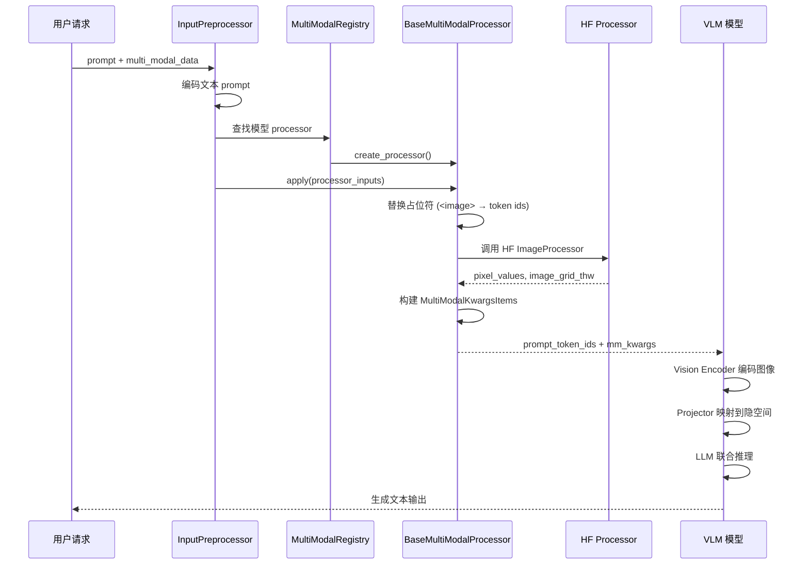

# vLLM 多模态与 LoRA：让推理引擎长出"第三只眼"

> **系列**: vLLM 技术博客系列 | **类型**: 核心技术详解篇
> 一个只会"读字"的推理引擎，就像一位只会看乐谱却听不到声音的音乐家——而当多模态与 LoRA 同时登场，引擎便长出了"第三只眼"，既能看图听音，又能一秒千面。

### 引言

想象你走进一家餐厅：菜单上只有文字，没有图片，没有推荐——你只能凭想象点菜。这就是传统 LLM 推理引擎的日常：它只会"读字"，对图像、音频、视频视而不见。而 VLM（视觉语言模型）的出现，就像是给餐厅装上了大屏——图片、视频轮番展示，食客一目了然。但更酷的是：如果这家餐厅还能根据每位食客的口味偏好，瞬间切换"菜单风格"，那就是 LoRA 的魔法了。

vLLM 作为业界领先的推理引擎，不仅原生支持多模态输入处理（图像、音频、视频），还通过 LoRA 机制实现了"一个基座模型，多种适配器"的高效服务模式。今天，我们将深入源码，拆解这两大特性背后的工程实现。

---

### 一、多模态——让引擎"看见"世界

##### 1.1 为什么多模态至关重要？

大语言模型的"语言"二字，曾是它的荣耀，也曾是它的枷锁。LLaVA、Qwen-VL、Phi-4-multimodal 等 VLM 的崛起，让"读图""听音""看视频"成为推理引擎的刚需。一个现代推理引擎如果不能高效处理多模态输入，就像一个只看得到黑白电视的家庭影院——功能有了，体验却差了一个时代。

vLLM 的多模态支持并非"打个补丁"，而是从架构层面重新设计了输入处理管线，让它能够统一地接纳图像、音频、视频等多种模态，并与文本 token 无缝交织。

##### 1.2 多模态处理管线全景

我们先看一张架构全景图，理解 vLLM 多模态数据从输入到模型推理的完整旅程：

```
┌──────────────────────────────────────────────────────────────────┐
│                     用户请求 (HTTP / Offline)                      │
│  prompt: "描述这张图片" + multi_modal_data: {"image": PIL.Image}  │
└───────────────────────────┬──────────────────────────────────────┘
                            │
                            ▼
┌──────────────────────────────────────────────────────────────────┐
│                   InputPreprocessor                               │
│  vllm/inputs/preprocess.py                                       │
│  ├── tokenizer 编码文本 prompt                                    │
│  ├── 解析 multi_modal_data 字典                                   │
│  └── 构建 MultiModalInput 对象                                    │
└───────────────────────────┬──────────────────────────────────────┘
                            │
                            ▼
┌──────────────────────────────────────────────────────────────────┐
│                 MultiModalRegistry                                │
│  vllm/multimodal/registry.py                                     │
│  ├── 根据 model_config 查找模型注册的 processor                    │
│  ├── create_processor() → BaseMultiModalProcessor                │
│  └── 全局单例 MULTIMODAL_REGISTRY                                │
└───────────────────────────┬──────────────────────────────────────┘
                            │
                            ▼
┌──────────────────────────────────────────────────────────────────┐
│              BaseMultiModalProcessor                              │
│  vllm/multimodal/processing/processor.py                         │
│  ├── _apply_prompt_updates() → 替换 <image> 占位符                │
│  ├── 调用 HF processor 处理多模态数据                              │
│  ├── 生成 MultiModalKwargsItems (按模态分组的张量)                 │
│  └── 输出: prompt_token_ids + mm_kwargs                           │
└───────────────────────────┬──────────────────────────────────────┘
                            │
                            ▼
┌──────────────────────────────────────────────────────────────────┐
│           模型前向传播 (如 LlavaForConditionalGeneration)          │
│  ├── Vision Encoder (CLIP/SigLIP) → 视觉特征                     │
│  ├── Projector/Connector → 对齐到 LLM 隐空间                     │
│  └── LLM Backbone → 文本 + 视觉 token 联合推理                   │
└──────────────────────────────────────────────────────────────────┘
```

这个管线的关键思想是：**多模态数据先经过模态专属的编码器处理，再通过 Projector 映射到语言模型的隐空间，最终与文本 token 交织后送入 LLM backbone**。

##### 1.3 Mermaid：多模态请求处理时序



##### 1.4 核心数据结构：从原始输入到模型张量

vLLM 多模态子系统的精妙之处，在于它设计了一套层次分明的数据结构，将用户传入的原始数据逐步转化为模型可消费的张量。我们追踪一下这条数据链路。

**MultiModalDataDict：用户入口**

用户通过 `multi_modal_data` 字段传入原始数据，它本质上是一个模态到数据的映射：

```python
# vllm/inputs/llm.py — 用户传入的多模态数据结构
MultiModalDataDict = dict[str, Any]
# 例如: {"image": PIL.Image}, {"audio": (array, sr)}, {"video": [frame1, frame2]}
```

支持三种核心模态，其数据类型定义在 `vllm/multimodal/inputs.py`：

| 模态 | 类型别名 | 可接受的数据形式 |
|------|---------|----------------|
| Image | `ImageItem` | `PIL.Image`、`np.ndarray`、`torch.Tensor`、预计算 embedding |
| Audio | `AudioItem` | `list[float]`、`np.ndarray`、`torch.Tensor`、`(array, sampling_rate)` |
| Video | `VideoItem` | `list[PIL.Image]`、`np.ndarray`、`torch.Tensor`、`(video, metadata)` |

> 笔者注：vLLM 允许直接传入预计算的 embedding 张量（3D tensor），此时会跳过 HF processor 的处理，直接送入模型——这对已经在离线阶段完成特征提取的场景非常友好。

**MultiModalDataItems：解析后的结构化数据**

`vllm/multimodal/parse.py` 中的 `MultiModalDataItems` 将原始数据解析为结构化形式，区分不同来源（Processor 处理的原始媒体 vs 预计算的 Embedding）：

```python
# vllm/multimodal/parse.py — 解析后的多模态数据容器
class MultiModalDataItems(UserDict[str, ModalityDataItems]):
    """按模态分组的多模态数据项集合
    例如: {"image": ImageProcessorItems([...]), "audio": AudioProcessorItems([...])}
    """
```

**PlaceholderRange：占位符定位**

多模态数据需要在 prompt 中占据一席之地。`PlaceholderRange` 精确记录了每个模态数据在 token 序列中的位置：

```python
# vllm/multimodal/inputs.py — 占位符位置信息
@dataclass(frozen=True)
class PlaceholderRange:
    offset: int       # 在 prompt 中的起始位置
    length: int       # 占位符长度（token 数）
    is_embed: torch.Tensor | None = None  # 嵌入掩码，标记哪些位置使用 encoder 输出

# 示例: prompt = "AAAA BBBB What is in these images?"
# 图像 A: PlaceholderRange(offset=0, length=4)
# 图像 B: PlaceholderRange(offset=5, length=4)
```

`is_embed` 字段尤其精妙——它是一个布尔掩码，允许部分位置使用 encoder 输出的 embedding、部分位置保留原始 token embedding。这种设计为 VLM 的"混合注意力"模式提供了底层支持。

**MultiModalKwargsItems：处理后的模型输入**

经过 HF processor 处理后，数据被组织为 `MultiModalKwargsItems`——按模态分组的、面向模型的 keyword arguments：

```python
# vllm/multimodal/inputs.py — 按模态分组的模型输入
class MultiModalKwargsItems(UserDict[str, Sequence[MultiModalKwargsItem]]):
    """
    示例: 一个包含 2 张图片 + 1 段音频的请求
    {
        "image": [
            MultiModalKwargsItem({"pixel_values": ..., "image_grid_thw": ...}),  # 第1张图
            MultiModalKwargsItem({"pixel_values": ..., "image_grid_thw": ...}),  # 第2张图
        ],
        "audio": [
            MultiModalKwargsItem({"input_audio_features": ...}),  # 第1段音频
        ],
    }
    """
```

> 笔者注： 与 HF 的 `BatchFeature`（所有 item 合并为一个大 batch）不同，vLLM 选择按 item 拆分，原因是——部分 item 可能已在 cache 中命中，无需重新传输；而多请求的 item 也可能被 batch 在一起以提升吞吐。这种"先拆后合"的策略，是高性能服务场景的关键。

##### 1.5 多模态注册表：Processor 的调度中心

`MultiModalRegistry` 是多模态子系统的"调度中心"，它为每个模型类注册专属的 processor 工厂：

```python
# vllm/multimodal/registry.py — 核心注册方法
class MultiModalRegistry:
    def register_processor(
        self,
        processor: MultiModalProcessorFactory,
        *,
        info: ProcessingInfoFactory,
        dummy_inputs: DummyInputsBuilderFactory,
    ):
        """注册多模态 processor 到模型类。使用懒加载工厂模式。"""
        def wrapper(model_cls):
            model_cls._processor_factory = _ProcessorFactories(
                info=info, dummy_inputs=dummy_inputs, processor=processor,
            )
            return model_cls
        return wrapper
```

每个 VLM 模型（如 `LlavaForConditionalGeneration`）在定义时通过装饰器注册自己的 processor，vLLM 在运行时根据 `model_config` 自动创建对应的 processor 实例。这种"注册-查找"模式与 vLLM 的模型注册表一脉相承，保证了扩展性。

##### 1.6 多模态缓存：避免重复计算

多模态处理是计算密集型的——一张图片的 vision encoder 前向传播可能耗时数十毫秒。vLLM 提供了多级缓存策略来避免重复处理：

| 缓存类型 | 实现类 | 适用场景 | 跨进程 |
|---------|--------|---------|--------|
| `processor_only` | `MultiModalProcessorOnlyCache` | 单进程，仅 processor 侧缓存 | 否 |
| `lru` | `MultiModalProcessorSenderCache` | API server 与 Engine Core 分离 | 是（IPC） |
| `shm` | `ShmObjectStoreSenderCache` | 多 worker 共享内存 | 是（共享内存） |

缓存以多模态数据的哈希值（`MultiModalHasher`）为键，当同一张图片在不同请求中重复出现时，直接从缓存中取回处理结果，省去昂贵的 encoder 计算。

##### 1.7 多图支持与模态交织

现代 VLM 越来越多地需要处理多图输入——例如对比两张图片、描述一组视频帧。vLLM 通过 `limit_mm_per_prompt` 配置来控制每种模态的最大数量：

```python
# 多图推理示例
llm = LLM(
    model="microsoft/Phi-3.5-vision-instruct",
    limit_mm_per_prompt={"image": 2},  # 最多接受 2 张图
)

outputs = llm.generate({
    "prompt": "<|image_1|>\n<|image_2|>\nWhat is the content of each image?",
    "multi_modal_data": {"image": [image1, image2]},
})
```

在内部，`MultiModalFieldConfig` 定义了三种字段类型来灵活组织批量数据：

| 字段类型 | 含义 | 示例 |
|---------|------|------|
| `batched` | 按 batch 维度索引，每项独立 | `pixel_values[0]`, `pixel_values[1]` |
| `flat` | 按 slice 切分，长度可变 | 不同分辨率的图像特征拼接后切片 |
| `shared` | 所有项共享同一数据 | 图像的 `image_grid_thw`（同图多问） |

---

### 二、LoRA——一秒千面的服务魔法

##### 2.1 为什么 LoRA 服务至关重要？

如果把基座模型比作"万能瑞士军刀"，LoRA（Low-Rank Adaptation）就是那把可以瞬间切换的"刀头"。在实际业务中，我们常常需要基于同一个基座模型服务数十种不同的任务适配器——SQL 生成、代码补全、风格迁移……如果为每个适配器都加载一份完整模型，GPU 显存将被迅速耗尽。

LoRA 的核心洞察是：**模型适配不需要修改全部参数，只需要在关键层上叠加两个低秩矩阵**，就能以极小的参数量实现接近全量微调的效果。数学表达为：

```
W' = W + (B × A) × (alpha / rank)
```

其中 `W` 是原始权重矩阵（冻结），`A` 是降维矩阵（rank × input_dim），`B` 是升维矩阵（output_dim × rank）。当 rank 远小于 input_dim 和 output_dim 时，参数增量微乎其微，但效果惊人。

##### 2.2 vLLM 的 LoRA 架构全景

```
┌──────────────────────────────────────────────────────────────────┐
│                        LoRA 请求生命周期                          │
└──────────────────────────────────────────────────────────────────┘

  用户请求 (lora_request=LoRARequest("sql_adapter", 1, path))
       │
       ▼
  ┌─────────────────┐     ┌──────────────────────────────────────┐
  │ LoRARequest     │     │ LoRAModelManager                     │
  │ vllm/lora/      │     │ vllm/lora/model_manager.py           │
  │ request.py      │────▶│                                      │
  │                 │     │ ├── _registered_adapters: {}          │
  │ lora_name       │     │ ├── _active_adapters: {}             │
  │ lora_int_id     │     │ ├── lora_index_to_id: [None] * slots │
  │ lora_path       │     │ ├── activate_adapter() → GPU 加载    │
  │                 │     │ └── deactivate_adapter() → 卸载      │
  └─────────────────┘     └──────────────┬───────────────────────┘
                                         │
                                         ▼
                          ┌──────────────────────────────────────┐
                          │ LoRAModel                            │
                          │ vllm/lora/lora_model.py              │
                          │                                      │
                          │ ├── id, rank, loras: {}              │
                          │ ├── from_lora_tensors() 加载权重     │
                          │ └── get_lora(module_name) → 权重查询 │
                          └──────────────┬───────────────────────┘
                                         │
                                         ▼
                          ┌──────────────────────────────────────┐
                          │ LoRALayerWeights                     │
                          │ vllm/lora/lora_weights.py            │
                          │                                      │
                          │ ├── lora_a: [rank, input_dim]        │
                          │ ├── lora_b: [output_dim, rank]       │
                          │ ├── scaling = alpha / rank           │
                          │ └── optimize() → scaling 合并到 B    │
                          └──────────────────────────────────────┘
                                         │
                                         ▼
                          ┌──────────────────────────────────────┐
                          │ PunicaWrapperGPU                     │
                          │ vllm/lora/punica_wrapper/punica_gpu  │
                          │                                      │
                          │ 基于 Punica 内核的 Multi-LoRA 推理    │
                          │ ├── lora_shrink() → x @ A^T          │
                          │ └── lora_expand() → (x@A^T) @ B      │
                          └──────────────────────────────────────┘
```

##### 2.3 LoRARequest：适配器的身份标识

每个 LoRA 请求通过 `LoRARequest` 标识，它是适配器在整个服务生命周期中的"身份证"：

```python
# vllm/lora/request.py
class LoRARequest(msgspec.Struct, omit_defaults=True, array_like=True):
    lora_name: str           # 人类可读名称，如 "sql_adapter"
    lora_int_id: int         # 全局唯一整数 ID（必须 > 0）
    lora_path: str           # 适配器权重路径
    base_model_name: str | None = None   # 基座模型名称
    load_inplace: bool = False           # 是否原地替换已有适配器
    is_3d_lora_weight: bool = False      # MoE 适配器的权重布局标识
```

> 笔者注： `lora_int_id` 必须全局唯一且大于 0。vLLM 并不强制检查唯一性，所以请务必自行保证——否则会导致适配器映射混乱。

##### 2.4 LoRAModel 与 LoRALayerWeights：权重的组织方式

`LoRAModel` 是一个适配器的完整表示，包含所有层的 LoRA 权重：

```python
# vllm/lora/lora_model.py
class LoRAModel:
    def __init__(self, lora_model_id, rank, loras: dict[str, LoRALayerWeights]):
        self.id = lora_model_id
        self.rank = rank
        self.loras = loras  # module_name → LoRALayerWeights

    @classmethod
    def from_lora_tensors(cls, lora_model_id, tensors, peft_helper, ...):
        """从 safetensors 字典构建 LoRAModel"""
        # 遍历所有 tensor，解析 lora_A / lora_B 权重
        # 跳过 base embedding 权重
        # 根据 peft_helper 的配置确定 rank 和 alpha
```

每层的权重由 `LoRALayerWeights` 表示：

```python
# vllm/lora/lora_weights.py
class LoRALayerWeights:
    module_name: str
    rank: int
    lora_alpha: int
    lora_a: torch.Tensor  # shape: [rank, input_dim]
    lora_b: torch.Tensor  # shape: [output_dim, rank]
    scaling: float = lora_alpha / rank

    def optimize(self):
        """将 scaling 合并进 lora_b，减少运行时计算"""
        self.lora_b *= self.scaling
        self.scaling = 1
```

> 笔者注：`optimize()` 方法是一个简洁而重要的优化——将 scaling 因子预乘进 `lora_b`，使得推理时只需计算 `x @ A^T @ B`，无需额外乘以 scaling。这种"预计算换运行时"的思想贯穿 vLLM 的设计。

##### 2.5 LoRAModelManager：适配器的生命周期管家

`LoRAModelManager` 是 LoRA 服务的核心，它管理着适配器从加载、激活到卸载的完整生命周期：

```python
# vllm/lora/model_manager.py
class LoRAModelManager:
    def __init__(self, model, max_num_seqs, max_num_batched_tokens,
                 vocab_size, lora_config, device, vllm_config):
        self._registered_adapters: dict[int, LoRAModel] = {}   # 已注册的适配器
        self._active_adapters: dict[int, None] = {}            # 当前在 GPU 上活跃的
        self.lora_index_to_id: list[int | None] = [None] * self.lora_slots  # slot 映射
        self.modules: dict[str, BaseLayerWithLoRA] = {}         # LoRA 化的模型层

    def activate_adapter(self, lora_id: int) -> bool:
        """将 LoRA 权重加载到 GPU buffer 中"""
        # 1. 找到空闲 slot
        # 2. 遍历所有 LoRA 化的模块，set_lora(index, lora_a, lora_b)
        # 3. 标记为 active

    def _deactivate_adapter(self, lora_id: int):
        """卸载适配器，释放 slot"""
```

**GPU Slot 机制**

vLLM 为 LoRA 设计了一个"slot"机制：GPU 上预分配 `max_loras` 个 slot，每个 slot 对应一组预分配的 buffer。适配器激活时，权重被拷贝到某个 slot 的 buffer 中；多个请求可以同时使用不同的 slot，实现真正的 Multi-LoRA 并发推理。

```
GPU Memory
┌──────────────────────────────────────────────────┐
│  Slot 0: LoRA_A (sql)   │  Slot 1: LoRA_B (code) │  Slot 2: (空)  │ ...
│  [rank×dim] [dim×rank]  │  [rank×dim] [dim×rank]  │               │
└──────────────────────────────────────────────────┘
  ↑ activate_adapter()     ↑ activate_adapter()
  │ 拷贝权重到预分配 buffer │
```

##### 2.6 Punica 内核：Multi-LoRA 的高效推理

Multi-LoRA 服务的核心挑战是：**同一个 batch 中不同请求可能使用不同的适配器**。如果逐个处理，batch 效率将荡然无存。

vLLM 采用了 [Punica](https://arxiv.org/abs/2310.18547) 论文的思路，通过自定义 Triton 内核实现批量化的 LoRA 推理：

```python
# vllm/lora/punica_wrapper/punica_gpu.py
class PunicaWrapperGPU(PunicaWrapperBase):
    """基于 Punica 内核的 Multi-LoRA 推理包装器"""

    def update_metadata(self, mapping: LoRAMapping, ...):
        """更新 LoRA 映射元数据，为内核调用做准备"""
        # 构建 token → adapter 的映射关系

    # 推理时的核心计算路径（调用 Triton 内核函数）:
    # lora_shrink(): x @ A^T  (降维: input_dim → rank)
    # lora_expand(): result @ B (升维: rank → output_dim)
    # 注: lora_shrink/lora_expand 是从 vllm.lora.ops.triton_ops 导入的
    #     独立 Triton 内核函数，而非 PunicaWrapperGPU 的类方法
```

计算流程可以概括为：

```
输入 x: [batch_size, input_dim]
          │
          ├── 基座路径: x @ W^T  (所有请求共享)
          │
          └── LoRA 路径:
              ├── lora_shrink: x @ A^T → [batch_size, rank]  (按请求分发到不同 A)
              └── lora_expand: result @ B → [batch_size, output_dim]  (按请求分发到不同 B)
                    │
                    ▼
              输出 = 基座输出 + LoRA 输出
```

Punica 内核的精妙之处在于：**它通过 `LoRAMapping` 元数据，在同一个 kernel launch 中处理所有请求的 LoRA 计算**——不同请求的 token 会被路由到对应适配器的 A/B 矩阵，从而实现真正的 batched Multi-LoRA 推理。

##### 2.7 Multi-LoRA 服务实战

**离线推理**

```python
# vllm/lora/docs 示例
from vllm import LLM, SamplingParams
from vllm.lora.request import LoRARequest

llm = LLM(model="meta-llama/Llama-3.2-3B-Instruct", enable_lora=True)

# SQL 适配器
outputs = llm.generate(
    prompts,
    SamplingParams(temperature=0, max_tokens=256),
    lora_request=LoRARequest("sql_adapter", 1, sql_lora_path),
)
```

**在线服务（OpenAI 兼容 API）**

```bash
# 启动时静态加载
vllm serve meta-llama/Llama-3.2-3B-Instruct \
    --enable-lora \
    --lora-modules sql-lora=jeeejeee/llama32-3b-text2sql-spider

# 请求时指定适配器
curl http://localhost:8000/v1/completions \
    -H "Content-Type: application/json" \
    -d '{"model": "sql-lora", "prompt": "San Francisco is a", "max_tokens": 7}'
```

**动态加载与卸载**

```bash
# 运行时动态加载新适配器
curl -X POST http://localhost:8000/v1/load_lora_adapter \
    -H "Content-Type: application/json" \
    -d '{"lora_name": "code_adapter", "lora_path": "/path/to/code-lora"}'

# 运行时卸载
curl -X POST http://localhost:8000/v1/unload_lora_adapter \
    -H "Content-Type: application/json" \
    -d '{"lora_name": "code_adapter"}'
```

> 笔者注： 动态加载功能需要设置 `VLLM_ALLOW_RUNTIME_LORA_UPDATING=True`，请在受信任的隔离环境中使用，生产环境需谨慎评估安全风险。

##### 2.8 LoRA 与多模态的交汇

vLLM 的一个独特能力是**多模态模型的 LoRA 支持**。在 `LoRAModelManager` 中，多模态模型会获得多组 PunicaWrapper：

```python
# vllm/lora/model_manager.py — 多模态 LoRA 初始化
def _maybe_init_mm(self, vllm_config, max_num_batched_tokens):
    # 语言模型 LoRA wrapper
    llm_punica_wrapper = get_punica_wrapper(...)
    self.punica_wrapper_mapping[lm_prefix] = llm_punica_wrapper

    # Tower (视觉编码器) LoRA wrapper
    if self.supports_tower_connector_lora:
        tower_punica_wrapper = get_punica_wrapper(...)
        for prefix in self.mm_mapping.tower_model:
            self.punica_wrapper_mapping[prefix] = tower_punica_wrapper

        # Connector LoRA wrapper
        if self.mm_mapping.connector:
            connector_punica_wrapper = get_punica_wrapper(...)
            for prefix in self.mm_mapping.connector:
                self.punica_wrapper_mapping[prefix] = connector_punica_wrapper
```

这意味着 LoRA 适配器不仅可以修改语言模型的行为，还可以修改视觉编码器和连接器——在 VLM 的每一个环节实现细粒度适配。

更进一步，vLLM 还支持**默认多模态 LoRA**（`default_mm_loras`），当请求中包含特定模态数据时自动应用对应的适配器：

```python
llm = LLM(
    model="ibm-granite/granite-speech-3.3-2b",
    enable_lora=True,
    default_mm_loras={"audio": model_id},  # 音频请求自动应用 LoRA
)
```

##### 2.9 性能考量与调优指南

| 参数 | 作用 | 调优建议 |
|------|------|---------|
| `max_loras` | GPU 上同时活跃的适配器数量 | 设为预期的并发适配器数，不宜过大 |
| `max_lora_rank` | 允许的最大 LoRA 秩 | 设为实际使用的最大 rank，如 64；设 256 会浪费显存 |
| `max_cpu_loras` | CPU 缓存的适配器数量（含非活跃） | >= max_loras，影响适配器切换延迟 |
| `lora_target_modules` | 限制 LoRA 只作用于特定模块 | 如只需 `o_proj`，可大幅降低显存开销 |
| `enable_tower_connector_lora` | 是否启用 VLM Tower/Connector LoRA | 实验性功能，默认关闭 |

> 笔者注： `max_lora_rank` 是最关键的参数。如果你的适配器 rank 分别是 [16, 32, 64]，请设为 64 而非 256——多出的 rank 会导致预分配 buffer 翻倍浪费。

---

### 总结

##### 特性对比一览

| 维度 | 多模态支持 | LoRA 支持 |
|------|----------|----------|
| 核心价值 | 让引擎"看/听/理解"非文本数据 | 一个基座服务多种任务适配 |
| 关键模块 | `vllm/multimodal/` | `vllm/lora/` |
| 数据流 | 原始媒体 → HF Processor → Encoder → Projector → LLM | 基座权重 + LoRA(A,B) → Punica 内核批量推理 |
| 性能关键 | Encoder 计算开销、缓存命中率 | Slot 分配、rank 配置、模块选择 |
| 交汇点 | 多模态模型的 Tower/Connector 也可加 LoRA | `default_mm_loras` 自动适配 |

##### 一句话行动建议

**先用 `limit_mm_per_prompt` 控制模态数量、用 `--max-lora-rank` 精确匹配实际 rank，再逐步探索多模态 LoRA 的无限可能。**

### 延伸阅读

- [vLLM Multimodal Inputs 官方文档](https://docs.vllm.ai/en/latest/features/multimodal_inputs.html)
- [vLLM LoRA Adapters 官方文档](https://docs.vllm.ai/en/latest/features/lora.html)
- [Punica: Multi-Tenant LoRA Serving 论文](https://arxiv.org/abs/2310.18547)
- [LoRA: Low-Rank Adaptation of Large Language Models 论文](https://arxiv.org/abs/2106.09685)
- [vLLM 多模态处理设计文档](https://github.com/vllm-project/vllm/blob/main/design/mm_processing.md)

---

*本文属于 [vLLM 技术博客系列]，欢迎持续关注。*
