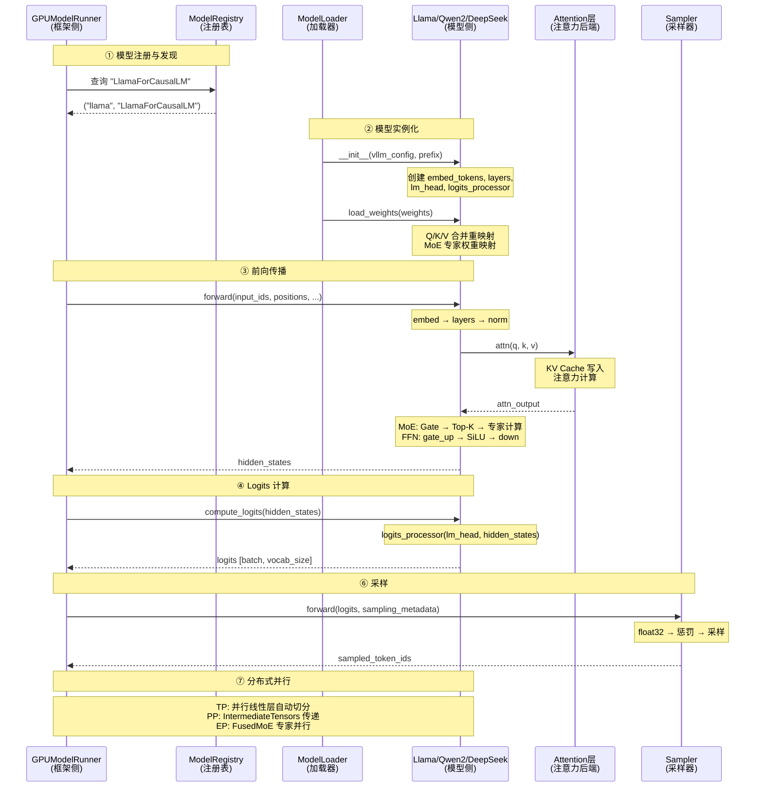

# vLLM 与 Llama/Qwen/DeepSeek 的握手协议：一次推理请求中的全部交互与耦合点

> **系列**: vLLM 技术博客系列 | **类型**: 模型适配深潜篇
>
> vLLM 是推理框架，Llama/Qwen/DeepSeek 是模型——它们之间到底怎么"握手"？谁定义接口？谁适配谁？一次推理请求中，框架和模型在哪些点发生交互？本文逐个拆解每一个耦合点，让你彻底理解 vLLM 的"模型适配层"。

简而言之，vLLM 到底是如何 serving 这些LLM大模型的？如果一个新的模型发布，Day0适配上线，要做哪几步？本文将一探究竟。

当前 vLLM 已支持业界 200+ LLM大语言模型，本文行文内容主要以 Llama、Qwen、DeepSeek举例。

### 引言

想象一个USB接口：不管你插的是鼠标、键盘还是U盘，只要符合USB协议，就能正常工作。vLLM 和模型之间也是这种关系——vLLM 定义了一套"推理框架接口协议"，任何模型只要实现了这套协议，就能被 vLLM 加载和调度。

但现实比USB复杂得多：Llama 用标准 MHA 注意力，DeepSeek 用 MLA 压缩 KV Cache；Llama 的 MLP 是简单的 FFN，DeepSeek 的 MLP 是 MoE 路由；Qwen2 支持 sliding window，DeepSeek V3 支持 Expert Parallelism。这些差异意味着"协议"之外，还有大量的"个性化适配"。

今天这篇文章，我们就沿着一次推理请求的完整路径，逐个拆解 vLLM 与模型之间的**每一个交互点和耦合点**，看清楚框架和模型的边界在哪里、适配发生在哪里。

---

### 全景地图：一次推理中的七大耦合点

```
┌─────────────────────────────────────────────────────────────────────────┐
│                    vLLM 框架与模型的七大交互点                           │
├─────────────────────────────────────────────────────────────────────────┤
│                                                                         │
│  ① 模型注册与发现                                                       │
│  ┌──────────────┐     HuggingFace Config     ┌──────────────────────┐  │
│  │ ModelRegistry│ ──── architecture name ────>│ "LlamaForCausalLM"  │  │
│  │ (字典映射)    │                            │ "Qwen2ForCausalLM"  │  │
│  └──────────────┘                            │ "DeepseekV3..."     │  │
│                                              └──────────┬───────────┘  │
│                                                         │               │
│  ② 模型实例化                                           ▼               │
│  ┌──────────────┐                            ┌──────────────────────┐  │
│  │ ModelLoader  │ ──── __init__(vllm_config) ─>│ LlamaForCausalLM   │  │
│  │ (权重加载)    │     load_weights(weights)    │ Qwen2ForCausalLM   │  │
│  └──────────────┘                            │ DeepseekV3...       │  │
│                                              └──────────┬───────────┘  │
│                                                         │               │
│  ③ 前向传播                                             ▼               │
│  ┌──────────────┐                            ┌──────────────────────┐  │
│  │GPUModelRunner│ ──── forward(input_ids, ──> │ model.forward()      │  │
│  │ (输入准备)    │      positions, ...)        │ → embed → layers    │  │
│  └──────────────┘                            │ → norm → hidden     │  │
│                                              └──────────┬───────────┘  │
│                                                         │               │
│  ④ Logits 计算                                          ▼               │
│  ┌──────────────┐                            ┌──────────────────────┐  │
│  │GPUModelRunner│ ──── compute_logits( ─────> │ LogitsProcessor      │  │
│  │ (采样入口)    │      hidden_states)         │ → lm_head → logits  │  │
│  └──────────────┘                            └──────────┬───────────┘  │
│                                                         │               │
│  ⑤ 注意力后端                                           ▼               │
│  ┌──────────────┐                            ┌──────────────────────┐  │
│  │ Attention    │ ──── q, k, v + metadata ──>│ FlashAttention       │  │
│  │ (统一接口)    │                            │ PagedAttention       │  │
│  └──────────────┘                            │ TRITON_MLA (DeepSeek)│  │
│                                              └──────────┬───────────┘  │
│                                                         │               │
│  ⑥ 采样                                                 ▼               │
│  ┌──────────────┐                            ┌──────────────────────┐  │
│  │ Sampler      │ <─── logits [batch, vocab] ─│ model.compute_logits │  │
│  │ (采样策略)    │ ──── sampled_token_ids ────>│ Scheduler            │  │
│  └──────────────┘                            └──────────────────────┘  │
│                                                                         │
│  ⑦ 分布式与并行                                                         │
│  ┌──────────────────────────────────────────────────────────────────┐  │
│  │ TP: QKVParallelLinear / RowParallelLinear / ColumnParallelLinear│  │
│  │ PP: IntermediateTensors + PPMissingLayer + make_layers          │  │
│  │ EP: FusedMoE + get_ep_group() (DeepSeek MoE 专属)               │  │
│  └──────────────────────────────────────────────────────────────────┘  │
│                                                                         │
└─────────────────────────────────────────────────────────────────────────┘
```

#### 七大耦合点总览

| # | 耦合点 | 框架侧 | 模型侧 | 关键接口 |
|---|--------|--------|--------|----------|
| ① | 模型注册 | `ModelRegistry` 字典 | HuggingFace Config 中的 `architectures` 字段 | `(module_name, class_name)` 元组 |
| ② | 模型实例化 | `ModelLoader.load_model()` | `__init__(vllm_config, prefix)` + `load_weights()` | `VllmConfig` 全局配置穿透 |
| ③ | 前向传播 | `GPUModelRunner.execute_model()` | `forward(input_ids, positions, ...)` | `VllmModel` Protocol |
| ④ | Logits 计算 | `GPUModelRunner` 调用 | `compute_logits(hidden_states)` | `VllmModelForTextGeneration` Protocol |
| ⑤ | 注意力后端 | `Attention` 层 | Q/K/V 张量 + `attn_metadata` | `AttentionBackend` 接口 |
| ⑥ | 采样 | `Sampler.forward(logits, ...)` | 输出 logits 张量 | `[batch, vocab_size]` Tensor |
| ⑦ | 分布式并行 | TP/PP/EP 通信原语 | 并行线性层 + 中间张量 | `IntermediateTensors` + 并行组 |

---

### ① 模型注册与发现：框架怎么"找到"你的模型？

当你执行 `vllm serve meta-llama/Llama-3-8B` 时，vLLM 怎么知道该用哪个 Python 类来加载模型？答案是**两步映射**：

##### 第一步：读 HuggingFace Config 获取架构名

每个 HuggingFace 模型仓库的 `config.json` 中都有一个 `architectures` 字段：

```json
// meta-llama/Llama-3-8B 的 config.json
{
  "architectures": ["LlamaForCausalLM"],
  "model_type": "llama",
  ...
}

// Qwen/Qwen2-7B 的 config.json
{
  "architectures": ["Qwen2ForCausalLM"],
  ...
}

// deepseek-ai/DeepSeek-V3 的 config.json
{
  "architectures": ["DeepseekV3ForCausalLM"],
  ...
}
```

##### 第二步：查注册表映射到实现类

vLLM 维护了一张**静态注册表**，把 HuggingFace 的架构名映射到 `(模块名, 类名)` 元组：

```python
# vllm/model_executor/models/registry.py
_TEXT_GENERATION_MODELS = {
    "LlamaForCausalLM":       ("llama",       "LlamaForCausalLM"),
    "Qwen2ForCausalLM":       ("qwen2",       "Qwen2ForCausalLM"),
    "DeepseekV2ForCausalLM":  ("deepseek_v2", "DeepseekV2ForCausalLM"),
    "DeepseekV3ForCausalLM":  ("deepseek_v2", "DeepseekV3ForCausalLM"),
    ...
}
```

元组的含义：
- **模块名** `llama` → 对应文件 `vllm/model_executor/models/llama.py`
- **类名** `LlamaForCausalLM` → 从该文件中导入的类

注意一个有趣的细节：**DeepSeek V2 和 V3 映射到同一个文件** `deepseek_v2.py`。这是因为 V3 的模型结构与 V2 高度相似，`DeepseekV3ForCausalLM` 直接继承自 `DeepseekV2ForCausalLM`：

```python
# vllm/model_executor/models/deepseek_v2.py
class DeepseekV3ForCausalLM(DeepseekV2ForCausalLM):
    pass  # 仅继承，无额外逻辑
```

##### 注册表的三张表

vLLM 按模型用途维护了三张注册表：

| 注册表 | 用途 | 示例 |
|--------|------|------|
| `_TEXT_GENERATION_MODELS` | 文本生成 | Llama, Qwen2, DeepSeek |
| `_EMBEDDING_MODELS` | 向量嵌入 | LlamaModel, Qwen2Model |
| `_MULTIMODAL_MODELS` | 多模态 | Qwen2VL, DeepseekVLV2 |

> 💡 **关键洞察**: 注册表是**纯静态字典**，没有运行时自动发现机制。新增模型架构必须手动在 `registry.py` 中添加映射条目。这是 vLLM 模型适配的"入口关卡"。

---

### ② 模型实例化：从配置到可运行的神经网络

找到模型类之后，vLLM 需要实例化它并加载权重。这个过程的耦合点有两个：**构造函数**和**权重加载**。

##### 构造函数协议：`__init__(vllm_config, prefix)`

所有 vLLM 模型必须接受统一的构造函数签名：

```python
# vllm/model_executor/models/interfaces_base.py
class VllmModel(Protocol[T_co]):
    def __init__(self, vllm_config: VllmConfig, prefix: str = "") -> None: ...
```

`VllmConfig` 是全局配置对象，包含模型、缓存、调度、量化等所有子配置。模型从 `vllm_config` 中读取自己需要的配置：

```python
# Llama 模型的构造函数
class LlamaForCausalLM(nn.Module, SupportsLoRA, SupportsPP, SupportsEagle, SupportsEagle3):
    def __init__(self, *, vllm_config: VllmConfig, prefix: str = "", ...):
        config = vllm_config.model_config.hf_config    # HuggingFace 原始配置
        quant_config = vllm_config.quant_config         # 量化配置
        self.model = LlamaModel(vllm_config=vllm_config, prefix=...)
        self.lm_head = ParallelLMHead(config.vocab_size, config.hidden_size, ...)
        self.logits_processor = LogitsProcessor(config.vocab_size, ...)

# DeepSeek V2 模型的构造函数（同样接受 vllm_config）
class DeepseekV2ForCausalLM(nn.Module, SupportsLoRA, SupportsPP, ...):
    def __init__(self, *, vllm_config: VllmConfig, prefix: str = ""):
        config = vllm_config.model_config.hf_config
        quant_config = vllm_config.quant_config
        ...
```

**三种模型构造函数对比**：

| 模型 | 从 vllm_config 读取什么 | 独有配置 |
|------|------------------------|----------|
| Llama | `hf_config`, `quant_config` | 无，最简洁 |
| Qwen2 | `hf_config.get_text_config()`, `cache_config`, `quant_config` | `max_window_layers`（滑动窗口） |
| DeepSeek V2 | `hf_config`, `quant_config`, `parallel_config` | `n_routed_experts`, `kv_lora_rank`, `q_lora_rank`（MLA + MoE） |

##### 权重加载协议：`load_weights(weights)`

模型必须实现 `load_weights` 方法，接收 `(参数名, 张量)` 的迭代器：

```python
# Llama 的权重加载 — 典型的"重映射"模式
class LlamaModel(nn.Module):
    def load_weights(self, weights: Iterable[tuple[str, torch.Tensor]]) -> set[str]:
        stacked_params_mapping = [
            # (vLLM参数名, HF参数名, 分片ID)
            (".qkv_proj", ".q_proj", "q"),   # q/k/v 合并为 qkv
            (".qkv_proj", ".k_proj", "k"),
            (".qkv_proj", ".v_proj", "v"),
            (".gate_up_proj", ".gate_proj", 0),  # gate/up 合并为 gate_up
            (".gate_up_proj", ".up_proj", 1),
        ]
        for name, loaded_weight in weights:
            for param_name, weight_name, shard_id in stacked_params_mapping:
                if weight_name in name:
                    name = name.replace(weight_name, param_name)
                    param = params_dict[name]
                    param.weight_loader(param, loaded_weight, shard_id)
                    break
```

**权重重映射**是 vLLM 的核心优化之一：HuggingFace 原始权重中，Q/K/V 是三个独立矩阵；vLLM 把它们合并为一个 `qkv_proj`，减少 GPU kernel launch 次数。同理 `gate_proj` + `up_proj` 合并为 `gate_up_proj`。

```
HuggingFace 权重:                     vLLM 权重:
┌──────────┐ ┌──────────┐ ┌──────────┐     ┌─────────────────────┐
│ q_proj   │ │ k_proj   │ │ v_proj   │ ──> │ qkv_proj (合并)      │
│ [H, D]   │ │ [H, D]   │ │ [H, D]   │     │ [H, 3D]             │
└──────────┘ └──────────┘ └──────────┘     └─────────────────────┘
┌──────────┐ ┌──────────┐                   ┌─────────────────────┐
│ gate_proj│ │ up_proj  │ ────────────────> │ gate_up_proj (合并) │
│ [H, F]   │ │ [H, F]   │                   │ [H, 2F]             │
└──────────┘ └──────────┘                   └─────────────────────┘
```

DeepSeek 的权重加载更复杂——MoE 层有 `n_routed_experts` 个专家，每个专家有独立的权重，需要特殊的映射逻辑：

```python
# DeepSeek MoE 权重映射
fused_moe_make_expert_params_mapping(
    expert_num=n_routed_experts,
    remap=None,
)
```

---

### ③ 前向传播：框架与模型最核心的交互

前向传播是框架与模型交互最频繁的环节。`GPUModelRunner` 准备好输入后，调用模型的 `forward()` 方法：

```python
# vllm/v1/worker/gpu_model_runner.py
# 框架侧调用
model_output = self.model(
    input_ids=input_ids,           # [num_tokens] Token ID 张量
    positions=positions,           # [num_tokens] 位置 ID 张量
    intermediate_tensors=None,     # PP 中间张量
    inputs_embeds=inputs_embeds,   # 多模态嵌入（可选）
)
```

##### `VllmModel` Protocol：前向传播的"合同"

```python
# vllm/model_executor/models/interfaces_base.py
class VllmModel(Protocol[T_co]):
    def forward(self, input_ids: torch.Tensor, positions: torch.Tensor) -> T_co: ...
```

这是最精简的接口定义。但实际模型实现中，`forward` 的签名更丰富：

```python
# 三个模型的 forward 签名对比
class LlamaForCausalLM:
    def forward(self, input_ids, positions, intermediate_tensors=None, inputs_embeds=None):
        ...

class Qwen2ForCausalLM:
    def forward(self, input_ids, positions, intermediate_tensors=None, inputs_embeds=None):
        ...

class DeepseekV2ForCausalLM:
    def forward(self, input_ids, positions, intermediate_tensors=None, inputs_embeds=None):
        ...
```

签名完全一致——这是 vLLM 模型适配的核心约束：**无论模型内部多么不同，forward 的入参必须统一**。

##### forward 内部流程对比

虽然签名一致，但三个模型的内部流程差异巨大：

```
LlamaForCausalLM.forward():
  input_ids
    → embed_tokens (查表)
    → 32 × LlamaDecoderLayer
        → LlamaAttention (标准 MHA: Q/K/V → RoPE → Attention)
        → LlamaMLP (gate_up_proj → SiLU → down_proj)
    → RMSNorm
    → hidden_states

Qwen2ForCausalLM.forward():
  input_ids
    → embed_tokens (查表)
    → 28 × Qwen2DecoderLayer
        → Qwen2Attention (标准 MHA + 可选 QK Norm + 可选 sliding window)
        → Qwen2MLP (gate_up_proj → SiLU → down_proj)
    → RMSNorm
    → hidden_states

DeepseekV2ForCausalLM.forward():
  input_ids
    → embed_tokens (查表)
    → 60 × DeepseekV2DecoderLayer
        → DeepseekV2Attention (MLA: Q LoRA → KV 压缩 → 解压 → Attention)
        或 DeepseekAttention (标准 MHA，部分层)
        → DeepseekV2MoE (Gate → Top-K 路由 → 共享专家 + 路由专家)
        或 DeepseekV2MLP (标准 FFN，部分层)
    → RMSNorm
    → hidden_states
```

##### 关键差异：注意力层

三种注意力机制是模型差异最大的地方：

| | Llama Attention | Qwen2 Attention | DeepSeek V2 MLA |
|---|---|---|---|
| Q/K/V 来源 | `QKVParallelLinear` 一次投影 | `QKVParallelLinear` 一次投影 | Q: LoRA 两步投影 (`q_a_proj` → `q_b_proj`) |
| KV Cache 存储 | 完整 K 和 V 向量 | 完整 K 和 V 向量 | **压缩的 latent 向量**（`kv_lora_rank` 维） |
| 位置编码 | RoPE (Neox-style) | RoPE + 可选 QK Norm | DeepSeek YARN RoPE (非 Neox-style) |
| KV Cache 大小 | `2 × num_kv_heads × head_dim` | `2 × num_kv_heads × head_dim` | **`kv_lora_rank + qk_rope_head_dim`**（大幅压缩） |
| 注意力后端 | FlashAttention / PagedAttention | FlashAttention / PagedAttention | **TRITON_MLA**（专用后端） |

DeepSeek 的 MLA（Multi-head Latent Attention）是最特殊的——它把 KV Cache 压缩到低维 latent 空间，推理时再解压。这意味着 vLLM 的注意力后端必须为 DeepSeek 提供专门的 MLA 实现：

```python
# DeepSeek V2 Attention 的 forward（简化）
def forward(self, positions, hidden_states, llama_4_scaling):
    # Step 1: Q 通过 LoRA 两步投影
    q = self.q_a_proj(hidden_states)     # [B, H] → [B, q_lora_rank]
    q = self.q_a_layernorm(q)
    q = self.q_b_proj(q)                 # [B, q_lora_rank] → [B, num_heads × qk_head_dim]

    # Step 2: KV 压缩到 latent 空间
    latent_cache = self.kv_a_proj_with_mqa(hidden_states)  # [B, H] → [B, kv_lora_rank + qk_rope_head_dim]
    kv_a, k_pe = latent_cache.split(...)
    kv_a = self.kv_a_layernorm(kv_a)
    kv = self.kv_b_proj(kv_a)            # 解压回高维

    # Step 3: 拼接 RoPE 部分
    q_pe, k_pe = self.rotary_emb(positions, q_pe, k_pe)
    q[..., qk_nope_head_dim:] = q_pe
    k[..., :qk_nope_head_dim] = k_nope
    k[..., qk_nope_head_dim:] = k_pe

    # Step 4: 调用 vLLM 的 Attention 层
    attn_output = self.attn(q, k, v)
    ...
```

##### 关键差异：MLP 层

| | Llama MLP | Qwen2 MLP | DeepSeek MoE |
|---|---|---|---|
| 类型 | 标准 FFN | 标准 FFN | 混合专家 (MoE) |
| 结构 | `gate_up_proj → SiLU → down_proj` | `gate_up_proj → SiLU → down_proj` | `Gate → Top-K 路由 → 共享专家 + 路由专家` |
| 参数量 | 固定 | 固定 | 路由专家数 × 每专家参数 + 共享专家 |
| 并行方式 | TP | TP | **EP (Expert Parallelism)** + TP |
| vLLM 适配 | `MergedColumnParallelLinear` | `MergedColumnParallelLinear` | **`FusedMoE`** 专用层 |

DeepSeek 的 MoE 是另一个重要的耦合点——vLLM 为 MoE 提供了 `FusedMoE` 层，支持专家并行 (EP) 和融合 CUDA kernel：

```python
# DeepSeek V2 MoE 的关键结构
class DeepseekV2MoE(nn.Module):
    def __init__(self, config, parallel_config, quant_config, prefix):
        self.n_routed_experts = config.n_routed_experts
        self.n_shared_experts = config.n_shared_experts
        self.ep_group = get_ep_group().device_group  # 专家并行组

        # 路由门控
        self.gate = GateLinear(config.hidden_size, config.n_routed_experts)

        # 共享专家（始终激活）
        self.shared_expert = DeepseekV2MLP(...)

        # 路由专家（Top-K 选择）
        self.experts = FusedMoE(
            num_experts=config.n_routed_experts,
            top_k=config.num_experts_per_tok,
            ...
        )
```

---

### ④ Logits 计算：从隐藏状态到概率分布

前向传播产生 `hidden_states` 后，`GPUModelRunner` 调用 `compute_logits()` 将其转换为 logits：

```python
# vllm/v1/worker/gpu_model_runner.py
# 框架侧调用
sample_hidden_states = hidden_states[logits_indices]  # 只取需要采样的位置
logits = self.model.compute_logits(sample_hidden_states)
```

##### `VllmModelForTextGeneration` Protocol

```python
# vllm/model_executor/models/interfaces_base.py
class VllmModelForTextGeneration(VllmModel[T], Protocol[T]):
    def compute_logits(self, hidden_states: T) -> T | None:
        """Return `None` if TP rank > 0."""
        ...
```

所有文本生成模型的 `compute_logits` 实现几乎完全一致：

```python
# Llama / Qwen2 / DeepSeek 的 compute_logits（三者代码相同）
def compute_logits(self, hidden_states: torch.Tensor) -> torch.Tensor | None:
    logits = self.logits_processor(self.lm_head, hidden_states)
    return logits
```

这里涉及两个 vLLM 提供的组件：

| 组件 | 职责 | 框架提供还是模型提供 |
|------|------|---------------------|
| `LogitsProcessor` | 处理 logits 的缩放、softcap 等 | **框架提供**，模型构造时创建 |
| `ParallelLMHead` | 语言模型头，`hidden_dim → vocab_size` 的线性层 | **框架提供**，模型构造时创建 |

`LogitsProcessor` 的关键逻辑：
- **TP rank > 0 时返回 None**：只有 rank 0 的 GPU 计算完整 logits，其他 rank 不重复计算
- **softcap**：某些模型（如 Gemma）对 logits 做软截断
- **scale**：某些模型对 logits 做缩放

---

### ⑤ 注意力后端：模型与 GPU Kernel 的桥梁

注意力计算是 vLLM 与模型交互中最复杂的耦合点。模型提供 Q/K/V 张量，vLLM 的 `Attention` 层负责实际的注意力计算——但计算方式取决于**注意力后端**的选择。

##### Attention 层：模型的统一出口

所有模型的注意力层最终都通过 vLLM 的 `Attention` 类来执行计算：

```python
# Llama Attention
self.attn = Attention(
    self.num_heads, self.head_dim, self.scaling,
    num_kv_heads=self.num_kv_heads,
    cache_config=cache_config, quant_config=quant_config,
)

# DeepSeek V2 MLA Attention
self.attn = Attention(
    self.num_local_heads, self.qk_head_dim, self.scaling,
    num_kv_heads=self.num_local_heads,
    cache_config=cache_config, quant_config=quant_config,
)
```

##### 注意力后端选择

vLLM 根据模型配置和硬件自动选择最优后端：

```python
# vllm/model_executor/layers/attention/attention.py
self.attn_backend = get_attn_backend(
    head_size, dtype, kv_cache_dtype,
    use_mla=False,      # DeepSeek MLA 时为 True
    has_sink=self.has_sink,
    ...
)
```

| 后端 | 适用场景 | 支持的模型 |
|------|----------|-----------|
| FlashAttention | 标准 MHA，GPU 最常用 | Llama, Qwen2, 大部分模型 |
| PagedAttention | 通用 fallback | 所有模型 |
| FlashInfer | 高性能注意力 | Llama, Qwen2 |
| TRITON_MLA | DeepSeek MLA 压缩 KV | DeepSeek V2/V3 |

**TRITON_MLA 是 DeepSeek 专属的后端**——因为 MLA 的 KV Cache 格式与标准 MHA 完全不同（存的是压缩的 latent 向量而非完整的 K/V），需要专用的 kernel 来处理 latent 向量的解压和注意力计算。

##### 注意力前向传播的数据流

```
模型侧:                              vLLM 框架侧:
                                     
q, k, v 张量                          attn_metadata (调度器准备)
    │                                      │
    └──────────┬───────────────────────────┘
               ▼
        Attention.forward()
               │
               ├── 1. KV Cache 写入 (k, v → kv_caches[block_table])
               ├── 2. 注意力计算 (q × k^T → softmax × v)
               └── 3. 返回 output 张量
               │
               ▼
        attn_output → o_proj → 层输出
```

`attn_metadata` 是框架传递给注意力层的关键数据结构，包含：
- **Block Table**：每个请求的 KV Cache 物理块映射
- **Slot Mapping**：每个 Token 写入 KV Cache 的具体位置
- **Query Start Loc**：批次中每个请求的起始位置
- **Seq Lens**：每个请求的序列长度

> 💡 **关键洞察**: 模型只负责"产出 Q/K/V"，不关心 KV Cache 怎么管理、注意力怎么算——这些全由 vLLM 的注意力后端处理。这是框架和模型之间最干净的解耦点。

---

### ⑥ 采样：从概率分布到下一个 Token

`compute_logits` 返回的 logits 张量被传递给 `Sampler`：

```python
# vllm/v1/worker/gpu_model_runner.py
logits = self.model.compute_logits(sample_hidden_states)
sampler_output = self.sampler(logits, sampling_metadata)
```

##### Sampler 的输入输出

```
输入:
  logits: [num_reqs, vocab_size]    ← 模型产出
  sampling_metadata                 ← 框架准备（每个请求的采样参数）

输出:
  SamplerOutput:
    sampled_token_ids: [num_reqs, 1]  ← 采样结果
    logprobs_tensors: ...             ← 可选的 logprobs
```

采样过程与模型无关——无论是 Llama、Qwen2 还是 DeepSeek，采样逻辑完全相同：

```python
# vllm/v1/sample/sampler.py
class Sampler(nn.Module):
    def forward(self, logits, sampling_metadata, ...):
        logits = logits.to(torch.float32)                  # 精度转换
        logits = self.apply_logits_processors(logits, ...)  # 惩罚/白名单
        sampled, logprobs = self.sample(logits, ...)        # greedy/random 采样
        return SamplerOutput(sampled_token_ids=sampled, ...)
```

**采样是框架和模型之间最"松耦合"的交互点**——模型只产出 logits，不参与采样决策。

---

### ⑦ 分布式与并行：模型如何感知多卡

分布式推理是框架与模型耦合最深的领域。模型必须"感知"并行策略，在正确的位置插入通信原语。

##### Tensor Parallelism (TP)：模型层的切分

TP 的核心是**把模型的线性层切分到多个 GPU 上**。vLLM 提供了三种并行线性层：

| 线性层类型 | 切分方式 | 典型用途 |
|-----------|---------|---------|
| `QKVParallelLinear` | 按注意力头切分 | Q/K/V 投影 |
| `ColumnParallelLinear` | 按输出维度切分 | DeepSeek 的 `q_b_proj`, `kv_b_proj` |
| `RowParallelLinear` | 按输入维度切分 | `o_proj`, `down_proj` |
| `MergedColumnParallelLinear` | 多个 Column 并行合并 | `gate_up_proj`, `qkv_proj` |
| `ReplicatedLinear` | 不切分，每卡复制 | DeepSeek 的 `q_a_proj`, `kv_a_proj_with_mqa` |

三种模型的 TP 适配对比：

```
Llama (标准 MHA):
  QKVParallelLinear → 按头切分 Q/K/V
  RowParallelLinear → o_proj 按输入切分
  MergedColumnParallelLinear → gate_up_proj 合并切分
  RowParallelLinear → down_proj 按输入切分

Qwen2 (标准 MHA):
  与 Llama 完全一致

DeepSeek V2 (MLA):
  ReplicatedLinear → q_a_proj 不切分（LoRA 低秩）
  ColumnParallelLinear → q_b_proj 按头切分
  ReplicatedLinear → kv_a_proj_with_mqa 不切分（LoRA 低秩）
  ColumnParallelLinear → kv_b_proj 按头切分
  RowParallelLinear → o_proj 按输入切分
```

DeepSeek MLA 的特殊之处：`q_a_proj` 和 `kv_a_proj_with_mqa` 使用 `ReplicatedLinear`（不切分），因为它们的输出维度是低秩的 `q_lora_rank` / `kv_lora_rank`，切分的收益不大。只有在 `q_b_proj` 和 `kv_b_proj` 解压回高维时才做 TP 切分。

##### Pipeline Parallelism (PP)：模型的层间切分

PP 把模型的不同层分配到不同 GPU 上。模型通过 `IntermediateTensors` 在 PP rank 之间传递中间结果：

```python
# Llama 的 PP 适配（Qwen2 和 DeepSeek 同理）
class LlamaModel(nn.Module):
    def __init__(self, *, vllm_config, prefix, ...):
        # 只有第一个 PP rank 有 embedding 层
        if get_pp_group().is_first_rank:
            self.embed_tokens = VocabParallelEmbedding(...)
        else:
            self.embed_tokens = PPMissingLayer()  # 占位层，不占内存

        # 只有最后一个 PP rank 有 norm 层
        if get_pp_group().is_last_rank:
            self.norm = RMSNorm(...)
        else:
            self.norm = PPMissingLayer()

    def forward(self, input_ids, positions, intermediate_tensors=None, ...):
        if get_pp_group().is_first_rank:
            hidden_states = self.embed_input_ids(input_ids)
        else:
            # 从上一个 PP rank 接收中间结果
            hidden_states = intermediate_tensors["hidden_states"]
            residual = intermediate_tensors["residual"]

        # 只执行分配给当前 rank 的层
        for layer in islice(self.layers, self.start_layer, self.end_layer):
            hidden_states, residual = layer(positions, hidden_states, residual)

        # 如果不是最后一个 PP rank，返回中间张量
        if not get_pp_group().is_last_rank:
            return IntermediateTensors({
                "hidden_states": hidden_states,
                "residual": residual
            })
```

`PPMissingLayer` 是一个巧妙的适配器——它是一个"空壳" `nn.Module`，不占内存，不参与计算，只是让模型的前向传播路径在不同 PP rank 上保持一致。

##### Expert Parallelism (EP)：DeepSeek MoE 专属

DeepSeek V2/V3 的 MoE 层支持**专家并行**——把不同的路由专家分配到不同 GPU 上：

```python
# DeepSeek V2 MoE 的 EP 适配
class DeepseekV2MoE(nn.Module):
    def __init__(self, config, parallel_config, ...):
        self.ep_group = get_ep_group().device_group
        self.ep_rank = get_ep_group().rank_in_group
        self.ep_size = self.ep_group.size()
        self.n_routed_experts = config.n_routed_experts

        # FusedMoE 自动处理 EP 切分
        self.experts = FusedMoE(
            num_experts=config.n_routed_experts,
            top_k=config.num_experts_per_tok,
            ...
        )
```

EP 是 DeepSeek 独有的并行维度——Llama 和 Qwen2 没有 MoE 层，不需要 EP。

---

### 模型的"能力标签"：接口协议与 Mixin

除了前向传播和权重加载，vLLM 还通过**接口协议 (Protocol)** 和 **Mixin** 来声明模型支持的能力：

##### 接口协议（Protocol）

```python
# vllm/model_executor/models/interfaces_base.py
class VllmModel(Protocol):
    """所有模型必须实现"""
    def __init__(self, vllm_config, prefix=""): ...
    def embed_input_ids(self, input_ids): ...
    def forward(self, input_ids, positions): ...

class VllmModelForTextGeneration(VllmModel, Protocol):
    """文本生成模型额外实现"""
    def compute_logits(self, hidden_states): ...
```

##### 能力 Mixin（声明式标签）

```python
# Llama 声明支持的能力
class LlamaForCausalLM(
    LocalArgmaxMixin,    # 支持 argmax 采样优化
    nn.Module,
    SupportsLoRA,        # 支持 LoRA 适配器
    SupportsPP,          # 支持流水线并行
    SupportsEagle,       # 支持 Eagle 推测解码
    SupportsEagle3,      # 支持 Eagle3 推测解码
):
    ...

# DeepSeek V2 声明支持的能力
class DeepseekV2ForCausalLM(
    nn.Module,
    MixtureOfExperts,    # 标记为 MoE 模型
    SupportsLoRA,
    SupportsPP,
    SupportsEagle,
    SupportsEagle3,
):
    ...
```

| 能力标签 | 含义 | 模型需要提供什么 |
|----------|------|-----------------|
| `SupportsLoRA` | 支持 LoRA 适配器 | `packed_modules_mapping`, `embedding_modules` 属性 |
| `SupportsPP` | 支持流水线并行 | `make_empty_intermediate_tensors` 工厂方法 |
| `SupportsEagle` | 支持 Eagle 推测解码 | 辅助隐藏状态输出 |
| `MixtureOfExperts` | MoE 架构 | `num_experts` 属性，路由逻辑 |
| `SupportsMultiModal` | 多模态输入 | `embed_multimodal()`, `get_language_model()` |

> 💡 **设计洞察**: 这些能力标签是**声明式的**——模型只需要继承对应的 Mixin 并提供必要的属性/方法，框架就会自动启用相应功能。这是 vLLM 模型适配的"能力发现"机制。

---

### 完整交互序列图：一次推理请求中的所有耦合点



---

### 七大耦合点速查表

| # | 耦合点 | 耦合紧密度 | 谁定义接口 | 三模型差异度 |
|---|--------|-----------|-----------|-------------|
| ① 模型注册 | 松 | 框架（静态字典） | 无差异（都是一行映射） |
| ② 模型实例化 | 中 | 框架（`VllmConfig`） | 中（MLA/MoE 额外参数） |
| ③ 前向传播 | **紧** | 框架（Protocol） | **高**（MLA vs MHA, MoE vs FFN） |
| ④ Logits 计算 | 松 | 框架（Protocol） | 无差异（代码完全一致） |
| ⑤ 注意力后端 | **紧** | 框架（`Attention` 层） | **高**（MLA 需要专用后端） |
| ⑥ 采样 | 松 | 框架（`Sampler`） | 无差异（与模型无关） |
| ⑦ 分布式并行 | **紧** | 框架（并行层 + 通信原语） | **高**（EP 仅 MoE 有） |

---

### 一个比喻：USB 协议与设备驱动

vLLM 和模型的关系，就像 USB 协议与 USB 设备：

| USB 世界 | vLLM 世界 |
|----------|-----------|
| USB 协议规范 | `VllmModel` Protocol |
| 设备描述符 | HuggingFace `config.json` 的 `architectures` 字段 |
| 设备驱动 | `vllm/model_executor/models/llama.py` 等模型文件 |
| 标准设备（鼠标/键盘） | Llama/Qwen2（标准 MHA + FFN） |
| 复杂设备（摄像头） | DeepSeek V2（MLA + MoE） |
| USB 控制器 | `Attention` 层 + 注意力后端 |
| 传输模式（Bulk/Interrupt/Isochronous） | TP/PP/EP 并行策略 |

**核心规则**：不管设备多复杂，必须遵守 USB 协议——不管模型多特殊，必须实现 `VllmModel` Protocol。协议保证了"即插即用"，驱动负责"个性化适配"。

---

### 给模型开发者的适配清单

如果你想让一个新模型跑在 vLLM 上，需要完成以下步骤：

| 步骤 | 做什么 | 参考哪个模型 |
|------|--------|-------------|
| 1 | 在 `registry.py` 中添加映射 | 任意模型 |
| 2 | 创建模型文件，实现 `__init__(vllm_config, prefix)` | Llama（最简洁） |
| 3 | 实现 `embed_input_ids(input_ids)` | Llama |
| 4 | 实现 `forward(input_ids, positions, intermediate_tensors, inputs_embeds)` | Llama |
| 5 | 实现 `compute_logits(hidden_states)` | Llama |
| 6 | 实现 `load_weights(weights)` | Llama（标准）/ DeepSeek（MoE） |
| 7 | 如果有 MoE，继承 `MixtureOfExperts`，使用 `FusedMoE` | DeepSeek V2 |
| 8 | 如果需要 MLA，使用 `MultiHeadLatentAttentionWrapper` | DeepSeek V2 |
| 9 | 如果支持 PP，继承 `SupportsPP`，处理 `IntermediateTensors` | Llama |
| 10 | 如果支持 LoRA，继承 `SupportsLoRA`，提供映射表 | Llama |

**最简适配**：步骤 1-6，参考 Llama，约 200 行代码即可完成一个标准 Decoder-Only 模型的适配。

---

### 附录：vLLM 支持的 LLM 大模型全览

vLLM 的 `ModelRegistry` 注册表中维护了 **250+ 种模型架构**，覆盖文本生成、多模态、Embedding、Reward、分类、推测解码等任务。以下是按类别整理的完整清单，数据来源为 `vllm/model_executor/models/registry.py`。

##### 文本生成模型（~100+ 种架构）

**主流开源大模型**

| 模型家族 | 架构名 | 备注 |
|---------|--------|------|
| **Llama 1/2/3** | `LlamaForCausalLM` | 最经典的 Decoder-Only 架构，很多模型复用此实现 |
| **Llama 4** | `Llama4ForCausalLM` | 独立实现，含 MoE |
| **Qwen2** | `Qwen2ForCausalLM` | |
| **Qwen3** | `Qwen3ForCausalLM` | |
| **Qwen2 MoE** | `Qwen2MoeForCausalLM` | |
| **Qwen3 MoE** | `Qwen3MoeForCausalLM` | |
| **DeepSeek V1** | `DeepseekForCausalLM` | |
| **DeepSeek V2** | `DeepseekV2ForCausalLM` | MLA + MoE |
| **DeepSeek V3/V3.2** | `DeepseekV3ForCausalLM` | 继承 V2，`pass` 无额外逻辑 |
| **DeepSeek V4** | `DeepseekV4ForCausalLM` | 独立实现 |
| **Mistral** | `MistralForCausalLM` | |
| **Mixtral** | `MixtralForCausalLM` | MoE 版 |
| **Mistral Large 3** | `MistralLarge3ForCausalLM` | |
| **Gemma 1** | `GemmaForCausalLM` | |
| **Gemma 2** | `Gemma2ForCausalLM` | |
| **Gemma 3** | `Gemma3ForCausalLM` | |
| **Gemma 3n** | `Gemma3nForCausalLM` | |
| **Gemma 4** | `Gemma4ForCausalLM` | |
| **Phi** | `PhiForCausalLM` | |
| **Phi3** | `Phi3ForCausalLM` | |
| **PhiMoE** | `PhiMoEForCausalLM` | |

**国产模型**

| 模型 | 架构名 | 备注 |
|------|--------|------|
| **百川 Bailing MoE** | `BailingMoeForCausalLM` (V1/V2/V2.5) | |
| **ChatGLM** | `ChatGLMModel` | |
| **GLM-4** | `Glm4ForCausalLM` | |
| **GLM-4 MoE** | `Glm4MoeForCausalLM` | |
| **文心 Ernie 4.5** | `Ernie4_5ForCausalLM` | |
| **文心 Ernie 4.5 MoE** | `Ernie4_5_MoeForCausalLM` | |
| **MiniCPM** | `MiniCPMForCausalLM` | |
| **MiniCPM3** | `MiniCPM3ForCausalLM` | |
| **盘古 Pangu** | `PanguEmbeddedForCausalLM` | |
| **盘古 Pangu MoE** | `PanguProMoEV2ForCausalLM`, `PanguUltraMoEForCausalLM` | |
| **TeleChat 2** | `TeleChat2ForCausalLM` | |
| **TeleChat 3** | `TeleChat3ForCausalLM` | 复用 Llama 实现 |
| **MiMo** | `MiMoForCausalLM`, `MiMoV2ForCausalLM` | 小米 |
| **混元 HunYuan MoE** | `HunYuanMoEV1ForCausalLM` | |
| **混元 HunYuan Dense** | `HunYuanDenseV1ForCausalLM` | |
| **MiniMax M2** | `MiniMaxM2ForCausalLM` | |
| **MiniMax M3** | `MiniMaxM3SparseForCausalLM` | |

**其他知名模型**

| 模型 | 架构名 | 备注 |
|------|--------|------|
| **InternLM2** | `InternLM2ForCausalLM` | |
| **InternLM3** | `InternLM3ForCausalLM` | 复用 Llama 实现 |
| **Falcon** | `FalconForCausalLM` | |
| **Falcon H1** | `FalconH1ForCausalLM` | |
| **GPT-2** | `GPT2LMHeadModel` | |
| **GPT-NeoX** | `GPTNeoXForCausalLM` | |
| **GPT-J** | `GPTJForCausalLM` | |
| **Bloom** | `BloomForCausalLM` | |
| **OPT** | `OPTForCausalLM` | |
| **Mamba** | `MambaForCausalLM` | 状态空间模型，非 Transformer |
| **Mamba2** | `Mamba2ForCausalLM` | |
| **Jamba** | `JambaForCausalLM` | Mamba + Attention 混合 |
| **Cohere / Command-R** | `CohereForCausalLM`, `Cohere2ForCausalLM` | |
| **Cohere2 MoE** | `Cohere2MoeForCausalLM` | |
| **OLMo** | `OlmoForCausalLM` | |
| **OLMo2/3** | `Olmo2ForCausalLM` | |
| **OLMoE** | `OlmoeForCausalLM` | |
| **Dbrx** | `DbrxForCausalLM` | MoE |
| **Nemotron** | `NemotronForCausalLM` | |
| **Nemotron-H** | `NemotronHForCausalLM` | |
| **Granite** | `GraniteForCausalLM` | |
| **Granite MoE** | `GraniteMoeForCausalLM` | |
| **Exaone** | `ExaoneForCausalLM` | |
| **Exaone4** | `Exaone4ForCausalLM` | |
| **Exaone MoE** | `ExaoneMoEForCausalLM` | |
| **Solar** | `SolarForCausalLM` | |
| **StarCoder2** | `Starcoder2ForCausalLM` | |
| **Step1** | `Step1ForCausalLM` | |
| **Step3** | `Step3TextForCausalLM` | |
| **Kimi Linear** | `KimiLinearForCausalLM` | |
| **Arctic** | `ArcticForCausalLM` | MoE |

##### 多模态模型（~70+ 种架构）

| 模型 | 模态 | 架构名 |
|------|------|--------|
| **Qwen2-VL** | 视觉 | `Qwen2VLForConditionalGeneration` |
| **Qwen2.5-VL** | 视觉 | `Qwen2_5_VLForConditionalGeneration` |
| **Qwen3-VL** | 视觉 | `Qwen3VLForConditionalGeneration` |
| **Qwen3-VL MoE** | 视觉 | `Qwen3VLMoeForConditionalGeneration` |
| **Qwen3-5** | 视觉 | `Qwen3_5ForConditionalGeneration` |
| **Qwen2-Audio** | 音频 | `Qwen2AudioForConditionalGeneration` |
| **Qwen2.5-Omni** | 全模态 | `Qwen2_5OmniThinkerForConditionalGeneration` |
| **Qwen3-ASR** | 语音 | `Qwen3ASRForConditionalGeneration` |
| **DeepSeek-VL2** | 视觉 | `DeepseekVLV2ForCausalLM` |
| **DeepSeek-OCR** | OCR | `DeepseekOCRForCausalLM` |
| **Llama4 (多模态)** | 视觉 | `Llama4ForConditionalGeneration` |
| **Gemma3 (多模态)** | 视觉 | `Gemma3ForConditionalGeneration` |
| **Gemma4 (多模态)** | 视觉 | `Gemma4ForConditionalGeneration` |
| **LLaVA** | 视觉 | `LlavaForConditionalGeneration` |
| **LLaVA-Next** | 视觉 | `LlavaNextForConditionalGeneration` |
| **LLaVA-OneVision** | 视觉 | `LlavaOnevisionForConditionalGeneration` |
| **InternVL** | 视觉 | `InternVLChatModel` |
| **MiniCPM-V** | 视觉 | `MiniCPMV` |
| **MiniCPM-O** | 全模态 | `MiniCPMO` |
| **Phi3-V** | 视觉 | `Phi3VForCausalLM` |
| **Phi4-MM** | 多模态 | `Phi4MMForCausalLM` |
| **Whisper** | 语音识别 | `WhisperForConditionalGeneration` |
| **Pixtral** | 视觉 | `PixtralForConditionalGeneration` |
| **PaliGemma** | 视觉 | `PaliGemmaForConditionalGeneration` |
| **BLIP-2** | 视觉 | `Blip2ForConditionalGeneration` |
| **Molmo** | 视觉 | `MolmoForCausalLM` |
| **Chameleon** | 视觉 | `ChameleonForConditionalGeneration` |
| **Fuyu** | 视觉 | `FuyuForCausalLM` |
| **GLM-4V** | 视觉 | `Glm4vForConditionalGeneration` |
| **Kimi-VL** | 视觉 | `KimiVLForConditionalGeneration` |
| **混元 VL** | 视觉 | `HunYuanVLForConditionalGeneration` |

##### 其他任务类型

| 类型 | 代表模型 | 架构名 |
|------|---------|--------|
| **Embedding** | BERT, RoPE-BERT, Jina, GTE, ModernBERT | `BertModel`, `GteNewModel`, `JinaEmbeddingsV5Model` 等 |
| **Reward Model** | InternLM2-RM, Qwen2-RM | `InternLM2ForRewardModel`, `Qwen2ForRewardModel` |
| **Late Interaction (ColBERT)** | ColBERT, ColQwen3 | `ColBERTModel`, `ColQwen3Model` |
| **Sequence Classification** | BERT, Llama, Jamba | `BertForSequenceClassification` 等 |
| **Token Classification** | BERT, ModernBERT | `BertForTokenClassification` 等 |

##### 推测解码 Draft 模型

| Draft 模型 | 目标模型 | 架构名 |
|-----------|---------|--------|
| **Eagle** | Llama | `EagleLlamaForCausalLM` |
| **Eagle3** | Llama | `Eagle3LlamaForCausalLM` |
| **Eagle3** | Qwen3 | `Eagle3Qwen3ForCausalLM` |
| **Eagle3** | DeepSeek V2/V3 | `Eagle3DeepseekV2ForCausalLM` |
| **Eagle** | Mistral | `EagleMistralForCausalLM` |
| **DeepSeek MTP** | DeepSeek V3 | `DeepSeekMTP` |
| **DeepSeek V4 MTP** | DeepSeek V4 | `DeepSeekV4MTP` |
| **MiMo MTP** | MiMo | `MiMoMTP` |
| **DFlash** | Qwen3 | `DFlashQwen3ForCausalLM` |

##### 架构复用：一个实现服务多个模型

注册表中很多模型**复用了同一个实现类**，这是 vLLM 的"少代码多适配"策略：

| 实现类 | 复用它的模型架构 |
|--------|----------------|
| `LlamaForCausalLM` | Llama, InternLM3, CWM, IQuestCoder, TeleChat3, LLaMA (旧版) |
| `DeepseekV3ForCausalLM` | DeepSeek V3, DeepSeek V3.2 |
| `FalconForCausalLM` | Falcon, RW |
| `MistralForCausalLM` | Mistral, Ministral3 |

> 💡 **数据截至**: 以上数据基于 vLLM 主分支最新代码。vLLM 社区持续快速迭代，几乎每周都有新模型加入注册表，完整列表请参考 [registry.py](https://github.com/vllm-project/vllm/blob/main/vllm/model_executor/models/registry.py)。

---

### 延伸阅读

- vLLM 模型注册表：[vllm/model_executor/models/registry.py](https://github.com/vllm-project/vllm/blob/main/vllm/model_executor/models/registry.py)
- vLLM 模型接口协议：[vllm/model_executor/models/interfaces_base.py](https://github.com/vllm-project/vllm/blob/main/vllm/model_executor/models/interfaces_base.py)
- Llama 模型实现：[vllm/model_executor/models/llama.py](https://github.com/vllm-project/vllm/blob/main/vllm/model_executor/models/llama.py)
- DeepSeek V2/V3 实现：[vllm/model_executor/models/deepseek_v2.py](https://github.com/vllm-project/vllm/blob/main/vllm/model_executor/models/deepseek_v2.py)
- Qwen2 模型实现：[vllm/model_executor/models/qwen2.py](https://github.com/vllm-project/vllm/blob/main/vllm/model_executor/models/qwen2.py)
- vLLM 官方文档：https://docs.vllm.ai

---

*本文属于 [vLLM 技术博客系列]，欢迎持续关注。*
