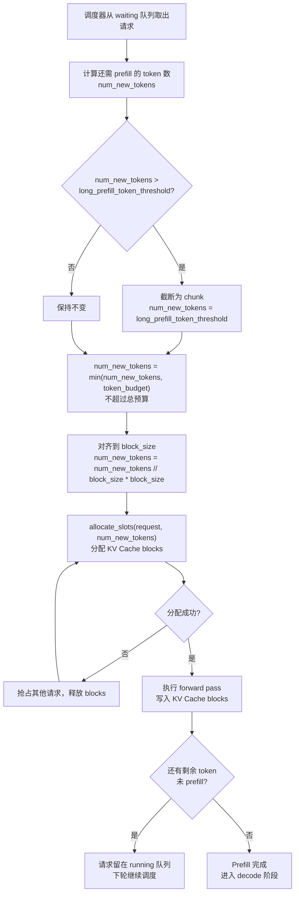

# 深入理解vLLM核心概念Chunked Prefill 与 Block Size：长 prompt 已经切分成很多 block 了，为什么 prefill 还要再 chunk？

> **系列**: vLLM 技术博客系列 | **类型**: 核心概念篇
>
> Chunked Prefill 与 Block Size 具体是什么关系？ 本来一个长的promot上下文已经切分成了很多个block，为什么prefill的时候还要再chunk？。

### What：它们分别是什么

#### Block Size — KV Cache 的存储单位

Block 是 PagedAttention 中 KV Cache 分配的最小单位，默认 16 tokens。KV Cache 不再为每个请求连续分配一整块显存，而是按 block 粒度按需分配，类似操作系统的内存分页。

```
请求 prompt = 10000 tokens, block_size = 16

KV Cache 存储：
  Block 0: [token 0~15]     Block 1: [token 16~31]    ...    Block 624: [token 9984~9999]
  ┌──────┐  ┌──────┐                ┌──────┐
  │ K V  │  │ K V  │    ......      │ K V  │
  └──────┘  └──────┘                └──────┘
```

#### Chunked Prefill — Prefill 的计算分片

Chunked Prefill 是将一个长 prompt 的 prefill 计算拆成多个 chunk，每个 chunk 只处理一部分 token，**每轮之间插入 decode 请求**，避免长 prefill 独占 GPU。

```
没有 chunked prefill（一锅炖）:
时间 →  [======== prefill 10K ========][decode][decode][decode]

有 chunked prefill（分批炒）:
时间 →  [prefill 2K][decode][prefill 2K][decode][prefill 2K][decode]...
```

#### 两者的本质区别

| | Block（存储） | Chunk（计算） |
|---|---|---|
| 解决什么问题 | KV Cache 内存碎片化 | GPU 计算资源独占 |
| 关注点 | 结果存在哪、怎么复用 | 每次算多少、何时让出 GPU |
| 没有它会怎样 | 显存浪费严重，无法共享前缀 | 长 prefill 阻塞所有 decode |
| 粒度 | 16 tokens（固定，`block_size`） | 由 `long_prefill_token_threshold` 控制 |
| 维度 | 存储维度 | 计算维度 |

**两者是正交的**：Block 管的是"算完的 KV 存到哪"，Chunk 管的是"一次算多少再让出 GPU"。

---

### Why：为什么需要它们

#### 为什么需要 Block

传统连续分配 KV Cache 存在严重问题：

| 痛点 | 具体表现 |
|---|---|
| 内部碎片 | 预分配最大长度，实际用不到的部分浪费 |
| 外部碎片 | 请求频繁创建/销毁，显存空洞无法复用 |
| 无法共享 | 相同前缀的请求各自存一份 KV Cache |
| 无法换出 | 连续内存无法部分释放，只能整块丢弃 |

Block 机制将 KV Cache 按固定大小分页，按需分配、按页共享、按页回收，彻底解决碎片化问题。

#### 为什么需要 Chunked Prefill

即使 Block 已经解决了存储问题，计算层面仍有瓶颈：

| 痛点 | 具体表现 |
|---|---|
| 长请求独占 GPU | 10K tokens 的 prefill 一步算完，期间其他请求的 decode 全部卡住 |
| 显存峰值爆炸 | Attention 是 O(n²)，10K tokens 的 attention 矩阵远大于 2K |
| 延迟毛刺 | 短请求排在长请求后面，TTFT 暴涨 |
| 调度不灵活 | 要么等长 prefill 算完，要么整个请求让出（代价大） |

Chunked Prefill 让长 prefill 分步执行，每步之间可以穿插 decode，实现 prefill 与 decode 的混合调度。

#### 为什么 Chunk 必须对齐 Block

Chunked Prefill 与 Block Size 的关系？
核心关系：chunk 的边界要对齐 block 边界。 Block size 是 KV Cache 分配的最小单位（默认 16 tokens），而 Chunked Prefill 把长 prefill 拆成多个 chunk 分步执行。每次 chunk 处理的 token 数必须是 block_size 的整数倍——否则 KV Cache 写到半个 block 里，无法正确管理和复用。

Chunk 的 token 数必须是 block_size 的整数倍，否则：

| 不对齐的后果 | 说明 |
|---|---|
| KV Cache 半写 | 一个 block 只写了一部分，剩余位置是脏数据 |
| 前缀缓存失效 | 哈希计算以 block 为单位，半 block 无法计算哈希 |
| Mamba 状态损坏 | Mamba 的状态缓存也要求 block 对齐 |
| 调度器回滚困难 | 抢占时只能整 block 释放，半 block 无法处理 |

---

### How：vLLM 中如何实现

#### 配置参数

| 参数 | 默认值 | 说明 |
|---|---|---|
| `block_size` | 16 | KV Cache block 大小（tokens 数） |
| `enable_chunked_prefill` | True | 是否启用 chunked prefill |
| `long_prefill_token_threshold` | 0（自动设为 max_model_len × 4%） | 超过此长度的 prefill 视为"长请求"，触发分 chunk |
| `max_num_partial_prefills` | 1 | 最多允许多少个请求同时处于部分 prefill 状态 |
| `max_long_partial_prefills` | 1 | 最多允许多少个长请求同时部分 prefill |
| `max_num_batched_tokens` | 2048 | 每步最多处理的 token 总数（prefill + decode 共享） |

#### 调度流程



#### 具体交互机制

```
请求: prompt = 5000 tokens
配置: block_size = 16, long_prefill_token_threshold = 2048

第1步调度:
  num_new_tokens = min(2048, 5000) = 2048
  对齐: 2048 // 16 * 16 = 2048 ✓ (已对齐，无需截断)
  分配: ceil(2048/16) = 128 个 block
  剩余: 2952 tokens 未 prefill

第2步调度:
  num_new_tokens = min(2048, 2952) = 2048
  对齐: 2048 ✓
  分配: 128 个 block
  剩余: 904 tokens 未 prefill

第3步调度:
  num_new_tokens = 904
  对齐: 904 // 16 * 16 = 896
  分配: ceil(896/16) = 56 个 block
  剩余: 8 tokens（不足一个 block，下轮处理）
```

#### 源码关键位置

| 文件 | 关键逻辑 |
|---|---|
| `vllm/config/scheduler.py` | `long_prefill_token_threshold`、`enable_chunked_prefill` 参数定义与校验 |
| `vllm/v1/core/sched/scheduler.py` | `_get_num_new_tokens()` 中 chunk 对齐 block_size 的逻辑 |
| `vllm/v1/core/sched/scheduler.py` | `schedule()` 中 prefill 分 chunk 调度与 `allocate_slots()` 调用 |
| `vllm/v1/core/kv_cache_manager.py` | `allocate_slots()` 按 num_new_tokens 分配 KV Cache blocks |

#### 源码中的对齐逻辑

```python
# vllm/v1/core/sched/scheduler.py - _get_num_new_tokens()
block_size = self.cache_config.block_size
last_cache_position = request.num_tokens - request.num_tokens % block_size

num_computed_tokens_after_sched = num_computed_tokens + num_new_tokens

# 如果当前 chunk 不是最后一个 chunk → 对齐到 block_size
if num_computed_tokens_after_sched < last_cache_position:
    num_new_tokens = num_new_tokens // block_size * block_size

# 如果是最后一个 chunk → 精确处理到缓存边界
elif num_computed_tokens < last_cache_position < num_computed_tokens_after_sched:
    num_new_tokens = last_cache_position - num_computed_tokens

# 公共前缀优化也要求对齐
if num_uncached_common_prefix_tokens >= block_size:
    num_new_tokens = num_uncached_common_prefix_tokens
    num_new_tokens = num_new_tokens // block_size * block_size
```

---

### 深层追问：长 prompt 已经切分成很多 block 了，为什么 prefill 还要再 chunk？

#### Block 是存储单位，Chunk 是计算单位

两者解决的是完全不同的问题。

#### 没有 Chunked Prefill 时发生了什么

假设一个请求 prompt = 10000 tokens，block_size = 16：

```
KV Cache 角度：10000 tokens → 625 个 block（存储没问题，分得好好的）

但计算角度：一次 forward pass 处理全部 10000 tokens
┌─────────────────────────────────────────────┐
│  GPU 正在算 10000 tokens 的 prefill          │
│  ████████████████████████████████████████    │  ← 耗时很长
│                                             │
│  其他 decode 请求：等着……等着……等着……          │  ← 全部阻塞
└─────────────────────────────────────────────┘
```

**问题不在存储，在计算**：

| 问题 | 说明 |
|---|---|
| 长请求独占 GPU | 10K tokens 的 prefill 一步算完，期间其他请求的 decode 全部卡住 |
| 显存峰值爆炸 | Attention 是 O(n²)，10K tokens 的 attention 矩阵远大于 2K |
| 延迟毛刺 | 短请求排在长请求后面，TTFT 暴涨 |

#### Chunked Prefill 做了什么

把一次巨大的计算拆成多轮小计算，**每轮之间插入 decode 请求**：

```
没有 chunked prefill（一锅炖）:
时间 →  [==== prefill 10K ====][decode][decode][decode]

有 chunked prefill（分批炒）:
时间 →  [prefill 2K][decode][prefill 2K][decode][prefill 2K][decode]...
              ↑ 短请求的 decode 不用等长 prefill 全部算完
```

#### 一个比喻，带你通关理解，醍醐灌顶

**Block = 冰箱的格子**，Chunk = 每次去超市采购的量。

冰箱有 625 个格子（blocks），放 10000 个鸡蛋没问题——这是存储。

但如果你一次性买 10000 个鸡蛋运回家，路上堵死整条街（GPU 被独占），其他车（decode 请求）全动不了。

Chunked Prefill 就是：每次只运 2000 个（一个 chunk），运完让别的车先走，下一趟再运 2000 个。鸡蛋最终都会放进冰箱的格子里（KV Cache blocks），只是分了好几趟运。

#### 关键对比

| | Block（存储） | Chunk（计算） |
|---|---|---|
| 解决什么问题 | KV Cache 内存碎片化 | GPU 计算资源独占 |
| 关注点 | 结果存在哪、怎么复用 | 每次算多少、何时让出 GPU |
| 没有它会怎样 | 显存浪费严重，无法共享前缀 | 长 prefill 阻塞所有 decode |
| 粒度 | 16 tokens（固定） | 由 `long_prefill_token_threshold` 控制 |

**所以它们是正交的两个维度**：Block 管的是"算完的 KV 存到哪"，Chunk 管的是"一次算多少再让出 GPU"。缺了哪个都不行。

---

**延伸阅读**：
- vLLM 官方文档：https://docs.vllm.ai
- PagedAttention 论文：https://arxiv.org/abs/2309.06180
- vLLM GitHub 仓库地址：https://github.com/vllm-project/vllm

*本文基于 vLLM 源码分析撰写，根据笔者在学习过程中的两个疑问，对claude code分别提问，根据GLM5.1大模型回复的内容，整理而成。*

