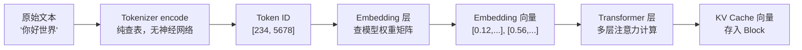

# 【硬核拆解vLLM】Tokenizer 的 encode、Embedding 向量、Transformer 的 Encoder——三个容易混淆的概念，一次讲透

> **系列**: vLLM 技术博客系列 | **类型**: 核心概念深潜篇
> 从一段文字到模型能理解的向量，中间到底经历了什么？三步走，步步不同，步步关键

### 引言

你有没有遇到过这样的困惑：Tokenizer 也有 `encode()`，Transformer 也有 Encoder——它们是同一个东西吗？Embedding 又是什么？和 Tokenizer 的查表有什么区别？

这三个概念名字里都带着"编码"的味道，但做的事情完全不同。今天我们就沿着一段文字进入 vLLM 系统的完整旅程，把这三步彻底拆解清楚。

---

### 一、三个"编码"到底在干什么

先用一张表说清全貌：

| 步骤 | 名称 | 做了什么 | 有没有神经网络 | 输入 | 输出 |
|---|---|---|---|---|---|
| 1 | Tokenizer `encode()` | 文本 → Token ID | **没有**，纯查表 | `"你好"` | `[234, 5678]` |
| 2 | Embedding 层 | Token ID → Embedding 向量 | **有**，查模型权重矩阵 | `[234, 5678]` | `[[0.12, ...], [0.56, ...]]` |
| 3 | Transformer Encoder | Embedding 向量 → 上下文表示 | **有**，多层注意力计算 | Embedding 向量 | 上下文向量 / KV Cache |

**三步是串联关系，前一步的输出是后一步的输入**，但本质完全不同：

```
"你好"
  │
  ▼ 第1步：Tokenizer encode — 纯查表，没有神经网络
[234, 5678]
  │
  ▼ 第2步：Embedding — 查模型权重矩阵，第一次出现神经网络
[[0.12, -0.34, ...], [0.56, 0.78, ...]]
  │
  ▼ 第3步：Transformer Encoder — 多层注意力计算，最重的神经网络
上下文表示向量 / KV Cache
```

下面我们逐步拆解。

---

### 二、第1步：Tokenizer 的 encode()——文本变编号

##### 它做了什么

Tokenizer 的 `encode()` 把一段文字切成 token，然后查词汇表，给每个 token 分配一个整数编号。

```python
# HuggingFace Tokenizer
tokenizer.encode("你好世界")
# → [234, 5678, 9012]    输出：Token ID 列表
```

这个过程分两个子步骤，但在 vLLM 中是**合一的**：

```
"你好世界"
    │
    ▼ 子步骤1：Tokenization（分词）
["你好", "世界"]         ← 切成 token
    │
    ▼ 子步骤2：Encoding（编码）
[234, 5678]              ← 查词汇表，得到 ID
```

##### 关键特征：纯查表，没有神经网络

Tokenizer 的词汇表就是一个**静态字典**，从 token 文本到 ID 的映射是预先定义好的：

```
词汇表:
  ID    Token
  ────  ──────
  234   你好
  5678  世界
  ...
```

查表过程：`token_id = vocabulary[token_text]`，没有任何参数需要训练，没有任何计算图。

##### 对应的"解码"：Tokenizer 的 decode()

```python
tokenizer.decode([234, 5678])
# → "你好世界"     ID 列表 → 文本
```

`encode` 和 `decode` 是一对：一个把文本变成 ID，一个把 ID 变回文本。这就是 `encode` 这个词在这里的含义——**用数字编码文本**。

##### vLLM 中的实现

vLLM 使用 HuggingFace 的 Tokenizer，在输入预处理阶段一次性完成 tokenization + encoding：

```python
# vllm/inputs/preprocess.py
tok_prompt = renderer._tokenize_singleton_prompt(prompt, tok_params)
prompt_token_ids = tok_prompt["prompt_token_ids"]   # 直接拿到 ID 列表
```

字段名就叫 `prompt_token_ids`——vLLM 内部不保留中间的 token 文本，只关心最终的 ID。

---

### 三、第2步：Embedding 层——编号变向量

##### 它做了什么

Token ID 还只是整数，模型无法直接做数学运算。Embedding 层把每个 ID 变成一个**固定维度的向量**。

```python
# 伪代码
embedding_vector = Embedding_Matrix[token_id]   # 取第 token_id 行
```

Embedding 矩阵是模型的**第一层权重**，大小为 `vocab_size × hidden_dim`：

```
Embedding 矩阵（32000 × 4096）:
  行号    向量（4096 维）
  ────    ──────────────────────
  0       [0.01, 0.02, ...]
  1       [0.03, -0.01, ...]
  ...
  234     [0.12, -0.34, ...]    ← "你好"的 Embedding
  ...
  5678    [0.56, 0.78, ...]     ← "世界"的 Embedding
  ...
```

##### 关键特征：查模型权重矩阵，有神经网络

Embedding 层和 Tokenizer 的查表看起来很像，但有一个本质区别：

| | Tokenizer 查词汇表 | Embedding 查权重矩阵 |
|---|---|---|
| 查的是什么 | 静态字典（token → ID） | 模型权重（ID → 向量） |
| 表的内容可以变吗 | **不能**，训练后固定 | **能**，是模型训练出来的参数 |
| 有没有梯度 | 没有 | **有**，训练时会更新 |
| 输出是什么 | 整数 | 浮点数向量 |

> 💡 **核心区别**: Tokenizer 的词汇表是"人为定义的编号规则"，Embedding 矩阵是"模型学到的语义空间"。同一个 Token ID 234，在不同模型里的 Embedding 向量完全不同——因为每个模型对"你好"的语义理解不同。

##### Embedding 向量的维度由谁决定

| 参数 | 含义 | 由谁决定 |
|---|---|---|
| `vocab_size` | 词汇表大小（矩阵行数） | Tokenizer + 模型训练配置 |
| `hidden_dim` | 向量维度（矩阵列数） | 模型结构 |

以 LLaMA 系列为例：

| 模型 | vocab_size | hidden_dim | Embedding 矩阵大小 |
|---|---|---|---|
| LLaMA-7B | 32,000 | 4,096 | 32,000 × 4,096 ≈ 128M 参数 |
| LLaMA-70B | 32,000 | 8,192 | 32,000 × 8,192 ≈ 512M 参数 |

---

### 四、第3步：Transformer Encoder——向量变上下文表示

##### 它做了什么

Embedding 向量只包含单个 token 的语义信息，**不知道周围 token 在说什么**。Transformer Encoder 通过多层自注意力计算，让每个 token "看到"上下文，生成包含上下文信息的表示。

```
Embedding 向量（只知道自己）          上下文向量（知道整个句子）
┌──────────────────┐               ┌──────────────────┐
│ "你好" → [0.12, ...] │    ──→   │ "你好" → [0.45, ...] │  ← 融入了"世界"的信息
│ "世界" → [0.56, ...] │           │ "世界" → [0.33, ...] │  ← 融入了"你好"的信息
└──────────────────┘               └──────────────────┘
```

##### 关键特征：多层注意力计算，最重的神经网络

| | Tokenizer encode | Embedding 层 | Transformer Encoder |
|---|---|---|---|
| 计算量 | 几乎为零（查表） | 很小（查表） | **极大**（矩阵乘法 × 多层） |
| 有没有注意力机制 | 没有 | 没有 | **有**，这是核心 |
| 输出和输入的区别 | 格式变了（文本→ID） | 维度变了（ID→向量） | **语义变了**（单点→上下文） |

##### Transformer Encoder vs Decoder

在 LLM 推理中，我们通常用的是 **Decoder-Only 架构**（如 GPT、LLaMA），没有独立的 Encoder。但概念上仍然可以区分：

| | Encoder | Decoder |
|---|---|---|
| 看的方向 | 双向（看前后所有 token） | 单向（只看前面的 token） |
| 典型模型 | BERT | GPT、LLaMA |
| 用途 | 理解（分类、抽取） | 生成（续写、对话） |
| 注意力掩码 | 无掩码（全可见） | 因果掩码（只看左边） |

> 笔者注：LLaMA 是 Decoder-Only，但它的 Prefill 阶段做的事情和 Encoder 很像——把整个 prompt 一次处理完。区别只是注意力掩码不同：Encoder 是全可见，Decoder 的 Prefill 是因果掩码（每个 token 只能看到自己和之前的 token）。

---

### 五、三步在 vLLM 中的位置



| 步骤 | 在 vLLM 中的位置 | 何时执行 |
|---|---|---|
| Tokenizer `encode()` | `vllm/inputs/preprocess.py` — 输入预处理 | 请求进入时，API Server 进程 |
| Embedding 查表 | `vllm/model_executor/models/` — 模型第一层 | GPU Worker 执行 forward pass 时 |
| Transformer 计算 | `vllm/model_executor/models/` — 模型主体 | GPU Worker 执行 forward pass 时 |

**Tokenizer 在 CPU 上执行，Embedding 和 Transformer 在 GPU 上执行。**

---

### 六、一个比喻：查字典 → 读释义 → 读懂整句话

你遇到一个生词，怎么理解它？三步：

##### 第1步：查目录找页码 → Tokenizer encode()

你翻到字典前面的目录，找到"苹果"在第 234 页。

- 目录只是**编号**——"苹果"在 234 页，"手机"在 5678 页
- 不管词多长多短，页码就是一个数字
- 这一步没有任何"理解"，只是找到位置

##### 第2步：翻到那一页读释义 → Embedding

你翻到第 234 页，看到释义：**名词、水果、红色、甜、可生食、蔷薇科……**

- 释义是多维度的特征描述——不是一句话，而是一组属性
- 同一个词，**不同的字典给出的释义不同**（就像不同模型的 Embedding 不同）
- 但释义是**静态的**——不管"苹果"出现在什么句子里，释义都一样

##### 第3步：把句子里所有词连起来读 → Transformer

现在你读整句话：

- **"我吃了一个苹果"** → 结合上下文，"苹果"是水果
- **"我买了一个苹果手机"** → 同一个"苹果"，结合上下文，变成了品牌

**同一个词，释义相同，但在不同句子里的理解完全不同**——这就是 Transformer 做的事：通过注意力机制，让每个 token 的表示融入上下文信息。

| 步骤 | 比喻 | 对应概念 | 关键特征 |
|---|---|---|---|
| 1 | 查目录找页码 | Tokenizer `encode()` | 纯编号，没有理解 |
| 2 | 翻到那一页读释义 | Embedding 层 | 多维特征描述，但和上下文无关 |
| 3 | 把整句话连起来读 | Transformer Encoder | 同一个词，不同句子，理解不同 |

**Tokenizer 找页码，Embedding 读释义，Transformer 读懂整句话。**

---

### 七、常见混淆一网打尽

| 混淆点 | 正确理解 |
|---|---|
| Tokenizer 的 `encode` = Transformer 的 Encoder？ | **不是**。前者是文本→ID 的查表，后者是向量→向量的神经网络计算 |
| Embedding = Tokenizer 查表？ | **不是**。Tokenizer 查的是静态词汇表，Embedding 查的是模型训练出的权重矩阵，有梯度、会更新 |
| Embedding 向量 = KV Cache 向量？ | **不是**。Embedding 是单个 token 的静态表示，KV Cache 是注意力计算后的上下文表示 |
| Decoder-Only 模型没有 Encoder？ | 概念上有区别，但 Prefill 阶段做的事情类似——只是注意力掩码不同（因果掩码 vs 全可见） |
| Token ID 234 在所有模型里 Embedding 一样？ | **不一样**。不同模型的 Embedding 矩阵是独立训练的，同一个 ID 的向量完全不同 |

---

### 总结

| 步骤 | 做了什么 | 本质 | 有无神经网络 | 输出大小 |
|---|---|---|---|---|
| Tokenizer `encode()` | 文本 → Token ID | 静态查表，编号规则 | 无 | 固定（整数） |
| Embedding 层 | Token ID → 向量 | 查模型权重，语义空间 | 有 | 固定（向量维度） |
| Transformer Encoder | 向量 → 上下文向量 | 注意力计算，上下文融合 | 有 | 固定（向量维度） |

**三步的输出大小都和文本长短无关，但本质完全不同：第一步是编号，第二步是表征，第三步是理解。**

### 延伸阅读

- vLLM 源码：[vllm/inputs/preprocess.py](https://github.com/vllm-project/vllm/blob/main/vllm/inputs/preprocess.py) — Tokenizer encode 入口
- vLLM 源码：[vllm/model_executor/models/llama.py](https://github.com/vllm-project/vllm/blob/main/vllm/model_executor/models/llama.py) — LLaMA 模型（Embedding + Transformer）
- HuggingFace 文档：[Tokenizer](https://huggingface.co/docs/transformers/main_classes/tokenizer) — Tokenizer encode/decode 详解

---

*本文属于 [vLLM 技术博客系列]，欢迎持续关注。*
